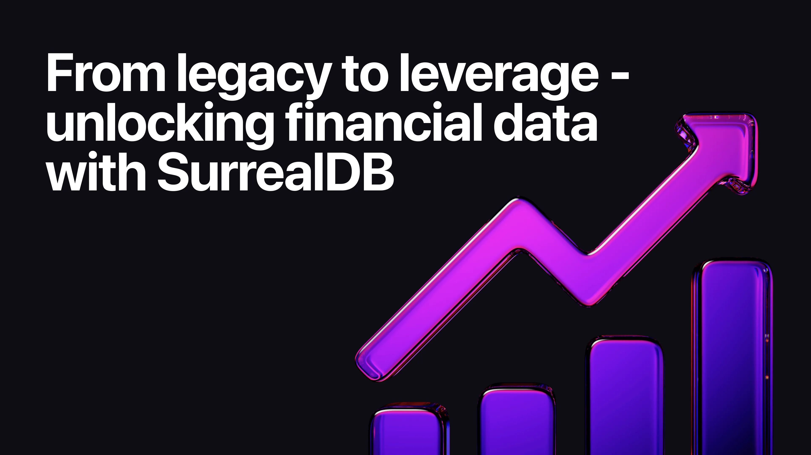

# From legacy to leverage - unlocking financial data with SurrealDB

Financial institutions sit on mountains of transactional data. Decades of payments, trades, account histories, and customer interactions often live in sprawling legacy systems like HBase. While those systems were built for scale, they weren’t built for speed, intelligence, or adaptability.

The result? Billions of rows of historical value sitting in cold storage, hard to query, harder to innovate with, and nearly impossible to connect into new services.

Why? Because until the arrival of ACID-compliant distributed data systems, that combination of characteristics simply didn’t exist. This forced financial companies to prioritise scale over versatility. The introduction of distributed systems broadened what was possible, but it wasn’t until the advent of native multi-model distributed engines that active intelligence and true adaptability moved from aspiration to reality.

That’s where SurrealDB comes in.

By migrating legacy financial data into SurrealDB’s multi-model database (document + relational + graph + vector), institutions can move beyond simple storage and begin turning history into intelligence, and intelligence into revenue.

Here’s a practical roadmap for how financial firms can evolve from stabilising legacy data to differentiating with customer intelligence to monetising entirely new services.

#### Phase 1: stabilise - building the foundation of trust

**Objective**: consolidate, govern, and modernise data to meet regulatory and operational needs.

What to do first:

- reframe decades of transactions from flat HBase rows into SurrealDB’s connected graph schema
- build AML/KYC relationship maps that link customers, accounts, and counterparties in a queryable way
- automate compliance reporting with data lineage built into the schema itself
- detect operational mismatches in reconciliation workflows in real time

Why it matters: regulators demand transparency. SurrealDB provides explainable, auditable data trails that reduce compliance overhead and strengthen trust.

#### Phase 2: differentiate - delivering customer value

**Objective**: move from compliance to customer-centricity, using intelligence to create differentiation.

What becomes possible:

- dynamic risk models: real-time credit scoring and liquidity heatmaps driven by graph + vector embeddings
- fraud detection: agentic AI flags anomalies instantly, based on behavioural similarity rather than static rules
- customer 360 views: unify credit, spending, and merchant relationships to build holistic customer profiles
- personalised insights: deliver predictive nudges (“Your weekend spending is up 14% - here’s how to save”)

Why it matters: customers no longer want generic financial products. They expect services tailored to their behaviours, risks, and goals, and the data already exists to provide them.

#### Phase 3: monetise - turning data into revenue

**Objective**: move beyond internal efficiency and customer experience into ecosystem-scale monetisation.

New frontiers:

- data-as-a-service: package anonymised, aggregated flows for fintech partners and insurers
- open banking APIs: empower external developers to build on top of your clean, connected data
- synthetic data products: sell privacy-safe, AI-ready datasets for model training
- ecosystem graphs: build marketplaces where fintechs plug into your customer graph to co-offer services

Why it matters: once financial institutions treat data not just as history, but as a living asset, entirely new business models emerge.

#### The shift

HBase was built for storage. SurrealDB is built for connection.

- from rows to relationships
- from historical storage to real-time intelligence
- from compliance costs to monetisation opportunities

The institutions that embrace this shift will not just manage their legacy, they will monetise it, differentiate on it, and lead with it.

#### Final thought

Financial data is the lifeblood of trust. When stored in legacy systems, it’s frozen potential. When migrated into SurrealDB, it becomes a living, connected, intelligent graph, powering fraud detection, customer personalisation, regulatory trust, and entirely new data businesses.

The question isn’t whether to migrate. It’s how soon you want to start turning your history into leverage.

Want to dive deeper into financial use cases? Explore our [finance and fintech solutions](/solutions/finance-and-fintech) to see how SurrealDB powers innovation across the industry.
