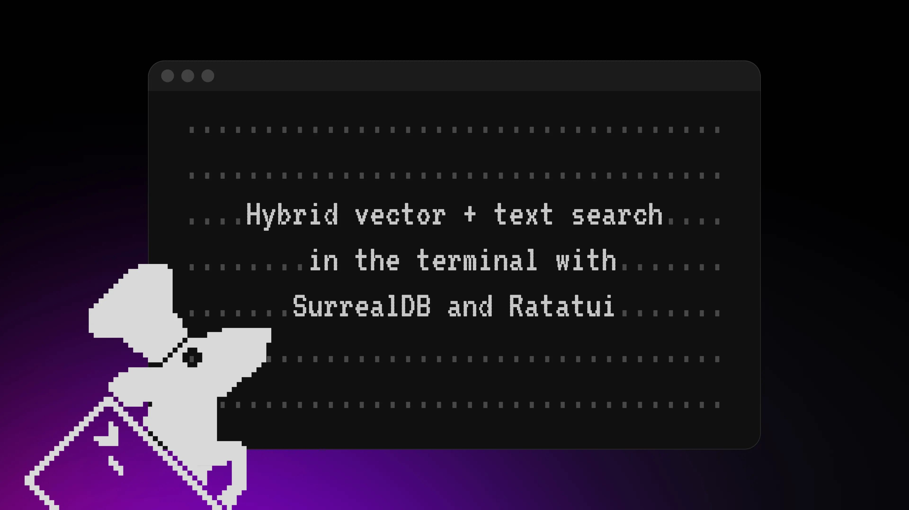
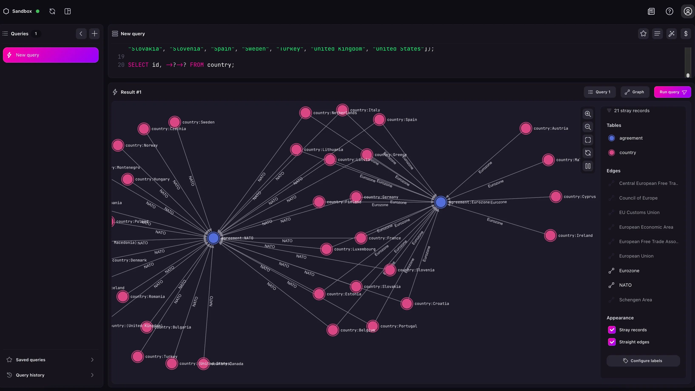

# Hybrid vector + text Search in the terminal with SurrealDB and Ratatui



## SurrealDB: shiny newcomer, low-level database, or both?

SurrealDB is admittedly a pretty shiny database. It's built in [Rust](https://www.rust-lang.org/), a programming language that has just barely hit the 10-year mark since it hit version 1.0. A good deal of attention is paid to [the website and brand design](/brand), and the official Surrealist app is not only slick but even capable of visualising data as an interconnected net of records.

[This blog post](/blog/visualising-your-data-with-surrealists-graph-view) goes into further detail on how this graph visualisation works, leading to output like the following that lets you see which European countries belong to which intranational groups.



But the other side of being a database written in a low-level language like Rust is that you can compile it to machine code with a single command and do everything you want with it on the command line, and thus on [small devices on the edge](https://www.linkedin.com/pulse/does-edge-need-new-database-tobie-morgan-hitchcock-n6ize) as well. The main way to work with SurrealDB on the terminal is with the [`surreal sql`](/docs/surrealdb/cli/start) command to open up a REPL, but building a TUI (terminal user interface) is another way to make it happen. That's what this post is about.

This post features the same AI-native demo app as in [a previous post](/blog/building-an-ai-native-multi-model-ui-with-surrealdb), except that this time it is built using [Ratatui](https://docs.rs/ratatui/latest/ratatui/index.html), the main way to build a TUI using Rust.

You can read more about the demo app functionality in the previous post, but here is a quick recap of what it does. It lets you:

- Insert documents that are sourced from [a Wikipedia API that provides a short summary](https://en.wikipedia.org/api/rest_v1/page/summary/calgary) of an article
- Manually link a document to another
- Automatically go through the article summary to try to link to other documents (e.g. if it sees the word "Canada" in the summary, it will try to link to a `document:Canada`)
- See the linked articles from a single article recursively down to a depth of 3
- Perform [full-text search](/docs/surrealdb/models/full-text-search) on article content
- Perform [semantic (vector) search](/docs/surrealdb/models/vector) via OpenAI or Mistral embeddings to find the closest articles to a sample of text (requires a key to use as it must call in to OpenAI and/or Mistral to first retrieve the embeddings)
- Query the database.

You can see what the final product will look like in the following video.


It also comes with a new feature that is so new that it was merged into SurrealDB just two days ago and is only available in nightly, called hybrid search. We'll look at how that works in the next section.

## Designing a TUI

Ratatui has a [showcase here](https://ratatui.rs/showcase/apps/) that demonstrates the range of design that can be done in a terminal UI. With a good amount of work you can generate graphics with them, such as [this Minesweeper game](https://github.com/cpcloud/minesweep-rs). One core developer on the Ratatui project has even [made a guitar tuner and realtime fretboard display](https://www.linkedin.com/posts/orhunp_rustlang-ratatui-tui-activity-7355531186103840768-j8ua/) out of it! But most of the time a terminal UI will be a relatively simple app made up of a few rectangles and some code to react to the user's keystrokes.

This is the case with this app, with the exception of a bit of some official SurrealDB colours.

Ratatui allows you to generate your own colours if you know their labellings such as RGB or hex. You can see the names of the SurrealDB brand colours and their values [on this page](/brand). However, not all terminals are able to display True Colour, and since colour is the way this app shows which window is currently selected, we don't want to take a chance by going with `Colour::Rgb(u8, u8, u8)`.

Fortunately, Ratatui allows 8-bit colour values to be specified and these are usually close enough. That gives us the following values, but you can change them to `Color::Rgb` if your terminal allows it.

```rust
const SURREAL_PINK: Color = Color::Indexed(199);
const SURREAL_PURPLE: Color = Color::Indexed(93);
const LAVENDER_MIST: Color = Color::Indexed(235);
const MOONLIT_WHITE: Color = Color::Indexed(15);
// These two are similar to each other so their
// 8-bit values end up being the same
const DEEP_AMETHYST: Color = Color::Indexed(233);
const OBSIDIAN_VIOLET: Color = Color::Indexed(233);
```

That gives us a selection of colours a bit different than the True Colour values, but close enough for a terminal app.

COLOUR1 COLOUR2 COLOUR3 COLOUR4 COLOUR5

## How does hybrid search work?

[The PR that adds hybrid search](https://github.com/surrealdb/surrealdb/pull/6189) to SurrealDB does a great job at explaining how it works. While vector search works well for lexical similarity, and full-text (lexical) search is optimised for precise results, sometimes you might want to combine the two to obtain a single similarity score.

The question then arises: how should these be weighted? If you have a certain vector similarity score, how could this be combined with the similarity or distance results from a full-text search?

This was precisely the reason why the previous blog post didn't have hybrid search, as I couldn't think of a way to combine the two that wasn't arbitrary. Fortunately, it turns out that algorithms already exist to combine the two. Let's read the description from the PR on what hybrid search does:

```syntax
Users frequently need “hybrid” retrieval: lexical search (BM25) gives precise keyword matches,
while vector search captures semantic similarity even when keywords don’t overlap.

Today SurrealDB exposes both capabilities separately, but there is no built‑in way to combine them,
forcing application code to stitch results together.

Adding an RRF‑based fusion primitive lets users get higher recall and better relevance with a
single query, without manual score normalization.

Reciprocal Rank Fusion is simple, robust across heterogeneous scorers, and can be implemented
on top of existing full‑text and vector index mechanisms, minimizing complexity while unlocking
a common production use case.
```

Hybrid search in SurrealDB is done using three main ways:

- `search::rrf()`: reciprocal rank fusion
- `search::linear()` using 'minmax' normalisation
- `seach::linear()` using 'zscore' normalisation

The `search::rrf()` function is the simplest method, because all it looks for is an array with the results of vector search and full-text search to stitch together, followed by the number of results to return, and an optional `k` constant that is used to smooth the ranking defaults to 60.

```surrealql
search::rrf([$vs, $ft], 4, 60)
```

The other two ways to use hybrid search have an extra parameter to set a weighting such as `[2, 1]` (giving vector search twice the weight of FTS) along with the choice between 'minmax' and 'zscore'. We won't use linear weighting in this post, but here is what these functions look like for reference.

```surrealql
-- Fuse with Linear / minmax
search::linear([$vs, $ft], [2, 1], 4, 'minmax');

-- Fuse with Linear / zscore
search::linear([$vs, $ft], [2, 1], 4, 'zscore');
```

Now, there is a good amount of setup required before using `search::rrf()`: one query to find the four nearest semantic neighbours, and another to get all of the full-text query matches. For more on these queries, see [this section](/blog/building-an-ai-native-multi-model-ui-with-surrealdb#using-full-text-search) in the previous blog.

```rust
let vs = self.surreal.query("SELECT id, extract,
title,
vector::distance::knn() AS distance
    FROM document
    WHERE {field} <|4,COSINE|> $embeds
    ORDER BY distance;
    ").bind(("embeds", embeds))
    .bind(("field", field))
    .await.unwrap().take::<Value>(0).unwrap();

    let ft = self.surreal.query("SELECT id, 
            search::highlight('**', '**', 0) AS title,
            search::highlight('**', '**', 1) AS extract,
(search::score(0) * 3) + search::score(1) AS score
            FROM document
        WHERE title @0@ $input OR extract @1@ $input
        ORDER BY score DESC;")
        .bind(("input", fts_query))
        .await.unwrap().take::<Value>(0).unwrap();

Ok(self.surreal
    .query("SELECT id, rrf_score FROM search::rrf([$vs, $ft], 4, 60) ORDER BY rrf_score DESC;")
    .bind(("vs", vs))
    .bind(("ft", ft)).await.unwrap().take::<Value>(0).unwrap().to_string())
```

Two more points to note about these functions are:

- They require the inputs to have an `id` field, as this is used to stitch them together. So make sure to include `id` in both the vector query and full-text query.
- They won't return an error if you don't have

Let's give this a try in the app by doing the following:

First add some articles to the database: the article for Canada, its two largest provinces, and their two largest cities.

```syntax
Canada,Ontario,Quebec,Montreal,Quebec City,Toronto,Ottawa
```

Then search for `Canada,popul city`. That will do a hybrid search for documents that are a close neighbour to `document:Canada` and also have a match for "populous city" on the full-text index. Using `edgengram(3,10)` in the search index means that `popul` will match a large number of words such as "populous" and "population".

```surrealql
DEFINE ANALYZER en_analyzer TOKENIZERS class FILTERS lowercase,edgengram(3,10);
DEFINE INDEX en_extract ON document FIELDS extract SEARCH ANALYZER en_analyzer BM25 HIGHLIGHTS;
DEFINE INDEX en_title ON document FIELDS title SEARCH ANALYZER en_analyzer BM25 HIGHLIGHTS;
```

The interesting thing about the output is that it will usually be the same, whether OpenAI or Mistral embeddings are used. The FTS here in addition to the hybrid search output truly does flatten the results.

```syntax
[{ id: document:Quebec_City, rrf_score: 0.01639344262295082f },
{ id: document:Toronto, rrf_score: 0.016129032258064516f },
{ id: document:Ottawa, rrf_score: 0.015873015873015872f },
{ id: document:Ontario, rrf_score: 0.015625f }]
```

In contrast, a vector-only search returns more varying results including not just `distance` metrics but also the order in which they are returned. OpenAI considers Ottawa to be the second-most important article after Ontario when it comes to the keyword "Canada":

```syntax
[{ distance: 0.09790307035147372f, extract: "Ontario is the southernmost province of Canada...", title: 'Ontario' },
{ distance: 0.11906508835503704f, extract: 'Ottawa is the capital city of Canada....', title: 'Ottawa' }]
```

While Mistral has put Quebec in second place.

```syntax
[{ distance: 0.36376299190450023f, extract: "Ontario is the southernmost province of Canada...", title: 'Ontario' },
{ distance: 0.36566584443638417f, extract: "Quebec is Canada's largest province by area...", title: 'Quebec' }]                                                                                                                      
```

As you can see, working with raw embedding output tends to be more dynamic, while a hybrid search tends to be flatter and with less variance.

To see more of a difference when using an RFF query, try using `A,B,C,D,E,F,G,H,I,J,K,L,M,N,O,P,Q,R,S,T,U,V,W,X,Y,Z,Alphabet,Latin alphabet` to insert a bunch of articles about the alphabet. If you do a search for something vague like `A,alphabet` inside the app then you will finally see some variation in the results.

```syntax
-- Mistral
[{ id: document:Alphabet, rrf_score: 0.01639344262295082f },
{ id: document:O, rrf_score: 0.014705882352941176f },
{ id: document:W, rrf_score: 0.014084507042253521f },
{ id: document:I, rrf_score: 0.0136986301369863f },
{ id: document:T, rrf_score: 0.013157894736842105f }]

-- OpenAI
[{ id: document:Alphabet, rrf_score: 0.01639344262295082f },
{ id: document:W, rrf_score: 0.014084507042253521f },
{ id: document:P, rrf_score: 0.012987012987012988f },
{ id: document:N, rrf_score: 0.012658227848101266f },
{ id: document:G, rrf_score: 0.012195121951219513f }]
```

If you firm up the search to something like `A,alphabet first letter` then the results will begin to converge again.

```syntax
[{ id: document:A, rrf_score: 0.01639344262295082f },
{ id: document:U, rrf_score: 0.016129032258064516f }]
```

The `document:U` part is interesting. Let's try a raw query to see why it's showing up. This is all we need to see the content:

```surrealql
document:U.extract
```

There it is! U just happens to be the twenty-**<u>first</u>** letter of the alphabet.

```syntax
'U, or u, is the twenty-first letter and the fifth vowel letter of the Latin alphabet,
used in the modern English alphabet and the alphabets of other western European languages
and others worldwide. Its name in English is u, plural ues.'
```

By the way, u's is a perfectly acceptable way to [pluralize the letter u](https://www.chicagomanualofstyle.org/qanda/data/faq/topics/Plurals/faq0008.html). Don't believe everything you read online!

```syntax
Plurals almost never take an apostrophe. Chicago style uses an apostrophe for the
plural of lowercase single letters (x’s and o’s), but for little else
(for instance, we write “dos and don’ts”).
```

As you can see, playing around with an app of this sort can take you into some pretty interesting corners of the world.

On that note, let's finish up with the source code for the app and how to run it.

## Final notes and app source code

Assuming you have Rust installed, the app can be run with a single command. Without an `OPENAI_API_KEY` and `MISTRAL_API_KEY` embedded retrieval and search won't work, but everything else will.

```cli
OPENAI_API_KEY=yourkeyhere MISTRAL_API_KEY=yourkeyhere cargo run
```

To use the `search::rrf()` function until the next version of SurrealDB is out, you can [download the nightly version](/docs/surrealdb/installation/nightly) of SurrealDB, run that and change `connect("memory")` to `connect("ws://localhost:8000")`, or just be lazy by cloning the [SurrealDB repo](https://github.com/surrealdb/surrealdb) and adding it to Cargo.toml as follows.

```yaml
anyhow = "1.0.97"
async-openai = "0.28.3"
crossterm = { version = "0.29.0", features = ["osc52"] }
mistralai-client = "0.14.0"
ratatui = "0.29.0"
serde = "1.0.219"
serde_json = "1.0.140"
surrealdb = { path = "../surrealdb/crates/sdk", features = ["kv-mem"] }
tokio = "1.44.0"
ureq = "3.0.12"
```

Then just paste the following content into `main.rs` and you are good to go!

Questions or comments? Drop by [our Discord](https://discord.gg/surrealdb) to get in touch with the SurrealDB community.

```rust
use std::{
    fmt::Display,
    sync::{
        LazyLock,
        mpsc::{Receiver, Sender, channel},
    },
};

use Constraint::{Min, Percentage};
use anyhow::Error;
use async_openai::{
    Client as OpenAiClient, config::OpenAIConfig, types::CreateEmbeddingRequestArgs,
};
use crossterm::{
    event::{self, Event, KeyCode, KeyModifiers},
    execute,
};
use mistralai_client::v1::{client::Client as MistralClient, constants::EmbedModel::MistralEmbed};
use ratatui::{
    layout::{Constraint, Layout},
    style::{Color, Style},
    widgets::{Block, BorderType, Paragraph, Wrap},
};
use serde::Deserialize;
use surrealdb::{
    engine::any::{Any, connect},
    {RecordId, Surreal, Value},
};

const _SURREAL_PINK: Color = Color::Indexed(199);
const SURREAL_PURPLE: Color = Color::Indexed(93);
const LAVENDER_MIST: Color = Color::Indexed(235);
const _DEEP_AMETHYST: Color = Color::Indexed(233);
const _OBSIDIAN_VIOLET: Color = Color::Indexed(233);
const _MOONLIT_WHITE: Color = Color::Indexed(15);

const MESSAGE: &str = "-----COMMANDS-----

Esc: delete text in current square
Enter: Run command, or copy Output content to clipboard
Shift + up/down: Scroll through Output content
Ctrl+C: Close app";

static OPENAI_API_KEY: LazyLock<String> =
    LazyLock::new(|| std::env::var("OPENAI_API_KEY").unwrap_or("NONE".to_string()));

static MISTRAL_API_KEY: LazyLock<String> =
    LazyLock::new(|| std::env::var("MISTRAL_API_KEY").unwrap_or("NONE".to_string()));

static OPENAI_CLIENT: LazyLock<OpenAiClient<OpenAIConfig>> = LazyLock::new(|| {
    let config = OpenAIConfig::new().with_api_key(&*OPENAI_API_KEY);
    OpenAiClient::with_config(config)
});

static MISTRAL_CLIENT: LazyLock<MistralClient> =
    LazyLock::new(|| MistralClient::new(Some(MISTRAL_API_KEY.clone()), None, None, None).unwrap());

trait StringOutput {
    fn output(self) -> String;
}

impl StringOutput for Result<String, String> {
    fn output(self) -> String {
        match self {
            Ok(o) => o,
            Err(e) => e,
        }
    }
}

#[derive(Deserialize, Debug, Clone)]
struct PageContent {
    title: String,
    extract: String,
}

fn page_for(page: &str) -> String {
    format!("http://en.wikipedia.org/api/rest_v1/page/summary/{page}")
}

fn init() -> &'static str {
    r#"
    DEFINE NAMESPACE ns;
    DEFINE DATABASE db;
    USE NS ns;
    USE DB db;
    DEFINE FIELD extract ON document TYPE string;
    DEFINE FIELD title ON document TYPE string;
    DEFINE FIELD mistral_embedding ON document TYPE option<array<float>> DEFAULT [];
    DEFINE FIELD openai_embedding ON document TYPE option<array<float>> DEFAULT [];
    DEFINE ANALYZER en_analyzer TOKENIZERS class FILTERS lowercase,edgengram(3,10);
    DEFINE INDEX en_extract ON document FIELDS extract SEARCH ANALYZER en_analyzer BM25 HIGHLIGHTS;
    DEFINE INDEX en_title ON document FIELDS title SEARCH ANALYZER en_analyzer BM25 HIGHLIGHTS;

    DEFINE TABLE link TYPE RELATION IN document OUT document ENFORCED;

    DEFINE INDEX only_one_link ON link FIELDS in,out UNIQUE;"#
}

#[derive(Debug, Clone)]
enum AppMessage {
    RunQuery(String),
    InsertDocuments(String),
    LinkDocuments(String),
    LinkUnlinkedDocs,
    OpenAiSimilaritySearch(String),
    MistralSimilaritySearch(String),
    FullTextSearch(String),
    SeeAllDocumentTitles,
    SeeLinkedArticles(String),
    AddOpenAiEmbeddings,
    AddMistralEmbeddings,
    MistralRrf(String),
    OpenAiRrf(String),
}

#[derive(Debug, Clone)]
enum DatabaseMessage {
    RunQuery(String),
    InsertDocuments(String),
    LinkDocuments(String),
    LinkUnlinkedDocs(String),
    OpenAiSimilaritySearch(String),
    MistralSimilaritySearch(String),
    FullTextSearch(String),
    SeeAllDocumentTitles(String),
    SeeLinkedArticles(String),
    AddOpenAiEmbeddings(String),
    AddMistralEmbeddings(String),
    MistralRrf(String),
    OpenAiRrf(String),
}

async fn get_openai_embeddings(content: Vec<PageContent>) -> Result<Vec<Vec<f32>>, String> {
    let extracts = content
        .into_iter()
        .map(|v| v.extract)
        .collect::<Vec<String>>();
    // Get the OpenAI embeddings
    let request = CreateEmbeddingRequestArgs::default()
        .model("text-embedding-3-small")
        .input(extracts)
        .dimensions(1536u32)
        .build()
        .map_err(|e| e.to_string())?;
    match OPENAI_CLIENT.embeddings().create(request).await {
        Ok(res) => Ok(res
            .data
            .into_iter()
            .map(|v| v.embedding)
            .collect::<Vec<Vec<f32>>>()),
        Err(e) => Err(e.to_string()),
    }
}

async fn get_mistral_embeddings(content: Vec<PageContent>) -> Result<Vec<Vec<f32>>, String> {
    let extracts = content
        .into_iter()
        .map(|v| v.extract)
        .collect::<Vec<String>>();
    // Get the Mistral embeddings
    match MISTRAL_CLIENT
        .embeddings_async(MistralEmbed, extracts, None)
        .await
    {
        Ok(res) => Ok(res
            .data
            .into_iter()
            .map(|d| d.embedding)
            .collect::<Vec<Vec<f32>>>()),
        Err(e) => Err(e.to_string()),
    }
}

fn get_possible_links(title: &str, content: &str) -> Vec<String> {
    content
        .split_whitespace()
        .filter(|word| matches!(word.chars().next(), Some(c) if c.is_uppercase()))
        .filter_map(|word| {
            let only_alpha = word
                .chars()
                .filter(|c| c.is_alphabetic())
                .collect::<String>();
            // Keep long words
            if only_alpha.chars().count() >= 3 && only_alpha != title {
                Some(only_alpha)
            } else {
                None
            }
        })
        .collect::<Vec<String>>()
}

#[derive(Deserialize, Debug)]
struct LinkOutput {
    r#in: RecordId,
    out: RecordId,
}

impl Display for LinkOutput {
    fn fmt(&self, f: &mut std::fmt::Formatter<'_>) -> std::fmt::Result {
        write!(f, "in: {} out: {}", self.r#in.key(), self.out.key())
    }
}

impl Database {
    fn send(&self, msg: DatabaseMessage) {
        self.sender.send(msg).unwrap();
    }

    async fn receive(&self) {
        use AppMessage as Msg;
        if let Ok(msg) = self.receiver.try_recv() {
            match msg {
                Msg::RunQuery(q) => {
                    let res = match self.surreal.query(&q).await {
                        Ok(mut r) => match r.take::<Value>(0) {
                            Ok(r) => r.to_string(),
                            Err(e) => e.to_string(),
                        },
                        Err(e) => e.to_string(),
                    };
                    self.send(DatabaseMessage::RunQuery(res));
                }
                Msg::InsertDocuments(m) => {
                    let res = self.insert_documents(m).await.output();
                    self.send(DatabaseMessage::InsertDocuments(res));
                }
                Msg::LinkDocuments(l) => {
                    let res = self.link_documents(l).await;
                    self.send(DatabaseMessage::LinkDocuments(res));
                }
                Msg::LinkUnlinkedDocs => {
                    let res = self.link_unlinked_docs().await.output();
                    self.send(DatabaseMessage::LinkUnlinkedDocs(res));
                }
                Msg::OpenAiSimilaritySearch(s) => {
                    let res = match self
                        .ai_similarity_search(s, "openai_embedding".to_string())
                        .await
                    {
                        Ok(o) => o.to_string(),
                        Err(e) => e.to_string(),
                    };
                    self.send(DatabaseMessage::OpenAiSimilaritySearch(res));
                }
                Msg::MistralSimilaritySearch(s) => {
                    let res = match self
                        .ai_similarity_search(s, "mistral_embedding".to_string())
                        .await
                    {
                        Ok(o) => o.to_string(),
                        Err(e) => e.to_string(),
                    };
                    self.send(DatabaseMessage::MistralSimilaritySearch(res));
                }
                Msg::FullTextSearch(s) => {
                    let res = match self.full_text_search(s).await {
                        Ok(o) => o,
                        Err(e) => e,
                    };
                    self.send(DatabaseMessage::FullTextSearch(res));
                }
                Msg::SeeAllDocumentTitles => {
                    let res = self.see_all_document_titles().await;
                    self.send(DatabaseMessage::SeeAllDocumentTitles(res));
                }
                Msg::SeeLinkedArticles(s) => {
                    let res = self.see_linked_articles(s).await;
                    self.send(DatabaseMessage::SeeLinkedArticles(res));
                }
                Msg::AddOpenAiEmbeddings => {
                    let res = self.add_openai_embeddings().await.output();
                    self.send(DatabaseMessage::AddOpenAiEmbeddings(res));
                }
                Msg::AddMistralEmbeddings => {
                    let res = self.add_mistral_embeddings().await.output();
                    self.send(DatabaseMessage::AddMistralEmbeddings(res));
                }
                Msg::MistralRrf(s) => {
                    let res = self.rrf(s, "mistral_embedding").await.output();
                    self.send(DatabaseMessage::MistralRrf(res));
                }
                Msg::OpenAiRrf(s) => {
                    let res = self.rrf(s, "openai_embedding").await.output();
                    self.send(DatabaseMessage::OpenAiRrf(res));
                }
            }
        }
    }

    async fn link_unlinked_docs(&self) -> Result<String, String> {
        let mut response = self
            .surreal
            .query("SELECT * FROM document")
            .await
            .map_err(|e| e.to_string())?;
        let unlinked_docs = response
            .take::<Vec<PageContent>>(0)
            .map_err(|e| format!("{e:?}"))?;
        let mut output = String::from("Docs linked: ");
        for doc in unlinked_docs {
            let possible_links = get_possible_links(&doc.title, &doc.extract);
            for link in possible_links {
                let first = RecordId::from(("document", &doc.title));
                let second = RecordId::from(("document", &link));
                if let Ok(mut o) = self
                    .surreal
                    .query("RELATE $first->link->$second")
                    .bind(("first", first))
                    .bind(("second", second))
                    .await
                {
                    if let Ok(Some(o)) = &o.take::<Option<LinkOutput>>(0) {
                        output += "\n";
                        output += &o.to_string();
                    }
                }
            }
        }
        Ok(output)
    }

    async fn ai_similarity_search(
        &self,
        doc: String,
        field_name: String,
    ) -> Result<Value, surrealdb::Error> {

        let mut current_doc = self
            .surreal
            // Grab just the embeds field from a document
            .query(format!("type::thing('document', '{doc}').{field_name};"))
            .await?;
        let embeds: Value = current_doc.take(0)?;

        let mut similar = self
            .surreal
            .query(format!(
                "(SELECT extract,
    title,
    vector::distance::knn() AS distance
        FROM document
        WHERE {field_name} <|4,COSINE|> $embeds
        ORDER BY distance).filter(|$t| $t.distance > 0.0001);",
            ))
            .bind(("embeds", embeds))
            .await?;
        similar.take::<Value>(0)
    }

    async fn rrf(&self, input: String, field: &str) -> Result<String, String> {
        let input = input.trim().to_string();
        let field = field.to_string();
        let Some((doc, fts_query)) = input.split_once(',') else {
            return Err("Must enter a document title followed by a comma and text to perform full-text search on".to_string());
        };

        let fts_query = fts_query.to_string();
        let doc = RecordId::from_table_key("document", doc);
        let mut current_doc = self
            .surreal
            // Grab just the embeds field from a document
            .query(format!("SELECT VALUE {field} FROM ONLY {doc}"))
            .bind(("doc", doc.clone()))
            .await
            .map_err(|e| e.to_string())?;

        let embeds: Value = current_doc.take(0).unwrap();

        let vs = self
            .surreal
            .query(
                "SELECT id, extract,
    title,
    vector::distance::knn() AS distance
        FROM document
        WHERE {field} <|4,COSINE|> $embeds
        ORDER BY distance;
        ",
            )
            .bind(("embeds", embeds))
            .bind(("field", field))
            .await
            .map_err(|e| e.to_string())?
            .take::<Value>(0)
            .map_err(|e| e.to_string())?;

        let ft = self
            .surreal
            .query(
                "SELECT id, 
                search::highlight('**', '**', 0) AS title,
                search::highlight('**', '**', 1) AS extract,
(search::score(0) * 3) + search::score(1) AS score
                FROM document
            WHERE title @0@ $input OR extract @1@ $input
            ORDER BY score DESC;",
            )
            .bind(("input", fts_query))
            .await
            .map_err(|e| e.to_string())?
            .take::<Value>(0)
            .map_err(|e| e.to_string())?;

        Ok(self.surreal
        .query("(SELECT id, rrf_score FROM search::rrf([$vs, $ft], 5, 60) ORDER BY rrf_score DESC).filter(|$v| $v.id != {doc})")
        .bind(("vs", vs))
        .bind(("ft", ft))
        .bind(("doc", doc))
        .await.map_err(|e| e.to_string())?.take::<Value>(0).map_err(|e| e.to_string())?.to_string())
    }

    async fn add_openai_embeddings(&self) -> Result<String, String> {
        let no_open_id: Vec<PageContent> = self
            .surreal
            .query("SELECT title, extract FROM document WHERE !openai_embedding")
            .await
            .map_err(|e| e.to_string())?
            .take(0)
            .map_err(|e| e.to_string())?;
        if !no_open_id.is_empty() {
            let embeddings = get_openai_embeddings(no_open_id.clone())
                .await
                .map_err(|e| e.to_string())?;
            let zipped = no_open_id.into_iter().zip(embeddings.into_iter());

            let mut results = String::from("Embeddings added for:");
            for (one, two) in zipped {
                let mut res = self
                    .surreal
                    .query(
                        "UPDATE type::thing('document', $title)
            SET openai_embedding = $embeds",
                    )
                    .bind(("title", one.title))
                    .bind(("embeds", two))
                    .await
                    .map_err(|e| e.to_string())?;
                if let Ok(Some(v)) = res.take::<Option<PageContent>>(0) {
                    results.push('\n');
                    results.push_str(&v.title);
                }
            }
            Ok(results)
        } else {
            Err(String::from("No documents found to update"))
        }
    }

    async fn add_mistral_embeddings(&self) -> Result<String, String> {
        let no_mistral_id: Vec<PageContent> = self
            .surreal
            .query("SELECT title, extract FROM document WHERE !mistral_embedding")
            .await
            .map_err(|e| e.to_string())?
            .take(0)
            .map_err(|e| e.to_string())?;
        if !no_mistral_id.is_empty() {
            let embeddings = get_mistral_embeddings(no_mistral_id.clone())
                .await
                .map_err(|e| e.to_string())?;
            let zipped = no_mistral_id.into_iter().zip(embeddings.into_iter());

            let mut results = String::from("Embeddings added for:");
            for (one, two) in zipped {
                let mut res = self
                    .surreal
                    .query(
                        "UPDATE type::thing('document', $title)
                         SET mistral_embedding = $embeds",
                    )
                    .bind(("title", one.title))
                    .bind(("embeds", two))
                    .await
                    .map_err(|e| e.to_string())?;
                match res.take::<Option<PageContent>>(0) {
                    Ok(Some(v)) => {
                        results.push('\n');
                        results.push_str(&v.title);
                    }
                    Ok(None) => return Ok("No PageContent found".to_string()),
                    Err(e) => return Err(e.to_string()),
                }
            }
            Ok(results)
        } else {
            Err(String::from("No documents found to update"))
        }
    }

    async fn insert_documents(&self, page_names: String) -> Result<String, String> {
        // Get each page name separated by a comma and add _ in between words
        let page_names = page_names
            .trim()
            .split(",")
            .map(|p| p.split_whitespace().collect::<Vec<&str>>().join("_"));
        let mut result = String::new();

        let results = page_names
            .map(|page| {
                std::thread::spawn(move || {
                    let url = page_for(&page);
                    let res = ureq::get(url).call();
                    match res {
                        Ok(mut o) => o
                            .body_mut()
                            .read_to_string()
                            .unwrap_or("Couldn't read to string".to_string()),
                        Err(_) => format!("No page {page} found"),
                    }
                })
            })
            .collect::<Vec<_>>();

        for res in results {
            let s = res.join().unwrap_or("Couldn't join thread".to_string());
            let mut content: PageContent = match serde_json::from_str(&s) {
                Ok(content) => content,
                Err(_) => return Err(s),
            };
            // Add an underscore again as response from Wikipedia won't have it
            content.title = content
                .title
                .split_whitespace()
                .collect::<Vec<&str>>()
                .join("_");
            result.push('\n');
            result.push_str(&self.add_document(content).await);
        }
        Ok(result)
    }

    async fn add_document(&self, content: PageContent) -> String {
        let doc = RecordId::from_table_key("document", &content.title);

        let res = self
            .surreal
            .query("CREATE ONLY $doc SET title = $title, extract = $extract;")
            .bind(("doc", doc))
            .bind(("title", content.title))
            .bind(("extract", content.extract));
        match res.await {
            Ok(mut r) => match r.take::<Option<PageContent>>(0) {
                Ok(Some(good)) => format!("{good:?}"),
                Ok(None) => "No PageContent found".to_string(),
                Err(e) => e.to_string(),
            },
            Err(e) => e.to_string(),
        }
    }

    async fn link_documents(&self, documents: String) -> String {
        let Some((one, two)) = documents.split_once(",") else {
            return "Please insert two document names separated by a comma".to_string();
        };
        let one = RecordId::from_table_key("document", one);
        let two = RecordId::from_table_key("document", two);

        match self
            .surreal
            .query("RELATE $one->link->$two;")
            .bind(("one", one))
            .bind(("two", two))
            .await
        {
            Ok(mut r) => match r.take::<Value>(0) {
                Ok(val) => format!("Link added: {val}"),
                Err(e) => e.to_string(),
            },
            Err(e) => e.to_string(),
        }
    }

    async fn raw_query(&self, query: &str) -> String {
        match self.surreal.query(query).await {
            Ok(mut r) => {
                let mut results = vec![];
                let num_statements = r.num_statements();
                for index in 0..num_statements {
                    match r.take::<Value>(index) {
                        Ok(good) => results.push(good.to_string()),
                        Err(e) => results.push(e.to_string()),
                    }
                }
                results.join("\n")
            }
            Err(e) => e.to_string(),
        }
    }

    async fn see_all_document_titles(&self) -> String {
        let res = self
            .raw_query("(SELECT VALUE title FROM document).sort()")
            .await;
        format!("All database article titles: {res}")
    }

    async fn full_text_search(&self, input: String) -> Result<String, String> {
        match self
            .surreal
            .query(
                "SELECT
            search::highlight('**', '**', 0) AS title,
            search::highlight('**', '**', 1) AS extract,
            (search::score(0) * 3) + search::score(1) AS score
            FROM document
            WHERE title @0@ $input OR extract @1@ $input
            ORDER BY score DESC;",
            )
            .bind(("input", input))
            .await
        {
            Ok(mut res) => Ok(res.take::<Value>(0).map_err(|e| e.to_string())?.to_string()),
            Err(e) => Err(e.to_string()),
        }
    }

    async fn see_linked_articles(&self, doc: String) -> String {
        self.raw_query(&format!(
            "type::thing('document', '{doc}').{{..3}}.{{ id, next: ->link->document.@ }};"
        ))
        .await
    }
}

struct Database {
    surreal: Surreal<Any>,
    receiver: Receiver<AppMessage>,
    sender: Sender<DatabaseMessage>,
}

#[derive(Debug)]
struct App {
    insert_documents: String,
    mistral_similarity_search: String,
    link_documents: String,
    full_text_search: String,
    openai_similarity_search: String,
    see_linked_articles: String,
    run_query: String,
    mistral_rrf: String,
    openai_rrf: String,
    receiver: Receiver<DatabaseMessage>,
    sender: Sender<AppMessage>,
    output: String,
    current_view: CurrentView,
    scroll: u16,
}

#[derive(Copy, Clone)]
enum LeftRight {
    Left,
    Right,
}

impl App {
    fn receive(&mut self) {
        use DatabaseMessage as Msg;
        if let Ok(msg) = self.receiver.try_recv() {
            match msg {
                Msg::RunQuery(s)
                | Msg::InsertDocuments(s)
                | Msg::LinkDocuments(s)
                | Msg::LinkUnlinkedDocs(s)
                | Msg::OpenAiSimilaritySearch(s)
                | Msg::MistralSimilaritySearch(s)
                | Msg::FullTextSearch(s)
                | Msg::SeeAllDocumentTitles(s)
                | Msg::SeeLinkedArticles(s)
                | Msg::AddOpenAiEmbeddings(s)
                | Msg::AddMistralEmbeddings(s)
                | Msg::MistralRrf(s)
                | Msg::OpenAiRrf(s) => self.output = s,
            }
        }
    }

    fn up(&mut self) {
        use CurrentView as C;
        self.current_view = match self.current_view {
            C::InsertDocuments => C::AddOpenAiEmbeddings,
            C::LinkDocuments => C::SeeAllDocumentTitles,
            C::LinkUnlinkedDocs => C::Output,
            C::AddOpenAiEmbeddings => C::Output,
            C::AddMistralEmbeddings => C::Output,
            C::OpenAiSimilaritySearch => C::FullTextSearch,
            C::MistralSimilaritySearch => C::SeeLinkedArticles,
            C::FullTextSearch => C::LinkDocuments,
            C::SeeLinkedArticles => C::InsertDocuments,
            C::SeeAllDocumentTitles => C::Output,
            C::RunQuery => C::MistralRrf,
            C::Output => C::RunQuery,
            C::MistralRrf => C::MistralSimilaritySearch,
            C::OpenAiRrf => C::OpenAiSimilaritySearch,
        }
    }
    fn down(&mut self) {
        use CurrentView as C;
        self.current_view = match self.current_view {
            C::InsertDocuments => C::SeeLinkedArticles,
            C::LinkDocuments => C::FullTextSearch,
            C::LinkUnlinkedDocs => C::LinkDocuments,
            C::AddOpenAiEmbeddings => C::InsertDocuments,
            C::AddMistralEmbeddings => C::InsertDocuments,
            C::OpenAiSimilaritySearch => C::OpenAiRrf,
            C::MistralSimilaritySearch => C::MistralRrf,
            C::FullTextSearch => C::OpenAiSimilaritySearch,
            C::SeeLinkedArticles => C::MistralSimilaritySearch,
            C::SeeAllDocumentTitles => C::LinkDocuments,
            C::RunQuery => C::Output,
            C::Output => C::AddOpenAiEmbeddings,
            C::MistralRrf => C::RunQuery,
            C::OpenAiRrf => C::RunQuery,
        }
    }
    fn left_right(&mut self, left_right: LeftRight) {
        use CurrentView as C;
        let right: bool = matches!(left_right, LeftRight::Right);

        self.current_view = match self.current_view {
            C::AddOpenAiEmbeddings => {
                if right {
                    C::AddMistralEmbeddings
                } else {
                    C::LinkUnlinkedDocs
                }
            }
            C::AddMistralEmbeddings => {
                if right {
                    C::SeeAllDocumentTitles
                } else {
                    C::AddOpenAiEmbeddings
                }
            }
            C::SeeAllDocumentTitles => {
                if right {
                    C::LinkUnlinkedDocs
                } else {
                    C::AddMistralEmbeddings
                }
            }
            C::LinkUnlinkedDocs => {
                if right {
                    C::AddOpenAiEmbeddings
                } else {
                    C::SeeAllDocumentTitles
                }
            }
            C::InsertDocuments => C::LinkDocuments,
            C::LinkDocuments => C::InsertDocuments,
            C::SeeLinkedArticles => C::FullTextSearch,
            C::FullTextSearch => C::SeeLinkedArticles,
            C::MistralSimilaritySearch => C::OpenAiSimilaritySearch,
            C::OpenAiSimilaritySearch => C::MistralSimilaritySearch,
            C::MistralRrf => C::OpenAiRrf,
            C::OpenAiRrf => C::MistralRrf,
            other => other,
        }
    }

    fn backspace(&mut self) {
        use CurrentView as C;
        let _ = match self.current_view {
            C::InsertDocuments => self.insert_documents.pop(),
            C::MistralSimilaritySearch => self.mistral_similarity_search.pop(),
            C::LinkDocuments => self.link_documents.pop(),
            C::FullTextSearch => self.full_text_search.pop(),
            C::RunQuery => self.run_query.pop(),
            C::LinkUnlinkedDocs => None,
            C::AddOpenAiEmbeddings => None,
            C::AddMistralEmbeddings => None,
            C::OpenAiSimilaritySearch => self.openai_similarity_search.pop(),
            C::SeeLinkedArticles => self.see_linked_articles.pop(),
            C::MistralRrf => self.mistral_rrf.pop(),
            C::OpenAiRrf => self.openai_rrf.pop(),
            C::SeeAllDocumentTitles => None,
            C::Output => None,
        };
    }

    fn enter(&mut self) {
        use CurrentView as C;
        let msg = match self.current_view {
            C::InsertDocuments => AppMessage::InsertDocuments(self.insert_documents.clone()),
            C::LinkDocuments => AppMessage::LinkDocuments(self.link_documents.clone()),
            C::LinkUnlinkedDocs => AppMessage::LinkUnlinkedDocs,
            C::AddOpenAiEmbeddings => AppMessage::AddOpenAiEmbeddings,
            C::AddMistralEmbeddings => AppMessage::AddMistralEmbeddings,
            C::OpenAiSimilaritySearch => {
                AppMessage::OpenAiSimilaritySearch(self.openai_similarity_search.clone())
            }

            C::MistralSimilaritySearch => {
                AppMessage::MistralSimilaritySearch(self.mistral_similarity_search.clone())
            }
            C::MistralRrf => AppMessage::MistralRrf(self.mistral_rrf.clone()),
            C::OpenAiRrf => AppMessage::OpenAiRrf(self.openai_rrf.clone()),
            C::FullTextSearch => AppMessage::FullTextSearch(self.full_text_search.clone()),
            C::SeeLinkedArticles => AppMessage::SeeLinkedArticles(self.see_linked_articles.clone()),
            C::SeeAllDocumentTitles => AppMessage::SeeAllDocumentTitles,
            C::RunQuery => AppMessage::RunQuery(self.run_query.clone()),
            C::Output => {
                execute!(
                    std::io::stdout(),
                    crossterm::clipboard::CopyToClipboard::to_clipboard_from(&self.output)
                )
                .unwrap();
                return;
            }
        };
        self.sender.send(msg).unwrap();
    }

    fn char(&mut self, c: char) {
        use CurrentView as C;

        match self.current_view {
            C::InsertDocuments => self.insert_documents.push(c),
            C::MistralSimilaritySearch => self.mistral_similarity_search.push(c),
            C::LinkDocuments => self.link_documents.push(c),
            C::FullTextSearch => self.full_text_search.push(c),
            C::RunQuery => self.run_query.push(c),
            C::OpenAiSimilaritySearch => self.openai_similarity_search.push(c),
            C::SeeLinkedArticles => self.see_linked_articles.push(c),
            C::OpenAiRrf => self.openai_rrf.push(c),
            C::MistralRrf => self.mistral_rrf.push(c),
            C::LinkUnlinkedDocs
            | C::AddOpenAiEmbeddings
            | C::AddMistralEmbeddings
            | C::SeeAllDocumentTitles
            | C::Output => {}
        };
    }

    fn esc(&mut self) {
        use CurrentView as C;

        match self.current_view {
            C::InsertDocuments => self.insert_documents.clear(),
            C::LinkDocuments => self.link_documents.clear(),
            C::OpenAiSimilaritySearch => self.openai_similarity_search.clear(),
            C::MistralSimilaritySearch => self.mistral_similarity_search.clear(),
            C::FullTextSearch => self.full_text_search.clear(),
            C::SeeLinkedArticles => self.see_linked_articles.clear(),
            C::SeeAllDocumentTitles => {}
            C::RunQuery => self.run_query.clear(),
            C::MistralRrf => self.mistral_rrf.clear(),
            C::OpenAiRrf => self.openai_rrf.clear(),
            C::LinkUnlinkedDocs | C::AddOpenAiEmbeddings | C::AddMistralEmbeddings | C::Output => {}
        }
    }
}

#[derive(Clone, Copy, Debug)]
enum CurrentView {
    InsertDocuments,
    LinkDocuments,
    LinkUnlinkedDocs,
    AddOpenAiEmbeddings,
    AddMistralEmbeddings,
    OpenAiSimilaritySearch,
    MistralSimilaritySearch,
    FullTextSearch,
    SeeLinkedArticles,
    SeeAllDocumentTitles,
    RunQuery,
    MistralRrf,
    OpenAiRrf,
    Output,
}

impl Display for CurrentView {
    fn fmt(&self, f: &mut std::fmt::Formatter<'_>) -> std::fmt::Result {
        let output = match self {
            CurrentView::InsertDocuments => " Insert documents ",
            CurrentView::LinkDocuments => " Link documents ",
            CurrentView::LinkUnlinkedDocs => " Link unlinked docs ",
            CurrentView::AddOpenAiEmbeddings => " Add OpenAI embeddings ",
            CurrentView::AddMistralEmbeddings => " Add Mistral embeddings ",
            CurrentView::OpenAiSimilaritySearch => " OpenAI similarity search ",
            CurrentView::MistralSimilaritySearch => " Mistral similarity search ",
            CurrentView::OpenAiRrf => " OpenAI RRF ",
            CurrentView::MistralRrf => " Mistral RRF ",
            CurrentView::FullTextSearch => " Full text search ",
            CurrentView::SeeLinkedArticles => " See linked articles ",
            CurrentView::SeeAllDocumentTitles => " See all document titles ",
            CurrentView::RunQuery => " Run query ",
            CurrentView::Output => " Output ",
        };
        write!(f, "{output}")
    }
}

fn square<'a>(
    title: &'a str,
    content: &'a str,
    view: CurrentView,
    offset: Option<u16>,
) -> Paragraph<'a> {
    let style = if title == view.to_string() {
        Style::new().bg(SURREAL_PURPLE)
    } else {
        Style::new().bg(LAVENDER_MIST)
    };
    Paragraph::new(content)
        .block(
            Block::bordered()
                .border_type(BorderType::Double)
                .style(style)
                .title(title),
        )
        .style(style)
        .wrap(Wrap { trim: true })
        .scroll((offset.unwrap_or_default(), 0))
}

fn block(title: &'static str, view: CurrentView) -> Block<'static> {
    let style = if title == view.to_string() {
        Style::new().bg(SURREAL_PURPLE)
    } else {
        Style::new().bg(LAVENDER_MIST)
    };
    Block::bordered()
        .border_type(BorderType::Double)
        .style(style)
        .title(title)
}

#[tokio::main]
async fn main() -> Result<(), Error> {
    let (msg_sender, msg_receiver) = channel();
    let (str_sender, str_receiver) = channel();

    let surreal = connect("memory").await?;
    surreal.use_ns("ns").use_db("db").await?;
    surreal.query(init()).await?;

    let database = Database {
        surreal,
        sender: str_sender,
        receiver: msg_receiver,
    };

    let mut app = App {
        sender: msg_sender,
        receiver: str_receiver,
        openai_similarity_search: String::new(),
        mistral_similarity_search: String::new(),
        full_text_search: String::new(),
        insert_documents: String::new(),
        link_documents: String::new(),
        see_linked_articles: String::new(),
        run_query: String::new(),
        mistral_rrf: String::new(),
        openai_rrf: String::new(),
        output: MESSAGE.to_string(),
        current_view: CurrentView::InsertDocuments,
        scroll: 0,
    };

    let mut terminal = ratatui::init();
    loop {
        database.receive().await;
        app.receive();

        terminal
            .draw(|frame| {
                // First split into four: buttons you don't type anything in, top buttons, query button, output
                let [non_type, top, run_query, output] = Layout::vertical([
                    Percentage(12),
                    Percentage(38),
                    Percentage(12),
                    Percentage(38),
                ])
                .areas(frame.area());
                let [top_left, top_right] = Layout::horizontal([Min(3); 2]).areas(top);

                let left_vertical = Layout::vertical([Min(3); 4]).areas(top_left);
                let right_vertical = Layout::vertical([Min(3); 4]).areas(top_right);
                let non_type_area = Layout::horizontal([Min(3); 4]).areas(non_type);

                let [
                    add_openai_embeddings,
                    add_mistral_embeddings,
                    see_all_document_titles,
                    link_unlinked_docs,
                ] = non_type_area;

                let [
                    insert_documents,
                    see_linked_articles,
                    mistral_similarity_search,
                    mistral_rrf,
                ] = left_vertical;

                let [
                    link_documents,
                    full_text_search,
                    openai_similarity_search,
                    openai_rrf,
                ] = right_vertical;

                frame.render_widget(
                    square(
                        " Insert documents ",
                        &format!("{} ▮", &app.insert_documents),
                        app.current_view,
                        None,
                    ),
                    insert_documents,
                );
                frame.render_widget(
                    square(
                        " Link documents ",
                        &format!("{} ▮", &app.link_documents),
                        app.current_view,
                        None,
                    ),
                    link_documents,
                );
                frame.render_widget(
                    block(" Link unlinked docs ", app.current_view),
                    link_unlinked_docs,
                );
                frame.render_widget(
                    block(" Add OpenAI embeddings ", app.current_view),
                    add_openai_embeddings,
                );
                frame.render_widget(
                    block(" Add Mistral embeddings ", app.current_view),
                    add_mistral_embeddings,
                );
                frame.render_widget(
                    square(
                        " OpenAI similarity search ",
                        &format!("{} ▮", &app.openai_similarity_search),
                        app.current_view,
                        None,
                    ),
                    openai_similarity_search,
                );
                frame.render_widget(
                    square(
                        " Mistral similarity search ",
                        &format!("{} ▮", &app.mistral_similarity_search),
                        app.current_view,
                        None,
                    ),
                    mistral_similarity_search,
                );

                frame.render_widget(
                    square(
                        " Full text search ",
                        &format!("{} ▮", &app.full_text_search),
                        app.current_view,
                        None,
                    ),
                    full_text_search,
                );

                frame.render_widget(
                    square(
                        " See linked articles ",
                        &format!("{} ▮", app.see_linked_articles),
                        app.current_view,
                        None,
                    ),
                    see_linked_articles,
                );

                frame.render_widget(
                    block(" See all document titles ", app.current_view),
                    see_all_document_titles,
                );

                frame.render_widget(
                    square(
                        " Run query ",
                        &format!("{} ▮", app.run_query),
                        app.current_view,
                        None,
                    ),
                    run_query,
                );
                frame.render_widget(
                    square(
                        " Mistral RRF ",
                        &format!("{} ▮", app.mistral_rrf),
                        app.current_view,
                        None,
                    ),
                    mistral_rrf,
                );
                frame.render_widget(
                    square(
                        " OpenAI RRF ",
                        &format!("{} ▮", app.openai_rrf),
                        app.current_view,
                        None,
                    ),
                    openai_rrf,
                );
                frame.render_widget(
                    square(" Output ", &app.output, app.current_view, Some(app.scroll)),
                    output,
                );
            })
            .expect("failed to draw frame");
        if let Event::Key(key) = event::read()? {
            match key.code {
                KeyCode::Up if key.modifiers == KeyModifiers::SHIFT => {
                    app.scroll = app.scroll.saturating_sub(1)
                }
                KeyCode::Up => app.up(),
                KeyCode::Down if key.modifiers == KeyModifiers::SHIFT => {
                    app.scroll = app.scroll.saturating_add(1)
                }
                KeyCode::Down => app.down(),
                KeyCode::Right => app.left_right(LeftRight::Right),
                KeyCode::Left => app.left_right(LeftRight::Left),
                KeyCode::Enter => app.enter(),
                KeyCode::Char(c) if c == 'c' && key.modifiers == KeyModifiers::CONTROL => break,
                KeyCode::Char(c) => app.char(c),

                KeyCode::Backspace => app.backspace(),
                KeyCode::Esc => app.esc(),
                _ => {}
            }
        }
    }
    ratatui::restore();
    Ok(())
}
```
