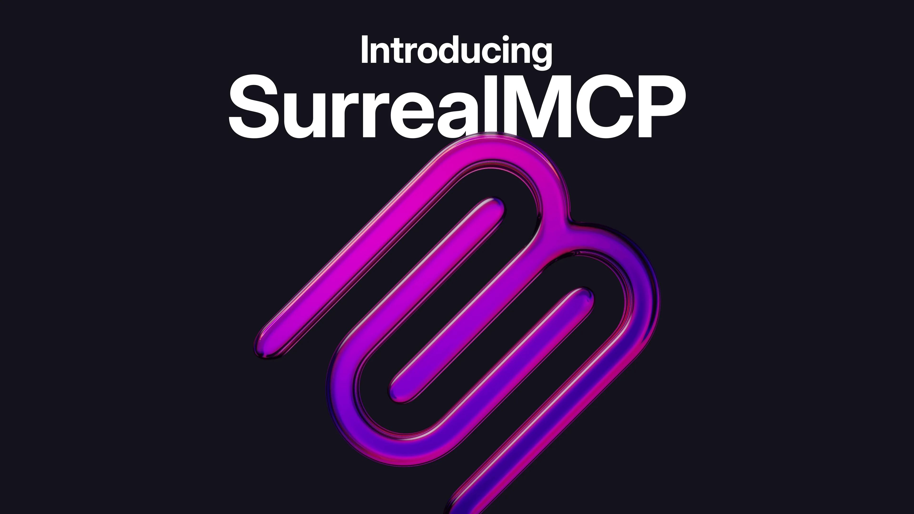

# Introducing SurrealMCP



We’ve just launched [SurrealMCP](/mcp), the official Model Context Protocol server for SurrealDB and SurrealDB Cloud.

With SurrealMCP, AI assistants, agents, IDEs, chatbots, and data platforms gain something they’ve always lacked: **persistent, permission-aware, real-time memory**. That means they can finally recall past conversations, query live data securely, and reason over structured knowledge, all backed by SurrealDB’s multi-model engine.

### Why memory matters for AI

AI agents are powerful, but without memory, they struggle to build long-term context. Every conversation starts from scratch. Every task repeats the same learning.

SurrealMCP changes that. By connecting any MCP-compatible client to SurrealDB, agents can:

- **Remember and recall events, facts, and conversations over time**
- **Query and update live data securely** with role-based access controls
- **Link vectors, graphs, and documents** for deep contextual understanding
- **Perform administrative tasks naturally**, like creating schemas or seeding data

Or as our CEO and co-founder Tobie Morgan Hitchcock put it:

> *“SurrealMCP gives AI agents what they’ve been missing - real, structured, and secure memory. By following the open MCP standard, we’ve made it possible for agents to work directly with live SurrealDB data, respecting every access rule, and remembering what matters.”*

### Feature highlights - what you can do with SurrealMCP

SurrealMCP is more than just memory - it’s your full Swiss army knife for AI-native database interactions:

- Connect your AI models and tools directly to SurrealDB - **no complex APIs or custom integrations required**
- Query documents, graphs, vectors, and relational data through a **single, unified interface**
- Instantly spin up ephemeral in-memory databases for prototyping, or easily **switch to persisted local storage** for durability
- Run perfectly fine even on the edge - **deploy embedded databases on edge devices, laptops, and constrained environments**
- Enjoy full **CRUD operations**, advanced filtering, pagination, grouping, and parameterised queries
- Seamlessly manage graph relationships - create, traverse, and query linked records with confidence.

### Example use cases

Here’s how SurrealMCP makes AI agents smarter and more capable:

- **Agent memory:** “Store this chat and recall anything about shipping delays.”

SurrealMCP stores the conversation as vectors, links related data in graph form, and makes it time-travel queryable.

- **Business intelligence:** “Recall customers in the top ten percent by lifetime value.”

SurrealMCP translates the request into optimised queries - while respecting access policies.

- **Operational automation:** “Create a dev namespace in Europe, apply the schema, seed sample data.”

SurrealMCP executes instantly - no dashboards, no scripts.

- **Enterprise co-pilots:** Power contextual CRM insights, real-time inventory tracking, or customer support histories - all memory-enabled.

### How it works - deployment options

SurrealMCP gives you flexible deployment tailored to your workflow:

| Deployment mode | Description |
|---|---|
| **Default (stdio)** | Fast, efficient local development - ideal for IDE integration and zero-overhead comms |
| **HTTP server mode** | Run as an HTTP server with RESTful JSON endpoints - great when stdio isn’t available |
| **Unix socket support** | Secure local communication in containerised or tightly regulated environments |

| **Cloud-native usage** | Connect SurrealMCP within SurrealDB Cloud using a simple JSON config like:

Run locally, and connect directly from your IDE SurrealMCP runs locally via stdio. Connect to SurrealDB instances from any IDE, framework, or AI tool. Instantly start an in-memory or local database at the edge directly from your AI tool, with ephemeral or persisted data.

```json
{
  "mcpServers": {
    "SurrealDB": {
      "command": "docker",
      "args": [
        "run",
        "--rm",
        "-i",
        "surrealdb/surrealmcp:latest",
        "start"
      ]
    }
  }
}
```

Run as an HTTP server, for local deployments SurrealMCP can alternatively be run as an HTTP server, for environments where stdio is not available. With SurrealDB embedded within SurrealMCP, you can run SurrealDB instances locally, and connect to them directly from your IDE.

```json
{
  "mcpServers": {
    "SurrealDB": {
      "command": "docker",
      "args": [
        "run",
        "--rm",
        "-p", "8080:8080",
        "surrealdb/surrealmcp:latest",
        "start",
        "--auth-disabled",
        "--bind-address", "127.0.0.1:8080",
        "--server-url", "http://localhost:8080"
      ]
    }
  }
}
```

### Get started

SurrealMCP is available **today** for both self-hosted SurrealDB and SurrealDB Cloud. Developers can:

- Run it via Docker or as a standalone binary
- Connect MCP-compatible agents, IDEs, and AI tools directly to SurrealDB
- Enable it instantly in SurrealDB Cloud for fully managed hosting

👉 Check out the [webpage](/mcp) for more information, or view the [source code and documentation](https://github.com/surrealdb/surrealmcp) to get started.
