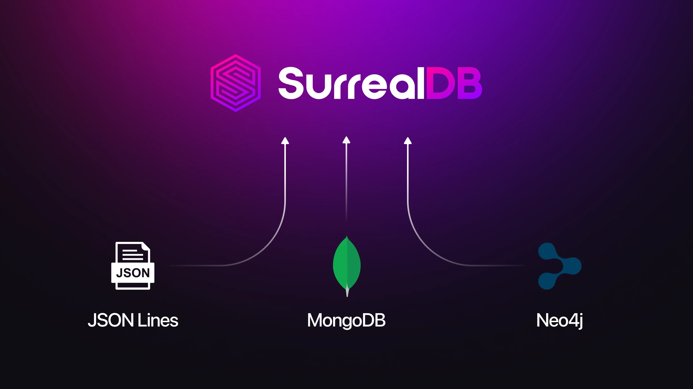

# Migrate your data directly to SurrealDB using Surreal Sync



> [!WARNING]
> Notice: Surreal Sync is currently in [active development](https://github.com/surrealdb/surreal-sync/releases) and is not yet stable. We are looking forward to any and all feedback on the tool, either via raising an [issue](https://github.com/surrealdb/surreal-sync/issues) or PR on the Surreal Sync repo, or anywhere else in the SurrealDB [community on Discord](https://discord.gg/surrealdb).

Today we are excited to announce the launch of Surreal Sync, a new tool that allows existing data from another database to be migrated to SurrealDB.

Surreal Sync is run entirely on the command line and allows you to import data directly from a another source straight into a running SurrealDB instance. For example, the following command will sign into a Neo4J database at `bolt://localhost:7687` as the user `neo4j` with the password `password` into the SurrealDB database `graph_data` inside the `production` namespace via a user named `root` with the password `secret`.

```cli
surreal-sync sync neo4j \
  --source-uri "bolt://localhost:7687" \
  --source-username "neo4j" \
  --source-password "password" \
  --neo4j-timezone "America/New_York" \
  --to-namespace "production" \
  --to-database "graph_data" \
  --surrealdb-username "root" \
  --surrealdb-password "secret"
```

Currently, the tool supports three sources: Neo4J, MongoDB, and JSON Lines.

## Importing from another database

Importing data from an external source into SurrealDB requires a conversion from one datatype into another, and in the case of Neo4J, also a conversion of Neo4J graph edges into SurrealDB graph edges. This allows you to use the built-in `->` graph syntax without needing to do any extra processing after the data migration is done.

The Surreal Sync documentation includes a page for each data source that explains how the conversion takes place. Most of the time the conversion will be from one type to a nearly identical one, such as from a [MongoDB Map](https://github.com/surrealdb/surreal-sync/blob/main/docs/mongodb-data-types.md) to a SurrealDB [object](/docs/surrealql/datamodel/objects). In this case, the data type is deemed to be "Fully Supported".

If a data type does not have a clear equivalent in SurrealQL, the data will be stored as an object that maintains as much of the original data and functionality as possible. For example, the Neo4J `Point3D` type does not have a direct SurrealQL equivalent, and is thus stored as a GeoJSON-like object with a `coordinates` field that holds three floats for the point's longitude, latitude, and elevation. In this case, the data type is deemed to be "Partially Supported".

As the Surreal Sync documentation puts it:

```syntax
✅ Fully Supported: The data type is converted with complete semantic preservation and no data loss
🔶 Partially Supported: The data is preserved but may lose some type-specific semantics, precision, or functionality
```

## Importing from JSON Lines

JSON Lines deserves a separate mention in this post because it shows that Surreal Sync is not strictly a tool to migrate data from one database to SurrealDB, but also data from one data *format* to SurrealDB. In addition, SurrealDB has recently [added JSON Lines support](/blog/two-new-ways-to-keep-an-eye-on-your-surrealdb-database#saving-logging-output-as-a-file) for the terminal output of the SurrealDB server itself. That lets you move from this:

```cli
2025-08-06T04:00:21.564978Z  INFO surreal::env: src/env/mod.rs:12: Running 3.0.0+20250804.354010130 for macos on aarch64
2025-08-06T04:00:21.565738Z  INFO surrealdb::core::kvs::ds: crates/core/src/kvs/ds.rs:275: Starting kvs store in memory
2025-08-06T04:00:21.566431Z  INFO surrealdb::core::kvs::ds: crates/core/src/kvs/ds.rs:278: Started kvs store in memory
2025-08-06T04:00:21.583716Z  INFO surrealdb::net: src/net/signals.rs:95: Listening for a system shutdown signal.
2025-08-06T04:00:21.584067Z  INFO surrealdb::net: src/net/mod.rs:225: Started web server on 127.0.0.1:8000
```

To this.

```json
{"timestamp":"2025-07-22T03:18:59.349350Z","level":"INFO","fields":{"message":"Running 3.0.0+20250721.eaff383ce for macos on aarch64"},"target":"surreal::env"}
{"timestamp":"2025-07-22T03:18:59.349604Z","level":"DEBUG","fields":{"message":"Database strict mode is false"},"target":"surreal::dbs"}
{"timestamp":"2025-07-22T03:18:59.349647Z","level":"WARN","fields":{"message":"❌🔒 IMPORTANT: Authentication is disabled. This is not recommended for production use. 🔒❌"},"target":"surreal::dbs"}
{"timestamp":"2025-07-22T03:18:59.349787Z","level":"DEBUG","fields":{"message":"Server capabilities: scripting=false, guest_access=false, live_query_notifications=true, allow_funcs=all, deny_funcs=none, allow_net=none, deny_net=none, allow_rpc=all, deny_rpc=none, allow_http=all, deny_http=none, allow_experimental=none, deny_experimental=none, allow_arbitrary_query=all, deny_arbitrary_query=none"},"target":"surreal::dbs"}
```

[This page](https://github.com/surrealdb/surreal-sync/blob/main/docs/jsonl.md) from the Surreal Sync repo goes into great detail on how to import data in JSON Lines format. The gist of it is as follows:

- Each file that holds the JSON Lines will become a SurrealQL table of the same name.
- Since an `id` field is needed for each and every SurrealQL record, the tool will look for an `id` field in each JSON object. If this field does not exist, use the `--id-field` flag to let it know which field you want to be converted into the `id` field.

For example, if the data above is saved in a file called `log.jsonl` and the following command is used:

```cli
surreal-sync sync jsonl \
  --source-uri /path/to/jsonl \
  --to-namespace myns \
  --to-database mydb \
  --id-field "timestamp"
```

The output from `SELECT * FROM log` will now look like this.

```surrealql
[
	{
		fields: {
			message: 'Running 3.0.0+20250721.eaff383ce for macos on aarch64'
		},
		id: log:⟨2025-07-22T03:18:59.349350Z⟩,
		level: 'INFO',
		target: 'surreal::env'
	},
	{
		fields: {
			message: 'Database strict mode is false'
		},
		id: log:⟨2025-07-22T03:18:59.349604Z⟩,
		level: 'DEBUG',
		target: 'surreal::dbs'
	},
	{
		fields: {
			message: '❌🔒 IMPORTANT: Authentication is disabled. This is not recommended for production use. 🔒❌'
		},
		id: log:⟨2025-07-22T03:18:59.349647Z⟩,
		level: 'WARN',
		target: 'surreal::dbs'
	},
	{
		fields: {
			message: 'Server capabilities: scripting=false, guest_access=false, live_query_notifications=true, allow_funcs=all, deny_funcs=none, allow_net=none, deny_net=none, allow_rpc=all, deny_rpc=none, allow_http=all, deny_http=none, allow_experimental=none, deny_experimental=none, allow_arbitrary_query=all, deny_arbitrary_query=none'
		},
		id: log:⟨2025-07-22T03:18:59.349787Z⟩,
		level: 'DEBUG',
		target: 'surreal::dbs'
	}
]
```

The SurrealDB documentation [has a section for Surreal Sync](https://github.com/surrealdb/surreal-sync), while further details can be found [in the readme for the tool itself](https://github.com/surrealdb/surreal-sync).
