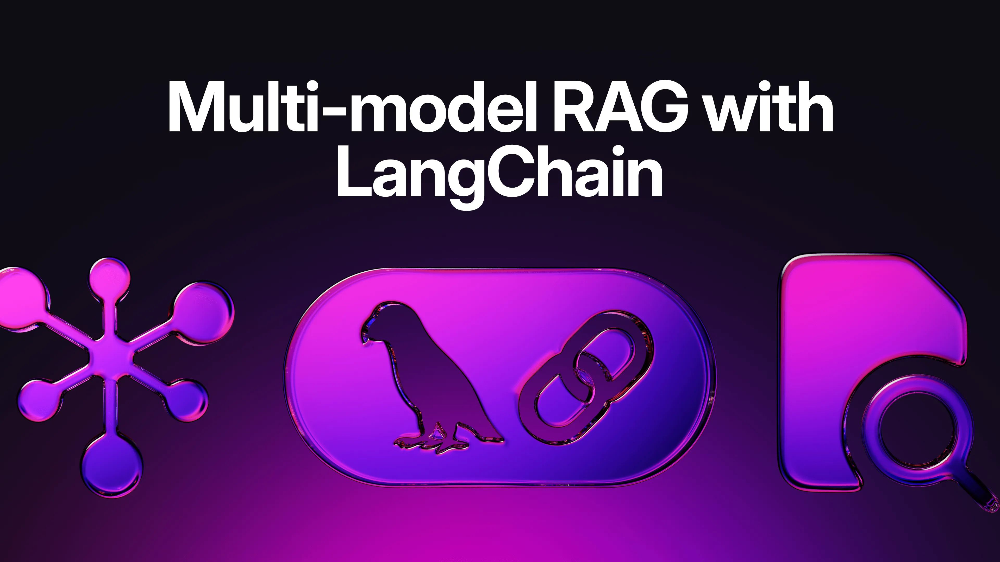
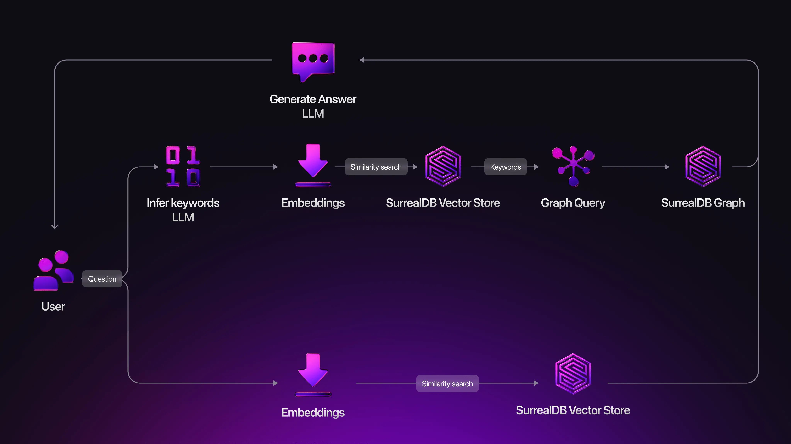
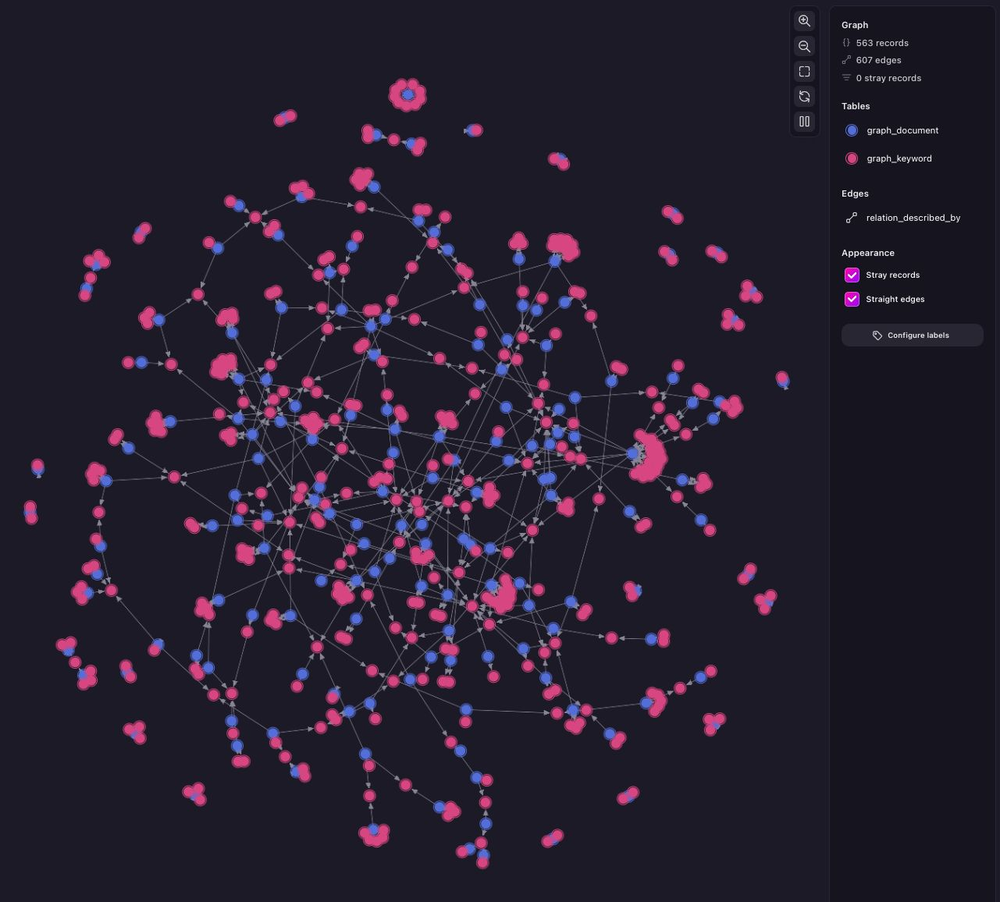

# Multi-model RAG with LangChain



> "I have not failed. I've just found 10,000 ways that won't work."

- Thomas Edison

In the rapidly evolving field of AI, most of the time is spent optimising. You are either maximising your **accuracy**, or minimising your **latency**. It’s therefore easy to find yourself running experiments and iterating, whenever you build a RAG solution.

This blog post presents an example of such a process, which helped me play around with some **LangChain components**, test some **prompt engineering** tricks, and identify specific use-case challenges (like time awareness).

I also wanted to test some of the ideas in [LightRAG](https://lightrag.github.io/). Although I built a much simpler graph (inferring only keywords and not the relationships), the process of reverse engineering LightRAG into a simpler architecture was very insightful.

Before we start, you may want to look at our [integrations](/integrations) page for more AI frameworks.

## Use case

*What data do I have easily available, that I know well? What type of questions could I ask a chatbot?*

I chose to download my WhatsApp group chats, and tried to ask questions about things we talked about.

But since I’m too ashamed to show you my private conversations, I asked Gemini to generate some chat conversations about topics I provided (favourite food, movie plan, books, AI). This is one of those conversations (from [\_chat_test.txt](https://github.com/surrealdb/langchain-surrealdb/blob/main/examples/graphrag-travel-group-chat/data/_chat_test.txt)):

```syntax
[21/07/2025, 19:20:11] Ben: Random question for a Monday night... but what's everyone's actual, number one, desert island favourite food?
[21/07/2025, 19:20:54] Liam: Ooh, tough one. So many contenders.
[21/07/2025, 19:21:38] Liam: I think I'd have to go with a proper Sunday roast. Like my mum's. Roast beef, crispy roast potatoes, massive Yorkshire puddings, swimming in gravy. Can't be beaten.
[21/07/2025, 19:22:15] Chloe: That's a strong choice, Liam. Very respectable.
[21/07/2025, 19:23:04] Chloe: For me... it has to be a really good, authentic Pad Thai. The perfect balance of sweet, sour, and salty. With loads of peanuts and chilli flakes. 🤤
[21/07/2025, 19:23:45] Ben: Both excellent choices. Liam, you can't go wrong with a roast. Chloe, good shout, a proper Pad Thai is a game changer.
[21/07/2025, 19:24:08] Ben: I was watching Chef's Table and now I'm starving haha.
[21/07/2025, 19:24:51] Liam: So what's yours then, Mr. Question Man?
[21/07/2025, 19:25:39] Ben: For me, it's gotta be pizza. But specifically, a Neapolitan margarita. The simple ones are the best. Chewy, charred crust, proper San Marzano tomatoes, and buffalo mozzarella. Perfection.
[21/07/2025, 19:26:18] Chloe: Ah, a man of taste. You're right, a simple margarita from a proper place is heaven.
[21/07/2025, 19:27:05] Liam: Okay, this conversation has just made me incredibly hungry.
[21/07/2025, 19:27:33] Ben: Right? We should do a food tour of our favourites. There's that pub in Islington that does an amazing roast, Chloe you must know a good Thai place, and I know the best pizza spot in Peckham.
[21/07/2025, 19:28:10] Chloe: I love that idea! The Thai place near me in Highbury is incredible. Let's actually plan it.
[21/07/2025, 19:28:44] Liam: 100%. For now though, I'm ordering a curry. This chat broke me.
```

## RAG architecture



## Ingestion

Let’s take a look at how all of this was put together, starting with the **ingestion** into a vector and a graph store.

DB connection and store instances:

```python
# Being a multi-model DB means all stores are handled by the same DB, so there’s
# only one connection
conn = Surreal(url)

# signin docs: https://surrealdb.com/docs/sdk/python/methods/signin
conn.signin({"username": user, "password": password})
conn.use(ns, db)

# Vector for conversations
vector_store = SurrealDBVectorStore(
    OllamaEmbeddings(model="all-minilm:22m"),
    conn,  # DB connection
    # default table name is "documents"
)

# Vector store for keywords
vector_store_keywords = SurrealDBVectorStore(
    OllamaEmbeddings(model="all-minilm:22m"),
    conn,
    "keywords",  # table
    "keywords_vector_idx",  # index name
)

# Graph
graph_store = SurrealDBGraph(conn)
```

Then, I used LangChain document loaders to load my backup files:

```python
# -- Load messages
match provider:
    case ChatProvider.WHATSAPP:
        loader = WhatsAppChatLoader(path=file_path)
    case ChatProvider.INSTAGRAM:
        loader = InstagramChatLoader(path=file_path)
    case _:
        raise ValueError(f"Unsupported provider: {provider}")
raw_messages = loader.lazy_load()
```

Then, it splits the full group chat backup into chunks. Ideally each chunk is a different conversation topic, but to heuristically identify them, I split the chunks on every 3-hour-of-silence-gap between messages (look for `max_gap_in_s` in [ingest.py](https://github.com/surrealdb/langchain-surrealdb/blob/main/examples/graphrag-travel-group-chat/src/graphrag_travel_group_chat/ingest.py)).

Then, for each chunk, it populates the vector and graph stores like this:

- **Destination: vector store**

The [SurrealDBVectorStore](https://python.langchain.com/docs/integrations/vectorstores/surrealdb/) LangChain component appends the corresponding vector embeddings and stores the chunks. It was set up to use `all-minilm:22m` embedding model from Ollama when creating its instance.

- **Destination: graph store**

1. infer keywords (prompts in [llm.py](https://github.com/surrealdb/langchain-surrealdb/blob/main/examples/graphrag-travel-group-chat/src/graphrag_travel_group_chat/llm.py))
1. generate vector embeddings and insert in vector store (same as above)
1. create a graph that relates keywords with conversations: **conversation -> described_by -> keyword** (using [SurrealDBGraph](https://github.com/surrealdb/langchain-surrealdb/blob/main/langchain_surrealdb/experimental/surrealdb_graph.py) LangChain component, the code to generate the graph is in [ingest.py](https://github.com/surrealdb/langchain-surrealdb/blob/main/examples/graphrag-travel-group-chat/src/graphrag_travel_group_chat/ingest.py))

```python
# -- Document loaders
from langchain_community.chat_loaders import WhatsAppChatLoader
from graphrag_travel_group_chat.chat_loaders.instagram import InstagramChatLoader

# -- Vector store
from langchain_core.documents import Document
from langchain_surrealdb.vectorstores import SurrealDBVectorStore

# -- Graph store
from langchain_community.graphs.graph_document import GraphDocument, Node, Relationship
from langchain_surrealdb.experimental.surrealdb_graph import SurrealDBGraph
```

Here’s the full [ingest.py](https://github.com/surrealdb/langchain-surrealdb/blob/main/examples/graphrag-travel-group-chat/src/graphrag_travel_group_chat/ingest.py) code.

## Inferring keywords

```python
from langchain_core.prompts import ChatPromptTemplate
from langchain_ollama import ChatOllama

def infer_keywords(text: str, all_keywords: list[str] | None) -> set[str]:
    chat_model = ChatOllama(model="llama3.2", temperature=0)
    prompt = ChatPromptTemplate(
        [
            ("system", INSTRUCTION_PROMPT_INFER_KEYWORDS),
            ("user", INPUT_PROMPT_INFER_KEYWORDS),
        ]
    )
    chain = prompt | chat_model
    res = chain.invoke(
        {
            "text": text,
            "additional_instructions": ADDITIONAL_INSTRUCTIONS.format(
                all_keywords=all_keywords
            )
            if all_keywords
            else "",
        }
    )
    return set([x.strip().lower() for x in res.content.split(",")])
```

To come up with the prompts for the LLM, I compared prompts from different LangChain and Ollama examples, and from the appendix in the [LightRAG paper](https://arxiv.org/abs/2410.05779). Then wrote my own prompts and after some iterations they end up looking like this:

```python
INSTRUCTION_PROMPT_INFER_KEYWORDS = """
---Role---
You are a helpfull assistant tasked with identifying themes and topics in chat
messages.

---Goal---
Given a series of chat messages, list the keywords that represent the main
themes and topics in the messages.
"""

INPUT_PROMPT_INFER_KEYWORDS = r"""
- Include at least 1 keyword that describes the feeling or sentiment of the
converation
- Keywords are general concepts or themes. They should be as broad as possible.
- Output only the keywords as a comma-separated list.
- Do not explain your answer.

{additional_instructions}

---Examples---

Example 1:
Text: "[2025-07-10 22:21:59] Martin: Let's go to italy during the holidays"
Output: ["italy","holiday","travel"]

…

Example 4:
Text: "[2025-01-19 10:30:16] Ben: Hello, how are you?\\nChloe: I'm doing fine!"
Output: []

---Real Data---
Text: {text}
Output:
"""
```

Here’s the full and latest [llm.py](https://github.com/surrealdb/langchain-surrealdb/blob/main/examples/graphrag-travel-group-chat/src/graphrag_travel_group_chat/llm.py) code.

The use of examples in the prompt is called **“few-shot prompting”**. It’s very powerful when a few examples are enough for the LLM to understand the pattern. Learn more about other techniques for prompt optimisation in this [LangChain blog post](https://blog.langchain.com/exploring-prompt-optimization/).

To visualise how the document -> keyword graph looks like, run the following query using [Surrealist](https://app.surrealdb.com/):

```surrealql
-- For each `graph_keyword`, select its `id` and `graph_document`s
-- that are connected (by any relation name `?`) to it
SELECT id, <-?<-graph_document FROM graph_keyword;
```



## Retrieval

**From the vector store:** user query -> generate embedding -> vector search conversations

```python
from langchain_surrealdb.vectorstores import SurrealDBVectorStore
...
k: int = 3
score_threshold: float = 0.3
...
results_w_score = vector_store.similarity_search_with_score(query, k=k)
```

Source: [retrieve.py](https://github.com/surrealdb/langchain-surrealdb/blob/main/examples/graphrag-travel-group-chat/src/graphrag_travel_group_chat/retrieve.py).

At this step, it’s worth checking your `k` and `threshold` values.

- `k`: how many chunks we want
- `threshold`: what’s the minimum acceptable similarity score. Opposite of “distance”, which you could get if you are using a different vector search function.

Try out some searches and see the results. What values define the line between good and bad? A `threshold` value that is higher than acceptable will pollute your context, but if you leave it too low you’ll leave out documents that contained the knowledge you needed but just didn’t match que user’s query that well (for example when users like to talk too much, and say please and thank you in the prompt). Again, it depends on the use case, but around `30%` and `55%` are good places to start.

```syntax
Ask something about the group chat: What is Ben's favorite food?
…
similarity_search_with_score:
✔︎ - [38%] [2025-07-21 19:20:11] Ben: Random question for a Monday night... but w
× - [22%] [2025-06-10 15:23:45] Chloe: GUYS. Have you seen the trailer for 'Apex
× - [20%] [2025-07-21 12:10:15] Liam: My commute has been upgraded. This book I'
× - [17%] [2025-07-22 00:01:15] Chloe: Are you guys awake? I’ve gone down a rabb
```

This use case requires "low" threshold values. In the example test above, because I know the data, only the first result is acceptable. Ideally, you should have a list of questions, acceptable results, and programmatically run all the experiments using a real data set. This will allow you to re-run the same experiments, with a different embedding model too.

**From the graph:** user query -> infer keywords -> search keywords in graph -> get related conversations

```python
query = """
    SELECT id,<-relation_described_by<-graph_document.content as doc
    FROM graph_keyword WHERE name IN $kws GROUP BY id
"""
result = conn.query(query, {"kws": similar_keywords})
```

The code is in [retrieve.py](https://github.com/surrealdb/langchain-surrealdb/blob/main/examples/graphrag-travel-group-chat/src/graphrag_travel_group_chat/retrieve.py).

## Generation

With both retrieval methods, there’s more than 2 ways of generating a context. This is what I explored while trying different questions and watching at the retrieved documents and the generated answers.

Here’s another example prompt: **Are we going to eat before going to the movies?**

### 1. From vector search context

```syntax
similarity_search_with_score:
✔︎ - [42%] [2025-06-10 15:23:45] Chloe: GUYS. Have you seen the trailer for 'Apex
× - [29%] [2025-08-08 13:14:25] Liam: Do you think a hot dog is a type of sandwh
× - [24%] [2025-07-21 19:20:11] Ben: Random question for a Monday night... but w
× - [19%] [2025-07-22 00:01:15] Chloe: Are you guys awake? I’ve gone down a rabb
× - [14%] [2025-07-21 12:10:15] Liam: My commute has been upgraded. This book I'
```

Only the first result is used, since the threshold is set at 30%.

With that first chunk as context, the LLM generated a good answer:

> You had previously agreed that meeting at 6pm for food would be a good plan, so it's likely that eating before the movie will be part of the plan. You mentioned grabbing a bite on the South Bank and could get there by 6pm.

llama3.2 (temperature 0.8)

### 2. From graph context

The first step is to generate keywords from the user’s questions using the LLM. The result for this particular test was: **movie, film, food, and hunger**, which pointed to 3 different conversations.

The question was crafted on purpose to get a bad context, because it includes keywords that relate to different conversations. This shows that a **semantic knowledge graph** requires more than just inferring keywords.

LLM generated:

> Hello Liam! Yes, you mentioned that you thought it would be great to grab food beforehand when you go to see "Apex" at the BFI IMAX on Tuesday, 12th August. You suggested meeting at 6 pm for food and then heading to the movie showing at 7:45 pm.

llama3.2 (temperature 0.8)

It doesn’t mean simple graphs are useless! For example, with this specific use case, I got bad contexts when asking questions that were time/location specific. This could be fixed by representing those implicit links in a graph, so we can trim down the context to remove chunks about the same topic but related to a different event in the past.

Here I let the LLM infer only the keywords (which are nodes in my graph), but you can also let the LLM infer the edges.

### 3. From documents that are found only on both

This alternative was a way I found to try to have both previous methods work together, keeping each other in check. So if vector search retrieved documents that are really not relevant, maybe the graph can help trim them out.

LLM generated:

> You're right, it's your name that I'm responding to now. Yes, you mentioned earlier that when going to see "Apex" at the BFI IMAX, you suggested meeting for food beforehand with Ben and Chloe. So, yes, we are planning to eat before the movie!

llama3.2 (temperature 0.8)

During my test, it was actually easier to make the graph fail: it takes more resources, it’s therefore slower, and retrieves wrong documents. But I don’t blame the graph here, the issue is that just keywords themselves are not enough for semantic retrieval. LightRAG, for example, also infers relationships, generating a semantic graph. For this use case, I can imagine better ways to use a graph store to improve the results.

## Future work

- What would be the effects of overlapping chunks?
- Define some user questions that are currently generating non-optimal contexts. With this, run new experiments to optimise accuracy.
- Add more nodes and edges to the graph to represent time, location, members, conversation topic, etc.

## Conclusions

- Set up yourself for success by structuring your code in a way you can test variations and **measure** the results, so you can confidently choose the right options. This applies to prompt engineering, vector indexes, graph edges, model temperatures, and any other tweak-able option you think can impact the metric you are optimising (accuracy, latency, costs, …).
- A multi-model RAG architecture can either be general (e.g. LightRAG) or use-case specific (graph that links chats, members, dates, pre-defined edges, …). In both cases, the aim is to find better source documents to build a context, and to provide a faster and cost-effective solution. That said, some use cases don’t need to be over-engineered, so make sure you are clear on the metric you are optimising, and that you try at least one alternative.

## Ready to build?

Get started for free with [Surreal Cloud](https://app.surrealdb.com/signin).

Any questions or thoughts about this or semantic search using SurrealDB? Feel free to [drop by our Discord](https://discord.gg/surrealdb) to get in touch.
