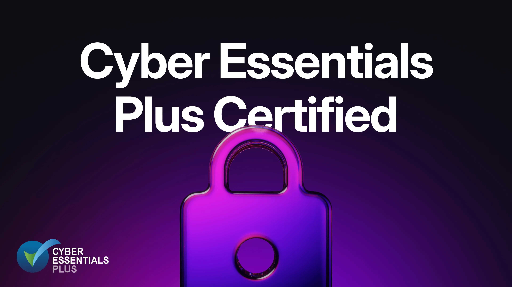

# SurrealDB achieves Cyber Essentials Plus certification

We are excited to share another major milestone in our security journey: SurrealDB has successfully achieved Cyber Essentials Plus (CE+) certification!

This UK Government - backed certification involves rigorous, independent technical testing of our systems, confirming that our defences are effective against the most common cyber threats, including phishing, malware, ransomware, and unauthorised access attempts. CE+ goes beyond a policy check, it validates that our security measures work in practice, providing independent assurance to our customers and partners.

Achieving CE+ strengthens our existing security framework, building on certifications such as ISO 27001 and SOC2 Type 1. It reinforces our proactive approach to protecting SurrealDB Cloud and all SurrealDB deployments, ensuring that we meet recognised industry standards and customer expectations for robust, proven security controls.

Our commitment to safeguarding your data is paramount. CE+ is not just a badge, it’s a demonstration of the trust you can place in SurrealDB to protect your valuable information while enabling you to innovate with confidence.

For more information view our [Trust Centre](https://trust.surrealdb.com/).
