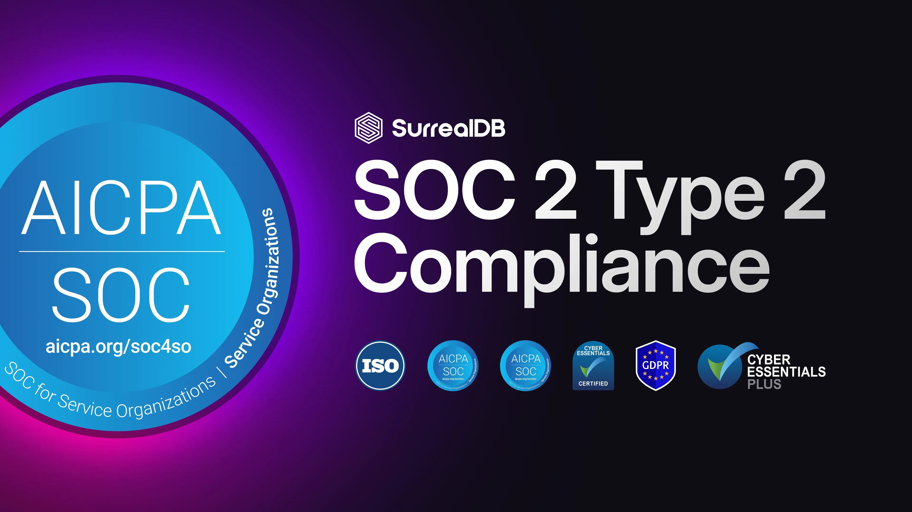

# SurrealDB Cloud successfully completes SOC 2 Type 2 Audit

We’re excited to share another major milestone in our security journey: SurrealDB Cloud has successfully completed its SOC 2 Type 2 audit with an unqualified opinion and no exceptions noted.

Building on SOC 2 Type 1, this deeper evaluation doesn’t just confirm that our controls are well designed, it proves they are operating effectively over time. Independent auditors have observed controls relevant to the Security, Availability, and Confidentiality Trust Service Criteria, providing validation that our protections aren’t just on paper, but active in practice.

For our customers, this means greater confidence that SurrealDB Cloud delivers continuous security visibility, reinforced operational integrity, and an ongoing commitment to safeguarding your data.

At SurrealDB, security isn’t a checkbox, it’s a core part of how we build and operate. This achievement is a direct reflection of that philosophy, and of our commitment to continually raising the bar.

For more information, view our [Trust Centre](https://trust.surrealdb.com/).
