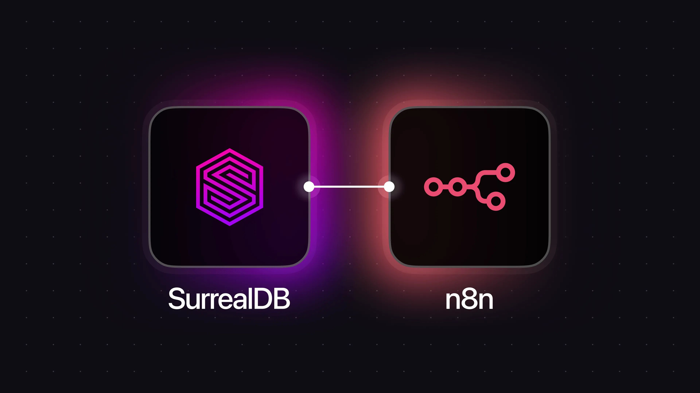
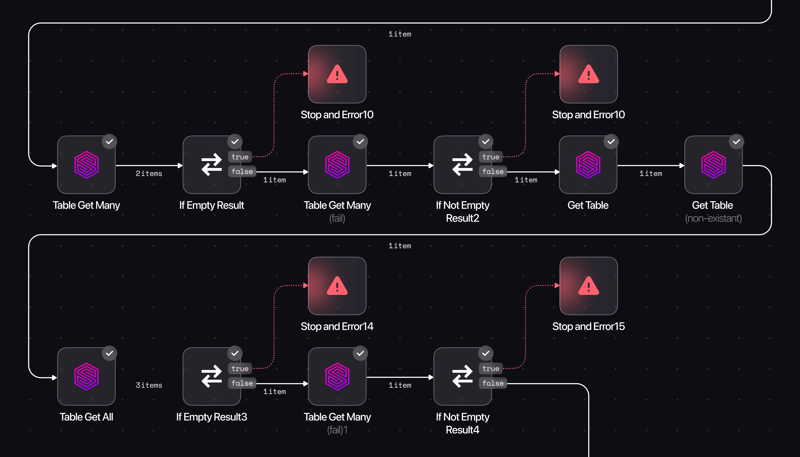

# Power up your AI workflows: the official SurrealDB x n8n node is here



**TL;DR** - We've shipped the **official SurrealDB node for n8n**. It's a first-party, production-ready integration that lets you query, create, update, upsert, and delete data in SurrealDB from any n8n workflow - and it also runs as an AI tool inside n8n's Agent nodes. This work builds on the amazing [community implementation](https://github.com/nsxdavid/n8n-nodes-surrealdb) by [David Whatley](https://github.com/nsxdavid)! 🚀

You can browse the code here: [https://github.com/surrealdb/n8n-nodes-surrealdb](https://github.com/surrealdb/n8n-nodes-surrealdb).

The node supports **complete CRUD**, **custom SurrealQL**, **table/field/index operations**, **relationship management**, **connection pooling**, and **diagnostics,** all over HTTP(S). For AI agents, enable tool usage and plug the SurrealDB node straight into your agent's toolbelt to give LLMs safe, structured access to your app data.



## Why this matters (especially for AI)

The fastest-growing teams are tightening the loop between **data → decision → action**. SurrealDB gives you one multi-model system - **document, relational, graph, full-text, and vector** - so the same database that powers your app can also power your automations and your AI.

[n8n](https://n8n.io/) brings the visual orchestration: triggers, conditionals, retries, and a deep library of built-in AI nodes and AI Agent tools. The SurrealDB node closes the loop so your automations and agents can read and write to the source of truth, safely and repeatably.

## What's available now

Here's what's in the **official SurrealDB n8n node**:

- **Dual node types**: use it as a standard action node *or* as a **tool** inside [n8n's AI Agent node](https://docs.n8n.io/integrations/builtin/cluster-nodes/root-nodes/n8n-nodes-langchain.agent/) (set an env var to allow tools).
- **CRUD**: create, get, update, upsert, delete.
- **Query**: run any **SurrealQL** with parameters; includes a **visual SELECT builder** (`WHERE`, `ORDER BY`, `GROUP BY`, etc.).
- **Tables and fields**: list, create, update, delete tables and fields.
- **Indexes**: create/delete indexes and monitor health.
- **Relationships**: create, delete, and query graph edges (via `RELATE` semantics).
- **System ops**: health check, version, **pool statistics** for performance visibility.
- **Security**: root / namespace / database-scoped auth (with overrides per node).
- **HTTP/HTTPS only** (no WebSocket support).

## What you can build (AI-first recipes)

Below are practical **AI-forward** patterns you can ship in hours, not weeks.

#### 1) Onboarding copilot (enrich, welcome, and segment new users)

Build advanced and dynamic workflows which combine AI and LLM calls to improve user experiences and make more accurate decisions. When you're turning onboarding into a growth loop, AI generates attributes you can target later (activation nudges, upgrade prompts) and all of it lives beside your operational data.

**Trigger**: Webhook (signup event) or Scheduled poll (for new records).

**Workflow**:

1. `INSERT` the user profile record into SurrealDB.
1. Call an **LLM** to calculate the sentiment or intent of the user and extract attributes.
1. `UPDATE` the user record with AI-generated traits; `RELATE` to organisations or plans.
1. **Notify** Slack and add to your email list.

**SurrealDB node ops**: `Create Record`, `Execute Query`, `Create Relationship`.

#### 2) RAG Search (retrieve documents, tickets, articles)

SurrealDB exposes vector functions (including vector::similarity::cosine) and supports vector search patterns; create vector indexes for performance and use the KNN operator where appropriate. With SurrealDB, you can use a single system for OLTP + vectors + graph lookups, for more accurate answers, and improved reasoning.

**Trigger**: new file in storage → chunk/embedding workflow.

**Workflow**:

1. Ingest with your favourite parser (e.g. Unstructured).
1. Create embeddings via your model of choice.
1. `Insert` records into SurrealDB with an embedding field.
1. At query time, `Execute Query` on the SurrealDB node to rank by similarity.

#### 3) GraphRAG or Knowledge Graph assistants

SurrealDB lets you **store graph + vectors in one place** and query both in a single SurrealQL statement. That's powerful for assistants that need **structure + semantics**.

**Trigger**: "Teach the agent" workflow or nightly build.

**Workflow**:

1. Extract entities from docs/tickets.
1. Create nodes (records) and `RELATE` edges (who-knows-who, depends-on, duplicates-with).
1. Store vectors on nodes to blend semantic + structural context.
1. For retrieval, `Execute Query` that follows edges and ranks by vector similarity.

#### 4) Analytics and alerts feed

Build intelligent monitoring systems that track key metrics, detect anomalies, and automatically respond to critical events. SurrealDB's time-series capabilities combined with AI analysis help you stay ahead of issues before they impact users. This creates the feedback loop that growth teams love: **measure → message → learn → ship**, with everything stored relationally, as documents, and as connected graph edges.

**Trigger**: Cron or webhook from your app.

**Workflow**:

1. Periodically `SELECT` error bursts, churn-risk users, or spikes in LLM refusals.
1. Post alerts to Slack; `Insert` incidents back into SurrealDB for post-mortems.
1. `RELATE` incidents to features, releases, and customers.

#### 5) AI Agent with SurrealDB as a Tool

n8n's [AI Agent node](https://docs.n8n.io/integrations/builtin/cluster-nodes/root-nodes/n8n-nodes-langchain.agent/) supports **tools**. When you enable community tools, you can add the SurrealDB node as a tool so the agent can **read** context or **write** results under guardrails. Set `N8N_COMMUNITY_PACKAGES_ALLOW_TOOL_USAGE=true`, then attach the SurrealDB tool with pre-scoped credentials (e.g., namespace or database level authentication) and with whitelisted operations (e.g., `Execute Query` with a parameterised template).

**Workflow**:

1. Agent receives a user query or task.
1. Agent decides if it needs data from SurrealDB (context, user history, etc.).
1. SurrealDB tool executes a scoped query and returns results.
1. Agent processes the data and may write back insights or updates.
1. Agent responds to the user with enriched, contextual information.

> Why it works: you get agentic behaviours, with principle-of-least-privilege access

## Hands-on: build an AI-powered onboarding flow

We'll implement an end-to-end workflow that welcomes a new user, tags them with AI, and writes everything back to SurrealDB.

### 1) Install the node

- In your self-hosted n8n: **Settings → Community Nodes → Install**
- Enter `@surrealdb/n8n-nodes-surrealdb` and install.
- Restart n8n if prompted.
- (Optional, for AI tools) set `N8N_COMMUNITY_PACKAGES_ALLOW_TOOL_USAGE=true`.

### 2) Create credentials

Add **SurrealDB credentials**:

- Connection string: `http(s)://your-surrealdb-host:port`
- Auth scope: **root**, **namespace**, or **database** (pick least privilege).
- Namespace/Database as required by the scope. You can override namespace/database per operation in node options.

### 3) Model the data (minimal schema)

You can start schemaless and later add schema definitions as your data model stabilises. For relationships (e.g., user -> plan), use `RELATE` edges. SurrealDB's `RELATE` creates first-class edges you can traverse in queries.

### 4) Build the n8n workflow

**Trigger**:

- Option A: Webhook receiving your signup event payload.
- Option B: Cron that **SELECTs** "users created since last run".

**Steps**:

1. **SurrealDB → Create Record**: write the user.
1. **AI call** to extract tags: persona, likely intent, key interests.
1. **SurrealDB → Update Record** with AI fields.
1. **SurrealDB → Create Relationship** to connect the user to their plan.
1. **Slack**: post a personalised welcome.
1. **Email provider**: add to onboarding list with the tags.
1. Add a **System → Get Pool Statistics** node in the path you run least often to check connection health over time.

### 5) Add a semantic lookup (nice extra)

If your signup includes free-text ("About me"), you can store an embedding on the user record and later build a segment of "most similar to **X**" users:

```surrealql
LET $e = /* embedding of "I'm a fintech founder" */

SELECT id, email, vector::similarity::cosine(about_embedding, $e) AS score
FROM user
ORDER BY score DESC
LIMIT 25;
```

The same pattern powers AI triage, content recommendations, and semantic deduping.

## For AI Agents: using the node as a tool

1. Set `N8N_COMMUNITY_PACKAGES_ALLOW_TOOL_USAGE=true` in your n8n environment.
1. In the **AI Agent** node, add a **Tool** → choose the **SurrealDB** tool.
1. Configure a **parameterised query** (e.g., allow `SELECT ... FROM $id` only).
1. Provide **database-scoped** credentials to limit blast radius.

This gives agents just-enough powers to fetch facts or file updates without opening up your whole database.

## Product-quality details you'll appreciate

- **Connection pooling** with monitoring: tune minimum and maximum connections, timeouts, retry logic, and query the pool's live stats via `System → Get Pool Statistics`. This is invaluable under bursty, agent-driven workloads.
- **Namespaces/databases**: scope access to your tenancy model and optionally override per operation at the node level.
- **Graph operations**: first-class helpers for creating and querying relationships so you can model organisations, teammates, dependencies, and recommendations as edges.
- **Vector-aware querying**: run similarity or KNN queries using SurrealQL's vector functions and operators; combine with filters for hybrid search.

## Security and governance

- Prefer **namespace-scoped** or **database-scoped** credentials over root; the node supports all three.
- Wrap risky actions (deletes, bulk updates) in dedicated workflows guarded by **IF** gates or **Manual Triggers** in n8n.
- For AI Agents, expose only **specific tool operations** with parameterised queries (no SurrealQL generated from raw format strings).
- Keep an audit trail by writing **activity** records back into SurrealDB later, you can visualise and investigate with graph queries.

## Quick reference: operations you'll use most

- **Records**: `Create` / `Select` / `Update` / `Upsert` / `Delete`.
- **Tables and fields**: `Create Table`, `Delete Table`; `List Field`, `Create Field`, `Delete Field`.
- **Indexes**: `Create Index`, `Delete Index`; `Rebuild Index` as needed. (Vector and full-text indexes are supported by SurrealDB; use indexes to accelerate similarity search and text search.)
- **Relationships**: `Create Relationship`, `Delete Relationship`, `Query Relationship` using SurrealDB's graph semantics.
- **Queries**: `Execute Query`, `Build SELECT` visually with filters and ordering.
- **System**: `Health Check`, `Version`, `Get Pool Statistics`.

## Install and explore

- Official repository: [https://github.com/surrealdb/n8n-nodes-surrealdb](https://github.com/surrealdb/n8n-nodes-surrealdb)
- Docs and integrations: [https://surrealdb.com/docs/integrations/data-management/n8n](/docs/integrations/data-management/n8n)

## Our roadmap

If you're building ambitious AI workflows - RAG, GraphRAG, or agentic back-office automations - we want this node to feel batteries-included for you. Open issues and PRs on the repo, or propose recipes you need (e.g., a pre-built "semantic dedupe" or "churn-risk scorer"). The more we learn from your usage, the faster we can sharpen the DX.

## Final word

Automation should reduce glue code, not add more of it. With **n8n** handling orchestration and **SurrealDB** unifying your **relational + document + graph + vector** data, you've now got a **native bridge** between workflows, agents, and your operational truth. Install the node, ship an AI-assisted flow today, and let your product's growth loops run on rails.
