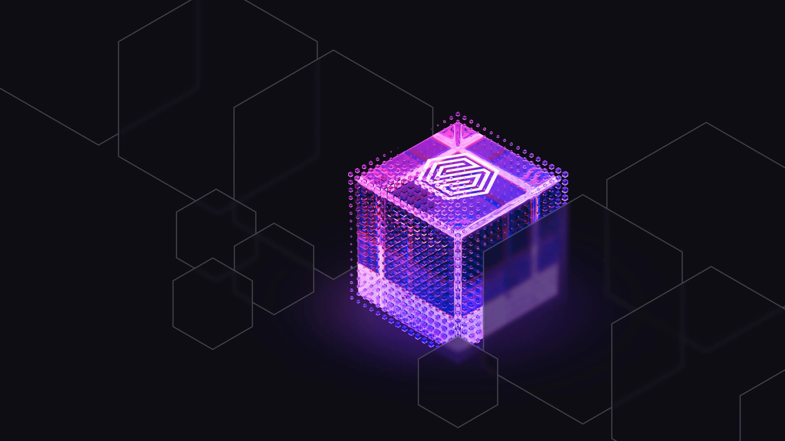

# Research paper - Bridging Analytics and Semantics with SurrealDB

We’re excited to highlight new research from two members of the SurrealDB community: [Bridging Analytics and Semantics: A Hybrid Database Approach to Retrieval-Augmented Generation, now published on Zenodo](https://doi.org/10.5281/zenodo.17018699).

In their work, they explore how hybrid database systems can power the next generation of Retrieval-Augmented Generation (RAG). Traditional RAG workflows rely solely on vector search, but this prototype demonstrates how combining SQL-style analytics with semantic vector search in a unified framework can unlock richer, more flexible retrieval.

To make this possible, the authors turned to SurrealDB. Its unique ability to seamlessly blend structured queries with vector operations enabled them to experiment with hybrid retrieval strategies that go well beyond the limitations of vector-only systems.

We’re proud that SurrealDB could serve as a key enabling technology in this research and look forward to seeing more innovation from our community.

You can read the full paper and access the prototype here: [https://doi.org/10.5281/zenodo.17018699](https://doi.org/10.5281/zenodo.17018699?utm_source=chatgpt.com)🔗

Stay tuned for the follow-on engineering blog with more technical details and the queries.

To learn more, head to:

- Our [AI Agents](/use-cases/ai-agents) and [Knowledge Graphs](/use-cases/knowledge-graphs) pages
- Implement your first RAG app with [Multi-model RAG with LangChain](/blog/multi-model-rag-with-langchain)
