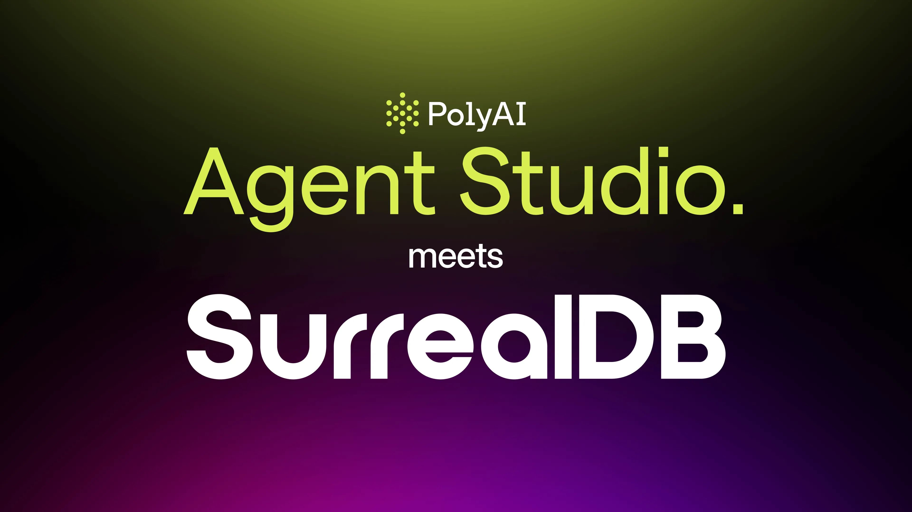

# Bring your own knowledge base: Agent Studio meets SurrealDB

This guest article by **Colman Yau, Vice President of Engineering at PolyAI**, explores how the integration of our multi-model database into its Agent Studio platform, as a Retrieval Augmented Generation (RAG) provider, enables real-time, low-latency AI conversations.

Today, businesses are increasingly wary of being locked into a single vendor ecosystem. Relying on one provider can limit flexibility, slow innovation, and make it harder to integrate tools that fit your exact needs.

One common question we hear is: “Can we bring our own knowledge base into Agent Studio?”

The answer is yes, and our recent work with SurrealDB shows just how quickly and smoothly that can happen. By keeping their own knowledge base, enterprises stay in control, protect sensitive information, and make sure every answer reflects their unique processes and expertise.

## Flexibility and extendability, by design

PolyAI Agent Studio is designed as a platform, not a walled garden. This means your organisation can connect its systems - whether databases, knowledge bases, or graph stores - directly into Agent Studio, which opens up three big advantages:

- Flexibility to choose the technology that works best for your needs.
- Extendability to adapt to future requirements without waiting for vendor updates.
- Control and privacy, since sensitive data can remain in the enterprise’s environment.

## Fast integration with SurrealDB

To see this in action, we connected SurrealDB, a high-performance next-generation database, to Agent Studio as a Retrieval Augmented Generation (RAG) provider. In other words, when a question comes in, it retrieves relevant information from SurrealDB to generate accurate, context-aware responses. SurrealDB acts as the backend knowledge source that powers these real-time answers. Using our custom function calling runtime, we were able to integrate SurrealDB into our agentic RAG implementation in just 20 minutes of work, without ever leaving Agent Studio.

## Performance in practice

One of the quickest ways a phone experience feels off is when there’s a long pause between what a caller says and how an AI agent responds. When a user asks a question, the system has to fetch the right information from the knowledge base. If this takes too long, the conversation feels slow or awkward. Reducing that latency makes conversations flow naturally, keeps callers engaged, and cuts down on frustrating moments.

Querying SurrealDB for vector lookup adds around 30 ms of latency. For comparison, PolyAI’s internal system, which handles both embedding generation and vector search, averages about 31 ms. Even though the two systems are doing different work, the added latency from SurrealDB is far below what a user would notice. This shows that external knowledge bases can connect to Agent Studio without slowing down real-time interactions, keeping responses fast and natural.

## Why latency and control matter

For live voice conversations, natural latency tolerance is about 1-1.5 seconds. Anything within that window feels human. In chat, tolerance is even higher. With latencies in the tens of milliseconds, SurrealDB integration added no perceptible delay.

This integration demonstrates that SurrealDB can power real-time conversational AI without noticeable latency while giving users the full flexibility of its powerful query language. This enables features like defining APIs and custom functions directly within the knowledge base.

This proves three key advantages:

1. **Plug-and-play flexibility:** Adding a new external DB takes minutes, not weeks.
1. **Data privacy and control:** Enterprises can use their own infrastructure without migrating sensitive data.
1. **Minimal performance overhead:** Agent Studio’s architecture ensures the integration runs smoothly and efficiently.

## Beyond the benchmark: real flexibility without compromise

This experiment shows more than just a technical benchmark. Agent Studio makes it easy for businesses to extend and customise their AI solutions without compromising performance or control.

By combining SurrealDB’s capabilities with Agent Studio’s real-time AI, companies get a platform that is both powerful and flexible, ready to adapt as needs evolve.

## Looking ahead

What started as a spontaneous collaboration with the SurrealDB team quickly turned into a practical demonstration of how flexible and forward-looking Agent Studio really is. By moving quickly and working with the tech community, we were able to explore new integrations with ease.

These experiments show the potential for seamless connections, allowing companies to use the tools they prefer while still delivering top-tier, real-time AI experiences. In the future, if we expand to new data types like knowledge graphs, SurrealDB’s multi-model and graph capabilities will let us do so smoothly and efficiently.

This article was first published on [www.poly.ai](https://poly.ai/blog/bring-your-own-knowledge-base-agent-studio-surrealdb/)
