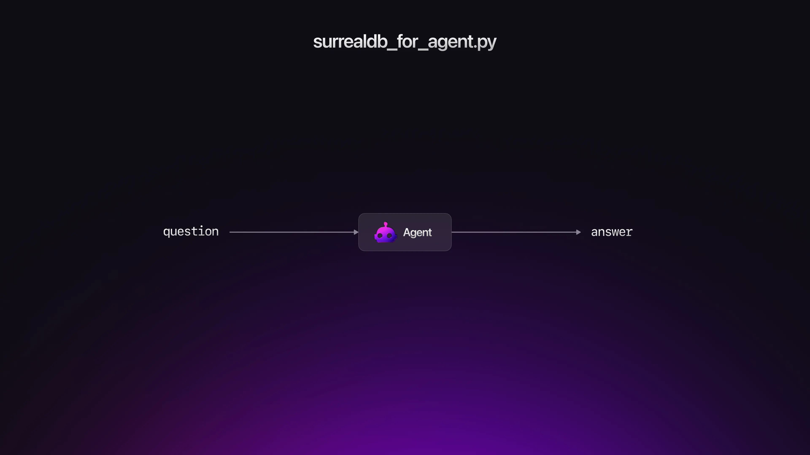
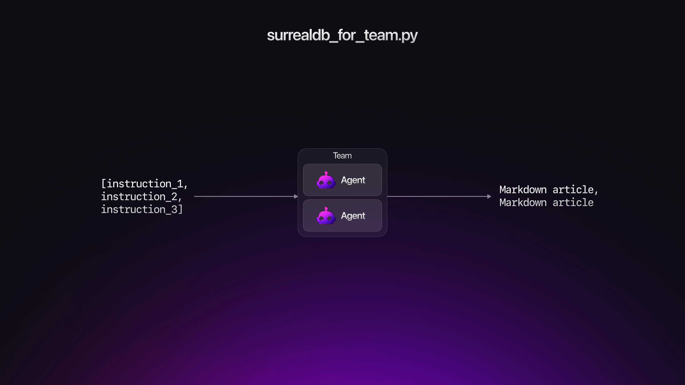
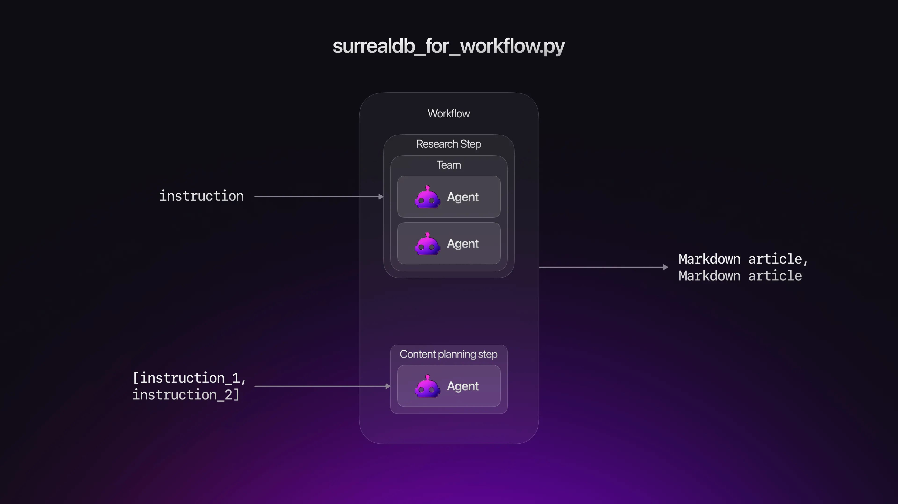

# Exploring the new SurrealDB integration with Agno


If you pay close attention to the latest developments with SurrealDB, you might have noticed that we are now integrated with the multi-agent framework [Agno](https://www.agno.com/). We had a [recent livestream](https://www.youtube.com/watch?v=Abx1FoNI7ws) together with the CEO of Agno Ashpreet Bedi, in which he mentions that one of areas where Agno focuses the most is on having agents produce input that is reliable, and in that SurrealDB has been a great fit in giving the LLM the perfect context on every request.

The integration includes a number of examples in the [Agno Cookbook](https://github.com/agno-agi/agno/tree/main/cookbook/db/surrealdb) produced by my coworker Martin Schaer, which are a great first step to get a sense of what can be done when SurrealDB and Agno work as a team.

## Getting started

The first requirement to get started is to get a key from [Claude](https://www.claude.com/platform/api), which is the LLM used in these examples.

- [Clone the repo](https://github.com/agno-agi/agno)
- Go into the cookbook and type `./scripts/dev_setup.sh`
- Proceed to the `/cookbook/db/surrealdb` folder
- Start a running SurrealDB instance using the command

`surreal start --user root --pass root`. If using Docker, type `docker run --rm --pull always -p 8000:8000 surrealdb/surrealdb:latest start --user root --pass root`

Inside the cookbook are three files to get started. They are:

## surrealdb_for_agent.py



To run this, use a command like the following (assuming the [uv package manager](https://github.com/astral-sh/uv), otherwise modify the command to fit whichever way you run Python code on your machine):

`ANTHROPIC_API_KEY=yourkeyhere uv run surrealdb_for_agent.py`

This first example is sort of the Hello, World! of this part of the Agno+SurrealDB part of the cookbook. It creates an agent that knows how to use DuckduckGo to answer questions.

```python
agent = Agent(
    db=db,
    model=Claude(id="claude-sonnet-4-5-20250929"),
    tools=[DuckDuckGoTools()],
    add_history_to_context=True,
)
agent.print_response("How many people live in Costa Rica?")
agent.print_response("What is their national anthem called?")
```

It will then return an input that looks like this.

```syntax
┃ Based on the search results, **Costa Rica has a population of approximately   ┃
┃ 5.2 to 5.3 million people** as of 2024.                                       ┃
┃                                                                               ┃
┃ According to the United Nations data, Costa Rica had an estimated population  ┃
┃ of **5,265,575 people in 2024**. The population represents about 0.06% of the ┃
┃ total world population and has been growing at a rate of approximately 0.461% ┃
┃ per year.


┃ Costa Rica's national anthem is called **"Himno Nacional de Costa Rica"**     ┃
┃ (which translates to "National Anthem of Costa Rica" in English).             ┃
┃                                                                               ┃
┃ The anthem is more than just a ceremonial tune-it's described as a lyrical    ┃
┃ embodiment of the country's values, history, and peaceful spirit. The lyrics  ┃
┃ begin with "Noble patria, tu hermosa bandera" (Noble Homeland, Your Beautiful ┃
┃ Flag).
```

The key part of this code is the `add_history_to_context` part, which is why the next question which asks about "**their** national anthem" can be understood. If you set this value to `False` then you will see the following output instead.

> I don't have enough context to answer your question. Could you please specify which country's national anthem you're asking about?

That means that the context must have been stored somewhere. Let's see if we can find it.

## Sifting through the SurrealDB data

Inside the env vars for the code we can see the following:

```python
SURREALDB_URL = "ws://localhost:8000"
SURREALDB_USER = "root"
SURREALDB_PASSWORD = "root"
SURREALDB_NAMESPACE = "agno"
SURREALDB_DATABASE = "surrealdb_for_agent"
```

That means that we can connect to the running instance either through [a connection in Surrealist](https://app.surrealdb.com/) using the `root` username and `root` password followed by selecting `agno` as the namespace and `surrealdb_for_agent` as the database, or in the terminal using this command.

```syntax
surreal sql --ns agno --db surrealdb_for_agent --user root --pass root
```

Once we are connected, an `INFO FOR DB` statement will show us what we are looking for. Looks like it has a single table!

```surrealql
{
	accesses: {},
	analyzers: {},
	apis: {},
	buckets: {},
	configs: {},
	functions: {},
	models: {},
	params: {},
	sequences: {},
	tables: {
		agno_sessions: 'DEFINE TABLE agno_sessions TYPE ANY SCHEMALESS PERMISSIONS NONE'
	},
	users: {}
}
```

Agno here is using SurrealDB's strength as a document database by default, since Claude is returning oodles of data that doesn't necessarily need a schema defined up front.

Since there is only one table in the database, that must hold all of the data.

```surrealql
SELECT * FROM agno_sessions;
```

Executing that query returns quite a bit of data. We can slim it down a bit to a few fields that are the most interesting to us. Thanks to SurrealDB's (de)structing operator, we can pass in the shape of the data that we'd like to see, ignoring all the other fields. The `content: content.?.slice(0, 100)` part means: "if there is a value for `content`, call the `.slice()` method (the `string::slice()`) function to only return the first 100 characters. That's because that part of the output contains a huge amount of content that would be too much to show in this blog post.

```surrealql
SELECT 
    runs.{
        content, 
        input: input.input_content, 
        messages.{
            content: content.?.slice(0, 100), 
            role, 
            tool_name, 
            from_history,
            tool_calls
        }
    }
FROM agno_sessions;
```

This gives us a bit of insight into the magic conducted on both Agno and SurrealDB's side, letting us just type `agent.print_response()` to magically carry on a conversation with this agent. Note the `from_history` part, which seems to be the instruction used to ensure that the agent's history is made available instead of just the question.

```surrealql
[
	{
		runs: [
			{
				content: 'Based on the search results, **Costa Rica has a population of approximately 5.1-5.2 million people** as of 2024-2025. 

According to Worldometer, the current population is estimated at around **5.15 million** people, making Costa Rica the 127th largest country in the world by population. The country has been experiencing steady but modest population growth, with an increase of about 0.43% per year in recent years.',
				input: 'How many people live in Costa Rica?',
				messages: [
					{
						content: 'Do not reflect on the quality of the returned search results in your response',
						from_history: false,
						role: 'system',
						tool_calls: NONE,
						tool_name: NONE
					},
					{
						content: 'How many people live in Costa Rica?',
						from_history: false,
						role: 'user',
						tool_calls: NONE,
						tool_name: NONE
					},
					{
						content: NONE,
						from_history: false,
						role: 'assistant',
						tool_calls: [
							{
								function: {
									arguments: '{"query": "Costa Rica population"}',
									name: 'duckduckgo_search'
								},
								id: 'toolu_01L8N7a292m78JGfW3dykZbb',
								type: 'function'
							}
						],
						tool_name: NONE
					},
					{
						content: '[
  {
    "title": "Demographics of Costa Rica - Wikipedia",
    "href": "https://en.wikipedia.org/w',
						from_history: false,
						role: 'tool',
						tool_calls: NONE,
						tool_name: 'duckduckgo_search'
					},
					{
						content: 'Based on the search results, **Costa Rica has a population of approximately 5.1-5.2 million people**',
						from_history: false,
						role: 'assistant',
						tool_calls: NONE,
						tool_name: NONE
					}
				]
			},
			{
				content: "Let me search again with a more specific query:Costa Rica's national anthem is called **\"Himno Nacional de Costa Rica\"** (which translates to \"National Anthem of Costa Rica\" in English). 

The anthem's opening line is \"Noble patria, tu hermosa bandera\" (\"Noble homeland, your beautiful flag\"), and it is a lyrical representation of Costa Rica's values, history, and peaceful spirit.",
				input: 'What is their national anthem called?',
				messages: [
					{
						content: 'Do not reflect on the quality of the returned search results in your response',
						from_history: false,
						role: 'system',
						tool_calls: NONE,
						tool_name: NONE
					},
					{
						content: 'How many people live in Costa Rica?',
						from_history: true,
						role: 'user',
						tool_calls: NONE,
						tool_name: NONE
					},
					{
						content: NONE,
						from_history: true,
						role: 'assistant',
						tool_calls: [
							{
								function: {
									arguments: '{"query": "Costa Rica population"}',
									name: 'duckduckgo_search'
								},
								id: 'toolu_01L8N7a292m78JGfW3dykZbb',
								type: 'function'
							}
						],
						tool_name: NONE
					},
					{
						content: '[
  {
    "title": "Demographics of Costa Rica - Wikipedia",
    "href": "https://en.wikipedia.org/w',
						from_history: true,
						role: 'tool',
						tool_calls: NONE,
						tool_name: 'duckduckgo_search'
					},
					{
						content: 'Based on the search results, **Costa Rica has a population of approximately 5.1-5.2 million people**',
						from_history: true,
						role: 'assistant',
						tool_calls: NONE,
						tool_name: NONE
					},
					{
						content: 'What is their national anthem called?',
						from_history: false,
						role: 'user',
						tool_calls: NONE,
						tool_name: NONE
					},
					{
						content: NONE,
						from_history: false,
						role: 'assistant',
						tool_calls: [
							{
								function: {
									arguments: '{"query": "Costa Rica national anthem name"}',
									name: 'duckduckgo_search'
								},
								id: 'toolu_01BTuqtufaCgL1fEKEdFySVT',
								type: 'function'
							}
						],
						tool_name: NONE
					},
					{
						content: '[
  {
    "title": "\\u5496\\u4e16\\u5bb6 - \\u7ef4\\u57fa\\u767e\\u79d1\\uff0c\\u81ea\\u7531\\u7684\\u767e\\u79d',
						from_history: false,
						role: 'tool',
						tool_calls: NONE,
						tool_name: 'duckduckgo_search'
					},
					{
						content: 'Let me search again with a more specific query:',
						from_history: false,
						role: 'assistant',
						tool_calls: [
							{
								function: {
									arguments: '{"query": "\\"Costa Rica\\" \\"national anthem\\" \\"Himno Nacional\\""}',
									name: 'duckduckgo_search'
								},
								id: 'toolu_01N2PSHE3v1GicT2Gm92H89C',
								type: 'function'
							}
						],
						tool_name: NONE
					},
					{
						content: '[
  {
    "title": "Costa Rica National Anthem - Himno Nacional de Costa Rica",
    "href": "https:/',
						from_history: false,
						role: 'tool',
						tool_calls: NONE,
						tool_name: 'duckduckgo_search'
					},
					{
						content: "Costa Rica's national anthem is called **\"Himno Nacional de Costa Rica\"** (which translates to \"Nati",
						from_history: false,
						role: 'assistant',
						tool_calls: NONE,
						tool_name: NONE
					}
				]
			}
		]
	}
]
```

And that's just for the simplest example!

Let's move on to the next one.

## surrealdb_for_team.py



This second example seems to involve some teamwork, as well as an output that matches a schema that we define. We can tell thanks to this class called an `Article` that presumably will be the final output. One nice thing about this class is (as I have learned from a coworker more fluent in Python) that since it is constructed on top of a Pydantic `BaseModel`, it not only validates the data but provides a JSON schema that Agno uses under the hood, providing it to the LLM so that it can generate the output in the expected format.

```python
class Article(BaseModel):
    title: str
    summary: str
    reference_links: List[str]
```

After that come two agents, one that uses a tool specialised for combing through Hacker News, and a second that is good at DuckDuckGo.

```python
hn_researcher = Agent(
    name="HackerNews Researcher",
    model=Claude(id="claude-sonnet-4-5-20250929"),
    role="Gets top stories from hackernews.",
    tools=[HackerNewsTools()],
)

web_searcher = Agent(
    name="Web Searcher",
    model=Claude(id="claude-sonnet-4-5-20250929"),
    role="Searches the web for information on a topic",
    tools=[DuckDuckGoTools()],
    add_datetime_to_context=True,
)
```

Joining them all together is a `Team` that holds the two members that we created. This team holds the general instructions, which are much more involved than before. It includes other nice bits like the ability to produce an output in Markdown format.

```python
hn_team = Team(
    name="HackerNews Team",
    model=Claude(id="claude-sonnet-4-5-20250929"),
    members=[hn_researcher, web_searcher],
    db=db,
    instructions=[
        "First, search hackernews for what the user is asking about.",
        "Then, ask the web searcher to search for each story to get more information.",
        "Finally, provide a thoughtful and engaging summary.",
    ],
    output_schema=Article,
    markdown=True,
    show_members_responses=True,
)

hn_team.print_response("Write an article about the top 2 stories on hackernews")
```

The result will depend on which day you execute the code, but here is what it concluded to be the first of the two top news items on the 22th of October, 2025 when this post was written.

```md
# Top Stories on Hacker News: Greenland's Satellite Shift and AMD's Cache Innovation

## Greenland Ditches Starlink for French Satellite Service

In a significant move for the Arctic nation, Greenland has chosen to partner
with French satellite operator Eutelsat's OneWeb service rather than Elon Musk's
Starlink for its satellite internet infrastructure.

This decision - which has generated considerable discussion on Hacker News with
41 points and 14 comments - reflects a complex interplay of technical
requirements, geopolitical considerations, and existing business relationships.

### The Deal

Tusass, Greenland's state-owned telecommunications company, has signed a
strategic multi-year agreement with Eutelsat to provide satellite internet
through OneWeb's Low Earth Orbit (LEO) constellation.

This partnership represents an expansion of an existing relationship rather than
a completely new venture - Tusass and OneWeb had already established a
partnership as early as December 2022.

### Why Not Starlink?

The decision wasn't based on one service being technically superior to the
other, according to Tusass CEO Toke Binzer. Instead, several factors influenced
the choice:

Trust and Familiarity: Tusass emphasised their existing, trusted relationship
with Eutelsat. They already understand OneWeb's systems and have a proven track
record of cooperation.

National Security: Some Greenlandic politicians have expressed concerns about
maintaining control over critical infrastructure. There’s particular wariness
about depending on U.S. private providers, especially given concerns about
potential service interruptions if the U.S. government were to intervene...
```

## surrealdb_for_workflow.py



This last example is the most involved, and starts to give us an idea of just how intricate the relationship between agents, teams and other actors can be.

The parts of this workflow are as follows:

- Create two actors. One agent will search through Hacker News posts, and the

second will search through DuckDuckGo. These two each have a single instruction.

- Create a `Team` composed of these two agents. So far this is the same as

before.

- Next, create a third agent with two instructions: to plan a content schedule

over four weeks for the provided topic, and to ensure that there are at least three posts per week.

- Since this team of agents and separate third agent need to work one after

another, create two `Step`s: one called the `research_step` and the other called the `content_planning_step`. Then create a `Workflow` to hold these two steps.

When you run this code, you will first see the output for this step as the information is gathered:

```md
Step 1: Research Step (Completed)

I'll help you research AI trends in 2025 by gathering information from both
Hacker News and the web. Based on my research from both sources, here are the
major AI trends for 2025:

🚀 Top AI Trends in 2025

1. AI Agents & Agentic AI - The Year of AI Teammates

AI agents are moving from experimental to mainstream, capable of managing
complex workflows and strategic decisions.

Multi-agent systems with machine-to-machine collaboration are emerging.

Digital collaborators are working autonomously alongside humans.
```

This is followed by the second step which creates the suggested content for the upcoming weeks.

```md
Step 2: Content Planning Step (Completed) 🗓️ 4-Week Content Schedule: AI Trends
2025 Week 1: Foundation & AI Agents

Post 1 (Monday): “2025: The Year AI Becomes Your Coworker”

Hook: The shift from AI tools to AI teammates

Focus: Agentic AI becoming mainstream

Include: Examples of multi-agent collaboration

CTA: “Which tasks would you delegate to an AI agent first?”

Post 2 (Wednesday): “From ChatGPT to AI Agents: What Changed?”

Topic: The evolution from chatbots to autonomous decision-makers

Include: Real-world use cases in workflow management and strategic planning

Visual: Timeline showing AI evolution from 2023 → 2025

CTA: Poll on current AI usage patterns
```

Curious to see more? Check out the [SurrealDB page](https://docs.agno.com/concepts/vectordb/surrealdb) in the Agno documentation, and the [Agno page](/docs/integrations/frameworks/agno) in the SurrealDB documentation.
