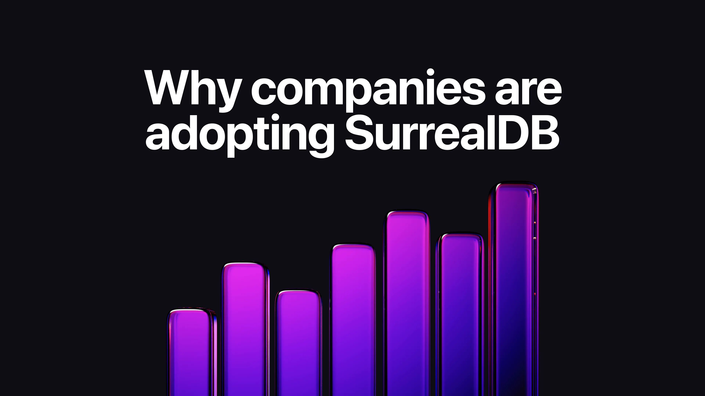
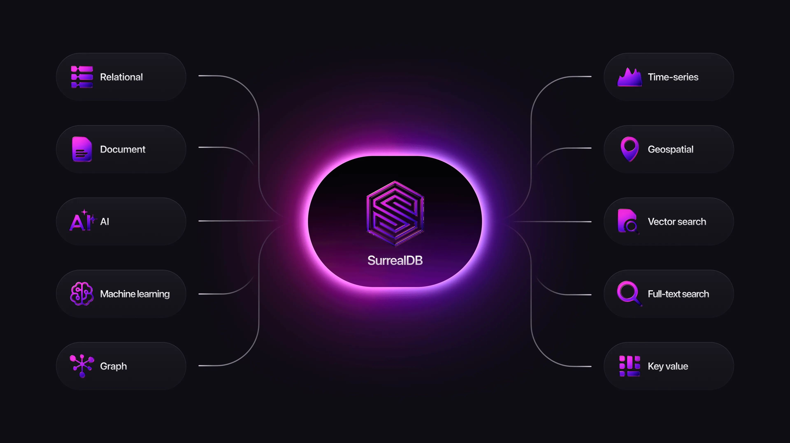
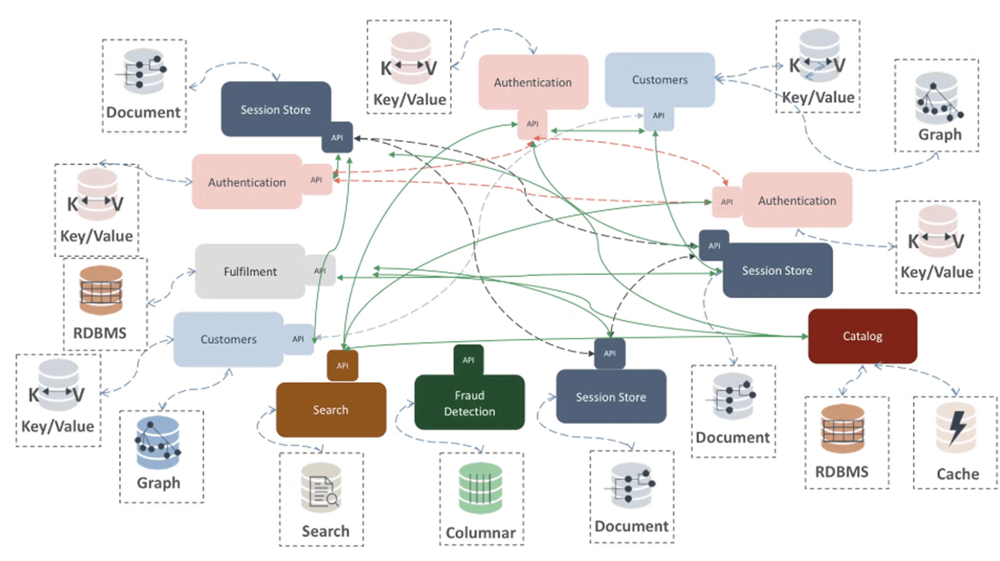
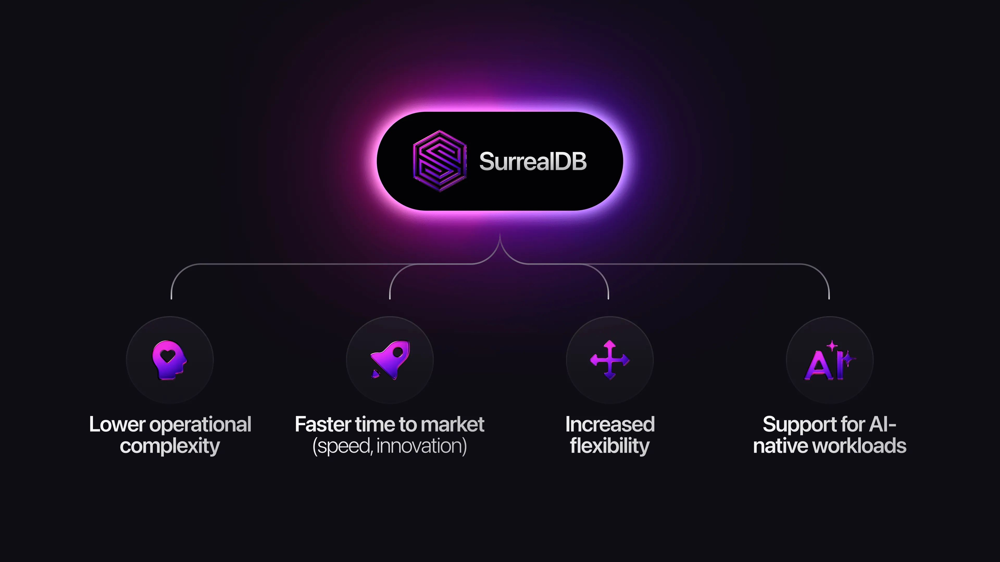

# Why companies are adopting SurrealDB

Since launching, SurrealDB has received a fantastic response from the technical community: pioneers and innovators, the most advanced software, data, and AI engineers. It became one of the fastest-growing databases on [GitHub](https://github.com/surrealdb/surrealdb), reaching over 30.5k stars to date and quickly surpassing established database providers. The growth started a few years ago when Fireship, a popular YouTuber in the software engineering community, released a viral [SurrealDB in 100 seconds video](https://www.youtube.com/watch?v=C7WFwgDRStM).

SurrealDB is one of few databases built from the ground-up in Rust, [the most admired language among developers](https://github.blog/developer-skills/programming-languages-and-frameworks/why-rust-is-the-most-admired-language-among-developers/). Rust is one of the fastest growing languages thanks to its security and performance (the US White House [advocated its agencies to move to memory-safe languages](https://www.techrepublic.com/article/white-house-report-memory-safe-programming-languages/), and has numerous initiatives to modernise to Rust). Rustaceans - a passionate and vibrant community - form a large base of our users, but SurrealDB is not only valuable for technology enthusiasts; it provides clear value for companies building modern data intensive and AI applications.

## The power of multi-model

Companies building modern AI systems and data-intensive applications are typically forced to use a variety of databases for their data needs: relational, document, graph, caching layers, full-text search, vector search, and more. They need to build complex API abstraction layers to orchestrate and integrate them, manage complicated security permissions, and keep data in sync. This significantly slows development and introduces unnecessary complexity, increasing operational and security risks while constraining innovation.

SurrealDB’s multi-model approach allows companies to replace multiple systems with one unified database - supporting all these data models natively, without extensions or bolt-on frameworks. Where many databases preach the same multi-model message, in reality they require plugins, external services, or additional packages to approximate multi-model behaviour. SurrealDB was designed from day one as a truly multi-model engine, where everything - documents, relationships, semantics, embeddings, full-text indexing, and event-driven logic - works together out of the box through a single query language and runtime.

This lets teams focus on building features and intelligence rather than stitching systems together, dramatically accelerating development speed and simplifying long-term maintenance.

## Lower infrastructure & operational complexity

Managing and integrating multiple databases - such as relational, document, graph, and vector systems - requires aligning their different data models under a unified entity schema with global IDs, ensuring consistent synchronisation via change-data-capture, events, or ETL pipelines, and orchestrating cross-store queries at the application, federation, or precomputed-view level. The application code must stitch results across systems because no shared query language spans all engines, and heavy multi-DB queries often leverage cached or materialised views. Operationally, each additional database adds complexity: separate scaling, monitoring, migrations, backup strategies, access control, and team expertise requirements.

With SurrealDB, companies avoid running multiple specialised systems. Consolidating these into one engine reduces:

- **Total Cost of Ownership:** fewer systems to host, license, and maintain. No infrastructure duplication or ETL pipelines.
- **Risk:** fewer integrations points, dependency failures, out-of-sync states and simpler incident response.
- **Operational overhead:** one database instead of a fragmented stack means easier deployment, scaling, replication, backups, monitoring, security policies, failover and access controls.

A strong example is [Tencent](/customer/tencent), who originally relied on nine different backend tools to power their infrastructure monitoring platform - each with separate maintenance, scaling models, and infrastructure. By adopting SurrealDB, Tencent consolidated all nine into a single unified system, reducing complexity, improving performance, and significantly lowering total cost of ownership.

## Faster time to market

In many organisations, a disproportionate amount of engineering effort is spent on:

- Integrating multiple databases and keeping them in sync
- Writing glue code, ETL jobs, and sync pipelines
- Managing schema migrations across services
- Maintaining separate security layers for each data store
- Debugging issues created by inconsistent data across systems

A [recent AI-readiness survey done by Matillion](https://www.matillion.com/news/data-ai-readiness-survey) found that 64% of organisations report their data teams spend more than 50% of their time on repetitive or manual tasks such as data maintenance or pipeline upkeep. A [report by IDC](https://www.infoworld.com/article/3831759/developers-spend-most-of-their-time-not-coding-idc-report.html?utm_source=chatgpt.com) found that in 2024, only about 16% of developers’ time was spent on actual application development, with the rest on operational/support tasks (CI/CD, infra monitoring, etc.).

With SurrealDB’s multi-model approach, teams spend far less time wiring systems together and far more time building actual product value. With a unified data layer, teams can:

- Build features and business logic faster
- Iterate without coordinating multiple databases or data flows
- Eliminate large amounts of boilerplate and duplication
- Reduce integration and migration friction
- Deliver new capabilities in days instead of weeks

By freeing teams from the overhead of stitching systems together, SurrealDB enabled [Aspire Competitions](/customer/aspire) to rapidly increase their development cycles through quicker feedback loops and more continuous innovation, reducing backend complexity by consolidating five separate tools into one.

## Increased flexibility

With traditional relational databases, developers must define schemas upfront, slowing prototyping and early-stage development. SurrealDB empowers teams with SurrealQL - its powerful SQL-like language - allowing them to start schemaless and gradually evolve toward full schema enforcement as models mature.

Traditional databases act primarily as static storage engines, pushing most logic into the application layer. SurrealDB takes a more modern approach, enabling developers to leverage:

- [Custom functions](/docs/surrealql/functions)
- [Triggers and event-driven logic](/docs/surrealql/statements/define/event)
- [Real-time subscriptions](/docs/surrealql/statements/live)
- [Dynamic access control](/docs/surrealdb/security/authentication)
- [Rich data modelling](/docs/surrealdb/models)

SurrealDB is also extremely deployment-flexible. As a single lightweight Rust binary, it can run:

- In-memory
- On the edge
- Embedded in the browser
- On mobile or offline-first applications
- On a single node or across distributed clusters
- Self-hosted or via SurrealDB Cloud

Support for WebAssembly and IndexedDB makes SurrealDB uniquely suited for client-side, offline-first, and IoT/edge use cases - something few databases can offer effectively. This flexibility enables entirely new types of applications and rapid prototyping for future-facing architectures.

SurrealDB runs on the edge of checkout locations in stores in Latin America for one of the largest retailers in the world, and inside the cars of a Swedish automotive provider. SurrealDB's lightweight design let [Calamu](/customer/calamu) run the same database in cloud and self-hosted environments, separating compute and storage for scalability and failover with one consistent database and API layer.

## Support for AI-native workloads

Modern AI applications are built on vectors, text, graph relationships, and real-time data for agent context and memory. SurrealDB supports all of these models natively and can scale on distributed storage layers either self-hosted or in the cloud. If your use cases involve agentic apps, knowledge graphs, feature stores, analytics, or personalised experiences, SurrealDB positions you far better than a database optimised only for one model.

Traditional graph databases are complex and expensive. Vector databases are popular in the AI space, but many lack relational or graph context. SurrealDB unifies all three - documents, vectors, and graphs - inside one engine. This enables powerful scenarios such as:

- Retrieval Augmentation Generation (RAG)
- Knowledge graphs and Graph RAG for AI
- Recommendation engines
- Fraud detection and anomaly analysis
- Real-time agentic workflows

A good example of this use case is [Verizon](/customer/verizon), who turned to SurrealDB to build a generative AI assistant to support its 10,000 field technicians. With SurrealDB's unified data platform, technicians gain instant access to technical documentation, real-time outage updates, and troubleshooting workflows, significantly improving field operations.

## What are the trade-offs?

Before choosing any database, it’s important to understand the trade-offs - especially when evaluating a multi-model system like SurrealDB. While SurrealDB simplifies architectures and accelerates development, there are scenarios where specialised tools may still have an edge. Below are the key considerations teams should be aware of, along with guidance on how to approach them.

Because SurrealDB supports multiple paradigms, highly specialised tools may outperform it in extreme, narrowly focused workloads (e.g., large-scale OLAP stores, ultra-optimised graph traversal for drug discovery or financial risk modelling, etc.). We focus on making information about our use cases available across our resources (including our Use Cases page in the website, guides, examples, docs, website, etc). Depending on your workload profile, benchmarking may be wise. Read our [Solutions](/solutions) page, [reach out to our experts](/contact) or [join our Discord community](https://discord.gg/surrealdb).

Lastly, while SurrealQL was built to be SQL-like, teams accustomed to purely relational or purely graph databases may need time to adjust. SurrealDB’s unified language, SurrealQL, is purposefully SQL-like - easy to read, familiar to learn, and free from the complexity of traditional JOINs. It’s ultimately simpler and more intuitive, though it still comes with a short learning curve. To help make the learning journey easier, we invest heavily in [SurrealDB Docs](/docs/surrealdb) and in educational resources such as [SurrealDB University](/learn) which includes [Tour of SurrealDB](/learn/tour), [Fundamentals Course](/learn/fundamentals) (with a certificate included) and the [SurrealDB Book](/learn/book) if you want to go deeper.

## Conclusion

SurrealDB is reshaping how modern applications are built by unifying multiple data models, simplifying architecture, and enabling everything from vectors to graph queries and real-time logic in a single engine. Companies across industries - from retail to telecom to cybersecurity - are already proving what’s possible when development shifts from maintaining infrastructure to creating real product value.

While no single database is the perfect fit for every specialised workload, SurrealDB offers a uniquely powerful foundation for the vast majority of modern data and AI-driven systems. With a familiar SQL-like language, broad deployment flexibility, and support for next-generation AI use cases, it provides both approachability and long-term scalability. And with a thriving open-source community, extensive documentation, and growing educational resources, getting started has never been easier.

SurrealDB isn’t just an alternative to the fragmented stacks of yesterday - it’s the future of unified, multi-model data enabling the next generation of AI use cases. Whether you’re building the next breakthrough AI product or simplifying a complex data landscape, SurrealDB gives you the freedom to innovate without limits.

[Try out SurrealDB today](https://app.surrealdb.com/signin/explore) to explore the power of multi-model databases and [join our community](https://discord.gg/surrealdb) to share your experience with our team!
