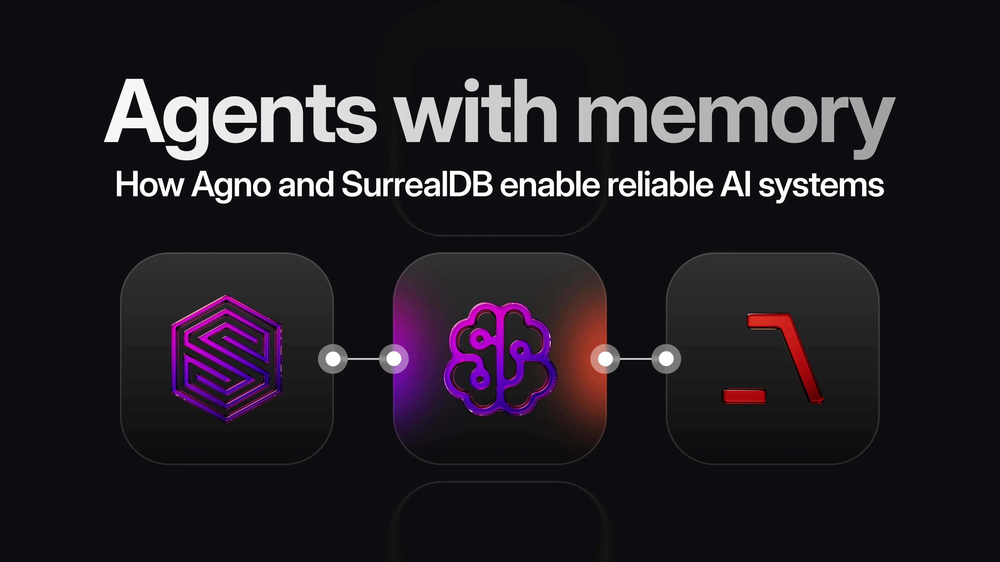

# Agents with memory: how Agno and SurrealDB enable reliable AI systems

SurrealDB CEO Tobie Morgan-Hitchcock recently hosted Agno founder and CEO Ashpreet Singh, together with SurrealDB Solutions Engineer Martin Schaer, for a livestream to discuss how to build agents that remember, reliably.

The conversation covered the realities of building production agent systems, why context is more important than raw model power, and how Agno’s Agent OS and SurrealDB fit together as a modern agent memory stack. This article distills that livestream into a focused Q&A for developers and teams who want their agents to do more than just respond to a single prompt.

## What is Agno, and why does it pair so well with SurrealDB?

**Tobie**: For anyone who has not used Agno yet, what does it do, and how does SurrealDB fit in?

**Ashpreet**: Agno is a high performance multi-agent framework. If you want to build serious agent systems, Agno gives you three things at once. First, a harness where your language models and agents run. Second, a runtime that you can deploy in your own cloud so you keep control of your data. Third, a user interface that lets you observe and manage your agents.

When you build systems with LLMs, you always have two pieces; the first is the harness in which the model and agents run (this is Agno’s focus), while the second is the context you feed into that harness. That is where SurrealDB fits naturally. Agno gives you the Agent OS for orchestrating agents. SurrealDB gives you the memory and knowledge layer that feeds those agents with the right information.

From the beginning, the integration between Agno and SurrealDB was driven by users who were already combining both. They needed a way to run multi agent workflows and a database that could handle memory, knowledge, and graph relations at the same time. That combination is what this partnership is about.

## What are teams struggling with when they build agents?

**Tobie**: As developers and companies build on Agno, what are the biggest challenges you are seeing?

**Ashpreet**: We see two big challenges again and again.

The first is reliability and visibility. Teams want to know whether what they have built actually works. They ask questions like: How is the system performing? When can this go live? What happened in this specific interaction? It is not enough to have something that works sometimes. They need repeatable behaviour and a way to inspect it.

The second challenge is context. With language models, the main thing you control is the input. If the context is wrong or noisy, the output will be unpredictable. Teams struggle with how to consistently provide the most relevant and up to date context, so users get a good experience every time instead of occasionally.

## **Is the answer just bigger context windows?**

**Tobie**: Many developers try to fix this by throwing more context at the model. Does that work?

**Ashpreet**: Not really. People are excited about huge context windows, but in practice you do not want to send everything you have on every request. If you have a million tokens available, you should not send a million tokens. You should send exactly what you need.

Two points matter here. It helps to use the best model you can for the task, but even then, sending too much context makes the model less focused and increases cost. And consistency does not come from size. It comes from giving the model tightly scoped information that is clearly relevant to the task.

This is where a proper memory and knowledge architecture is important. You want to store a lot, but you want to retrieve precisely. That is the role of SurrealDB in this stack: a single place that holds structured facts, vectors, relationships, and history, which Agno can query in a controlled way.

## **How exactly does SurrealDB integrate with Agno’s Agent OS?**

**Tobie**: What did the Agno x SurrealDB integration actually add for developers?

**Martin**: The integration arrived in two phases.

First, we integrated SurrealDB as a vector store for knowledge. That allowed Agno agents to perform semantic search across documents stored in SurrealDB and use that as their knowledge base.

More recently, we merged SurrealDB as a native memory provider inside Agent OS. Now agents can store sessions, memories, knowledge snapshots, evals, and metrics directly in SurrealDB. For each agent run you can see, in the database, how many tokens were used, how long it took, what context was fetched, and what was stored as memory.

In practice this means that Agno agents use SurrealDB both as long term memory and as a source of truth for analytics around their own behaviour. It makes debugging and improving agents much easier, because you can inspect what actually happened, rather than guessing.

## **How does Agno think about “context” and “memory”?**

**Tobie**: The industry uses many terms like context, knowledge, memory, brain, and reasoning. How do you think about these inside Agno?

**Ashpreet**: We try to avoid buzzwords and think of everything as context. By context we mean the input that is available to the program that is calling the model.

You can break that down into three parts.

The first part is the task prompt. This is the description of what the agent should do. For example, you might tell an agent that it is answering user support tickets and must respond in a specific style.

The second part is memory. This is information about specific users, sessions, or previous interactions. For instance, that a user lives in New York, likes certain products, or prefers certain channels. This is where SurrealDB is often used as a memory store.

The third part is knowledge. These are your documents, past tickets, product documentation, research notes, and so on. Again, SurrealDB acts as the backing store, using vectors, documents, and graphs.

The important design choice is that the model is not simply force fed everything all the time. Instead, the agent is given tools it can use to retrieve the right context when it needs it. It is similar to an open book exam: you do not paste the entire textbook into the answer, you give students the book and a way to search it.

## **Why is SurrealDB a good fit for agent memory and context?**

**Tobie**: Many storage systems can hold vectors. What makes SurrealDB useful as a memory layer for agents? **Martin**: In practice, agents rarely need only embeddings. Real workloads involve multiple types of data at once.

Teams use SurrealDB for structured facts, vectors, graph relationships, and time series. For example, they store users and accounts, connect them via graphs, attach embeddings to content, and record time stamped events. When you combine these things, you can build richer retrieval strategies.

One common pattern is to start with a similarity search over vector data, then refine the results using graph relations. For instance, you can filter results by tenant, filter by time windows, or follow relationships that connect entities such as accounts, tickets, or documents. You can also bring in time awareness, where each chunk is associated with a month or a time period, and you only keep chunks from a relevant timeframe.

The result is that the agent gets a much cleaner and more relevant context. Instead of “top N vector matches”, it sees a carefully curated slice of the user’s actual world. That improves accuracy and makes the system more deterministic.

## **What are people actually building with Agno and agent memory today?**

**Tobie**: In production environments, what kinds of agent use cases are working well right now?

**Ashpreet**: The majority of successful use cases look quite practical and sometimes even boring, but they deliver real value.

Many teams build document processing and extraction pipelines. That includes invoice processing, contract analysis, and pulling key fields out of semi structured or visual documents. These use cases are often multimodal because they involve PDFs, images, and text at the same time.

Another large group of use cases sits inside companies as internal knowledge assistants. These agents help prepare for sales calls, summarise incidents, surface relevant documents, and pull together history around specific customers or features.

Support workflows are an important category too. Imagine an agent that can read historical tickets, understand user history, look at screenshots or charts, and then draft responses or suggest next actions. That is where both multimodal models and a strong memory layer really shine.

In almost all of these cases, SurrealDB is used as the central store of knowledge and memory, while Agno provides the harness and tools to orchestrate the agents that sit on top of that data.

## **Are we close to fully autonomous, company wide agents?**

**Tobie**: Many organisations dream of one large agent that can roam across all company data. How realistic is that today?

**Ashpreet**: We are not there yet, and it is important to be honest about that.

You can absolutely build impressive demos today, and you can ship agents that perform very well on specific workflows. But if you imagine a single, fully autonomous agent that can safely act over all of your company data, across all workflows, that is still ahead of where the ecosystem is.

There are two ways this situation improves. One is that the models get better and better. The other is that we mature the harnesses and systems around the models. That means better runtimes like Agent OS, better memory and data layers like SurrealDB, and better engineering practices.

For now, the most productive approach is to build small, tightly scoped agents that solve clearly defined problems extremely well. Once you have a solid harness and a strong memory layer in place, you will be ready to grow those agents into larger workflows as the technology matures.

## **How should developers get started with Agno and SurrealDB?**

**Tobie**: For a developer who has only used chat style interactions so far, what is a good first step into agents with memory?

**Ashpreet**: Start small and start with a problem that matters to you.

Pick a personal or internal workflow that you understand deeply. That might be a notes assistant, a daily summary of your messages, or an internal helper for your own company docs. Because you know what “good” looks like, you can judge when the agent is getting better.

Then, use the Agno documentation and the SurrealDB integration cookbook to bring up Agent OS connected to SurrealDB. Let SurrealDB store your knowledge, your sessions, and your metrics. Let Agno orchestrate the agents and tools.

Do not overthink the first version. The goal is to get a feel for how the harness, the memory, and the model interact. As you iterate, you will find that improvements often come more from better retrieval and better memory design than from just switching to a larger model.

## **What is coming next for agent memory with Agno and SurrealDB?**

**Tobie**: Looking ahead, what is most exciting about the future of Agno and SurrealDB in the agent space?

**Ashpreet**: One idea we are very excited about is the notion of Agent OS as a networked runtime.

Agent OS can expose agents in multiple ways, including as MCP tools and as APIs. Inside a company you can imagine many different agent runtimes, each owned by a team and specialised on a certain domain. These agents can talk to each other, and SurrealDB can act as the shared or scoped memory layer underneath them.

On the SurrealDB side, we are working on richer support for multimodal data and more unified abstractions for memory across facts, vectors, graphs, and time series. The long term goal is that agents can simply describe the kind of information they need, and the combination of Agno and SurrealDB will take care of figuring out how to fetch and shape that context.

The direction is clear. Reliable agents need a strong harness and a strong memory layer. Agno focuses on the harness. SurrealDB focuses on the memory and context. Together they help teams move from “cool demo” to real, production grade agents that actually remember.

## Start building

- [Create your SurrealDB account](https://app.surrealdb.com/signin/deploy) to get a ready-to-use free environment for storing agent memory, knowledge, and context.
- [Check out the Agno and SurrealDB integration](/docs/integrations/frameworks/agno) to see how Agent OS uses SurrealDB for memory, sessions, evals, and knowledge retrieval. See [Agno’s Docs](https://docs.agno.com/integrations/vectordb/surrealdb/overview) for more information.
- [Explore the new SurrealDB integration inside Agno](/blog/exploring-the-new-surrealdb-integration-with-agno) using the cookbook examples to spin up agents, test memory workflows, and experiment with context-rich behaviours.
