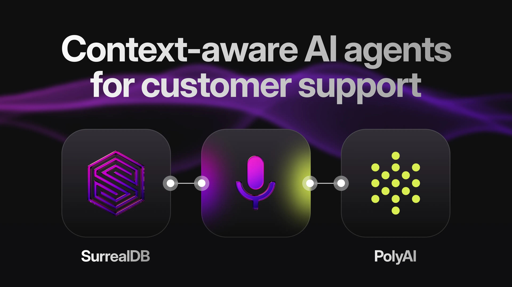

# PolyAI on building context-aware voice agents: latency, knowledge bases, and what actually ships

## What this stream was about

If you’re building “agentic” support, your hardest problems aren’t the prompts. They’re latency, context, and operational trust: can the system respond fast enough, stay accurate enough, and be debugged when it inevitably goes sideways?

In SurrealDB Stream #34, SurrealDB CEO & co-founder, Tobie Morgan-Hitchcock, sat down with Shawn Wen (CTO & co-founder at PolyAI)\*\* to unpack what it *actually* takes to ship context-aware AI agents in enterprise contact centres - especially on voice, where users notice every wobble.

PolyAI builds voice agents for enterprise contact centres (and is expanding into chat and multimodal), with a developer platform and APIs planned for Q1 2026. The conversation focused on why customer support is a uniquely unforgiving domain for AI, and why “bring your own knowledge” only works when the knowledge layer is treated as part of the product - versioned, governed, and optimised for retrieval speed.

The subtext throughout: RAG isn’t the differentiator. The differentiator is the *engineering discipline* around context, observability, and data ownership.

## Key ideas & takeaways

### Voice changes the rules: latency is the product

**Tobie**: PolyAI is automating phone calls. How much does latency shape everything you build?

**Shawn**: Voice is a different modality. In chat, users tolerate waiting a few seconds. On the phone, if the agent “goes dark” for more than ~5 seconds, people assume something is broken.

The conversation needs to feel like ping-pong. In production, you’re aiming to keep that back-and-forth under ~1 to 1.5 seconds. Once you creep past ~2 to 2.5 seconds, the whole thing starts to feel clunky - and voice users punish clunky immediately.

### Most contact centres don’t have a “knowledge base” - they have documents

**Tobie**: How often do you see contact centres with a structured, centralised knowledge base?

**Shawn**: Almost never. Support teams were built around humans, and humans are excellent at absorbing messy, unstructured information. So knowledge tends to live in Google Docs, Word docs, PDFs, and “whatever the last manager decided”.

That works (barely) when a person is doing the job. The moment you try to automate, you hit the hard question: *where is the single source of truth?*

### Accuracy is mostly a context problem (and AI exposes weak processes)

**Tobie**: How do organisations improve accuracy for customer support agents?

**Shawn**: There’s “model accuracy” and “process/content accuracy”. For support, the second one tends to dominate.

If an organisation has a strong digital footprint - clearer ownership, more reliable systems, a genuine source of truth - their content is usually more consistent. If not, rolling out AI forces the conversation they avoided for years: which version of the policy is correct, who owns it, and how updates actually happen.

Shawn’s point was simple: agents are context-hungry, and the difference between a good one and a bad one is often the quality of what you feed it.

### Agent Studio: model-agnostic, integration-first, built for real workflows

**Tobie**: What is Agent Studio, and what does it unlock?

**Shawn**: Agent Studio is PolyAI’s platform for building contact-centre agents, optimised for voice but usable for chat too.

Two design principles came through clearly:

- **Model-agnostic by default.** Different ASR, TTS, and LLM providers have different strengths. PolyAI has internal models, but the platform is built to let you mix and match.
- **Integrations are the job.** Enterprises already have workflows and systems. The platform needs to slot into that world - whether that means REST APIs, MCP-style integrations, or existing tooling they’re already committed to.

The voice angle matters here: you’re not just choosing “the best model”, you’re choosing what stays inside your latency budget.

### External knowledge bases: latency vs ownership

**Tobie**: Customers want to bring their own knowledge. What patterns do you see?

**Shawn**: There’s no standard playbook yet.

Sometimes the external system is basically a content source (say, a KB tool), and PolyAI runs retrieval internally. Sometimes the external system has vector search and PolyAI just calls it over an API. Both can work.

But voice adds a constraint that kills a lot of neat architectures: if the vendor’s retrieval isn’t fast enough, you can’t hide it behind a spinner. You feel it in the conversation.

That’s where teams end up doing the slightly grim thing: mirroring knowledge locally for performance. It solves one problem and creates three others - syncing, freshness, and the inevitable “which system is the truth today?” arguments.

### “Barge-in” sounds easy. It isn’t (yet).

**Tobie**: Voice conversations involve interruptions and corrections. How mature is barge-in?

**Shawn**: The mechanics are possible, but the experience isn’t where it needs to be.

A lot of today’s voice activity detection is basically waveform-level pattern matching. It knows “someone is speaking” and “someone stopped speaking”, but it doesn’t really know *why*. Humans use semantics to interpret pauses - “my name is Shawn… [pause] …Wen” doesn’t mean I’ve finished, it means I’m mid-thought.

Shawn’s take: the next generation of voice agents needs interruption decisions that incorporate semantic cues. The catch is that training data for this is hard to collect in a way that’s actually representative.

### Treat knowledge like code: version it, trace it, reproduce it

**Tobie**: What are you seeing around governance, versioning, and security for enterprise knowledge?

**Shawn**: Enterprises are cautious for good reason. Once an agent is customer-facing, you’re putting your name on its output.

The interesting point here was about how the knowledge base stops being “content” and starts behaving like part of the program. Prompts evolve. Functions evolve. The embedded knowledge evolves. If you can’t trace what the agent saw - *and which version it saw* - then debugging becomes vibes-based.

Tobie linked this to a theme SurrealDB cares about as well: the ability to “time-travel” through data. In practice, that’s really about auditability and repeatability. When someone asks “why did it say this?”, you need an answer that isn’t guesswork.

### “Should we train our own model?” Usually: not yet.

**Tobie**: What are the challenges when companies try to build this themselves?

**Shawn**: If you’re not a foundational model company, training your own model is a classic way to spend a lot of money before you’ve proven you’re solving the right problem.

The bigger risk is simpler: most AI agent projects don’t deliver value at enterprise scale. You can get surprisingly far quickly (70-80% of the way) and then stall at the point where reliability matters. The advice was pragmatic: validate outcomes first with whatever gets you there fastest; optimise the stack later once the business case is real.

### The misconception to kill: centralise everything before you’ve shipped anything

**Tobie**: What’s one “bring-your-own-knowledge” misconception you’d stop today?

**Shawn**: The urge to build a centralised knowledge base for *every channel* up front - chat, voice, email, internal tools - before you’ve proven a single one is delivering value.

The failure mode is predictable: the first deployment disappoints, and the entire programme gets labelled “AI doesn’t work here”. Start with one use case, get it working, and earn the right to expand.

## Why this matters for AI-native systems & agents

This stream was a useful corrective to a lot of the “agents everywhere” discourse. In customer support - and especially on voice - you don’t get to hide behind demos.

- Latency isn’t a metric. It’s the experience.
- Accuracy is rarely “pick a better model”; it’s “stop feeding the agent inconsistent reality”.
- The knowledge layer is not a dumping ground. It’s part of the system you’re shipping - which means versioning, governance, and the ability to reproduce behaviour later.

Once you accept that, multi-model storage stops being a feature checklist and starts being a practical requirement. The moment you’re trying to combine “what’s true”, “what’s relevant”, “what’s connected”, and “what was true at the time”, you end up needing more than a single vector lookup and a prayer.

**Watch the full stream**: [SurrealDB Stream #34 - PolyAI × SurrealDB: Context-Aware AI Agents for Customer Support](/events/livestreams/hzwqrsj31qa).

## Keep building with SurrealDB

If you’re building support agents (voice or chat), the useful place to invest isn’t more prompt engineering - it’s better context plumbing.

SurrealDB is designed for exactly that kind of workload: storing structured records alongside relationships, embeddings, and time-aware history, so you can retrieve tighter context without stitching five systems together.

And if you’re interested in voice-first agent building specifically, keep an eye on PolyAI’s developer platform launch in Q1 2026.
