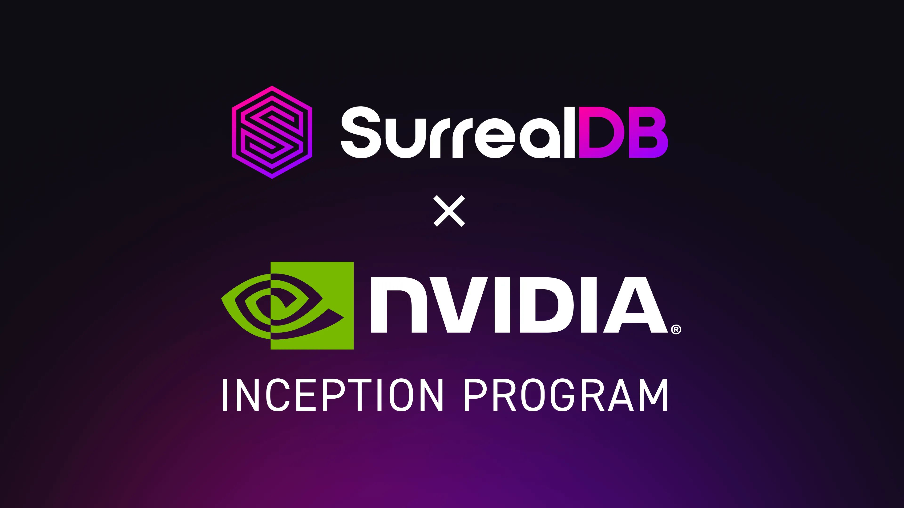

# SurrealDB joins the NVIDIA Inception Program

SurrealDB is now part of the NVIDIA Inception Program, a global accelerator supporting AI startups. This milestone strengthens SurrealDB’s position within the NVIDIA ecosystem and accelerates our work on GPU-optimised database technology.

NVIDIA Inception offers technical guidance, engineering resources, and access to advanced GPU tooling - support designed to help AI-driven companies scale faster.

### Why this matters for SurrealDB users

Joining NVIDIA Inception gives SurrealDB earlier access to GPU acceleration, boosting performance for vector search, graph queries, embedding workflows, and real-time AI workloads. Deeper CUDA integration enables faster query execution, higher throughput, and more efficient edge AI deployments - solidifying SurrealDB as a real-time, multi-model database built for AI-native systems.

> “*Joining NVIDIA Inception provides valuable validation and access to world-class expertise. This partnership accelerates our work on GPU-powered capabilities for developers*,”

>

> - **Tobie Morgan Hitchcock**, Co-Founder & CEO, SurrealDB

### What’s next

With NVIDIA’s support, SurrealDB will continue expanding GPU-accelerated features, including edge AI deployments with NVIDIA DGX Spark (to run SurrealDB in embedded/edge deployments) and integrations with NVIDIA’s CUDA platform such as vector search and graph queries.
