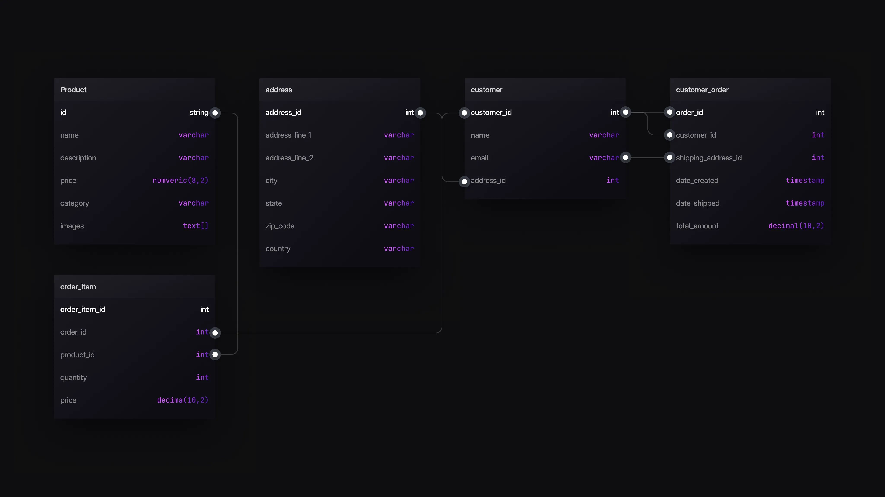

# A look at SurrealQL and how it differs from PostgreSQL


PostgreSQL has been around for thirty years as of this year, and is the go-to choice for applications that need reliability, performance and scalability. It's an open-source SQL database used by lots of big companies and startups, from web apps to scientific research. But as more complex apps need to be built, the limitations of traditional SQL databases lead developers to look for alternatives. One of the main issues developers come up against with PostgreSQL is writing complex joins. It's even tricky for experienced SQL programmers.

Putting an end to this complexity is one of the reasons to opt for SurrealDB instead. Let's contrast the two and see how they compare.

## What SurrealQL is all about

SurrealDB uses its own query language called SurrealQL. This language strongly resembles traditional SQL and in many cases can be used identically, but has many differences and improvements. Note the phrasing "traditional SQL" and not "standard SQL", because there is in fact no such thing as a universally standardised SQL language; SurrealQL can be thought of as another one of its dialects if you prefer to see it that way.

Our [SurrealDB Fundamentals](/learn/fundamentals/) course has a great quote on the subject.

As anyone who’s done plenty of database migrations will tell you, “standard SQL” is a cruel joke filled with false hopes and pitfalls. Even when migrating between the most well-known “standard SQL” databases such as MySQL and PostgreSQL, you’ll hit a lot of inconsistencies such as: <ul> Data types: a boolean in MySQL is just an alias for tinyint, which is incompatible with PostgreSQL’s boolean type. Different words for the same thing, such as autoincrement vs sequence (except it’s not quite the same thing…) Generally huge differences in features such as indexes, functions and more. </ul> Since each SQL dialect is annoyingly different anyway, why force yourself to pretend to be “standard SQL”, when you can take the best ideas from SQL and combine them with the best ideas from other NoSQL query languages?

Inside familiar statement names like `SELECT`, `CREATE`, `UPDATE`, `DELETE`, `RELATE` and `INSERT` there are many ways to retrieve data, such as `.` dot notation, `.{ field_1, field_2 }` destructuring notation, and `->` graph semantics.

SurrealQL allows records to link to other records and travel across all embedded links or graph connections as required.

You can read more about these idioms by visiting [this page in the documentation](/docs/surrealql/datamodel/idioms) dedicated to them.

With that quick introduction out of the way, let's see how SurrealQL can overcome some of the limitations that relational databases have.

## Building an e-commerce platform

In this blog, we'll be studying an e-commerce platform built using PostgreSQL and SurrealQL side by side.

An e-commerce application needs a special schema that can handle product variations, pricing tiers, and customer details. While e-commerce databases can be successfully built using relational databases, the schema can be complex with numerous tables and joins in order to maintain the transactional data.

Below is the relational schema of a lightweight e-commerce platform. It has a limited scope and will insert only three customers and a couple of products so we can focus on each query and compare it with SurrealQL to understand how they differ.



## Data Manipulation and Querying

Let's look at how we `INSERT` data in a table in PostgreSQL vs in SurrealDB.

Manipulation and querying of data in SurrealQL is done using the [SELECT](/docs/surrealql/statements/select), [CREATE](/docs/surrealql/statements/create), [INSERT](/docs/surrealql/statements/insert), [UPDATE](/docs/surrealql/statements/update), [UPSERT](/docs/surrealql/statements/upsert), and [DELETE](/docs/surrealql/statements/delete) statements. These enable selecting or modifying individual records, or whole tables. Each statement supports multiple different tables or record types at once.

- **PostgreSQL**

```surrealql
INSERT INTO product
    (name, description, price, category, images)
    VALUES
    ('Shirt', 'Slim fit', 6, 'clothing', ARRAY['image1.jpg', 'image2.jpg', 'image3.jpg'])
;
```

- **SurrealQL**

```surrealql
-- Using INSERT with SQL-style tuples
INSERT INTO product
    (id, name, description, price, category, images)
    VALUES
    ('shirt', 'Shirt', 'Slim fit', 6, 'clothing', ['image1.jpg', 'image2.jpg', 'image3.jpg'])
;

-- Or use CREATE
CREATE product CONTENT {
    name: 'Shirt',
    id: 'shirt',
    description: 'Slim fit',
    price: 6,
    category: 'clothing',
    images: ['image1.jpg', 'image2.jpg', 'image3.jpg']
};
```

If you were to use SurrealDB in a strictly SCHEMAFULL approach, you would define a schema similar to PostgreSQL. You can find a detailed explanation of defining tables in SurrealDB by viewing the [`DEFINE TABLE` statement documentation](/docs/surrealql/statements/define/table).

But in the default SCHEMALESS approach, you also have the option to quickly get started without having to define every column. In SurrealDB we can define relationships between entities directly. We do not need to know about foreign keys and neither do we have to write logic about how to store them.

Since the PostgreSQL INSERT statement above would not work until the schema is defined, let's get to that part first.

## PostgreSQL schema

We need to define the tables to insert up front in PostgreSQL that store the metadata about our e-commerce database.

```surrealql
-- Product table
CREATE TABLE product (
    id SERIAL PRIMARY KEY,
    name TEXT,
    description TEXT,
    price NUMERIC(8,2),
    category TEXT,
    images TEXT[]
);

-- Customer address
CREATE TABLE address (
    address_id INT PRIMARY KEY,
    address_line_1 VARCHAR(255),
    address_line_2 VARCHAR(255),
    city VARCHAR(255),
    state VARCHAR(255),
    zip_code VARCHAR(255),
    country VARCHAR(255)
);

-- Customer table
CREATE TABLE customer (
    customer_id INT PRIMARY KEY,
    name VARCHAR(255),
    email VARCHAR(255),
    address_id INT,
    FOREIGN KEY (address_id) REFERENCES address(address_id)
);

-- Order details
CREATE TABLE customer_order (
    order_id INT PRIMARY KEY,
    customer_id INT,
    shipping_address_id INT,
    total_amount DECIMAL(10,2),
    FOREIGN KEY (customer_id) REFERENCES customer(customer_id),
    FOREIGN KEY (shipping_address_id) REFERENCES address(address_id)
);

-- Product details in an order
CREATE TABLE order_item (
    order_item_id INT PRIMARY KEY,
    order_id INT,
    product_id INT,
    quantity INT,
    price DECIMAL(10,2),
    FOREIGN KEY (order_id) REFERENCES customer_order(order_id),
    FOREIGN KEY (product_id) REFERENCES product(id)
);
```

These tables aren't required in SurrealDB because the `vertex`->`edge`->`vertex` syntax inside a [RELATE](/docs/surrealql/statements/relate) statement is all that is needed to link two records and store metadata. We will look at this statement in more detail in a moment.

```surrealql
RELATE customer:meriel->bought->product:iphone SET // set metadata here...
```

You can of course define your tables and fields up front if you prefer.

The most common practice in SurrealQL is to begin with an entirely schemaless schema (the default), and then populate the schema with statements to firm it up and add assertions once you are sure exactly how it should look. That allows you to get the best of both worlds by quickly iterating when prototyping, followed by a strict schema to ensure consistent output.

Here are some examples of DEFINE FIELD statements that you might use.

```surrealql
DEFINE FIELD quantity ON bought TYPE int;
DEFINE FIELD total    ON bought
    TYPE int
    ASSERT $value <= 1000; // Can't order more than 1000 items
DEFINE FIELD status   ON bought
    TYPE 'Pending' | 'Delivered' | 'Cancelled'; // Must be one of these three values, nothing else
```

## Populating the database

Let's imagine that we wanted to add a new field just before populating the database. In PostgreSQL, this would mean using ALTER TABLE. Once this is done, an INSERT can be used.

```surrealql
ALTER TABLE product ADD COLUMN options jsonb[];

INSERT INTO product
    (name, description, price, category, images, options)
    VALUES
    (
        'Shirt', 'Slim fit', 6, 'clothing',
        ARRAY['image1.jpg', 'image2.jpg', 'image3.jpg'],
        '{
            "sizes": ["S", "M", "L"],
            "colours": ["Red", "Blue", "Green"]
        }'::jsonb
    )
;
```

In SurrealQL, we don't need to define the `options` field up front if working with a schemaless table - an INSERT with the relevant data is all we need.

```surrealql
INSERT INTO product {
    name: 'Shirt',
    id: 'shirt',
    description: 'Slim fit',
    price: 6,
    category: 'clothing',
    images: ['image1.jpg', 'image2.jpg', 'image3.jpg'],
    options: { 
        sizes: ['S', 'M', 'L'],
        colours: ['Red', 'Blue', 'Green'] 
    }
};
```

If we wanted to follow a stricter pattern by defining the field up front, we would use a `DEFINE FIELD` statement. Here is one way to do it.

```surrealql
DEFINE FIELD options ON product TYPE option<object>;
```

We could also refine the `TYPE` clause to ensure that the fields inside the optional object fit a certain pattern. These statements will ensure that the `colours` field of the optional object will only hold strings, and that the `sizes` field will only hold strings that are 'S' or 'M' or 'L' - and nothing else.

```surrealql
DEFINE FIELD options.colours ON product TYPE option<array<string>>;
DEFINE FIELD options.sizes ON product TYPE option<array<'S'|'M'|'L'>>;
```

Now let's enter some data into our PostgreSQL reference tables.

```surrealql
INSERT INTO address (address_id, address_line_1, city, state, zip_code, country)
VALUES (1, '123 Main St', 'New York', 'NY', '10001', 'USA');

INSERT INTO address (address_id, address_line_1, city, state, zip_code, country)
VALUES (2, '124 Main St', 'New York', 'NY', '10002', 'USA');

INSERT INTO address (address_id, address_line_1, city, state, zip_code, country)
VALUES (3, '125 Main St', 'New York', 'NY', '10003', 'USA');

INSERT INTO customer (customer_id, name, email, address_id)
VALUES (1, 'Tobie', 'tobie@tobie.com', 1);

INSERT INTO customer (customer_id, name, email, address_id)
VALUES(2, 'Martin', 'martin@tobie.com', 2);

INSERT INTO customer (customer_id, name, email, address_id)
VALUES (3, 'Meriel', 'meriel@meriel.com', 3);

INSERT INTO product (name, description, price, category, images, options)
VALUES ('Trousers', 'Pants', 10, 'clothing',
        ARRAY['image1.jpg', 'image2.jpg', 'image3.jpg'],
        '{
            "sizes": ["S", "M", "L"],
            "colours": ["Red", "Blue", "Green"]
        }'::jsonb;

INSERT INTO product (name, description, price, category, images, options)
VALUES ('Iphone', 'Mobile Phone', 600, 'Electronics',
        ARRAY['image1.jpg', 'image2.jpg', 'image3.jpg'],
        '{
            "sizes": ["S", "M", "L"],
            "colours": ["Red", "Blue", "Green"]
        }'::jsonb;

INSERT INTO customer_order (order_id, customer_id, shipping_address_id, total_amount)
VALUES (5, 3, 1, 600);

INSERT INTO order_item (order_item_id, order_id, product_id, quantity, price)
VALUES (6, 5, 1, 1, 600);

INSERT INTO order_item (order_item_id, order_id, product_id, quantity, price)
VALUES (7, 5, 3, 1, 600);
```

Let's insert some data in our SurrealDB tables too!

```surrealql
INSERT INTO customer {
    name: 'Meriel',
    id: 'meriel',
    email: 'meriel@meriel.com',
    address: { house_no: '221B', street: 'Baker street', city: 'London', country: 'UK' }
};

INSERT INTO customer {
    name: 'Tobie',
    id: 'tobie',
    email: 'tobie@tobie.com',
    address: { house_no: '221A', street: 'Church street', city: 'London', country: 'UK' }
};

INSERT INTO customer {
    name: 'Martin',
    id: 'martin',
    email: 'martin@martin.com',
    address: { house_no: '221C', street: 'Pound street', city: 'London', country: 'UK' }
};

INSERT INTO product {
    name: 'Trousers',
    id: 'trousers',
    description: 'Pants',
    price: 10,
    category: 'clothing',
    images: ['image1.jpg', 'image2.jpg', 'image3.jpg'],
    options: 
        { 
            sizes: ['S', 'M', 'L'],
            colours: ['Red', 'Blue', 'Green']
        }
};

INSERT INTO product {
    name: 'Iphone',
    id: 'iphone',
    description: 'Mobile phone',
    price: 600,
    category: 'Electronics',
    images: ['image.jpg', 'image1.jpg', 'image4.jpg'],
    options: { 
        sizes: ['Max', 'Pro', 'SE'],
        colours: ['Red', 'Blue', 'Green']
    }
};
```

## Retrieving the data

At their core, the SELECT statements in SurrealDB are similar to PostgreSQL.

- **PostgreSQL**

```surrealql
SELECT * FROM product where id=1;
```

- **SurrealQL**

```surrealql
SELECT * FROM product:shirt;
```

The `SELECT` statement will fetch all required details from the product tables. In SurrealDB you can assign a unique id to each product. In case you do not assign it an id, it auto-assigns a unique ID to every record. In PostgreSQL, this can be achieved by using a uuid column and it has to be explicitly mentioned initially.

## The RELATE statement

The RELATE statement can be used to generate graph edges between two records in the database. The graph edges stand for the relationship between two nodes and are standalone records themselves.

When a customer buys a product, SurrealDB relates the customer with the product using the `bought` relation. You can name your relationship whatever you feel fits right. It could also be called `purchased` or `ordered`.

As the statements show, a `RELATE` statement can be followed with all the needed metadata for the relation that binds one table to another.

```surrealql
RELATE customer:meriel->bought->product:iphone CONTENT {
    option: { Size: 'Max', Color: 'Red' },
    quantity: 1,
    total: 600,
    status: 'Pending',
    created_at: time::now()
};

RELATE customer:meriel->bought->product:shirt CONTENT {
    option: { Size: 'S', Color: 'Red' },
    quantity: 2,
    total: 40,
    status: 'Delivered',
    created_at: time::now()
};

RELATE customer:martin->bought->product:iphone CONTENT {
    option: { Size: 'M', Color: 'Max' },
    quantity: 1,
    total: 600,
    status: 'Pending',
    created_at: time::now()
};

RELATE customer:martin->bought->product:shirt CONTENT {
    option: { Size: 'S', Color: 'Red' },
    quantity: 2,
    total: 12,
    status: 'Delivered',
    created_at: time::now()
};

RELATE customer:tobie->bought->product:iphone CONTENT {
    option: { Size: 'M', Color: 'Max' },
    quantity: 1,
    total: 600,
    status: 'Pending',
    created_at: time::now()
};
```

## Querying the databases

The data is now in place.

Let's select all the products bought by a particular customer.

**PostgreSQL**

```surrealql
SELECT p.id AS product_id, p.name AS product_name
FROM product p
JOIN order_item oi ON p.id = oi.product_id
JOIN customer_order co ON oi.order_id = co.order_id
JOIN customer c ON co.customer_id = c.customer_id
WHERE c.name = 'Meriel'
ORDER BY p.id;
```

**SurrealQL**

```surrealql
SELECT * FROM customer:meriel->bought;
```

You may have noticed pretty big difference in complexity between the two queries! One of the most powerful features in SurrealDB is the capability to relate records using graph connections and links. Instead of pulling data from multiple tables and merging that data together, SurrealDB allows you to select related records efficiently without needing to use JOINs.

Here's what you get when you fire off the above SurrealQL query.

```surrealql
[
	{
		created_at: d'2026-01-12T02:08:35.545979Z',
		id: bought:3rjfr067br8arg68glt6,
		in: customer:meriel,
		option: {
			Color: 'Red',
			Size: 'Max'
		},
		out: product:iphone,
		quantity: 1,
		status: 'Pending',
		total: 600
	},
	{
		created_at: d'2026-01-12T02:08:35.546816Z',
		id: bought:fe5uejq6vol197j63t9z,
		in: customer:meriel,
		option: {
			Color: 'Red',
			Size: 'S'
		},
		out: product:shirt,
		quantity: 2,
		status: 'Delivered',
		total: 40
	}
]
```

You can also directly fetch the product ids without the metadata with the following query.

```surrealql
SELECT out FROM customer:meriel->bought;
```

```surrealql
[
	{
		out: product:iphone
	},
	{
		out: product:shirt
	}
]
```

We can also query the graph edge `bought` in the same way that we would query any other table.

```surrealql
SELECT out FROM bought;
```

```surrealql
[
	{
		out: product:iphone
	},
	{
		out: product:shirt
	},
	{
		out: product:shirt
	},
	{
		out: product:iphone
	},
	{
		out: product:iphone
	}
]
```

If you study the queries you will realise that customers Meriel and Martin both bought shirts and an iPhone. We have a new customer Tobie who also buys a shirt. Your e-commerce system wants to recommend the products that other customers have bought to Tobie.

How would you do this using PostgreSQL?

To recommend products to Tobie based on what Meriel and Martin have bought, we need to first find out what products Meriel and Martin have purchased and then look for other customers who have purchased the same products.

This query first selects all the products bought by Meriel and Martin, then filters out the products already bought by Tobie. The resulting list includes the product_id and product_name of the items to be recommended to Tobie.

```surrealql
SELECT DISTINCT p.id AS product_id, p.name AS product_name
FROM product p
JOIN order_item oi ON p.id = oi.product_id
JOIN customer_order co ON oi.order_id = co.order_id
JOIN customer c ON co.customer_id = c.customer_id
WHERE c.name IN ('Meriel', 'Martin') AND p.id NOT IN (
    SELECT p2.id
    FROM product p2
    JOIN order_item oi2 ON p2.id = oi2.product_id
    JOIN customer_order co2 ON oi2.order_id = co2.order_id
    JOIN customer c2 ON co2.customer_id = c2.customer_id
    WHERE c2.name = 'Tobie'
)
ORDER BY p.id;
```

Is your head spinning by now? In today's age, this sort of query would probably be offloaded to an LLM tool to get the job done.

Not so with SurrealQL.

```surrealql
SELECT 
    (<-bought<-customer->bought->product).distinct().* AS purchases
FROM ONLY product:shirt;
```

Here is the result:

```surrealql
{
	purchases: [
		{
			category: 'clothing',
			description: 'Slim fit',
			id: product:shirt,
			images: [
				'image1.jpg',
				'image2.jpg',
				'image3.jpg'
			],
			name: 'Shirt',
			options: {
				colours: [
					'Red',
					'Blue',
					'Green'
				],
				sizes: [
					'S',
					'M',
					'L'
				]
			},
			price: 6
		},
		{
			category: 'Electronics',
			description: 'Mobile phone',
			id: product:iphone,
			images: [
				'image.jpg',
				'image1.jpg',
				'image4.jpg'
			],
			name: 'Iphone',
			options: {
				colours: [
					'Red',
					'Blue',
					'Green'
				]
			},
			price: 600
		},
		{
			category: 'Electronics',
			description: 'Mobile phone',
			id: product:iphone,
			images: [
				'image.jpg',
				'image1.jpg',
				'image4.jpg'
			],
			name: 'Iphone',
			options: {
				colours: [
					'Red',
					'Blue',
					'Green'
				]
			},
			price: 600
		},
		{
			category: 'clothing',
			description: 'Slim fit',
			id: product:shirt,
			images: [
				'image1.jpg',
				'image2.jpg',
				'image3.jpg'
			],
			name: 'Shirt',
			options: {
				colours: [
					'Red',
					'Blue',
					'Green'
				],
				sizes: [
					'S',
					'M',
					'L'
				]
			},
			price: 6
		}
	]
};
```

In fact, that query could have been even shorter. That's because we can just go straight from the record itself using just `product:shirt<-bought<-customer->bought->product.distinct()` plus `.*` at the end to fetch all the fields. Here it is displayed over multiple lines to show just how readable this syntax is and how it follows a very human train of thought.

```surrealql
product:shirt          // Start at product:shirt
    <-bought<-customer // Which customers was it bought by?
    ->bought->product  // Now which products did they buy?
    .distinct()        // Remove duplicates
    .*;                // Fetch all the fields
```

And if you want the same structure as above that returns the output as the `products` field inside an object, just enclose it in braces and assign the output to the `products` field name.

```surrealql
{ products: product:shirt<-bought<-customer->bought->product.distinct().* }
```

But what if you do not want the common product (i.e., the `product:shirt` record) to be recommended?

You can use the WHERE operator to manipulate the data.

```surrealql
{ products: product:shirt<-bought<-customer->bought->(product WHERE id != product:shirt).distinct().* }
```

Here is the output for that.

```surrealql
{
	products: [
		{
			category: 'Electronics',
			description: 'Mobile phone',
			id: product:iphone,
			images: [
				'image.jpg',
				'image1.jpg',
				'image4.jpg'
			],
			name: 'Iphone',
			options: [
				{
					sizes: [
						'Max',
						'Pro',
						'SE'
					]
				},
				{
					colours: [
						'Red',
						'Blue',
						'Green'
					]
				}
			],
			price: 600
		},
		{
			category: 'Electronics',
			description: 'Mobile phone',
			id: product:iphone,
			images: [
				'image.jpg',
				'image1.jpg',
				'image4.jpg'
			],
			name: 'Iphone',
			options: [
				{
					sizes: [
						'Max',
						'Pro',
						'SE'
					]
				},
				{
					colours: [
						'Red',
						'Blue',
						'Green'
					]
				}
			],
			price: 600
		}
	]
};
```

## Trying it out yourself

Want to try some of these queries yourself? You can do that online by visiting the [Surrealist Sandbox](https://app.surrealdb.com/c/sandbox/query). Just paste these statements in to add the schema and data, and query away!

```surrealql
DEFINE FIELD options.sizes ON product TYPE option<array<'S'|'M'|'L'>>;
DEFINE FIELD options.colours ON product TYPE option<array<string>>;

INSERT INTO product {
    name: 'Shirt',
    id: 'shirt',
    description: 'Slim fit',
    price: 6,
    category: 'clothing',
    images: ['image1.jpg', 'image2.jpg', 'image3.jpg'],
    options:
        { sizes: ['S', 'M', 'L'], colours: ['Red', 'Blue', 'Green'] },
};

INSERT INTO customer {
    name: 'Meriel',
    id: 'meriel',
    email: 'meriel@meriel.com',
    address: { house_no: '221B', street: 'Baker street', city: 'London', country: 'UK' }
};

INSERT INTO customer {
    name: 'Tobie',
    id: 'tobie',
    email: 'tobie@tobie.com',
    address: { house_no: '221A', street: 'Church street', city: 'London', country: 'UK' }
};

INSERT INTO customer {
    name: 'Martin',
    id: 'martin',
    email: 'martin@martin.com',
    address: { house_no: '221C', street: 'Pound street', city: 'London', country: 'UK' }
};

INSERT INTO product {
    name: 'Trousers',
    id: 'trousers',
    description: 'Pants',
    price: 10,
    category: 'clothing',
    images: ['image1.jpg', 'image2.jpg', 'image3.jpg'],
    options:
        { 
            sizes: ['S', 'M', 'L'],
            colours: ['Red', 'Blue', 'Green'] 
        }
};

INSERT INTO product {
    name: 'Iphone',
    id: 'iphone',
    description: 'Mobile phone',
    price: 600,
    category: 'Electronics',
    images: ['image.jpg', 'image1.jpg', 'image4.jpg'],
    options:
        { 
            colours: ['Red', 'Blue', 'Green']
        }
};

RELATE customer:meriel->bought->product:iphone CONTENT {
    option: { Size: 'Max', Color: 'Red' },
    quantity: 1,
    total: 600,
    status: 'Pending',
    created_at: time::now()
};

RELATE customer:meriel->bought->product:shirt CONTENT {
    option: { Size: 'S', Color: 'Red' },
    quantity: 2,
    total: 40,
    status: 'Delivered',
    created_at: time::now()
};

RELATE customer:martin->bought->product:iphone CONTENT {
    option: { Size: 'M', Color: 'Max' },
    quantity: 1,
    total: 600,
    status: 'Pending',
    created_at: time::now()
};

RELATE customer:martin->bought->product:shirt CONTENT {
    option: { Size: 'S', Color: 'Red' },
    quantity: 2,
    total: 12,
    status: 'Delivered',
    created_at: time::now()
};

RELATE customer:tobie->bought->product:iphone CONTENT {
    option: { Size: 'M', Color: 'Max' },
    quantity: 1,
    total: 600,
    status: 'Pending',
    created_at: time::now()
};
```

## Conclusion

In this blog post, we saw how SurrealDB can make it easier for you to structure and query your database compared to PostgreSQL. With SurrealDB you can truly have the best of both databases while not compromising on security and flexibility. SurrealDB has a lot of features like real-time queries with highly efficient related data retrieval, advanced security permissions for multi-tenant access, and support for performant analytical workloads to offer. You can read more about them [here](/features).

## Next Steps

If you haven't started with SurrealDB yet, you can get started by visiting [the install page](/install). Drop your questions on our [Discord](https://discord.gg/surrealdb) and don't forget to star us on [GitHub](https://github.com/surrealdb/surrealdb).
