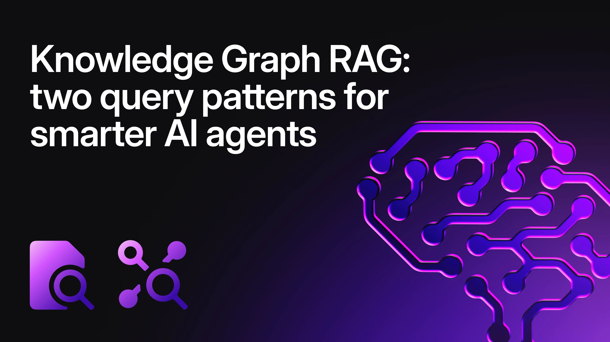
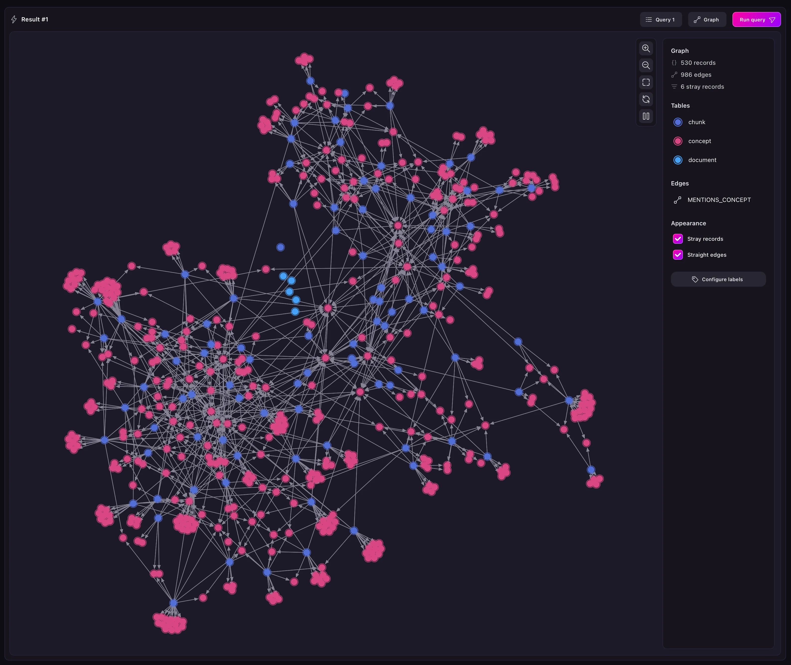

# Knowledge Graph RAG: two query patterns for smarter AI agents



Retrieval-Augmented Generation (RAG) has become the go-to architecture for grounding AI agents in real knowledge. But while most RAG systems treat documents as isolated chunks of text, knowledge graph RAG adds a critical layer: understanding the _relationships_ between concepts, chunks, and documents. This is sometimes also called a context graph (see [AI’s-trillion dollar opportunity: Context graphs](https://foundationcapital.com/context-graphs-ais-trillion-dollar-opportunity/)).

In this post, we'll walk through two powerful SurrealQL query patterns that demonstrate how to retrieve context from a knowledge graph to feed AI agents. Whether you're building a chatbot, a research assistant, or an autonomous agent, these patterns show how to move beyond basic vector search to semantic, graph-aware retrieval. SurrealQL is a query language that allows you to combine all models: vector, graph, relational, BM25 and more, in the same query.

## The architecture: knowledge graphs meet vector search

A typical knowledge graph RAG system has three main entities:

1. **Documents:** the source files (PDFs, markdown, web pages, etc.)
1. **Chunks:** smaller text segments with vector embeddings for semantic search
1. **Concepts:** keywords, topics, or ideas extracted from chunks, also with

embeddings

The magic happens in the relationships. This graph structure lets us ask richer questions than pure vector search allows. Instead of just "which chunks match my query?", we can ask "which documents contain chunks about concepts similar to my query?" - a subtle but powerful difference.

- Each chunk belongs to a document
- Each chunk mentions one or more concepts (via a graph edge called

`MENTIONS_CONCEPT`)

- Both chunks and concepts have vector embeddings for similarity search



## Query pattern 1: concept-based document retrieval

The first query pattern uses **concept similarity** as a proxy for document relevance. Here's the logic:

1. Find concepts semantically similar to the user's query (using vector search)
1. Follow the graph backward to find chunks that mention those concepts
1. Group chunks by document and rank documents by their best concept match

### The query

This is a big query, but don’t worry - it’s broken down and explained just below.

```surrealql
LET $sub_query = SELECT VALUE
    chunks.map(|$chunk| {
        index: $chunk.index,
        concept: id,
        content: $chunk.content,
        chunk: $chunk.id,
        doc: $chunk.doc,
        score: score
    }) AS x
    FROM (
        SELECT *,
            <-MENTIONS_CONCEPT<-chunk.{id, doc, index} AS chunks
        FROM (
            SELECT *,
                (1 - vector::distance::knn()) AS score
            OMIT embedding
            FROM concept
            WHERE embedding <|5,40|> $embedding
        )
        WHERE score >= $threshold
    );

SELECT
    doc,
    array::group({
        chunk: chunk,
        index: index,
        max_score: max_score,
        concepts: concepts
    }) AS chunks,
    math::max(max_score) AS best_concept_score
FROM (
    SELECT
        doc,
        chunk,
        index,
        content,
        math::max(score) AS max_score,
        array::group(concept) AS concepts
    FROM array::flatten($sub_query)
    GROUP BY chunk
)
GROUP BY doc
ORDER BY best_concept_score DESC;
```

Example response:

```surrealql
[
  {
    best_concept_score: 0.9999999403953552f,
    chunks: [
      {
        chunk: chunk:92355c0fe4d03cae4c591361b38f85e1,
        concepts: [
          concept:⟨SECRETARY OF STATE⟩
        ],
        index: 11,
        max_score: 0.9999999403953552f
        content: ...
      },
      ...
    ],
    doc: document:1adeceeb156bcf4de5324feeb0321c0d
  },
  {
    best_concept_score: 0.9999999403953552f,
    chunks: [
      {
        chunk: chunk:092dbfb54865adf2e6ff2a5dd68afed8,
        concepts: [
          concept:SECRETARY
        ],
        index: 17,
        max_score: 0.821898481619539f
        content: ...
      },
      {
        chunk: chunk:2867a09694a33dbbc1daa769ef048612,
        concepts: [
          concept:MINISTER
        ],
        index: 8,
        max_score: 0.5018606779741432f
        content: ...
      },
      {
        chunk: chunk:28cc4ee0cc2fc236c779dff09485a5b5,
        concepts: [
          concept:⟨SECRETARY OF STATE⟩,
          concept:MINISTER
        ],
        index: 13,
        max_score: 0.9999999403953552f
        content: ...
      },
      ...
    ],
    doc: document:1b22a97499fb98242e5bf5f4e0315508
  },
  ...
]
```

### Breaking it down

- **Step 1: Vector search on Concepts**

```surrealql
SELECT *,
  (1 - vector::distance::knn()) AS score
  OMIT embedding
  FROM concept
  WHERE embedding <|5,40|> $embedding
```

This performs a k-nearest neighbours (k-NN) search, finding the top `5` concepts from a pool of `40` candidates that are most similar to the user's query embedding (`$embedding`). The `<|5,40|>` syntax is SurrealDB's vector search operator.

<aside>

**k-Nearest Neighbours (k-NN)** search finds the _k_ closest vectors to a query by comparing it against every stored vector, giving exact results but becoming slow and impractical as data size and dimensionality grow.

**Approximate Nearest Neighbour (ANN)** search uses specialised data structures (graphs, trees, quantisation) to avoid exhaustive comparisons, trading a small amount of accuracy for dramatically faster queries and better scalability, which makes it the standard choice for large-scale vector search systems.

</aside>

- **Step 2: Graph traversal**

`<-MENTIONS_CONCEPT<-chunk.{id, doc, index} AS chunks`

Here's where the graph magic happens. The arrow syntax (`<-MENTIONS_CONCEPT<-`) walks the graph **backward** from concepts to chunks, following the MENTIONS_CONCEPT edge relationship. This is SurrealDB's graph traversal syntax - no JOINs needed.

- **Step 3: Aggregation**

The outer query groups results first by chunk (to find the best concept per chunk), then by document (to collect all relevant chunks), and finally ranks documents by their best-scoring concept.

### When to use this pattern

Concept-based retrieval shines when:

- Your knowledge graph has well-extracted entities and topics
- You want high-level topical relevance ("find documents about quantum

computing")

- You're okay with slightly indirect matches (concept acts as an intermediary)
- You want to understand _why_ a document was retrieved (via the concepts)

## Query Pattern 2: direct chunk retrieval with document context

The second pattern takes a more direct approach: find chunks by vector similarity, then group them by document and return contextual metadata.

The query:

```surrealql
SELECT
    best_chunk_score,
    summary,
    doc.{id, filename, content_type},
    array::transpose([
        contents,
        scores,
        chunks,
        chunk_indexes
    ]).map(|$arr| {
        content: $arr[0],
        score: $arr[1],
        id: $arr[2],
        chunk_index: $arr[3]
    }) AS chunks
FROM (
    SELECT
        doc,
        summary,
        math::max(score) AS best_chunk_score,
        array::group(content) AS contents,
        array::group(score) AS scores,
        array::group(id) AS chunks,
        array::group(index) AS chunk_indexes
        FROM (
            SELECT *,
                (1 - vector::distance::knn()) AS score
                OMIT embedding
            FROM chunk
            WHERE embedding <|5,40|> $embedding
            ORDER BY index ASC
        )
        WHERE score >= $threshold
        GROUP BY doc
        ORDER BY best_chunk_score DESC
);
```

Example response:

```surrealql
[
  {
    best_chunk_score: 0.3430139030822458f,
    chunks: [
      {
        chunk_index: 33,
        content: "...",
        id: chunk:dce5670f0f27810100a9f66777398f2c,
        score: 0.30309090110388426f
      },
      {
        chunk_index: 34,
        content: "...",
        id: chunk:8c6e7d0f19f0cd111416535066d06a7b,
        score: 0.3430139030822458f
      },
      {
        chunk_index: 35,
        content: "...",
        id: chunk:4bb7da79c7dc8daaf266ac4c0b1173c0,
        score: 0.31088319745159065f
      }
    ],
    doc: {
      content_type: 'application/pdf',
      filename: 'foo.pdf',
      id: document:1b22a97499fb98242e5bf5f4e0315508
    },
    summary: "..."
  },
  {
    best_chunk_score: 0.25366124467119633f,
    chunks: [
      {
        chunk_index: 0,
        content: "...",
        id: chunk:03526f27c67ce54efb98d6863482310d,
        score: 0.24738225372049172f
      },
      {
        chunk_index: 2,
        content: "...",
        id: chunk:bdfd9463293b47a9f235c540e75c8ffc,
        score: 0.25366124467119633f
      }
    ],
    doc: {
      content_type: 'application/pdf',
      filename: 'bar.pdf',
      id: document:f3f15298ffda45019418a865dfb8f7e9
    },
    summary: "..."
  }
]
```

### Breaking it down

- **Step 1: vector search on chunks**

```surrealql
SELECT *,
  (1 - vector::distance::knn()) AS score
  OMIT embedding
  FROM chunk
  WHERE embedding <|5,40|> $embedding
  ORDER BY index ASC
```

This searches directly against chunk embeddings - the most straightforward RAG approach. The `ORDER BY` index ASC ensures chunks maintain their original document order.

- **Step 2: group by document**

`GROUP BY doc`

All matching chunks are grouped by their parent document, with arrays collecting the content, scores, IDs, and indexes.

**Step 3: array transformation**

```surrealql
array::transpose([
  contents,
  scores,
  chunks,
  chunk_indexes
]).map(|$arr| {
  content:     $arr[0],
  score:       $arr[1],
  id:          $arr[2],
  chunk_index: $arr[3]
}) AS chunks
```

This is a clever data reshaping trick. The `array::transpose` function converts four parallel arrays into an array of tuples, which the map then transforms into structured chunk objects. The result is a clean, nested structure perfect for AI agent consumption. Here’s a nice [example of how array::transpose works](/docs/surrealql/functions/database/array#arraytranspose).

### When to use this pattern

Direct chunk retrieval works best when:

- You need precise, text-level matches to the user's query
- Your chunks are high-quality and well-sized
- You want the actual text content for generation (not just concepts)
- Document-level context matters (summary, filename, content type)

## Key SurrealQL features in action

Both queries showcase SurrealDB's unique strengths for RAG systems:

1. **Multi-model queries:** vector search

(`WHERE embedding <|5,40|> $embedding`), graph traversal (`<-MENTIONS_CONCEPT<-`), relational grouping, and document operations all in one query. No context switching between databases.

2. **First-class arrays:** functions like `array::group`, `array::flatten`, and

`array::transpose` let you reshape data without application-side post-processing. The map operator applies transformations inline.

3. **Graph traversal without JOINs:** the arrow syntax makes relationship

traversal intuitive. `<-MENTIONS_CONCEPT<-chunk` reads like plain English and eliminates complex JOIN logic.

4. **Variables & sub-queries:** the LET statement stores intermediate results,

making complex queries readable and maintainable. Sub-queries can be deeply nested without performance penalties.

5. **Vector operations:** built-in vector indexes and distance functions mean

you don't need a separate vector database. Keep your structured data, graphs, and embeddings in one ACID-compliant system.

## Adapting these patterns to your use case

Let’s see some examples of how you can customise the previous patterns.

### Search parameters

`WHERE embedding <|5,40|> $embedding`

- First number (`5`): How many results to return
- Second number (`40`): Candidate pool size for approximate search
- Tune based on your recall/latency tradeoffs

### Filter by metadata

```surrealql
WHERE embedding <|5,40|> $embedding
AND doc.created_at > time::now() - 7d
AND doc.access_level = $user_permissions
```

Add temporal, security, or categorical filters to constrain retrieval.

### Change aggregation strategy

Instead of `math::max(score)`, try:

- `math::mean()` - Average relevance across chunks
- `count()` - Number of matching chunks (vote-based)
- Custom scoring formulas combining multiple signals

### Add reranking

After retrieval, add a second pass:

```surrealql
SELECT *,
    rerank_score($query, summary, chunks) AS final_score
FROM previous_results
ORDER BY final_score DESC
LIMIT 5;
```

## Building this with SurrealDB Cloud and Surrealist

Want to implement knowledge graph RAG yourself? SurrealDB's tooling makes it surprisingly accessible.

### SurrealDB Cloud: zero-ops database hosting

SurrealDB Cloud is the fully-managed DBaaS that handles all infrastructure concerns:

- **Multi-model in one place**: store documents, chunks, concepts, embeddings,

and graph edges without juggling multiple databases

- **Elastic scaling**: start small and scale vertically or horizontally as your

knowledge base grows

- **Built-in vector indexes**: native support for similarity search - no

separate vector database needed.

- **Pay-as-you-go pricing**: free tier for prototyping, usage-based scaling for

production.

Create an instance in minutes, connect via CLI or SDK, and start loading your knowledge graph. The same queries you develop locally work identically in production. Visit the [SurrealDB Cloud website](/cloud) to learn more.

### Surrealist: your RAG Development Environment

Surrealist is the graphical IDE that makes working with knowledge graphs visual and intuitive:

- **Query editor**: write, test, and iterate on complex SurrealQL queries with

syntax highlighting and auto-complete

- **Schema designer**: drag-and-drop interface to design your

document/chunk/concept relationships visually

- **Table explorer**: browse your knowledge graph, follow edges, and inspect

embeddings without writing queries

- **ML models view**: upload embedding models or rerankers and expose them as

queryable functions

- **Connection profiles**: switch between local dev, staging, and production

Surreal Cloud instances seamlessly

The **Personal Sandbox** feature auto-generates API documentation for your schema with code snippets in multiple languages - perfect for team onboarding or building client applications.

## Bonus query if you read this far

This query shows concepts that show up in more than 2 documents. If you change the `WHERE` clause to `WHERE array::len(docs) <= 1;` , you’ll get concepts that only appear on one document. Queries like this give you some insights on your graph, and could help you evaluate if “concepts” are the right type of node for your use case.

```surrealql
SELECT
    docs.filename AS docs,
    id AS concept
FROM (
    SELECT
        id,
        array::distinct(<-MENTIONS_CONCEPT<-chunk.doc) AS docs
    FROM concept
)
WHERE array::len(docs) > 1;
```

## Get started today

The beauty of SurrealDB's unified approach is that you can start simple and evolve:

1. **Start with direct chunk search** (Query Pattern 2) - it works with any

chunked document collection

2. **Add concept extraction** using NLP tools or LLMs to build the knowledge

graph

3. **Implement concept-based retrieval** (Query Pattern 1) for higher-level

semantic search

4. **Experiment with hybrid approaches** - combine both patterns and weight the

results

Whether you're building a customer support bot, a research assistant, or an autonomous agent, knowledge graph RAG gives your AI the context it needs to be genuinely helpful.

**Ready to build?**

- 🚀 Try [SurrealDB Cloud free](/cloud)
- 🎨 Download [Surrealist](/surrealist)
- 📚 Read the [Docs](/docs/surrealdb)
- 💬 Join the [community](https://discord.com/invite/surrealdb)

Want to dive deeper? Check out our [AI labs](/docs/labs?filters=ai) or explore the full [SurrealQL reference](/docs/surrealql) to unlock more powerful query patterns.
