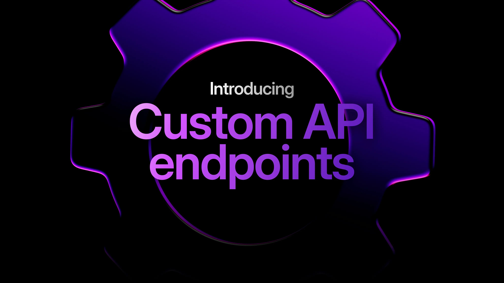

# Custom API Endpoints: streamlining your architecture

With the release of SurrealDB 3.0, we’re excited to announce the stabilisation of a powerful feature: [`DEFINE API`](/docs/surrealql/statements/define/api). This innovative addition allows developers to define database behaviours, set up middleware, and create custom API endpoints directly within the familiar SurrealQL query language.

Traditionally, applications connect to databases through middleware, resulting in a three-layer architecture:

- Client → Middleware (API) → Database

With SurrealDB's new `DEFINE API`, you can simplify your infrastructure significantly:

- Client → Database

This streamlined approach not only reduces complexity but also enhances performance and ease of management.

## Real-world use case: implementing rate limits for a social app

Consider a scenario: you've built a popular social application that allows users to see recent comments. You want to provide a free API for anonymous users, but you also need to ensure these guest users don't overload your system resources during peak traffic.

Here are some ways how you can achieve this efficiently using SurrealDB's `DEFINE API`:

### Setup: restrict arbitrary queries

To begin, pass in the new `--deny-arbitrary-query` flag when starting the SurrealDB server.

```cli
surreal start --user root --pass root --deny-arbitrary-query guest --allow-experimental define_api
```

This prevents certain groups, like guests or record users, from putting their own queries together. We'll add `guest` here so that any guest users will have to use the API endpoint instead.

You can then connect using Surrealist, or with the following command in a new terminal window:

```cli
surreal sql --user root --pass root
```

### Defining your API Endpoint

Next, we'll add a `DEFINE API` statement to define the endpoint. The statement will start with the path `/get_latest` , and to specify that it can only be used for `GET` requests, we will include it after the `FOR` keyword.

```surrealql
DEFINE API OVERWRITE "/get_latest" FOR get
```

### Add middleware functions

We can follow this up with some middleware by passing in some of SurrealDB's [API functions](/docs/surrealql/functions/database/api). We'll use `api::timeout` to give guest users up to 50 milliseconds of server time.

```surrealql
MIDDLEWARE
    api::timeout(50ms)
```

### Define the RETURN data

And then we'll finish up the statement by adding what it actually returns: a `SELECT` statement for all `comment` records that have been created over the past ten minutes:

```surrealql
THEN {
      {
        body: SELECT * FROM comment:[time::now()-10m].. ORDER BY id DESC
	  }
	};	           
```

In summary, that gives us a `DEFINE API` statement that looks like this.

```surrealql
DEFINE API OVERWRITE "/get_latest" FOR get
    MIDDLEWARE
        api::timeout(50ms),
    THEN {
        {
            body: SELECT * FROM comment:[time::now()-10m].. ORDER BY id DESC
        }
};
```

### Testing your endpoint

You can test it from SurrealQL itself by first adding a comment or two and then calling the `api::invoke` function:

```surrealql
CREATE comment:[time::now()] SET user_says = "Nice blog!";
CREATE comment:[time::now()] SET user_says = "Can't wait for the new version";

api::invoke("/get_latest");
```

Or externally at: `/api/:namespace/:database/:endpoint_name`. Here's what our defined endpoint will look like with a namespace called `test_ns` and a database called `test_db`.

```syntax
http://localhost:8000/api/test_ns/test_db/get_latest
```

That means that a curl command like the following will be enough to get the latest comments.

```cli
curl -H "Accept: application/json" \
  http://localhost:8000/api/test_ns/test_db/get_latest
```

The output should look something like this.

```json
[
  {"id":"comment:[d'2026-02-12T01:10:02.445607Z']","user_says":"Can't wait for the new version"},
  {"id":"comment:[d'2026-02-12T01:08:33.709073Z']","user_says":"Nice blog!"}
]
```

But that’s not all. The `MIDDLEWARE` clause in a `DEFINE API` statement can take custom middleware as well that you define yourself using a regular `DEFINE FUNCTION` statement. These functions are automatically populated with the user request and a way to get the current state of the response as you put it together.

There are a lot of examples in the documentation to show how it works, but here’s a simple example to get you started.

```surrealql
DEFINE FUNCTION fn::add_prefix($req: object, $next: function, $prefix: string) -> object {
    LET $res = $next($req);
    LET $res = $res + { body: $res.body + { prefix: $prefix + ": " + $res.body.message } };
    $res;
};

DEFINE API "/custom_with_args"
    FOR get
        MIDDLEWARE
            fn::add_prefix("PREFIX")
        THEN {
            {
                status: 200,
                body: {
                    message: "original message"
                }
            };
        };
```

With `DEFINE API`, SurrealDB brings the power of API design directly into the database - no external layers, no additional frameworks. Whether you’re enforcing limits, defining access, or building powerful custom endpoints, this feature helps you simplify your architecture and move faster.

## Explore further

Dive deeper into SurrealDB's powerful API management capabilities:

- [API Functions](/docs/surrealql/functions/database/api)
- [DEFINE API Documentation](/docs/surrealql/statements/define/api)
- [HTTP Integration](/docs/surrealdb/integration/http#custom)
- [Managing Arbitrary Queries](/docs/surrealdb/security/capabilities#arbitrary-queries)

Harness the power of `DEFINE API` and redefine what's possible with SurrealDB 3.0.
