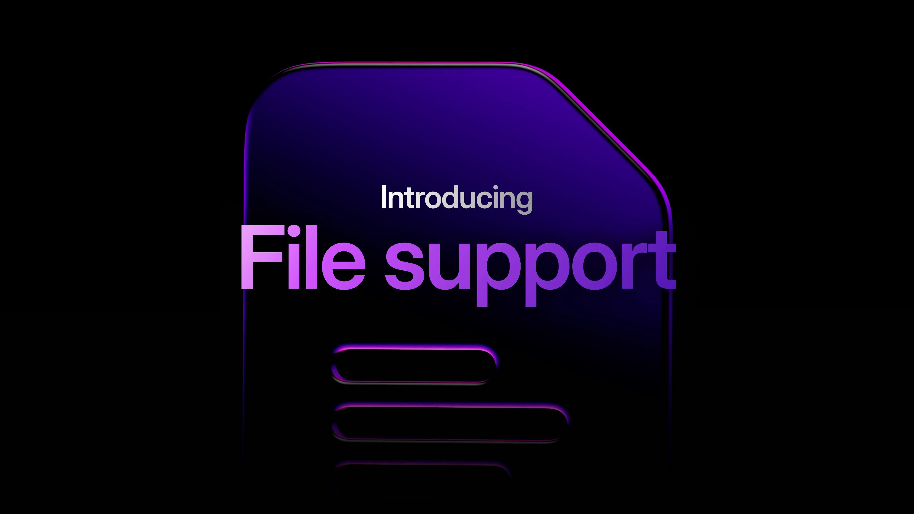

# File Support

Until now, SurrealDB has always encouraged users to store files externally, referencing them with paths stored in the database. We’re now introducing the first step toward native file support - bringing file storage directly into your database workflow.

File storage is still an experimental feature at this moment, and we would love to hear from you as you give it a try for your own solutions.

## Setting up file storage

To begin, we can start a new SurrealDB server with the experimental `files` capability enabled.

```cli
surreal start --user root --pass secret --allow-experimental files
```

Setting up file storage can be done with a single `DEFINE BUCKET` statement! A bucket can be a physical location, or even in-memory.

For global usage across all namespaces and databases, you can set a `SURREAL_GLOBAL_BUCKET` environment variable, with an optional `SURREAL_GLOBAL_BUCKET_ENFORCED` if you want to ensure that every database uses the same global bucket.

Let’s define a simple in-memory bucket. Just provide a name, and set the backend to "memory":

```surrealql
DEFINE BUCKET my_bucket BACKEND "memory";
```

The name of the bucket is also your path to the bucket and everything inside.

## Storing and accessing files

Once your bucket is defined, you can reference it using a file pointer - a string prefixed with the letter `f` to indicate a file path.

File pointers have their own functions, like `.put()` to add bytes, `.get()` to see them, `.rename()` to rename a file, and `.head()` to see its metadata. Let’s use the `.get()` function to see if our bucket has a file called `tour_of_surrealdb.txt`.

```surrealql
f"my_bucket:/tour_of_surrealdb.txt".get();
```

The function returned `NONE`, so looks like there’s nothing there.

Let’s use the `.put()` method to add some bytes, creating the file. `.put()` can take bytes or a string, which it will automatically convert into bytes.

```surrealql
f"my_bucket:/tour_of_surrealdb.txt".put("Welcome to the Tour of SurrealDB!");
```

Here, we’re adding the string “Welcome to the Tour of SurrealDB!”

Now that the file exists, the .get() function will return its as bytes:

```surrealql
f"my_bucket:/tour_of_surrealdb.txt".get();

-- Output:
b"57656C636F6D6520746F2074686520546F7572206F66205375727265616C444221"
```

## Working with file data

If you prefer to view the data differently, SurrealDB also now supports improved type conversions for byte-related types.

For example, you can cast the result to an array to see each byte as a number:

```surrealql
<array>f"my_bucket:/tour_of_surrealdb.txt".get();
```

```surrealql
[87, 101, 108, 99, 111, 109, 101, 32, 116, 111, 32, 116, 104, 101, 32, 84, 111, 117, 114, 32, 111, 102, 32, 83, 117, 114, 114, 101,
97, 108, 68, 66, 33]
```

Or cast to a string:

```surrealql
<string>f"my_bucket:/tour_of_surrealdb.txt".get();
```

In cases where the bytes include invalid UTF-8, you can use `type::string_lossy()` - a new function that replaces invalid bytes with the `�` Unicode replacement character, rather than throwing an error.

This function is especially useful when working with partially corrupted or inconsistently encoded data. Instead of failing outright, it preserves and returns all valid parts of the string.

Here’s an example using `type::string`, which returns an error because not all the bytes are valid:

```surrealql
type::string(<bytes>[83, 117, 114, 255, 114, 101, 97, 254, 108, 68, 66]);
-- 'Could not cast into `string` using input `b"537572FF726561FE6C4442"`'
```

And here’s the same input passed through `type::string_lossy()`. We can see that there are some valid bytes in there - enough to make out the word SurrealDB.

```surrealql
type::string_lossy(<bytes>[83, 117, 114, 255, 114, 101, 97, 254, 108, 68, 66]);
-- 'Sur�rea�lDB'
```

SurrealDB also has [encoding functions](/docs/surrealql/functions/database/encoding) that allow you to encode and decode bytes into SurrealDB types. That means that you can take a type like this object and turn it into bytes...

```surrealql
encoding::cbor::encode({ some: "data" });

-- Output:
b"A164736F6D656464617461"
```

And then turn it back from bytes into an object.

```surrealql
encoding::cbor::decode(b"A164736F6D656464617461");

-- Output:
{
	some: 'data'
}
```

## A takeaway example to get started

Let's take a quick running example to give you some ideas of how you could use files in your own app, in this case an app that stores temporary shopping cart files to disk so that other parts of the app can access them.

This time we'll define a bucket to a file path instead of memory, which requires `SURREAL_BUCKET_FOLDER_ALLOWLIST` to be set so that the database knows that this folder has been approved as the location for file storage. Note that the SurrealDB instance itself is using memory as the backend, but it's able to save files to this directory, getting the best of both worlds.

```cli
SURREAL_BUCKET_FOLDER_ALLOWLIST="/users/your_user_name" surreal start --allow-experimental files --user root --pass secret
```

After connecting, defining the bucket can be done with a path that begins with `file:` and holds the path we have allowed.

```surrealql
DEFINE BUCKET shopping_carts BACKEND "file:/users/your_user_name";
```

Since working with files takes a good amount of code, we'll put some functions together to simplify the process. These three will allow us to save, get, and delete files in the `shopping_carts` backend.

```surrealql
-- Convenience functions to save, decode back into
-- SurrealQL type, and delete
DEFINE FUNCTION fn::save_file($file_name: string, $input: any) {
    LET $file = type::file("shopping_carts", $file_name);
    $file.put(encoding::cbor::encode($input));
};

DEFINE FUNCTION fn::get_file($file_name: string) -> object {
    encoding::cbor::decode(type::file("shopping_carts", $file_name).get())
};

DEFINE FUNCTION fn::delete_file($file_name: string) {
    type::file("shopping_carts", $file_name).delete();
};
```

With those functions set up, we can play around with a file for a user with the user number 24567. Once you execute the `fn::save_file()` function below you will be able to go into the directory yourself to view it. And you can also view and interact with it using SurrealQL via the other functions in the example below.

```surrealql
-- Save current shopping cart
fn::save_file("temp_cart_user_24567", {
    items: ["shirt1"],
    last_updated: time::now()
});

fn::get_file("temp_cart_user_24567");
-- Returns { items: ['shirt1', 'deck_of_cards'], last_updated: d'2026-02-25T01:03:24.141080Z' }

-- User adds item, save over file with newer information
fn::save_file("temp_cart_user_24567", {
    items: ["shirt1", "deck_of_cards"],
    last_updated: time::now()
});

fn::get_file("temp_cart_user_24567");
-- Returns { items: ['shirt1', 'deck_of_cards'], last_updated: d'2026-02-25T01:06:02.752429Z' }

-- Session is over, delete temp file
fn::delete_file("temp_cart_user_24567");
```

We’re excited to introduce this first stage of native file support in SurrealDB. As the next step in our journey toward multimodality, we’re working on enabling integrations with object storage solutions such as Amazon S3, allowing you to work with files at scale. If you’re building apps that rely on lightweight file storage or embedded assets, give it a try - and let us know what features you’d like to see next. This is just the beginning.

Learn more at [https://surrealdb.com/docs/surrealql/datamodel/files](https://surrealdb.com/docs/surrealql/datamodel/files).
