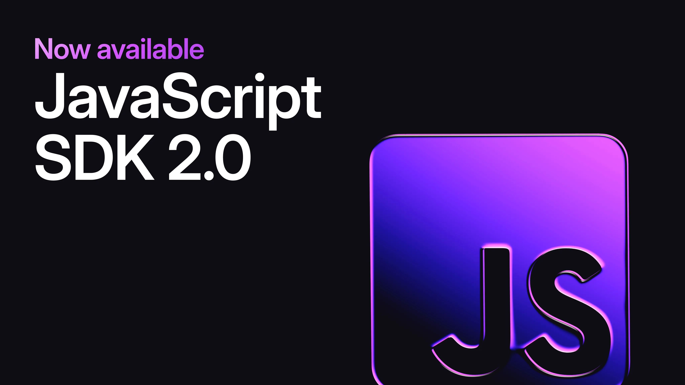

# Introducing JavaScript SDK 2.0



We're excited to announce the SurrealDB JavaScript SDK v2, the most significant update to the SDK to date. We've rebuilt the core internals with a focus on ergonomics, flexibility, and developer experience. Key highlights include full support for SurrealDB 3.0, multi-session support, automatic token refreshing, client-side transactions, a redesigned live query API, and a new query builder pattern that makes working with your data more intuitive than ever.

## Welcome WASM and Node!

The existing WebAssembly and Node.js SDKs have been rewritten, updated to support the 2.0 JavaScript SDK, and moved into the JavaScript SDK repository.

Going forward, the JS, WASM, and Node.js SDKs will be published together, so embedded SurrealDB stays up to date. The WASM and Node.js SDK versions align their major and minor versions with SurrealDB, so you can tell at a glance which SurrealDB version you're running.

As a bonus, the WASM SDK now supports running inside a Web Worker, so you can offload database work from the main thread and keep your UI responsive.

### Wasm

```typescript


const db = new Surreal({
    engines: {
        ...createRemoteEngines(),
        ...createWasmEngines(),
        // or for Web Worker based engines
        ...createWasmWorkerEngines({
            createWorker: () => new WorkerAgent()
        })
    },
});
```

### Node.js (and Bun & Deno)

```typescript


const db = new Surreal({
    engines: {
        ...createRemoteEngines(),
        ...createNodeEngines(),
    },
});
```

## Official event listeners

The original SDK exposed events through the internal `surreal.emitter` field. The new SDK provides a type-safe `surreal.subscribe()` function instead. Calling `.subscribe()` returns a cleanup function that unsubscribes the listener when invoked.

```typescript
// Subscribe to events
const unsub = surreal.subscribe("connected", () => {
    ...
});

// Unsubscribe
unsub();
```

## Access internal state

New getters let you read internal state from the `Surreal` instance:

- `surreal.namespace` and `surreal.database` for the selected namespace and database
- `surreal.params` for connection parameters
- `surreal.accessToken` and `surreal.refreshToken` for authentication tokens

```typescript
await surreal.use({ namespace: surreal.namespace, database: "other-db" });
```

## Automatic token refreshing

The SDK now restores or renews authentication when your access token expires or the connection reconnects. When refresh tokens are available, they are exchanged for a new token pair. Otherwise the SDK reuses the credentials you provided or fires an `auth` event for custom handling. [Read more on GitHub](https://github.com/surrealdb/surrealdb.js/pull/484).

For asynchronous authentication, you can pass a callable to the `authentication` property:

```typescript
const surreal = new Surreal();

await surreal.connect("http://example.com", {
    namespace: "test",
    database: "test",
    renewAccess: true, // default true
    authentication: () => ({
        username: "foo",
        password: "bar",
    })
});
```

## Multi-session support

You can create multiple isolated sessions on a single connection, each with its own namespace, database, variables, and authentication state. New sessions can be created at any time, or you can fork an existing session and reuse its state.

### Simple example

```typescript
// Create a new session
const session = await surreal.newSession();

// Use the session
session.signin(...);

// Dispose the session
await session.closeSession();
```

### Forking sessions

```typescript
const freshSession = await surreal.newSession();

// Clone a session including namespace, database, variables, and auth state
const forkedSession = await freshSession.forkSession();
```

### Await using

```typescript
await using session = await surreal.newSession();

// JavaScript will automatically close the session at the end of the current scope
```

## Redesigned live query API

Live query methods on the Surreal class have been redesigned to be more intuitive. Live select queries can also restart automatically when the driver reconnects.

The record ID is now passed as the third argument to your handlers, so you can identify which record changed when handling patch updates.

```typescript
// Construct a new live subscription
const live = await surreal.live(new Table("users"));

// Listen to changes
live.subscribe((action, result, record) => {
     ...
});

// Alternatively, iterate messages
for await (const { action, value } of live) {
    ...
}

// Kill the query and stop listening
live.kill();

// Create an unmanaged query from an existing id
const [id] = await surreal.query("LIVE SELECT * FROM users");
const live = await surreal.liveOf(id);
```

## Improved parameter explicitness

Query functions no longer accept plain strings as table names. You must use the `Table` class, which avoids record IDs being mistaken for table names.

```typescript
// tables.ts
const usersTable = new Table("users");
const productsTable = new Table("products");
...

// main.ts
await surreal.select(usersTable);
```

## Query builder pattern

A new builder pattern lets you configure RPC calls with optional chaining. All query methods support chainable helpers for filtering, limiting, and fetching.

As a result, `update` and `upsert` no longer take content as a second argument. You choose how to change records by calling `.content()`, `.merge()`, `.replace()`, or `.patch()`.

```typescript
// Select
const record = await db.select(id)
    .fields("age", "firstname", "lastname")
    .fetch("foo");

// Update
await db.update(record).merge({
    hello: "world"
});
```

## Query method overhaul

The `.query()` function has been overhauled to support more use cases, including picking response indexes, automatic JSON output, and streaming responses.

```typescript
// Execute a query and return results
const [user] = await db.query<[User]>("SELECT * FROM user:foo");

// Collect specific results
const [foo, bar] = await db.query("LET $foo = ...; LET $bar = ...; SELECT * FROM $foo; SELECT * FROM $bar")
    .collect<[User, Product]>(2, 3);

// Jsonify responses
const [products] = await db.query<[Product[]]>("SELECT * FROM product").json();

// Response objects
const responses = await db.query<[Product[]]>("SELECT * FROM product").responses();

// Stream responses
const stream = surreal.query(`SELECT * FROM foo`).stream();

for await (const frame of stream) {
    if (frame.isValue<Foo>()) {
        //  Process a single value with frame.value typed Foo
    } else if (frame.isDone()) {
        // Handle completion and access stats with frame.stats
    } else if (frame.isError()) {
        // Handle error frame.error
    }
}
```

SurrealDB does not yet support streaming individual records, but this API is ready for when it does. It works with current SurrealDB versions and is now the only way to obtain query stats.

## Expressions API

A new Expressions API works with the `.where()` function and makes it easier to build dynamic expressions. It integrates with the `surql` template tag so you can insert parameter-safe expressions anywhere.

```typescript
const checkActive = true;

// Query method
await db.select(userTable).where(eq("active", checkActive));

// Custom query
await db.query(surql`SELECT * FROM user WHERE ${eq("active", checkActive)}`);

// Expressions even allow raw insertion
await db.query(surql`SELECT * FROM user ${raw("WHERE active = true")}`);
```

You can also serialize expressions to a string with the `expr()` function:

```typescript
const result: BoundQuery = expr(
    or(
        eq("foo", "bar"),
        false && eq("hello", "world"),
        eq("alpha", "beta"),
        and(
            inside("hello", ["hello"]),
            between("number", 1, 10)
        )
    )
);
```

## Value encode/decode visitor API

For advanced use cases where you need to process SurrealDB value types, you can pass encode or decode visitor callbacks in the Surreal constructor. These run for each value sent to or received from the engine, so you can modify or wrap values before they appear in responses.

```typescript
const surreal = new Surreal({
	codecOptions: {
		valueDecodeVisitor(value) {
			if (value instanceof RecordId) {
				return new RecordId("foo", "bar");
			}

			return value;
		},
	},
});

...

const [result] = await surreal.query(`RETURN hello:world`).collect<[RecordId]>();

console.log(result); // foo:bar
```

## Diagnostics API

The Diagnostics API lets you wrap engines and inspect protocol-level communication. It is useful for debugging queries, analysing SDK behaviour, measuring timings, and similar tasks.

Because it is implemented as a wrapper engine, there is no extra cost unless you use it. We do not recommend using it in production, as it can affect performance and the events may change between versions.

```typescript
new Surreal({
	driverOptions: {
		engines: applyDiagnostics(createRemoteEngines(), (event) => {
			console.log(event);
		}),
	},
});
```

Each event has a `type`, `key`, and `phase`. The `type` identifies the operation, `key` is a stable id across phases, and `phase` indicates start, progress, or completion. The `query` diagnostic exposes the internal chunk stream; you are responsible for stitching queries and batches together. The `after` phase includes `duration`, `success`, and `result`.

## Get started with the new SDK

You can visit the [JavaScript SDK documentation](/docs/sdk/javascript) for more information on the new SDK, which has been fully updated to reflect all new changes. It contains many new concept guides explaining how to use the new SDK, and now includes a comprehensive API reference for detailed information.

Follow the [Quickstart guide](/docs/sdk/javascript/start) to get started.
