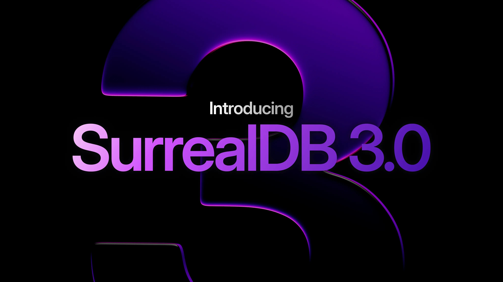
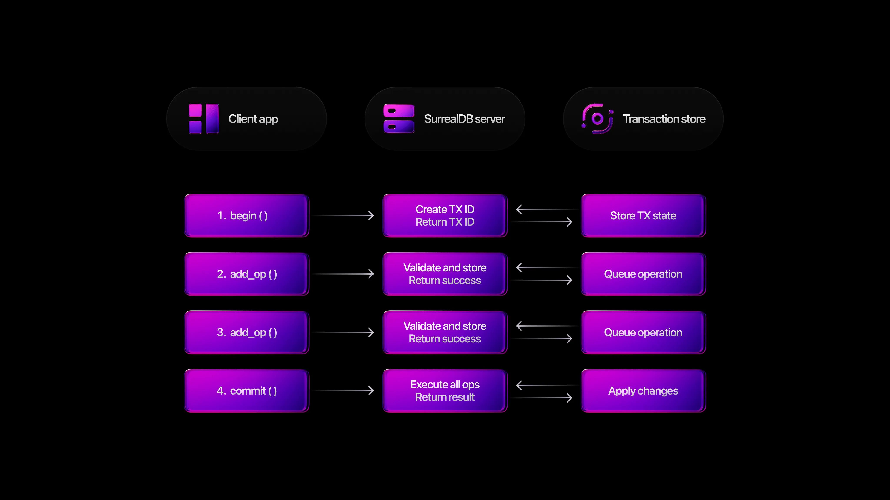
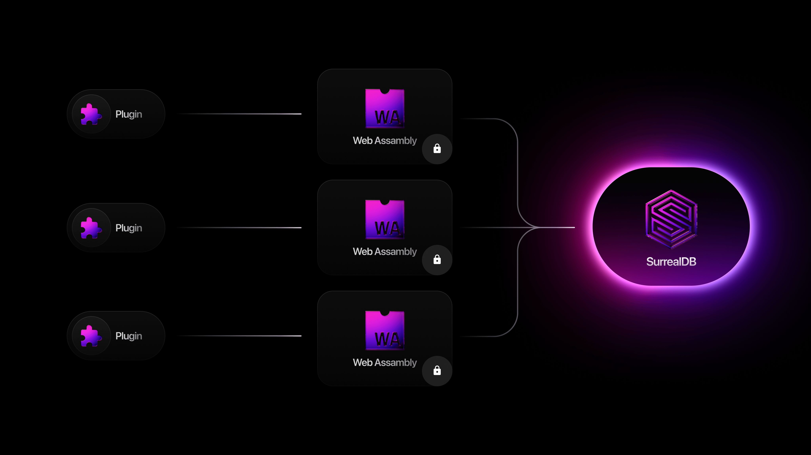

# Introducing SurrealDB 3.0 - the future of AI agent memory



Since SurrealDB was first released, we’ve been humbled by the reviews and adoption from our users. The possibility of a single database that does it all, can run anywhere, and can scale from embedded to large scale clusters opened up the imagination of users, all the way from building small applications to large scale enterprise AI production systems.

3.0 looks to take SurrealDB to the next level, with significant improvements across three main areas:

- Stability, performance and tooling
- Improved developer experience
- Building AI agents

## Stability, performance and tooling

2.0 was a milestone for SurrealDB in terms of capability, but as usage scaled, some of our internal models made the engine do work it didn’t need to do, and made correctness and predictability harder than they needed to be.

With SurrealDB 3.0, we’ve made major architectural changes to improve stability, performance, and the developer experience. We’ve separated values from expressions, introduced computed fields, moved core metadata to ID‑based storage, made synced writes the default, and re‑designed how documents are represented on disk. The result is a faster, more stable database - and a cleaner path to future optimisation.

Let’s dive into these changes and explore why they matter.

### Splitting values and expressions

At the heart of 3.0 is a clean separation between what your data is (values) and how it’s derived (expressions).

In earlier versions these were entangled. A field could be “computed or un‑computed,” but the engine often had to continuously compute to present a result. That meant extra evaluation, extra serialisation, and edge‑case bugs - especially once you stored logic *inside* records.

By splitting the two, the engine evaluates only when it should, avoiding redundant work and laying a foundation for a more predictable planner and smarter optimisations in future releases.

This corrects the prior model and directly enables a safer, faster way to express logic in your schema: computed fields.

### Computed fields

SurrealDB’s `future` type was used for values that were evaluated at query time. While flexible, they embedded logic into each record and forced per‑row evaluation. In 3.0, they are replaced with computed fields: logic you define once in the schema to be evaluated consistently at query time.

```surrealql
DEFINE FIELD can_drive ON person COMPUTED age > 18;
```

This approach removes unnecessary per‑record computation, improves stability, and makes behaviour easier to reason about. The result is a reduced workload for the engine and a clearer developer experience, with guardrails that prevent hidden complexity.

Learn more at [https://surrealdb.com/docs/surrealql/statements/define/field](https://surrealdb.com/docs/surrealql/statements/define/field).

### ID‑based storage

3.0 moves core catalog entries like namespaces, databases and indexes from name‑based to ID‑based storage. Internally, these now use compact, fixed‑size identifiers rather than variable‑length names.

The benefits are twofold:

- **Consistent, smaller keys on disk:** reducing storage consumption and improving lookups - especially when names are long.
- **It lays the groundwork for renaming resources:** since references point to stable IDs that don’t change, it will be possible to rename database resources.

This makes the catalog more robust today and more flexible for features in the future.

As an arbitrary example of a smaller key, here’s one of the keys that’s stored in the DB that is used for indexing.

This is what it would look like before at 80 bytes with the previous Rust code:

```syntax
`/*namespace\0*database\0*order_history\0+order_history__city_time__idx\0!bd\x01\0\0\0\0\0\0\0\x07`
```

```rust
let val = Bd::new(
	"namespace",
	"database",
	"order_history",
	"order_history__city_time__idx",
	Some(7),
);
let enc = Bd::encode(&val).unwrap();
assert_eq!(enc.len(), 80);
assert_eq!(enc, b"/*namespace\0*database\0*order_history\0+order_history__city_time__idx\0!bd\x01\0\0\0\0\0\0\0\x07");
```

And here it is now at 42 bytes.

```syntax
`/*\0\0\0\x01*\0\0\0\x02*order_history\0+\0\0\0\x03!bd\0\0\0\0\0\0\0\x07`
```

```rust
let val = Bd::new(NamespaceId(1), DatabaseId(2), "order_history", IndexId(3), 7);
let enc = Bd::encode_key(&val).unwrap();
assert_eq!(enc.len(), 42);
assert_eq!(enc, b"/*\0\0\0\x01*\0\0\0\x02*order_history\0+\0\0\0\x03!bd\0\0\0\0\0\0\0\x07");
```

That’s a reduction of 38 bytes on this key alone - multiplied across catalogs, it meaningfully trims storage and I/O.

### Synced writes by default

Synced writes are now the default in 3.0. Rather than relying on the operating system to flush data “soon,” SurrealDB confirms a write only after it’s durably committed.

This change doesn’t alter what’s possible - it makes the safer behaviour the standard, improving predictability for production workloads.

### Document representation

Previously, a record’s value and its metadata lived together, with metadata stored as hidden fields. That made rendering results slower and caused correctness issues - especially with views and table statistics.

3.0 introduces a proper **document wrapper type**. Record **content** and record **metadata** are stored **explicitly and separately**. That means cleaner responses with no invisible fields, improved stability for views and table statistics, and room to attach system metadata - such as update timestamps or version stamps - without polluting user data.

### Bug fixes & SDK improvements

3.0 also includes a large bug-fixing effort. We have closed over 150 bugs, and are now laser-focused on solving any new reported bugs. We have also implemented improved automated testing, and a CRUD bench workflow that runs on every submitted PR. These fixes address long-standing pain points raised by both community users and enterprise deployments, improving correctness and reliability across the board.

Alongside this, the Go and Java SDKs have reached `1.0` production readiness, giving developers stable integration paths in more ecosystems out of the box.

SurrealDB 3.0 represents a significant step forward in the stability and maturity of the database. By separating values from expressions, introducing computed fields, adopting ID‑based storage, enabling synced writes by default, and redesigning document handling, SurrealDB becomes more predictable, more durable, and easier to operate.

As you explore SurrealDB 3.0, you’ll find these improvements make everyday queries faster, behaviour more consistent, and future optimisation substantially easier.

### Surreal Sync

Surreal Sync is a new tool that helps you move data from another database or source into SurrealDB. It’s currently in active development, and users are welcome to test it and share feedback or report any issues.

Surreal Sync is run entirely on the command line and allows you to import data directly from a another source straight into a running SurrealDB instance. For example, the following command will sign into a Neo4J database at `bolt://localhost:7687` as the user `neo4j` with the password `password` into the SurrealDB database `graph_data` inside the `production` namespace via a user named `root` with the password `secret`.

```syntax
surreal-sync sync neo4j \
  --source-uri "bolt://localhost:7687" \
  --source-username "neo4j" \
  --source-password "password" \
  --neo4j-timezone "America/New_York" \
  --to-namespace "production" \
  --to-database "graph_data" \
  --surrealdb-username "root" \
  --surrealdb-password "secret"
```

Learn more at [https://surrealdb.com/docs/surrealdb/migrating](https://surrealdb.com/docs/surrealdb/migrating).

### GraphQL support is now stable

GraphQL has become a critical interface layer for modern applications. It gives frontend teams precise control over the data they fetch, reduces over-fetching and under-fetching, and enables faster iteration across web, mobile, and edge clients. For companies, it provides a strongly typed, self-documenting API surface that scales cleanly across teams and services. With SurrealDB 3.0, we are excited to announce that GraphQL support is now stable.

Previously gated behind an experimental flag, the GraphQL interface has undergone a comprehensive overhaul to meet real-world requirements - including full mutation support, built-in authentication flows, permission enforcement, and strong protections against abusive queries through configurable depth and complexity limits.

This release also introduces:

- Rich filtering operators and nested object support
- First-class geometry and relation resolution
- N+1 query optimisations for dramatically fewer database round-trips
- Security hardening and safer error handling
- GraphQL enabled by default (no experimental flag required)

If you’ve been waiting to run SurrealDB with GraphQL, now’s the time. Explore the GraphQL docs and get started: [https://surrealdb.com/docs/surrealdb/querying/graphql](https://surrealdb.com/docs/surrealdb/querying/graphql)

## Improved developer experience

2.0 unlocked new possibilities, but as adoption grew, developers asked for a more predictable, extensible, and expressive way to build with SurrealDB. With **3.0**, we’ve delivered just that - bringing a refined model that’s simpler to reason about and faster to build on. Developers can now define custom API endpoints directly within the database, manage complex workflows through client-side transactions, and express logic safely with computed fields and record references. These upgrades transform how you handle data relationships and integrate SurrealDB into real-world applications - making the developer experience as seamless as the database itself.

### Custom API endpoints

With SurrealDB 3.0, `DEFINE API` is now fully stabilised - letting you define custom endpoints and middleware directly inside your database, using the same SurrealQL you already know.

`DEFINE API` allows you to move from:

- Client → Middleware (API) → Database

To:

- Client → Database

While this was already possible with the standard endpoints, we’ve now improved it by also making custom endpoints possible.

`DEFINE API` is customisable, so let’s see an example. Let's say you have a social app that lets users see all the latest comments. You'd like to develop a free API to allow anonymous users to see them too, but sometimes the app gets really busy and you don't want guests to take up valuable resources.

In other words, you’d like to implement rate limits.

To begin, pass in the new `--deny-arbitrary-query` flag when starting the SurrealDB server.

```cli
surreal start --user root --pass root --deny-arbitrary-query guest
```

This prevents certain groups, like guests or record users, from putting their own queries together. We'll add `guest` here so that any guest users will have to use the API endpoint instead.

**Defining your API endpoint**

Next, we'll add a `DEFINE API` statement to define the endpoint. The statement will start with the path `/get_latest` , and to specify that it can only be used for `GET` requests, we will include the `FOR` keyword.

```surrealql
DEFINE API OVERWRITE "/get_latest" FOR get
```

We can follow this up with some middleware by passing in some of SurrealDB's [API functions](/docs/surrealql/functions/database/api). We'll use `api::timeout` to give guest users up to 50 milliseconds of server time.

```surrealql
MIDDLEWARE
    api::timeout(50ms)
```

And then we'll finish up the statement by adding what it actually returns: a `SELECT` statement for all `comment` records that have been created over the past ten minutes. In summary, that gives us a `DEFINE API` statement that looks like this.

```surrealql
DEFINE API OVERWRITE "/get_latest" FOR get
    MIDDLEWARE
        api::timeout(50ms),
    THEN {
        RETURN {
            body: SELECT * FROM comment:[time::now()-10m].. ORDER BY id DESC
        }
};
```

You can test it from SurrealQL itself through `api::invoke`:

```surrealql
api::invoke("/get_latest");
```

or externally at: `/api/:namespace/:database/:endpoint_name`. Here's what our defined endpoint will look like with a namespace called `test_ns` and a database called `test_db`.

```cli
http://localhost:8000/api/test_ns/test_db/get_latest
```

But that’s not all. The `MIDDLEWARE` clause in a `DEFINE API` statement can take custom middleware as well that you define yourself using a regular `DEFINE FUNCTION` statement. These functions are automatically populated with the user request and a way to get the current state of the response as you put it together.

There are a lot of examples in the documentation to show how it works, but here’s a simple example to get you started.

```surrealql
DEFINE FUNCTION fn::add_prefix($req: object, $next: function, $prefix: string) -> object {
    LET $res = $next($req);
    LET $res = $res + { body: $res.body + { prefix: $prefix + ": " + $res.body.message } };
    $res;
};

DEFINE API "/custom_with_args"
    FOR get
        MIDDLEWARE
            fn::add_prefix("PREFIX")
        THEN {
            {
                status: 200,
                body: {
                    message: "original message"
                }
            };
        };
```

With `DEFINE API`, SurrealDB brings the power of API design directly into the database - no external layers, no additional frameworks. Whether you’re enforcing limits, defining access, or building powerful custom endpoints, this feature helps you simplify your architecture and move faster.

Dive deeper into SurrealDB's powerful API management capabilities:

- [API Functions](https://surrealdb.com/docs/surrealql/functions/database/api)
- [DEFINE API Documentation](https://surrealdb.com/docs/surrealql/statements/define/api)
- [HTTP Integration](https://surrealdb.com/docs/surrealdb/integration/http#custom)
- [Managing Arbitrary Queries](https://surrealdb.com/docs/surrealdb/security/capabilities#arbitrary-queries)

### Client-side transactions

We’re introducing client-side transactions - a new way of working with transactions that gives developers far more flexibility and control.

In earlier versions, transactions were handled in a single request. That worked well for many use cases, but it also meant that any decision logic - such as whether to commit or cancel - had to be written directly in SurrealQL.

Now, with client-side transactions, that logic can live in your programming language of choice. You can begin a transaction, add operations across multiple requests, and commit when ready - all while keeping the same strong, ACID-compliant guarantees.

**How it works**

Client-side transactions follow a simple workflow: begin → add operations → commit or cancel.



This enhancement lets developers keep application logic in SDK languages such as Rust, Go, or JavaScript, while SurrealDB manages the transactional consistency behind the scenes.

For developers, this means cleaner, easier-to-read code, and workflows that are simpler to debug and maintain. Complex, multi-step business logic can now be expressed naturally in application code without giving up transactional safety.

And this is just the beginning. Client-side transactions also unlock new possibilities - like multi-step processes that span time or even human intervention - while still relying on SurrealDB for atomic guarantees.

With 3.0, transactions become far more adaptable to the way you build applications.

Learn more at [https://surrealdb.com/docs/surrealql/transactions](https://surrealdb.com/docs/surrealql/transactions).

### Computed fields

As mentioned already, in 3.0 we’re introducing computed fields - a simpler, faster, and more predictable way to define logic directly inside your data.

In previous versions of SurrealDB, you could attach a `future` to a field. While flexible, futures were too tightly coupled to the records themselves, which made it hard to scale well and often led to unexpected behaviour.

In 3.0, `futures` are gone. In their place, we now have computed fields - defined with a clear `COMPUTED` keyword, evaluated consistently whenever you query a record.

```surrealql
-- Before: using a future
DEFINE FIELD can_drive ON person VALUE <future> { time::now() - born > 18y };

-- After: using a computed field
DEFINE FIELD can_drive ON person COMPUTED time::now() - born > 18y;
```

This new syntax is shorter, clearer, and always up to date. Developers can now trust that computed values will appear in results without having to update records manually.

By consolidating logic into computed fields, SurrealDB reduces complexity in the core engine. This improves stability today - and sets us up to **optimise computations at scale in future versions**, leading to smarter query planning and faster results.

It also fixes a real pain point: developers no longer need to worry about when or how a future was set. With computed fields, the logic lives in one place, is always evaluated fresh, and returns consistently.

**A practical example**

Let’s look at how this works in practice. We want to model a driver’s licenses that expire two years after they are issued. We define when the license was issued, who owns it, and then add a computed field that checks if it’s still valid:

```surrealql
DEFINE FIELD since ON license TYPE datetime DEFAULT time::now();
DEFINE FIELD owner ON license TYPE record<person>;
DEFINE FIELD valid ON license COMPUTED time::now() - since < 2y;
```

The `valid` field automatically returns whether a license is less than two years old. There’s no update step, no manual reset. Just clean, predictable results every time.

When we query the license, the `valid` field is computed on the fly and included right in the result:

```surrealql
[
  {

		id: license:buvnfunv21em9zncxe03,
		owner: person:one,
		since: d'2025-09-01T04:23:34.956Z',
		valid: true
	}
]
```

**Guardrails for reliability**

Computed fields also introduce guardrails that futures never had. They can only be defined as top-level fields, which avoids hidden complexity in nested objects. And they cannot be combined with clauses like `VALUE`, `DEFAULT`, or `ASSERT`.

These restrictions make computed fields easier to reason about, more consistent to query, and safer to use in production.

**Looking ahead**

Computed fields aren’t just a replacement for futures. They’re a foundation for the future.

By moving logic into a consistent, centralised system, we’ve opened the door for optimised computation and query planning in upcoming releases. This means faster queries, smarter evaluation, and a simpler mental model for developers.

With SurrealDB 3.0, you can now define logic directly in your schema with confidence - cleaner, safer, and faster than ever before.

Learn more at [https://surrealdb.com/docs/surrealql/statements/define/field](https://surrealdb.com/docs/surrealql/statements/define/field).

### Record references

With the introduction of record references in SurrealDB 3.0, we’re making it possible for simple record links to now work in two directions instead of one.

This is a big improvement for anyone working with record links if you’ve been using ad-hoc queries like this one to simulate bidirectional links.

```surrealql
DEFINE FIELD since ON license TYPE datetime DEFAULT time::now();
-- Link from a license to a person
DEFINE FIELD owner ON license TYPE record<person>;

SELECT 
    name, 
    -- Look through all licenses to find the one linking to this person
    (SELECT type, since FORM license WHERE owner = $parent.id) AS licenses
FROM person;
```

Record references are defined at the schema level with the new `REFERENCE` keyword.

```surrealql
DEFINE FIELD owner ON license TYPE record<person> REFERENCE;
```

This turns a unidirectional link into a bidirectional relationship. With the reference in place, linked records can automatically “see” the records linking to them.

The syntax for traversing them is familiar too. While graph lookups use `<-` arrows, record references use a tilde - `<~` - to signal the reverse lookup.

**A practical example**

Let’s further develop the license example to see how this works in practice. Here, we’re modelling people and their licenses.

This time though, `owner` is set to be a `REFERENCE`, allowing other records to pick up on the incoming link. We have also added two `COMPUTED` fields. The one called `valid` checks to see if the license is still valid by being less than two years old, while the one called `licenses` checks for incoming links from the `license` table.

```surrealql
DEFINE FIELD since ON license TYPE datetime DEFAULT time::now();
DEFINE FIELD owner ON license TYPE record<person> REFERENCE;
DEFINE FIELD valid ON license COMPUTED time::now() - since < 2y;
DEFINE FIELD licenses ON person COMPUTED <~license;
```

Let’s test out this new setup by creating a person named Billy, along with two licenses - a current driver’s license and an old pilot’s license:

```surrealql
CREATE person:one SET name = "Billy";
CREATE license SET owner = person:one, type = "driver";
CREATE license SET owner = person:one, type = "pilot", since = d'2003-03-11';
```

This time when we query a person, all we need to do is select the fields we want to see and the built-in schema does the rest of the work. Both licenses are returned automatically, complete with their validity status.

```surrealql
SELECT 
	name, 
	licenses.{ since, type, valid }
FROM person;
```

```surrealql
[
	{
		licenses: [
			{
				since: d'2003-03-11T00:00:00Z',
				type: 'pilot',
				valid: false
			},
			{
				since: d'2025-09-03T02:17:04.340Z',
				type: 'driver',
				valid: true
			}
		],
		name: 'Billy'
	}
]
```

And since record reference syntax works just like graph queries do, you can use the `<~` syntax directly inside a query too. Here’s how we can order Billy’s licenses by date if we decided to use a direct query instead of defining a field using `<~` in the schema.

```surrealql
DEFINE FIELD since ON license TYPE datetime DEFAULT time::now();
DEFINE FIELD owner ON license TYPE record<person> REFERENCE;
DEFINE FIELD valid ON license COMPUTED time::now() - since < 2y;

CREATE person:one SET name = "Billy";
CREATE license SET owner = person:one, type = "driver";
CREATE license SET owner = person:one, type = "pilot", since = d'2003-03-11';

SELECT 
	name, 
	(SELECT type, since, valid FROM **<~**license ORDER BY since) AS driving_licenses
FROM person;

[
	{
		driving_licenses: [
			{
				since: d'2003-03-11T00:00:00Z',
				type: 'pilot',
				valid: false
			},
			{
				since: d'2025-09-03T02:18:20.489Z',
				type: 'driver',
				valid: true
			}
		],
		name: 'Billy'
	}
]
```

Record references make schemas clearer, queries simpler, and traversals faster. By cutting down redundant lookups, they give you the option to keep adding linked tables without seeing degradation in performance.

For developers working on a schema, it means you can model relationships more naturally, query them more efficiently, and rely on SurrealDB to manage the complexity.

Learn more at [https://surrealdb.com/docs/surrealql/datamodel/references](https://surrealdb.com/docs/surrealql/datamodel/references).

### Surqlize TypeScript ORM (experimental)

We’re excited to introduce Surqlize - our new, type-safe TypeScript ORM for SurrealDB. Surqlize is designed to bring the full power of SurrealDB to TypeScript developers, with end-to-end type safety, zero code generation, and first-class graph support. It embraces SurrealDB’s flexibility while giving you the confidence and developer experience you expect from modern TypeScript tooling.

> ⚠️ Surqlize is currently experimental. We’re sharing it early so you can try it, push it, and help shape its future.

**Why Surqlize?**

SurrealDB is powerful - multi-model, graph-native, and highly expressive. Surqlize makes that power ergonomic and type-safe in TypeScript.

With Surqlize, you get:

- **Type-safe schema definitions**: define your database schema using intuitive `t.*` builders.
- **Automatic type inference**: full TypeScript types - without code generation or separate schema compilation steps.
- **Fluent, fully typed query builder**: chain `.select()`, `.where()`, `.return()`, and more - with complete type safety throughout.
- **Comprehensive CRUD operations:** build `SELECT`, `CREATE`, `UPDATE`, `DELETE`, and `UPSERT` queries in a clean, expressive API.
- **First-class graph relationships:** model edges and traverse relationships naturally - fully typed.
- **Rich type system:** objects, arrays, unions, literals, optional fields, and more - all mapped directly to TypeScript.
- **SurrealDB function support:** integrated string, array, and record operations directly within typed queries.

Surqlize isn’t just an abstraction layer - it’s built specifically for SurrealDB’s multi-model architecture, including its graph capabilities and powerful function system.

**Try it and help us shape it**

Because Surqlize is experimental, your feedback is critical. Try it in your projects, push the limits, and tell us what feels great and what doesn’t. You can learn more here: [https://github.com/surrealdb/surqlize](https://github.com/surrealdb/surqlize)

Join us in the [SurrealDB Discord server](https://discord.com/invite/surrealdb) and share your feedback, ideas, and issues. We’re actively iterating and want to build this with the community.

SurrealDB 3.0 is about pushing boundaries - and Surqlize is a big step toward a best-in-class TypeScript developer experience.

## Building AI agents

SurrealDB 3.0 moves beyond storing data - it becomes the foundation for agent memory and intelligence. As developers build increasingly autonomous systems, the line between data, logic, and perception starts to blur. With this release, SurrealDB evolves from a multi-model database into a multi-modal platform for \*\*\*\*AI agents - one that can understand, recall, and extend its own context - ideal for context graphs and semantic layers to power complex AI agents and autonomous agentic workflows.

With file support, SurrealDB now handles structured records alongside images, audio, and documents - all queryable within SurrealQL. Enhanced vector search and indexing let agents store and retrieve embeddings with millisecond precision. Surrealism, our new WebAssembly extension system, enables custom logic and model execution directly inside the database. And we have some exciting agent memory functionalities in the roadmap to build better durable, scalable context for long-running AI agents.

Together, these capabilities turn SurrealDB 3.0 into more than a database - it’s a persistent memory engine for intelligent systems.

### File support

Until now, SurrealDB has always encouraged users to store files externally, referencing them with paths stored in the database. We’re now introducing the first step toward native file support - bringing file storage directly into your database workflow.

**Setting up file storage**

To begin, we can start a new SurrealDB server with the `files` capability enabled.

```cli
surreal start --user root -pass root --allow-experimental files
```

Setting up file storage can be done with a single `DEFINE BUCKET` statement! A bucket can be a physical location, or even in-memory.

For global usage across all namespaces and databases, you can set a `SURREAL_GLOBAL_BUCKET` environment variable, with an optional `SURREAL_GLOBAL_BUCKET_ENFORCED` if you want to ensure that every database uses the same global bucket.

Let’s define a simple in-memory bucket. Just provide a name, and set the backend to "memory":

```surrealql
DEFINE BUCKET my_bucket BACKEND "memory";
```

The name of the bucket is also your path to the bucket and everything inside.

**Storing and accessing files**

Once your bucket is defined, you can reference it using a file pointer - a string prefixed with the letter `f` to indicate a file path.

File pointers have their own functions, like `.put()` to add bytes, `.get()` to see them, `.rename()` to rename a file, and `.head()` to see its metadata. Let’s use the `.get()` function to see if our bucket has a file called `tour_of_surrealdb.txt`.

```surrealql
f"my_bucket:/tour_of_surrealdb.txt".get();
```

The function returned `NONE`, so looks like there’s nothing there.

Let’s use the `.put()` method to add some bytes, creating the file. `.put()` can take bytes or a string, which it will automatically convert into bytes.

```surrealql
f"my_bucket:/tour_of_surrealdb.txt".put("Welcome to the Tour of SurrealDB!");
```

Here, we’re adding the string “Welcome to the Tour of SurrealDB!”

Now that the file exists, the .get() function will return its as bytes:

```surrealql
f"my_bucket:/tour_of_surrealdb.txt".get();
```

```surrealql
b"57656C636F6D6520746F2074686520546F7572206F66205375727265616C444221"
```

**Working with file data**

If you prefer to view the data differently, SurrealDB also now supports improved type conversions for byte-related types.

For example, you can cast the result to an array to see each byte as a number:

```surrealql
<array>f"my_bucket:/tour_of_surrealdb.txt".get();
```

```surrealql
[ 87, 101, 108, 99, 111, 109, 101, 32, 116, 111, 32, 116, 104, 101, 32, 84, 111, 117, 114, 32, 111, 102, 32, 83, 117, 114, 114, 101,
97, 108, 68, 66, 33 ]
```

Or cast to a string:

```surrealql
<string>f"my_bucket:/tour_of_surrealdb.txt".get();
```

In cases where the bytes include invalid UTF-8, you can use `type::string_lossy()` - a new function that replaces invalid bytes with the `�` Unicode replacement character, rather than throwing an error.

This function is especially useful when working with partially corrupted or inconsistently encoded data. Instead of failing outright, it preserves and returns all valid parts of the string.

Here’s an example using `type::string`, which returns an error because not all the bytes are valid:

```surrealql
type::string(<bytes>[83, 117, 114, 255, 114, 101, 97, 254, 108, 68, 66]);
-- 'Could not cast into `string` using input `b"537572FF726561FE6C4442"`'
```

And here’s the same input passed through `type::string_lossy()`. We can see that there are some valid bytes in there - enough to make out the word SurrealDB.

```surrealql
type::string_lossy(<bytes>[83, 117, 114, 255, 114, 101, 97, 254, 108, 68, 66]);
-- 'Sur�rea�lDB'
```

We’re excited to introduce this first stage of native file support in SurrealDB. If you’re building apps that rely on lightweight file storage or embedded assets, give it a try - and let us know what features you’d like to see next. This is just the beginning.

Learn more at [https://surrealdb.com/docs/surrealql/datamodel/files](https://surrealdb.com/docs/surrealql/datamodel/files).

### Indexing and search

We know that index performance and functionality is important, which is why we’re excited to announce a brand-new indexing foundation - delivering faster queries, higher throughput, and smarter planning across the board.

Until now, SurrealDB’s queries often had to scan entire tables because the planner couldn’t exploit compound or descending indexes, full‑text search only matched all terms, and index updates ran single-threaded. This made searches and analytics painfully slow and blocked high-write workloads, motivating a comprehensive indexing overhaul for 3.0.

Indexing now combines a log‑based, multi‑writer engine with normalised key formats and smarter planners. Compound indexes support prefix + range scans, descending order, and LIMIT-aware iterators, while standard indexes handle duplicates gracefully. These changes let 3.0 answer many queries directly from indexes under heavy concurrency.

Let’s take a closer look at these changes.

**Compound indexes with prefix + range scans**

In SurrealDB 3.0, compound indexes have been enhanced to support both \*\*\*\*prefix equality and range queries in the same plan.

That means queries like this are now served directly from the index, without touching the entire table:

```surrealql
DEFINE INDEX idx_orders_customer_created
ON orders FIELDS customer, created_at;

SELECT id, total
FROM orders
WHERE customer = "acme"
  AND created_at >= d'2025-01-01'
  AND created_at <  d'2025-02-01'
ORDER BY created_at;

```

By constraining the left prefix (`customer = "acme"`) and scanning a precise range on `created_at`, the query planner can narrow down results efficiently, even on large datasets.

**Descending order and LIMIT-aware scans**

Queries with `ORDER BY ... DESC` can now be satisfied directly from the index on supported backends, eliminating the need for in-memory sorting. Combined with smarter batching that respects `LIMIT`, the database returns exactly what you asked for.

```surrealql
SELECT id, created_at, total
FROM orders
WHERE customer = "acme"
ORDER BY created_at DESC
LIMIT 20;
```

This approach reduces latency, saves memory, and keeps response times consistent.

**Normalised numeric keys**

Numeric values are now encoded canonically inside indexes. That means that the integer 0, the float 0.0, and 0 decimal are treated as equal in `UNIQUE` constraints and scan operations, and range queries run seamlessly across all numeric variants.

```surrealql
DEFINE INDEX uniq_price ON products FIELDS price UNIQUE;

CREATE products:one SET price = 0;
CREATE products:two SET price = 0.0;   -- Duplicate error, as expected
```

This change brings greater predictability to numeric comparisons, ensuring that equality and ordering work the way you’d expect.

**Smarter full-text search**

Full-text indexing has also been upgraded in 3.0. It now supports `OR` boolean operations, so you can query for documents that contain *any* of the specified terms, not just all of them.

```surrealql
DEFINE INDEX idx_docs_ft ON docs FIELDS body FULLTEXT ANALYZER english;

SELECT id
FROM docs
WHERE body @OR@ "vector graph";
```

On top of that, full-text indexing now supports concurrent writers, using a log-based approach with background compaction. This makes SurrealDB’s search engine more scalable under high-write workloads.

**Concurrent index builds**

Index creation itself has been improved with concurrent indexing by default. Instead of building an index in one large transaction, 3.0 handles index builds in batches. That means large indexes can be created more efficiently, without running into memory or file space issues.

**The impact**

Moving from O(N) scans to tight indexed lookups drops latency from seconds to milliseconds on million-row tables, while log‑based multi-writer indexing removes write bottlenecks for full‑text searches.

For developers, the net effect is faster reads, higher throughput, and more predictable tails as your datasets grow.

Indexing in SurrealDB 3.0 is now faster, more flexible, and more powerful, and this foundation sets us up for future distributed and specialised indexes - including vector and geospatial - enabling SurrealDB to scale to ever-larger, multi-tenant workloads.

### Introducing Surrealism

We are excited to introduce Surrealism which offers something developers have wanted for a long time: true extensibility inside SurrealDB itself.

Surrealism is a new open-source extension system for SurrealDB. It allows you to define modular, programmable logic using functions you write in Rust - and execute them directly within the database at runtime. We'll also soon be supporting a variety of other languages, including JavaScript and Python too.

This is a big shift.

Traditionally, if you wanted to extend your database, you had to choose between brittle, complex, error-prone, and potentially huge SQL scripts, heavyweight external services, or just push the data to the application layer and perform the logic there. Surrealism changes that. It brings logic into the database in a way that’s fast, secure, testable, and fully integrated with your development workflow. Surrealism redefines the way that developers and organisations work with stored procedures - allowing for custom business logic, and access control layers as version-controlled, testable, and shareable modules. These extensions execute with full transactional guarantees, and can be used to manage everything from dynamic API behaviours to policy enforcement and auditing.



**How Surrealism works**

Extensions are compiled to WebAssembly, allowing them to run in a secure, deterministic, sandboxed execution environment, whilst delivering near-native performance, with strict isolation between functions. This makes it ideal for both single-tenant systems and multi-tenant clusters, where isolation and efficiency are critical.

Extensions can be loaded from local disk, object storage, or uploaded directly into SurrealDB. They can be enabled and executed dynamically - without restarting the database - with fine-grained permission controls to determine who can load or invoke them.

With Surrealism, the development experience has been designed from the ground up for **productivity**. Developers can use their own libraries, tools, and frameworks. They can write tests in Rust, integrate extensions into CI and CD pipelines, and manage extension versions just like any other component of their application stack. Extensions are defined in simple projects with metadata in a TOML file, and compiled into portable WebAssembly binaries that can be reused, versioned, and shared.

**Built-in AI support and 'datagentic' workflows**

Surrealism enables direct integration with AI models, both local and remote. Extensions can interact with GPU-accelerated inferencing runtimes, or call out to external APIs for services like text or image generation, classification, tokenisation, embedding, translation, and anything else.

This means you could define an extension that takes a user’s input, runs it through a local LLM, and stores the generated result - all within a single SurrealQL query. You can trigger sentiment analysis on inserted documents, run similarity scoring against vector indexes, or use a vision model to extract structured data from uploaded files.

And because Surrealism extensions have full access to SurrealDB’s query engine, schema, and the new file functionality, they can work with structured data, unstructured content, and multi-modal assets in a single unified system.

For example, an extension can transcribe an audio file, extract named entities, enrich the results using a remote model, and save the output - all in one transactional flow.

This allows developers to build intelligent applications entirely within the database. The database becomes more than a data store - it becomes an intelligent, programmable runtime for real-time decision-making, content generation, and AI integration.

Bringing logic and agentic workflows into the database, rather than pushing the data out to external systems, enables seamless integration for AI, and unlocks new possibilities for intelligent applications. We call this workflow 'datagentic'. It’s fast. It’s flexible. It’s secure. And it’s open source.

Surrealism is available today for you to start developing your own custom or business logic, and it opens up a whole new frontier in database development - one where you can bring your own code, your own models, and your own ideas directly into the data layer. We can’t wait to see what you build. Learn more at [https://surrealdb.com/docs/surrealdb/extensions](https://surrealdb.com/docs/surrealdb/extensions).

## What’s next?

Building a database is never finished, and there’s more work we need to do. We’ll continue working on additional performance improvements, more tooling, integrations, and making SurrealDB the best database in the market.

Update your SurrealDB instance to 3.0 with our [migration guide](https://surrealdb.com/docs/surrealdb/installation/upgrading/migrating-data-to-3x), join our [Discord server](https://discord.com/invite/surrealdb) and share with us what you are building.

Thank you for helping us shape the future of databases.
