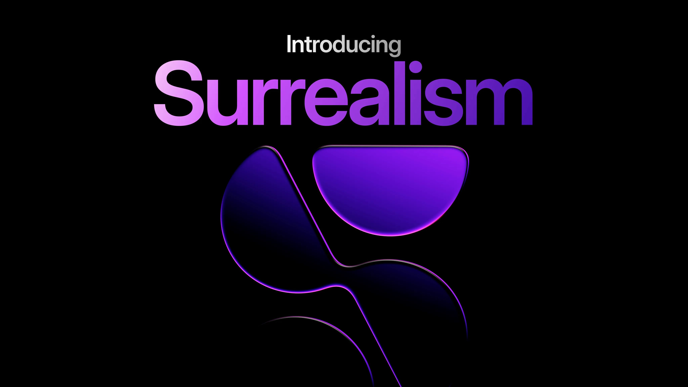
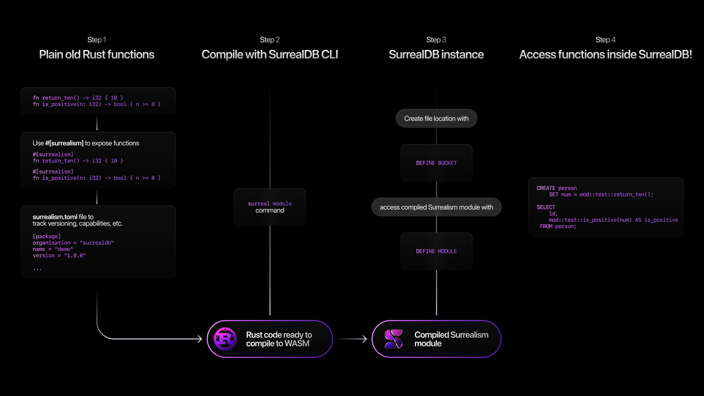

# Introducing Surrealism

We are excited to introduce Surrealism which offers something developers have wanted for a long time: true extensibility inside SurrealDB itself. Those of you who have participated in the SurrealDB 3.0 beta might have already gotten a glimpse of Surrealism, and we’re excited to announce it more broadly to the world today.

Surrealism is a new open-source extension framework for SurrealDB. It allows you to define modular, programmable logic using functions you write in Rust - and execute them directly within the database at runtime. We intend to expand Surrealism to support other languages including JavaScript and Python.

Traditionally, if you wanted to extend your database, you had to choose between brittle, complex, error-prone, and potentially huge scripts, heavyweight external services, or just push the data to the application layer and perform the logic there. Surrealism changes that. It brings logic into the database in a way that’s fast, secure, testable, and fully integrated with your development workflow. Surrealism redefines the way that developers and organisations work with stored procedures - allowing for custom business logic, and access control layers as version-controlled, testable, and shareable modules. These plugins execute with full transactional guarantees, and can be used to manage everything from dynamic API behaviours to policy enforcement and auditing.

## How Surrealism works

Functions are compiled to WebAssembly, allowing them to run in a secure, deterministic, sandboxed execution environment, whilst delivering near-native performance, with strict isolation between functions. This makes it ideal for both single-tenant systems and multi-tenant clusters, where isolation and efficiency are critical.

Plugins can be loaded from local disk, object storage, or uploaded directly into SurrealDB. They can be enabled and executed dynamically - without restarting the database - with fine-grained permission controls to determine who can load or invoke them.

With Surrealism, the development experience has been designed from the ground up for **productivity**. Developers can use their own libraries, tools, and frameworks. They can write tests in Rust, integrate plugins into CI and CD pipelines, and manage plugin versions just like any other component of their application stack. Plugins are defined in simple projects with metadata in a TOML file, and compiled into portable WebAssembly binaries that can be reused, versioned, and shared.

## Built-in AI support and agentic workflows

Surrealism enables direct integration with AI models, both local and remote. Plugins can interact with GPU-accelerated inferencing runtimes, or call out to external APIs for services like text or image generation, classification, tokenisation, embedding, translation, and anything else. Surrealism extensions turn SurrealDB into a programmable data and logic layer - perfect for agentic and AI-heavy workloads.

This means you could define a plugin that takes a user’s input, runs it through a local LLM, and stores the generated result - all within a single SurrealQL query. You can trigger sentiment analysis on inserted documents, run similarity scoring against vector indexes, or use a vision model to extract structured data from uploaded files.

And because Surrealism plugins have full access to SurrealDB’s query engine, schema, and the new file functionality, they can work with structured data, unstructured content, and multi-model assets in a single unified system.

For example, a plugin can transcribe an audio file, extract named entities, enrich the results using a remote model, and save the output - all in one transactional flow.

This allows developers to build intelligent applications entirely within the database. The database becomes more than a data store - it becomes an intelligent, programmable runtime for real-time decision-making, content generation, and AI integration.

Bringing logic and agentic workflows into the database, rather than pushing the data out to external systems, enables seamless integration for AI and unlocks new possibilities for intelligent applications. It’s fast. It’s flexible. It’s secure. And it’s open source.

Surrealism is available today for you to start developing your own custom or business logic, and it opens up a whole new frontier in database development - one where you can bring your own code, your own models, and your own ideas directly into the data layer.

We can’t wait to see what you build.

## Get started with Surrealism

Go to the [Surrealism Docs](/docs/surrealdb/extensions) to get started. We are excited to see what extensions you build, be sure to share them in our [Discord channel](https://discord.com/invite/surrealdb).

Thank you for being on this journey with us!
