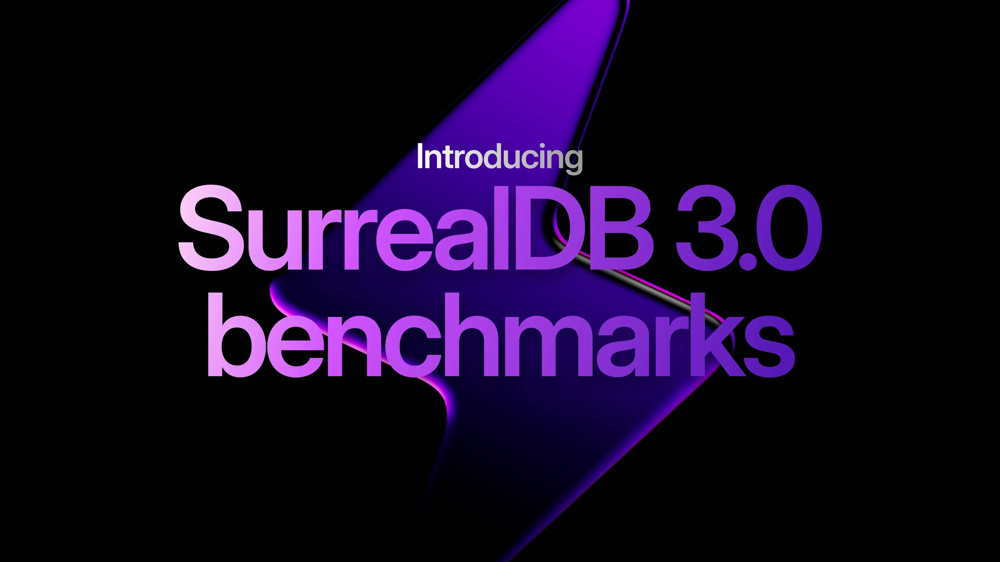

# SurrealDB 3.0 benchmarks: a new foundation for performance

When we began our benchmarking journey with SurrealDB 2.0, we set out to answer a simple but important question: how does SurrealDB perform in the real world?

Since then, SurrealDB has seen rapidly growing traction - including enterprises like Tencent and [Later.com](http://Later.com) running in production at significant scale, across high-throughput, business-critical workloads. As adoption has increased, so has the importance of demonstrating not just raw performance, but predictable, production-ready performance.

Last year we shared those early results openly, along with our methodology and learnings, in our [first benchmarking report](../../2025/02/beginning-our-benchmarking-journey.md).

With SurrealDB 3.0, we’re taking the next major step in that journey. Today, we’re excited to announce our new benchmarks for SurrealDB 3.0 - and more importantly, the architectural changes that make these results possible.

## Benchmarking a multi-model database

[As mentioned](https://surrealdb.com/blog/beginning-our-benchmarking-journey#the-challenge-of-multi-model-benchmarking) in our previous benchmarking blog, benchmarking a multi-model database is more complex than comparing single-purpose systems. SurrealDB unifies relational, document, graph, time-series, key-value, vector, geospatial, and full-text workloads in one engine, spanning everything from embedded deployments to distributed clusters.

This versatility makes fair benchmarking challenging, since different databases vary widely in durability guarantees, disk flushing behaviour, and configuration trade-offs. For our benchmarks, we’ve done our best to keep comparisons as balanced and transparent as possible - and we always welcome feedback on how to improve the methodology further.

Because SurrealDB can replace entire stacks of databases and supporting tools, the best way to benchmark SurrealDB is often through a like-for-like proof of concept against multiple existing systems (we have customers like Tencent who reduced nine separate tools down to one with SurrealDB).

## Our open-source benchmarking tool

We built our own internal benchmarking tool - [crud-bench](https://github.com/surrealdb/crud-bench) - in Rust to properly evaluate SurrealDB across the wide range of workloads it supports. Unlike many generic benchmarking suites, crud-bench is designed to test not just basic CRUD operations, but also the broader feature set that makes SurrealDB unique, across embedded, networked, and remote deployments. It allows us to compare SQL, NoSQL, key-value, and embedded systems in a consistent way, while continuously measuring the performance impact of changes inside SurrealDB itself. For more details on how the tool work, check the [crud-bench GitHub repo](https://github.com/surrealdb/crud-bench) and [the explanation in the previous 2.0 benchmark blog](https://surrealdb.com/blog/beginning-our-benchmarking-journey#how-does-it-work).

## SurrealDB 3.0: a new execution engine

**The foundation**

SurrealDB 3.0 has been largely focused on stability and getting the right foundations in place. We rearchitected the internals in ways that would have been nearly impossible under the previous design, and the performance results we're seeing now are a direct consequence of that work.

The biggest change is the query execution engine. We took inspiration from the broader database community and moved SurrealQL's execution model to a more standard pipeline: **AST → LogicalPlan → ExecutionPlan**, with basic query optimisations applied throughout. The new engine is fully streaming internally, and in a future minor release we will make it stream end-to-end.

Right now, the new execution engine covers read-only statements. In the coming minor releases we'll expand it to handle all of our workloads.

**TL;DR** Now let’s get to the benchmarks themselves. The tl;dr for the numbers below are as follows:

- Graph queries are between 8-22x faster.
- Large table scans with `LIMIT`, `START`, and `START + LIMIT` are 3-6x faster.
- The query planner is smarter. Queries like `SELECT * FROM table WHERE id = record:42` that previously triggered full table scans now resolve in sub-millisecond time, a 4000x+ improvement. This is especially important for a query language like SurrealQL which is very close to standard SQL in which `WHERE id =` is one of the most common patterns.
- ORDER BY queries are 3-4x faster across all storage engines.
- HNSW vector search is up to 8x faster. Indexed vector similarity queries dropped from ~35 seconds to ~4.5 seconds.
- The new execution model enables significantly improved concurrency and throughput.
- Complex GROUP BY queries with multiple aggregations are up to 55% faster, with the biggest gains on multi-aggregation and deduplication workloads.

## Benchmark hardware

The benchmarks below were run on the following system:

| Part | Name | Link |
|---|---|---|
| CPU | AMD Ryzen Threadripper 9970X | [amazon.co.uk](https://www.amazon.co.uk/AMD-Ryzen-Threadripper-9970X-5-40GHz/dp/B0FJ6FJN2H) |
| RAM | Samsung DDR5 4800MHz 64GB RDIMM | [amazon.co.uk](https://www.amazon.co.uk/Samsung-4800MHz-PC5-38400-Registered-M321R8GA0BB0-CQK-Green/dp/B0CFG7THWM) |
| SSD | Lexar EQ790 4TB NVMe | [amazon.co.uk](https://www.amazon.co.uk/dp/B0DNMK2Z1C) |
| Motherboard | ASUS PRO WS TRX50-SAGE WIFI A | [ballicom.co.uk](https://www.ballicom.co.uk/90mb1le0-m0eay0-asus-pro-ws-trx50-sage-wifi-a.p1681724.html) |
| CPU Cooler | Arctic Freezer 4U-M | [scan.co.uk](https://www.scan.co.uk/products/arctic-freezer-4u-m-ampere-server-workstation-cpu-cooler-2x-120mm-fans-altra-4926-xeon-threadripper) |
| Power Supply | CORSAIR RM1000x | [amazon.co.uk](https://www.amazon.co.uk/CORSAIR-RM1000x-Modular-Low-Noise-Supply/dp/B0D9C1HG19) |
| GPU | PowerColor AMD Radeon RX 7600 Fighter 8GB | [amazon.co.uk](https://www.amazon.co.uk/dp/B0C488N4BF) |
| Case | In-Win IW-R400-01N 4U | [servercase.co.uk](https://www.theserver.group/products/in-win-iw-r400-01n-4u-rack-server-chassis-for-extended-motherboards-w-lockable-door-ideal-for-cctv-applications) |

## Benchmarks

**In-Memory**

| Test | v3 vs. v2 | | SurrealDB 2 | | SurrealDB 3 | |
|---|---|---|---|---|---|---|
| | Mean % | OP/s % | Mean (ms) | OP/s | Mean (ms) | OP/s |
| [C]reate | -62.9% | +168.7% | 1.94 | 147538.6 | 0.72 | 396504.5 |
| [R]ead | +56.8% | -35.6% | 0.37 | 757976.6 | 0.58 | 488252.1 |
| [U]pdate | -71.7% | +249.6% | 2.58 | 111466.6 | 0.73 | 389693.8 |
| [S]can::count_all (2000) | -44.4% | +64.3% | 204.97 | 1277.8 | 113.99 | 2100.1 |
| [S]can::limit_id (2000) | -67.5% | +166.8% | 5.32 | 47510.8 | 1.73 | 126780.2 |
| [S]can::limit_all (2000) | -85.9% | +550.9% | 17.45 | 15053.5 | 2.46 | 97982.9 |
| [S]can::limit_start_id (2000) | +45.1% | -28.2% | 7.45 | 33909.7 | 10.81 | 24360.7 |
| [S]can::limit_start_all (2000) | -38.5% | +64.6% | 18.11 | 14419.5 | 11.14 | 23733.8 |
| [S]can::select_where_id (2000) | +34.7% | -20.4% | 0.49 | 401422.2 | 0.66 | 319614.6 |
| [S]can::select_where_id_eq (2000) | -100.0% | +436179.7% | 3935.65 | 70.9 | 0.68 | 309409.5 |
| [S]can::select_where_gt (2000) | +18.9% | -17.2% | 5242.39 | 52.9 | 6235.40 | 43.8 |
| [S]can::select_where_in (2000) | -36.2% | +55.8% | 9745.80 | 28.4 | 6221.91 | 44.3 |
| [S]can::select_where_multi_and (2000) | +2.8% | -3.2% | 6065.92 | 45.7 | 6238.46 | 44.2 |
| [S]can::select_where_order_limit (2000) | +10.9% | -8.7% | 5196.36 | 53.3 | 5762.22 | 48.7 |
| [S]can::select_where_order_desc_limit (2000) | +12.5% | -11.8% | 5191.97 | 53.5 | 5842.42 | 47.1 |
| [S]can::select_where_multi_order_limit (2000) | -7.0% | +9.2% | 6271.61 | 44.3 | 5830.96 | 48.4 |
| [S]can::select_omit_limit (2000) | -84.4% | +465.6% | 18.09 | 14490.0 | 2.83 | 81951.6 |
| [S]can::select_fields_where_limit (2000) | +589.8% | -85.7% | 16.15 | 16178.0 | 111.41 | 2305.7 |
| [S]can::select_order_by (2000) | -69.5% | +231.8% | 17270.90 | 16.1 | 5274.94 | 53.5 |
| [S]can::select_order_by_multi (2000) | -70.1% | +235.3% | 17387.92 | 16.0 | 5192.82 | 53.7 |
| [S]can::select_group_count (2000) | -9.2% | +8.7% | 5989.63 | 46.4 | 5436.81 | 50.4 |
| [S]can::select_group_sum (2000) | -16.6% | +19.8% | 6754.21 | 41.1 | 5635.44 | 49.2 |
| [S]can::select_group_avg (2000) | -18.3% | +20.9% | 6766.85 | 40.9 | 5529.88 | 49.4 |
| [S]can::select_group_multi_agg (2000) | -36.3% | +53.4% | 9738.26 | 28.5 | 6203.12 | 43.8 |
| [S]can::select_group_all (2000) | -25.8% | +33.7% | 7492.08 | 37.1 | 5561.68 | 49.5 |
| [S]can::select_group_order_limit (2000) | -23.7% | +31.6% | 7603.12 | 36.5 | 5798.60 | 48.1 |
| [S]can::select_group_where (2000) | -12.8% | +13.8% | 7411.37 | 37.5 | 6459.82 | 42.7 |
| [S]can::select_group_dedup_agg (2000) | -35.5% | +54.0% | 9735.38 | 28.5 | 6278.25 | 43.9 |
| [S]can::select_split (2000) | -55.1% | +111.3% | 19.71 | 13415.2 | 8.85 | 28351.9 |
| [S]can::select_fetch (2000) | -80.6% | +401.8% | 39.07 | 6802.6 | 7.58 | 34134.4 |
| [S]can::select_fetch_where_limit (2000) | +291.6% | -74.3% | 32.16 | 8366.1 | 125.95 | 2146.3 |
| [S]can::graph_out_depth1 (2000) | -60.0% | +124.2% | 2.30 | 105137.8 | 0.92 | 235676.0 |
| [S]can::graph_out_depth2 (2000) | -72.9% | +222.0% | 6.16 | 42125.8 | 1.67 | 135637.0 |
| [S]can::graph_out_depth3 (2000) | -83.2% | +449.0% | 18.02 | 15001.7 | 3.02 | 82363.1 |
| [S]can::graph_in_depth1 (2000) | -58.8% | +129.5% | 2.72 | 90892.6 | 1.12 | 208621.0 |
| [S]can::graph_bidirectional (2000) | -67.1% | +193.4% | 4.22 | 57673.0 | 1.39 | 169188.7 |
| [S]can::graph_edge_filter (2000) | -5.9% | -4.2% | 1.19 | 197478.8 | 1.12 | 189149.0 |
| [S]can::graph_multi_out (2000) | -84.3% | +504.6% | 148.68 | 1886.3 | 23.32 | 11405.3 |
| [S]can::graph_multi_out_where (2000) | -72.0% | +243.5% | 51.38 | 5401.8 | 14.40 | 18555.1 |
| [S]can::graph_multi_count (2000) | -72.4% | +247.7% | 33.74 | 8098.3 | 9.32 | 28157.6 |
| [S]can::graph_depth2_limit (2000) | -88.1% | +696.2% | 78.83 | 3529.7 | 9.41 | 28104.7 |
| [S]can::graph_sub_where (2000) | -24.7% | +32.1% | 2.67 | 91237.9 | 2.01 | 120503.8 |
| [S]can::graph_sub_group_all (2000) | -42.6% | +69.2% | 3.36 | 74807.0 | 1.93 | 126560.9 |
| [S]can::graph_sub_group_by (2000) | -42.2% | +61.1% | 3.25 | 78504.3 | 1.88 | 126496.6 |
| [S]can::subquery_inline (2000) | -49.1% | +95.4% | 724.85 | 377.8 | 368.70 | 738.3 |
| [S]can::subquery_count (2000) | +116.6% | -52.4% | 28.49 | 9262.4 | 61.72 | 4406.4 |
| [S]can::subquery_from (2000) | -38.3% | +60.9% | 2918.72 | 94.6 | 1801.28 | 152.2 |
| [S]can::pipeline_filter_group_order (2000) | -29.2% | +41.6% | 9341.45 | 29.7 | 6613.75 | 42.0 |
| [S]can::index_standard (2000) | +34.0% | -26.9% | 3910.21 | 71.0 | 5241.54 | 51.9 |
| [I]ndex::index_standard | -49.7% | +98.0% | 1003.26 | 1.0 | 504.19 | 2.0 |
| [S]can::index_standard::indexed (2000) | -42.6% | +60.8% | 4.11 | 61150.4 | 2.36 | 98303.1 |
| [R]emoveIndex::index_standard | -78.8% | +370.7% | 380.54 | 2.6 | 80.67 | 12.4 |
| [S]can::index_composite (2000) | +1.1% | -4.2% | 6101.19 | 45.7 | 6171.27 | 43.8 |
| [I]ndex::index_composite | +0.9% | -1.0% | 502.14 | 2.0 | 506.50 | 2.0 |
| [S]can::index_composite::indexed (2000) | -50.4% | +107.2% | 1504.21 | 176.7 | 745.47 | 366.3 |
| [R]emoveIndex::index_composite | -73.6% | +278.3% | 338.82 | 3.0 | 89.50 | 11.2 |
| [S]can::index_range_merged (2000) | -25.7% | +33.5% | 7595.90 | 36.5 | 5641.66 | 48.7 |
| [I]ndex::index_range_merged | -50.0% | +99.0% | 1004.29 | 1.0 | 502.14 | 2.0 |
| [S]can::index_range_merged::indexed (2000) | -52.4% | +114.4% | 478.07 | 555.2 | 227.80 | 1190.4 |
| [R]emoveIndex::index_range_merged | -74.4% | +289.6% | 360.32 | 2.8 | 92.19 | 10.8 |
| [S]can::index_in (2000) | -25.3% | +34.1% | 7232.84 | 38.4 | 5404.26 | 51.5 |
| [I]ndex::index_in | -50.0% | +99.0% | 1004.29 | 1.0 | 502.40 | 2.0 |
| [S]can::index_in::indexed (2000) | -61.6% | +160.3% | 25.35 | 10437.8 | 9.73 | 27169.0 |
| [R]emoveIndex::index_in | -77.9% | +352.1% | 373.89 | 2.7 | 82.78 | 12.1 |
| [I]ndex::index_fulltext | -93.1% | +1300.0% | 51134.46 | 0.0 | 3511.30 | 0.3 |
| [S]can::index_fulltext::indexed (2000) | +237.6% | -69.3% | 225.31 | 1216.5 | 760.70 | 373.8 |
| [R]emoveIndex::index_fulltext | +98.8% | -49.2% | 845.06 | 1.2 | 1679.87 | 0.6 |
| [I]ndex::index_hnsw | -32.7% | +60.0% | 18604.03 | 0.1 | 12529.66 | 0.1 |
| [S]can::index_hnsw::indexed (2000) | -87.4% | +671.0% | 38581.61 | 7.3 | 4847.09 | 56.3 |
| [R]emoveIndex::index_hnsw | -82.2% | +456.5% | 2190.34 | 0.5 | 390.78 | 2.6 |

**SurrealKV**

| Test | v3 vs. v2 | | SurrealDB 2 | | SurrealDB 3 | |
|---|---|---|---|---|---|---|
| | Mean % | OP/s % | Mean (ms) | OP/s | Mean (ms) | OP/s |
| [C]reate | -96.3% | +2579.9% | 221.27 | 1299.7 | 8.25 | 34830.7 |
| [R]ead | +76.5% | -42.4% | 0.34 | 828781.5 | 0.60 | 477557.1 |
| [U]pdate | -96.2% | +2550.3% | 222.01 | 1295.3 | 8.37 | 34330.5 |
| [S]can::count_all (2000) | -53.0% | +89.6% | 303.53 | 917.2 | 142.73 | 1738.6 |
| [S]can::limit_id (2000) | -68.2% | +170.0% | 6.51 | 40313.3 | 2.07 | 108861.9 |
| [S]can::limit_all (2000) | -84.5% | +460.1% | 16.51 | 16063.4 | 2.56 | 89964.2 |
| [S]can::limit_start_id (2000) | -59.2% | +132.9% | 14.27 | 18977.0 | 5.82 | 44194.4 |
| [S]can::limit_start_all (2000) | -71.6% | +241.5% | 21.48 | 12560.3 | 6.10 | 42894.7 |
| [S]can::select_where_id (2000) | +39.2% | -25.4% | 0.51 | 400808.0 | 0.71 | 299184.1 |
| [S]can::select_where_id_eq (2000) | -100.0% | +393137.5% | 3478.94 | 81.6 | 0.69 | 320960.5 |
| [S]can::select_where_gt (2000) | +30.1% | -25.9% | 4666.15 | 60.8 | 6071.58 | 45.0 |
| [S]can::select_where_in (2000) | -34.5% | +48.6% | 9275.42 | 30.5 | 6071.93 | 45.3 |
| [S]can::select_where_multi_and (2000) | +9.7% | -11.1% | 5509.79 | 51.2 | 6044.50 | 45.5 |
| [S]can::select_where_order_limit (2000) | +18.4% | -17.6% | 4650.07 | 61.0 | 5504.01 | 50.3 |
| [S]can::select_where_order_desc_limit (2000) | +25.0% | -21.4% | 4623.38 | 61.4 | 5777.77 | 48.3 |
| [S]can::select_where_multi_order_limit (2000) | -1.8% | +0.5% | 5692.97 | 49.8 | 5590.58 | 50.1 |
| [S]can::select_omit_limit (2000) | -76.9% | +316.0% | 17.20 | 15569.4 | 3.97 | 64774.7 |
| [S]can::select_fields_where_limit (2000) | +545.0% | -85.3% | 16.06 | 16653.9 | 103.59 | 2450.0 |
| [S]can::select_order_by (2000) | -68.1% | +210.7% | 15714.24 | 17.9 | 5016.71 | 55.5 |
| [S]can::select_order_by_multi (2000) | -68.3% | +214.1% | 15943.91 | 17.6 | 5055.99 | 55.3 |
| [S]can::select_group_count (2000) | +19.3% | -18.1% | 4391.26 | 64.7 | 5236.94 | 53.0 |
| [S]can::select_group_sum (2000) | +9.2% | -10.9% | 5024.47 | 56.5 | 5485.56 | 50.4 |
| [S]can::select_group_avg (2000) | +8.2% | -10.6% | 5023.77 | 56.5 | 5437.21 | 50.5 |
| [S]can::select_group_multi_agg (2000) | -23.4% | +26.5% | 7942.62 | 35.6 | 6081.36 | 45.0 |
| [S]can::select_group_all (2000) | -5.9% | +3.6% | 5757.57 | 49.2 | 5418.85 | 51.0 |
| [S]can::select_group_order_limit (2000) | -5.1% | +2.0% | 5832.72 | 48.6 | 5534.30 | 49.6 |
| [S]can::select_group_where (2000) | +5.1% | -7.2% | 6046.34 | 46.9 | 6354.95 | 43.5 |
| [S]can::select_group_dedup_agg (2000) | -23.9% | +26.7% | 7959.49 | 35.5 | 6055.39 | 45.0 |
| [S]can::select_split (2000) | -51.9% | +92.3% | 18.00 | 14812.0 | 8.66 | 28485.5 |
| [S]can::select_fetch (2000) | -75.1% | +291.8% | 35.99 | 7481.3 | 8.96 | 29309.5 |
| [S]can::select_fetch_where_limit (2000) | +271.6% | -72.7% | 30.70 | 8690.9 | 114.08 | 2375.0 |
| [S]can::graph_out_depth1 (2000) | -69.0% | +181.5% | 5.00 | 52630.3 | 1.55 | 148160.1 |
| [S]can::graph_out_depth2 (2000) | -77.6% | +315.8% | 14.70 | 18594.4 | 3.29 | 77306.4 |
| [S]can::graph_out_depth3 (2000) | -80.3% | +382.1% | 42.04 | 6604.0 | 8.30 | 31839.6 |
| [S]can::graph_in_depth1 (2000) | -71.1% | +202.3% | 4.95 | 53273.6 | 1.43 | 161031.4 |
| [S]can::graph_bidirectional (2000) | -77.2% | +297.3% | 11.14 | 24621.8 | 2.54 | 97824.2 |
| [S]can::graph_edge_filter (2000) | -49.0% | +87.9% | 2.41 | 100491.2 | 1.23 | 188866.9 |
| [S]can::graph_multi_out (2000) | -83.9% | +508.7% | 436.45 | 643.7 | 70.48 | 3918.3 |
| [S]can::graph_multi_out_where (2000) | -78.8% | +361.6% | 173.91 | 1610.2 | 36.83 | 7433.1 |
| [S]can::graph_multi_count (2000) | -82.3% | +436.8% | 94.20 | 2968.2 | 16.70 | 15934.7 |
| [S]can::graph_depth2_limit (2000) | -80.9% | +413.0% | 246.73 | 1139.2 | 47.07 | 5844.6 |
| [S]can::graph_sub_where (2000) | -61.8% | +139.7% | 5.50 | 48232.8 | 2.10 | 115625.9 |
| [S]can::graph_sub_group_all (2000) | -61.1% | +142.2% | 5.84 | 45269.5 | 2.27 | 109630.7 |
| [S]can::graph_sub_group_by (2000) | -62.5% | +140.8% | 5.90 | 44952.6 | 2.21 | 108263.4 |
| [S]can::subquery_inline (2000) | -38.6% | +57.9% | 596.32 | 471.7 | 366.11 | 744.9 |
| [S]can::subquery_count (2000) | -43.3% | +75.1% | 75.35 | 3716.0 | 42.73 | 6505.7 |
| [S]can::subquery_from (2000) | -36.5% | +54.1% | 2723.41 | 102.0 | 1730.69 | 157.1 |
| [S]can::pipeline_filter_group_order (2000) | -17.1% | +17.3% | 7624.09 | 37.0 | 6318.85 | 43.4 |
| [S]can::index_standard (2000) | +46.8% | -34.6% | 3454.12 | 82.3 | 5071.34 | 53.8 |
| [I]ndex::index_standard | -33.4% | +50.0% | 1513.98 | 0.7 | 1008.38 | 1.0 |
| [S]can::index_standard::indexed (2000) | -56.3% | +90.7% | 6.04 | 43641.0 | 2.64 | 83230.9 |
| [R]emoveIndex::index_standard | -76.9% | +332.6% | 445.31 | 2.2 | 102.82 | 9.7 |
| [S]can::index_composite (2000) | +11.7% | -13.5% | 5489.27 | 51.6 | 6131.84 | 44.7 |
| [I]ndex::index_composite | -33.2% | +50.0% | 1513.98 | 0.7 | 1011.97 | 1.0 |
| [S]can::index_composite::indexed (2000) | +30.9% | -23.1% | 1509.67 | 183.2 | 1976.73 | 141.0 |
| [R]emoveIndex::index_composite | -64.8% | +184.0% | 421.76 | 2.4 | 148.54 | 6.7 |
| [S]can::index_range_merged (2000) | -20.9% | +23.4% | 7044.30 | 39.8 | 5572.12 | 49.1 |
| [I]ndex::index_range_merged | -33.1% | +50.0% | 1513.98 | 0.7 | 1012.48 | 1.0 |
| [S]can::index_range_merged::indexed (2000) | +34.2% | -24.9% | 453.72 | 608.9 | 608.72 | 457.5 |
| [R]emoveIndex::index_range_merged | -67.0% | +202.7% | 445.06 | 2.2 | 146.75 | 6.8 |
| [S]can::index_in (2000) | -22.1% | +25.5% | 6744.01 | 41.8 | 5253.10 | 52.5 |
| [I]ndex::index_in | -33.1% | +50.0% | 1512.96 | 0.7 | 1011.97 | 1.0 |
| [S]can::index_in::indexed (2000) | -58.8% | +136.3% | 30.92 | 8937.5 | 12.73 | 21115.7 |
| [R]emoveIndex::index_in | -71.2% | +247.0% | 456.32 | 2.2 | 131.52 | 7.6 |
| [I]ndex::index_fulltext | +46.8% | -50.0% | 55689.22 | 0.0 | 81756.16 | 0.0 |
| [S]can::index_fulltext::indexed (2000) | +45.0% | -29.9% | 204.39 | 1343.2 | 296.32 | 942.0 |
| [R]emoveIndex::index_fulltext | +130.9% | -56.3% | 969.98 | 1.0 | 2239.49 | 0.5 |
| [I]ndex::index_hnsw | -30.8% | +40.0% | 19587.07 | 0.1 | 13545.47 | 0.1 |
| [S]can::index_hnsw::indexed (2000) | -87.1% | +654.4% | 35710.91 | 7.9 | 4622.45 | 59.4 |
| [R]emoveIndex::index_hnsw | -67.3% | +205.0% | 2509.82 | 0.4 | 820.48 | 1.2 |

**RocksDB**

| Test | v3 vs. v2 | | SurrealDB v2 | | SurrealDB v3 | |
|---|---|---|---|---|---|---|
| | Mean % | OP/s % | Mean (ms) | OP/s | Mean (ms) | OP/s |
| [C]reate | -14.7% | +17.3% | 9.99 | 28778.2 | 8.52 | 33768.3 |
| [R]ead | +59.5% | -36.1% | 0.37 | 757343.3 | 0.59 | 484147.0 |
| [U]pdate | +1.9% | -1.6% | 8.34 | 34370.8 | 8.50 | 33828.1 |
| [S]can::count_all (2001) | -13.2% | -2.7% | 153.00 | 1821.8 | 132.74 | 1771.7 |
| [S]can::limit_id (2001) | -63.5% | +155.9% | 5.32 | 48199.9 | 1.94 | 123328.7 |
| [S]can::limit_all (2001) | -85.0% | +492.6% | 16.29 | 16194.5 | 2.45 | 95975.1 |
| [S]can::limit_start_id (2001) | -49.8% | +90.2% | 12.08 | 22395.3 | 6.07 | 42606.3 |
| [S]can::limit_start_all (2001) | -69.3% | +210.4% | 20.45 | 13197.6 | 6.28 | 40970.0 |
| [S]can::select_where_id (2001) | +19.0% | -12.7% | 0.63 | 334303.5 | 0.75 | 291755.1 |
| [S]can::select_where_id_eq (2001) | -100.0% | +352510.7% | 3313.50 | 85.7 | 0.72 | 302257.9 |
| [S]can::select_where_gt (2001) | +30.1% | -27.0% | 4576.38 | 62.0 | 5955.45 | 45.2 |
| [S]can::select_where_in (2001) | -34.9% | +50.0% | 9134.11 | 30.7 | 5944.41 | 46.0 |
| [S]can::select_where_multi_and (2001) | +12.1% | -13.1% | 5394.01 | 52.4 | 6047.01 | 45.5 |
| [S]can::select_where_order_limit (2001) | +22.3% | -19.4% | 4543.69 | 62.4 | 5556.69 | 50.3 |
| [S]can::select_where_order_desc_limit (2001) | +26.4% | -22.0% | 4505.67 | 63.0 | 5695.88 | 49.1 |
| [S]can::select_where_multi_order_limit (2001) | -2.4% | +0.0% | 5628.40 | 50.4 | 5495.20 | 50.4 |
| [S]can::select_omit_limit (2001) | -76.9% | +314.9% | 16.68 | 16042.6 | 3.85 | 66553.8 |
| [S]can::select_fields_where_limit (2001) | +637.0% | -86.9% | 14.19 | 18728.2 | 104.58 | 2460.3 |
| [S]can::select_order_by (2001) | -68.5% | +214.1% | 15667.41 | 17.9 | 4932.92 | 56.2 |
| [S]can::select_order_by_multi (2001) | -68.3% | +215.8% | 15902.27 | 17.6 | 5037.95 | 55.7 |
| [S]can::select_group_count (2001) | +20.2% | -20.1% | 4235.10 | 67.0 | 5091.89 | 53.6 |
| [S]can::select_group_sum (2001) | +8.8% | -11.6% | 4881.45 | 58.1 | 5309.39 | 51.4 |
| [S]can::select_group_avg (2001) | +9.6% | -11.3% | 4900.75 | 57.8 | 5371.33 | 51.3 |
| [S]can::select_group_multi_agg (2001) | -21.5% | +25.9% | 7782.85 | 36.0 | 6111.42 | 45.4 |
| [S]can::select_group_all (2001) | -3.6% | +2.5% | 5624.71 | 50.3 | 5421.68 | 51.5 |
| [S]can::select_group_order_limit (2001) | -3.3% | +1.5% | 5721.24 | 49.5 | 5529.63 | 50.2 |
| [S]can::select_group_where (2001) | +6.1% | -7.3% | 5949.82 | 47.5 | 6311.33 | 44.0 |
| [S]can::select_group_dedup_agg (2001) | -21.6% | +27.4% | 7813.47 | 35.8 | 6125.32 | 45.6 |
| [S]can::select_split (2001) | -50.1% | +80.7% | 17.45 | 15307.9 | 8.70 | 27658.5 |
| [S]can::select_fetch (2001) | -77.1% | +327.8% | 35.19 | 7564.1 | 8.06 | 32357.4 |
| [S]can::select_fetch_where_limit (2001) | +276.7% | -73.1% | 30.11 | 8892.6 | 113.41 | 2388.4 |
| [S]can::graph_out_depth1 (2001) | -79.1% | +334.3% | 4.78 | 54273.4 | 1.00 | 235728.9 |
| [S]can::graph_out_depth2 (2001) | -88.0% | +612.6% | 14.39 | 19118.8 | 1.73 | 136232.2 |
| [S]can::graph_out_depth3 (2001) | -93.3% | +1232.1% | 41.42 | 6724.3 | 2.78 | 89577.1 |
| [S]can::graph_in_depth1 (2001) | -77.1% | +254.4% | 4.90 | 54000.1 | 1.12 | 191369.2 |
| [S]can::graph_bidirectional (2001) | -89.3% | +654.4% | 10.62 | 25771.5 | 1.14 | 194426.5 |
| [S]can::graph_edge_filter (2001) | -57.0% | +122.3% | 2.37 | 102130.8 | 1.02 | 227036.8 |
| [S]can::graph_multi_out (2001) | -94.6% | +1651.9% | 426.98 | 659.4 | 23.02 | 11551.7 |
| [S]can::graph_multi_out_where (2001) | -91.8% | +1060.6% | 170.00 | 1648.7 | 13.99 | 19133.9 |
| [S]can::graph_multi_count (2001) | -90.1% | +833.6% | 90.26 | 3098.7 | 8.96 | 28929.8 |
| [S]can::graph_depth2_limit (2001) | -95.9% | +2195.0% | 238.54 | 1176.5 | 9.82 | 27000.0 |
| [S]can::graph_sub_where (2001) | -59.8% | +125.1% | 5.40 | 49395.5 | 2.17 | 111209.4 |
| [S]can::graph_sub_group_all (2001) | -62.9% | +144.8% | 5.72 | 46438.1 | 2.12 | 113671.0 |
| [S]can::graph_sub_group_by (2001) | -65.0% | +158.7% | 5.65 | 47104.9 | 1.98 | 121859.2 |
| [S]can::subquery_inline (2001) | -39.8% | +62.5% | 585.17 | 476.7 | 352.05 | 774.7 |
| [S]can::subquery_count (2001) | -10.6% | +8.9% | 71.02 | 3947.0 | 63.50 | 4299.9 |
| [S]can::subquery_from (2001) | -36.1% | +53.9% | 2708.90 | 102.4 | 1731.46 | 157.7 |
| [S]can::pipeline_filter_group_order (2001) | -13.0% | +13.8% | 7471.20 | 37.6 | 6498.49 | 42.9 |
| [S]can::index_standard (2001) | +53.5% | -37.3% | 3307.64 | 85.9 | 5077.27 | 53.8 |
| [I]ndex::index_standard | +0.2% | +0.0% | 1010.43 | 1.0 | 1011.97 | 1.0 |
| [S]can::index_standard::indexed (2001) | -68.1% | +181.6% | 6.95 | 38213.8 | 2.22 | 107603.5 |
| [R]emoveIndex::index_standard | -21.0% | +26.8% | 275.84 | 3.6 | 217.79 | 4.6 |
| [S]can::index_composite (2001) | +10.0% | -12.3% | 5403.80 | 52.4 | 5945.42 | 45.9 |
| [I]ndex::index_composite | +1.2% | -1.0% | 1006.34 | 1.0 | 1018.11 | 1.0 |
| [S]can::index_composite::indexed (2001) | -49.0% | +96.1% | 1494.50 | 184.7 | 762.39 | 362.3 |
| [R]emoveIndex::index_composite | -70.9% | +243.8% | 769.28 | 1.3 | 223.81 | 4.5 |
| [S]can::index_range_merged (2001) | -21.9% | +25.3% | 6974.03 | 40.3 | 5446.44 | 50.5 |
| [I]ndex::index_range_merged | +0.2% | +0.0% | 1012.48 | 1.0 | 1014.53 | 1.0 |
| [S]can::index_range_merged::indexed (2001) | -47.9% | +92.8% | 456.57 | 595.9 | 237.86 | 1148.8 |
| [R]emoveIndex::index_range_merged | -20.5% | +25.5% | 271.74 | 3.7 | 216.13 | 4.6 |
| [S]can::index_in (2001) | -24.2% | +27.4% | 6644.39 | 42.3 | 5037.32 | 53.8 |
| [I]ndex::index_in | +0.2% | +0.0% | 1010.43 | 1.0 | 1011.97 | 1.0 |
| [S]can::index_in::indexed (2001) | -70.1% | +218.6% | 30.15 | 9168.9 | 9.00 | 29209.8 |
| [R]emoveIndex::index_in | -18.5% | +22.7% | 279.94 | 3.6 | 228.03 | 4.4 |
| [I]ndex::index_fulltext | +28.6% | +0.0% | 73302.02 | 0.0 | 94273.54 | 0.0 |
| [S]can::index_fulltext::indexed (2001) | -8.0% | +9.6% | 217.18 | 1267.2 | 199.83 | 1388.3 |
| [R]emoveIndex::index_fulltext | +598.3% | -85.7% | 435.07 | 2.3 | 3038.21 | 0.3 |
| [I]ndex::index_hnsw | -6.4% | +16.7% | 15544.32 | 0.1 | 14544.90 | 0.1 |
| [S]can::index_hnsw::indexed (2001) | -87.3% | +659.9% | 35562.02 | 7.9 | 4524.91 | 60.0 |
| [R]emoveIndex::index_hnsw | -16.2% | +18.5% | 1546.75 | 0.7 | 1295.87 | 0.8 |

## More performance improvements coming

We have a roadmap of performance-related improvements that we'll be rolling out across the coming minor releases. Here's what to expect:

- **Expanding the new executor** to cover write workloads and all remaining statement types
- **End-to-end streaming**, pushing the streaming model from internal execution all the way to the client
- **Indexing improvements**, including better index planning, reduced scan overhead, expanded index types, and optimised composite index strategies
- **Continued optimisation** of the planning and execution pipeline itself

For now, you can start reaping the benefits of the new executor on read-heavy workloads, and expect it to get better with every release.

## What’s next?

These benchmarks are just the beginning. This release focuses on measuring the performance gains in SurrealDB 3.0 compared directly to SurrealDB v2.x, highlighting the impact of the new foundations.

Next, we’ll expand this work with a broader benchmarking iteration that compares SurrealDB against other databases and platforms across a wider range of workloads. Stay tuned - there’s much more to come.

If you have any questions, feedback, or want to dive deeper into the results, feel free to [reach out to us](https://surrealdb.com/contact) or [join our Discord community](https://discord.com/invite/surrealdb) to chat directly with the community and team.
