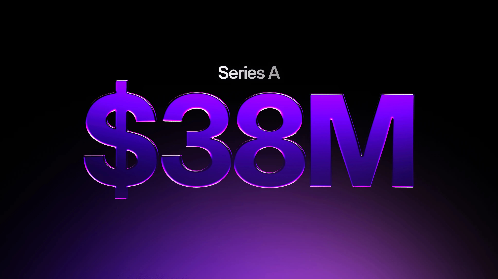

# SurrealDB raises $23M Series A extension to power the AI-native database era

Today, we’re excited to announce that SurrealDB has secured an additional $23 million in Series A funding, bringing our total investment to date to $44 million.

This extension brings Chalfen Ventures and Begin Capital into the round, joining existing investors FirstMark and Georgian, and takes the total Series A to $38 million. We’re also proud to welcome Mike Chalfen, Founder of Chalfen Ventures, to our board.

This is a major milestone for SurrealDB - and for the future of AI-native infrastructure.

## Building the database for the AI era

Every computing shift demands a new data foundation.

Cloud computing reshaped infrastructure. Mobile redefined user experience. Now, AI is transforming how software is built and how systems think.

But while models have evolved rapidly, the data layer has not.

AI agents require something fundamentally different from traditional applications:

- persistent memory
- a unified view of structured and unstructured data
- context that remains synchronised as systems grow
- real-time performance at scale.

Most enterprise AI projects stall because they attempt to build AI systems on top of fragmented data stacks. SurrealDB was built to solve this problem at its core.

We are creating the first truly AI-native, multi-model database - a single platform where relational, document, graph, vector, search, geospatial, time-series, and key-value data coexist natively with powerful retrieval built for the AI era. A system where context and memory are not bolted on, but built in.

## Exceptional momentum

This investment comes amid extraordinary growth. SurrealDB has become one of the fastest-growing databases in history:

- **2.3 million downloads**
- **31,000 GitHub stars**
- **1,000+ forks**
- rapid adoption in production environments globally

Developers are choosing SurrealDB because modern systems demand simplicity at scale. Every additional integration adds latency, complexity, and cost. SurrealDB collapses data infrastructure into one coherent layer - and that simplicity compounds over time.

As our co-founder and CEO Tobie Morgan Hitchcock puts it:

> _“This fresh investment demonstrates a growing level of excitement for our category-defining, developer-friendly database. Chalfen Ventures and Begin Capital have joined this round due to our strong momentum in real-world usage, and clear path to large-scale production.”_

## Backing from category builders

We’re thrilled to partner with investors who deeply understand platform shifts.

Mike Chalfen, Founder of Chalfen Ventures, shared the following:

> _“Every compute era requires a new database paradigm. We are in the AI era, but most ambitious enterprise AI projects stall. They need a data platform that makes unprecedentedly large-scale contextual information available to agentic systems, in a way that is synchronised across data sources, fast, and secure. SurrealDB is that platform.”_

His experience backing disruptive software companies makes him an invaluable addition to our board as we enter our next phase of growth.

## What this funding enables

This capital accelerates our mission to make SurrealDB _the_ default data layer for AI-native applications.

We continue to invest heavily in:

- enterprise-grade reliability and performance
- new security and governance features
- cloud scalability and new regions
- production support and deployment tooling
- expanding our global team

As AI systems move from experimentation to production, infrastructure must mature accordingly. Our focus is clear: make SurrealDB the most stable, performant, and enterprise-ready AI-native database available.

## A defining moment

This announcement coincides with the [General Availability release](/blog/introducing-surrealdb-3-0-the-future-of-ai-agent-memory) of SurrealDB 3.0 - our most mature and production-ready version to date. While 3.0 represents a major technical milestone, today’s funding announcement signals something broader: the AI era needs a new database paradigm - and we’re building it.

To our community, customers, contributors, and partners: thank you. Your trust and feedback have shaped SurrealDB into what it is today.

We’re just getting started.

-

**The SurrealDB Team**
