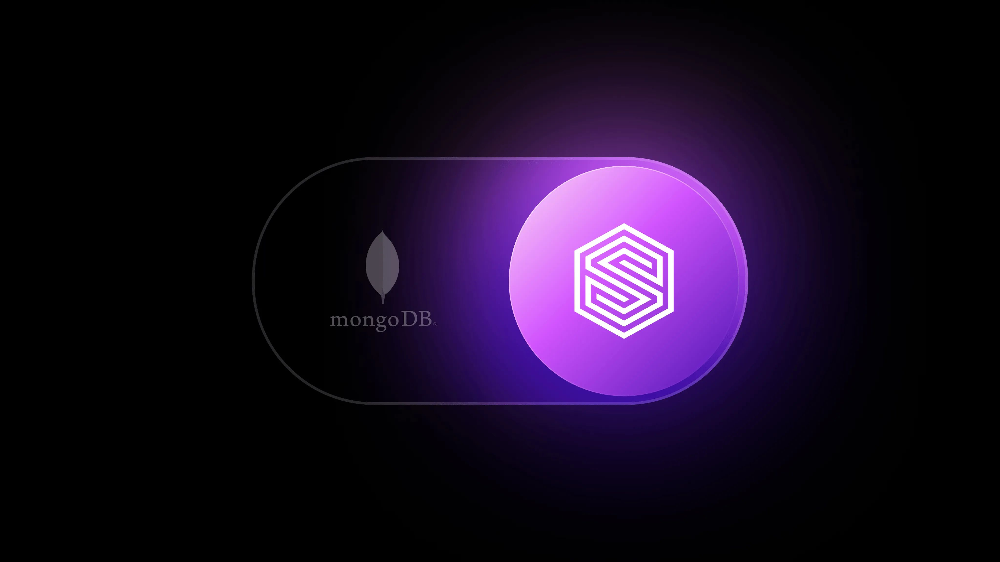

# SurrealDB vs. MongoDB

MongoDB started as a document store and later added search, vector, and limited graph features through separate systems. SurrealDB was built from the ground up to run document, relational, graph, vector, full-text, and temporal queries natively in one engine.

- **True multi-model engine:** Document, relational, graph, vector, full-text,

temporal, and geospatial access patterns natively in one system.

- **Temporal graph querying:** Time is treated as a first-class constraint

within graph traversal.

- **Unified indexing:** No compound multikey limitations across arrays or nested

fields.

- **ACID without locking:** Transactions across all data models without global

or table-level locking.

SurrealDB is built for systems that need correctness, composability, and consistent semantics across complex queries.

## SurrealDB vs. MongoDB at a glance

As apps demand richer models, temporal logic, and AI retrieval, document-centric systems with external subsystems hit composability limits.

MongoDB splits document, search, and vector execution across separate paths. SurrealDB runs everything in one distributed engine with consistent semantics.

### Business-critical capabilities

**MongoDB:** Document-first database with no relational query planner or cost-based join optimisation. Limited graph traversal and no first-class temporal semantics.

**_SurrealDB:_** Native document, relational, graph, vector, full-text, and temporal querying in one engine.

### Platform openness and composability

**MongoDB:** Search and vector queries run through Atlas Search (Lucene-based) and must appear first in pipelines, limiting composability.

**_SurrealDB:_** All query primitives are first-class and fully composable within a single execution plan.

### Cost and performance

**MongoDB:** Contention increases transaction overhead, and separate core vs. search/vector execution adds complexity.

**_SurrealDB:_** Unified execution reduces coordination overhead, hardware usage, and system sprawl.

## SurrealDB delivers enterprise-grade correctness and consistency

### ACID across all data models

MongoDB supports ACID transactions, but they're limited, costly under contention, and don't span search, vectors, or graph traversal.

**_SurrealDB:_** provides ACID transactions natively across all models in one engine.

### No locking, predictable concurrency

MongoDB uses coordination-heavy concurrency control that adds overhead under concurrent workloads.

**_SurrealDB:_** avoids global and table-level locks for concurrency, enabling predictable reads and writes.

### Temporal correctness by design

MongoDB lacks temporal graph traversal - time filters can't participate directly in traversal semantics.

**_SurrealDB:_** supports native temporal graph querying with time constraints built into traversal logic.

### Enterprise takeaway

MongoDB is optimised for document-centric workloads.

**_SurrealDB:_** is optimised for correctness, composability, and consistency across complex, evolving datasets.

## SurrealDB is open and unified by design

### One engine, not fragmented subsystems

MongoDB runs full-text and vector search through Atlas Search (Lucene) outside core CRUD, without full transactional consistency.

**_SurrealDB:_** executes documents, graphs, vectors, and full-text search in one distributed engine.

### Indexing without structural limits

MongoDB supports full-text indexing, but Atlas Search runs as a separate Lucene engine with delayed consistency and added overhead. Compound indexes are also limited with nested arrays, limiting efficient indexing of deeply nested or multi-array document models.

**_SurrealDB:_** provides native full-text search and indexing across arrays, nested fields, vectors, and relationships without these constraints.

### Flexible schema without trade-offs

MongoDB is a schema-optional database; its schema validation is enforced only at write time, does not encode relationships or retroactively protect existing data, and reduces performance.

**_SurrealDB:_** allows you to start schemaless and progressively enforce schemas with DB-level guarantees, with native enforcement, preserving relationships and full transactional consistency.

### Platform takeaway

**_SurrealDB:_** replaces fragmented document-oriented architectures with a single, consistent platform capable of executing application and AI workloads end to end, including native support for custom in-database logic such as triggers, events, and procedural logic.

## Feature-by-feature comparison

### Business model

| MongoDB | SurrealDB |
|---|---|
| Source-available, with key capabilities gated behind commercial offerings and Atlas-managed services. | Open source and available for use. Commercial offerings build on the same core engine without fragmenting capabilities. |

### Availability

| MongoDB | SurrealDB |
|---|---|
| Runs locally, on-premises, and in major clouds, but advanced search, vectors, and scaling mainly depend on Atlas, with limited self-managed support. | Runs locally, on-premises, and on all major public clouds. Deployable as embedded, single-node, or distributed. |

### Architecture

| MongoDB | SurrealDB |
|---|---|
| Document-first with limited graph traversal and no planner-driven relational semantics. Secondary views, FTS and vectors require duplicated data and separate async pipelines. | Unified, distributed multi-model engine. Query execution, indexing, storage, and transactions operate inside a single system. Designed for mixed read and write workloads. |

### Scale

| MongoDB | SurrealDB |
|---|---|
| Scales through sharding, which introduces operational complexity. Transaction coordination overhead increases as scale and concurrency grow. | Horizontally scalable across reads and writes. No sharding required for query semantics. Designed for large, continuously evolving datasets. |

### Resilience

| MongoDB | SurrealDB |
|---|---|
| Separate subsystems introduce additional operational dependencies. Search and vector results are not transactionally consistent with core data. | Distributed execution without dependency on separate subsystems. Failures do not fragment query correctness or transactional consistency. |

### Transactional consistency

| MongoDB | SurrealDB |
|---|---|
| ACID transactions are limited, costly under contention, and don't extend to search, vectors, or graph traversal. | ACID transactions across documents, relational joins, graph traversal, vector search, and full-text search. No global or table-level locks. |

### Models

| MongoDB | SurrealDB |
|---|---|
| Document-first. Graph traversal support is limited and non-composable. Relational semantics are limited and not planner-driven. | Native support for document, relational, graph, key-value, time-series, vector, full-text search, and geospatial access patterns in one engine. |

### Temporal capabilities

| MongoDB | SurrealDB |
|---|---|
| No temporal graph querying. Time filters cannot participate directly in traversal semantics. | Temporal querying is first-class. Time constraints participate directly in graph traversal and filtering. |

### Indexing

| MongoDB | SurrealDB |
|---|---|
| Compound indexes may include only one array field. Deeply nested or multi-array document models cannot be efficiently indexed. | Indexing across arrays, nested fields, vectors, and relationships without compound multikey restrictions. |

### Query execution

| MongoDB | SurrealDB |
|---|---|
| Queries split into multiple stages, with $search required first. There's no unified planner across document, $search, vector, and graph operations, increasing latency from execution boundaries and data handoffs. | Single declarative query language with a unified execution plan. All retrieval primitives are co-planned and optimised together. |

### Pricing

| MongoDB | SurrealDB |
|---|---|
| Costs increase with sharding, coordination overhead, Atlas dependency, and duplicated subsystems. Operational complexity grows as scale increases. | Straightforward pricing with architectural efficiency reducing infrastructure and operational cost as scale grows. Lower TCO than MongoDB Atlas at comparable scale. |
