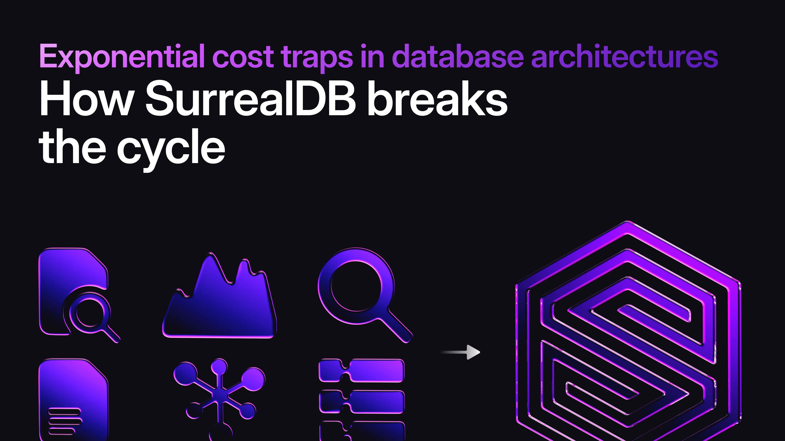

# Exponential cost traps in database architectures: how SurrealDB breaks the cycle

In the fast-paced world of application development, database choices can make or break an organisation's scalability and budget. Traditional polyglot persistence (relying on multiple specialised databases) often leads to exponential cost growth as systems expand. What starts as a simple setup spirals into a complex, inefficient infrastructure riddled with data duplication, ETL pipelines, and operational silos. SurrealDB, with its multi-model architecture unifying document, graph, vector, full-text, time-series, geospatial, and relational capabilities, offers a consolidated alternative that eliminates these pitfalls. By storing data once and querying it across models, SurrealDB can reduce overall costs by multiple factors, particularly in storage-heavy environments where cloud block storage is in use.

To understand the value of consolidation, consider the common trajectory of database sprawl. Below, we explore a real-world-inspired story of how costs escalate exponentially, helping readers identify if their setup is heading toward inefficiency. This narrative highlights the compounding effects of architectural decisions, setting the stage for how SurrealDB provides a streamlined, cost-effective path forward.

## A story of exponentially increasing costs: from simplicity to sprawl

Many teams begin with modest needs but face rapid growth that exposes the limitations of single-model databases. Let's trace a typical app's evolution, illustrating how costs outpace traffic due to added complexity, redundancy, and management overhead.

### 1. Launching the app: a simple start

> Sentiment: "We start simple: a single database, fast and cheap to run."

Your app is new, with straightforward transactional requirements. You deploy a single MySQL instance on AWS, adding one replica for high availability. It's low cost and easy to manage. Database expenses are minimal, infrastructure is straightforward, and personnel needs are light.

| ​ | ​ |
|---|---|
| Database Costs: | Low |
| Traffic Handled: | Basic |
| Infra Cost: | Minimal |
| Personnel Required: | 1–2 engineers |
| Temp cost: | None yet |
| Complexity cost: | None yet |

Architecture:

- MySQL (Primary)
- MySQL (Failover Replica)

### 2. First wave of growth: scaling reads

> Sentiment: "Our first scaling challenge is reads. Replicas help, but cost growth slightly outpaces traffic."

User traffic surges, dominated by reads. You add 8 read replicas and scale the writer to a larger instance (where per-vCPU costs rise disproportionately). Costs begin increasing slightly faster than traffic due to over-provisioning and load balancing.

| ​ | ​ |
|---|---|
| Database costs: | Moderate |
| Traffic handled: | Increased |
| Infra cost: | Rising |
| Personnel required: | Still low, but monitoring grows |
| Temp cost: | None yet |
| Complexity cost: | None yet |

Architecture:

- MySQL Writer
- Load Balancer
- 8x MySQL Read Replicas

### 3. Write traffic explodes: sharding begins

> Sentiment: "As writes explode, we shard the system, but migrations are expensive and disruptive."

Writes overwhelm the single writer. You shard into four MySQL instances, over-provisioning each for spikes. A data access layer handles routing by key, and the migration temporarily doubles costs. Complexity introduces temporary and ongoing expenses.

| ​ | ​ |
|---|---|
| Database costs: | High |
| Traffic handled: | Substantial |
| Infra cost: | Accelerating |
| Personnel required: | Increasing (sharding expertise needed) |
| Temp cost: | Spike from migration |
| Complexity cost: | Emerging |

Architecture:

- 4x MySQL Shards (each with Writer + Multiple Read Replicas)
- Load Balancers
- CDC (Change Data Capture) for transitioning from old architecture

### 4. Analytics demands: the first pipeline

> Sentiment: "Analytics needs have driven us to add a pipeline and duplicate data with added complexity as a result.”

Product teams demand dashboards and real-time insights. You build an Extract, Transform, Load (ETL) pipeline to an analytical database such as ClickHouse, duplicating data via Change Data Capture (CDC). Applications now query multiple systems, and engineers must manage query routing while maintaining consistency across stores.

| ​ | ​ |
|---|---|
| Database costs: | Very high |
| Traffic handled: | Advanced |
| Infra cost: | Ballooning |
| Personnel required: | Still increasing (pipeline maintenance) |
| Temp cost: | Pipeline setup |
| Complexity cost: | Significant |

Architecture:

- Existing MySQL Shards
- CDC + ETL
- ClickHouse
- Application querying multiple databases

### 5. AI ambitions: vector database enters

> Sentiment: "AI ambitions require another new system, and more pipelines. The architecture is growing fast."

AI agents need RAG (Retrieval-Augmented Generation) support, querying across systems. You spin up a vector DB like Weaviate or Pinecone, with new pipelines for replication. Data is consolidated in S3 for training, adding sharding as usage grows.

| ​ | ​ |
|---|---|
| Database costs: | Extreme |
| Traffic handled: | AI-enhanced |
| Infra cost: | Exponential |
| Personnel required: | Specialised teams |
| Temp cost: | AI integration |
| Complexity cost: | Overwhelming |

Architecture:

- Existing Setup
- Additional ETL + Kafka
- Weaviate
- S3 for data lakes

### 6. Keeping it all running: growing ops

> Sentiment: "Now we need a large ops team just to stay afloat. Costs are scaling exponentially, not linearly."

Ongoing tasks include re-sharding MySQL, scaling MongoDB/Weaviate/ClickHouse, upgrades across systems, node recoveries, and pipeline fixes. Teams manage credentials, security, and optimisations in isolation. Ops cycles dominate, slowing innovation and ballooning personnel costs.

| ​ | ​ |
|---|---|
| Database costs: | Off the charts |
| Traffic handled: | Peak |
| Infra cost: | Exponential |
| Personnel required: | Large teams |
| Temp cost: | Constant disruptions |
| Complexity cost: | Debilitating |

Architecture:

- All systems with balancing, re-sharding, upgrades, and recoveries

### Why the cost curve went exponential

Exponential costs are rarely caused by user growth alone. Instead, they often stem from an architecture that acts as a tax on every new login. Between the headaches of manual sharding, the hidden drain of data duplication, and the hours lost to rigid schema changes, many teams end up subsidizing a fragmented mess. If your infrastructure spend is climbing faster than your traffic, you are leaking resources rather than scaling. Moving toward a unified database simplifies the stack and returns your cost curve to a manageable, linear state.

## The hidden costs of database sprawl: ETL, layers, and operational overhead

Building on this story, polyglot architectures create fragile ETL pipelines for data movement between systems like MySQL and ClickHouse. These demand resources for processing, debugging, and schema handling. Operational burdens include multiple query languages, fragmented backups, and custom synchronisation.

SurrealDB eliminates this by natively supporting all models in one platform with SurrealQL. No ETL needed. Data stays unified, reducing dependencies and accelerating development, as seen in replacements of PostgreSQL + Neo4j + RabbitMQ stacks.

## EBS storage: the #1 cost driver in self-hosted databases

As the story shows, EBS volumes (and Azure and GCP’s equivalent) multiply with replicas and duplications, becoming the dominant expense. With EBS volumes not being eligible for discounts, costs compound in sprawls: 3x replication per cluster, plus copies across databases, over-provisioning, and snapshots typically result in massive redundant data duplication

For example, in a 50-node cluster with 4TB EBS volumes on AWS, storage will be $28,098 monthly, over twice the $12,577 for EC2 (factoring in discounts). Polyglot setups exacerbate this exponential growth.

## SurrealDB's compression edge: reducing data size by 1/3 for dramatic savings

SurrealDB's storage engine (TiKV) delivers 70-80% better compression than PostgreSQL's, typically shrinking datasets to one-third. For the 4TB example, this cuts EBS to ~1.33TB, dropping costs to under $10,000, a 65% savings. In addition to the raw savings, smaller data reduces I/O, snapshots, and data transfer cost, countering the sprawl's redundancy.

## Eliminating data duplication: organization-wide cost reductions

Storing data once avoids multi-system duplication. A single cluster with 3× replication replaces the primary and secondary copies spread across multiple database systems. Eliminating ETL removes staging costs, while unified data views simplify compliance and backups, reducing S3 storage and egress fees.

## Linear scalability: ensuring cost-effective growth

Unlike most other database systems, SurrealDB scales linearly via TiKV, with less than a 5% performance deviation coefficient per node. You get roughly the same increase in capability and performance when adding a node to a 9-node cluster as when adding a node to a 100-node cluster. This keeps costs predictable and prevents exponential cost growth which is typical in sprawling platforms.

## Conclusion: escape the exponential trap with SurrealDB

The story of sprawl reveals how polyglot decisions lead to exponential costs through duplication, complexity, and ops overhead. SurrealDB's "one database to rule them all" reverses this, slashing EBS-driven expenses via consolidation and compression. For teams in inefficient systems, migrating promises simplicity and transformative savings.
