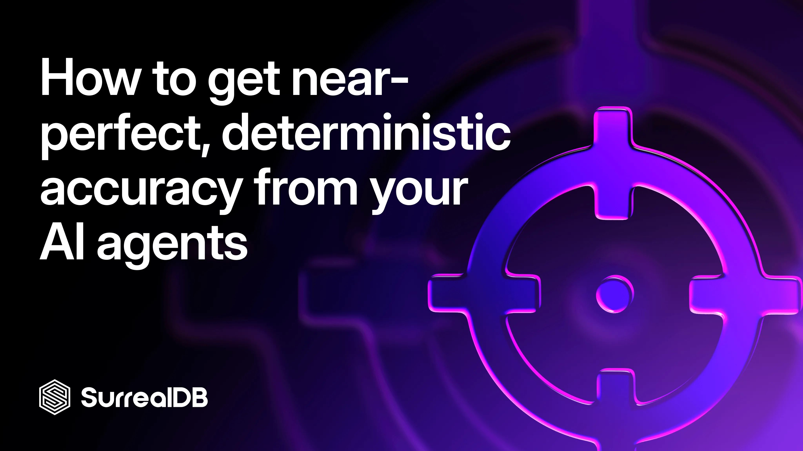
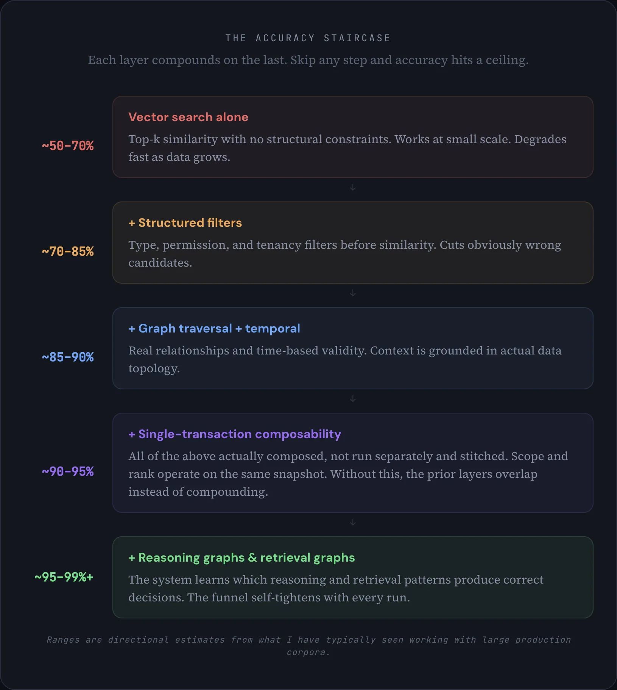
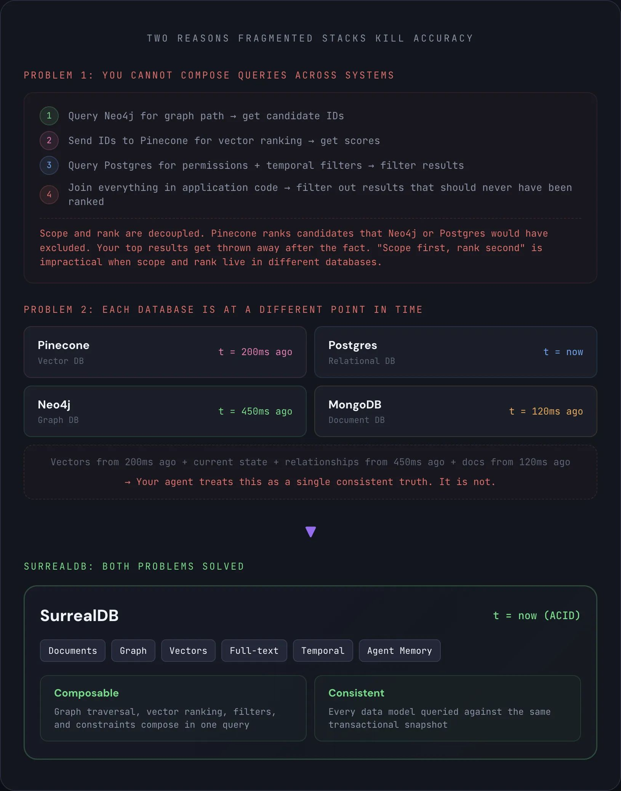
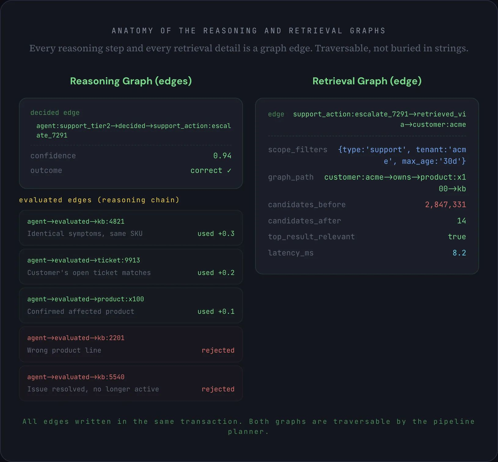
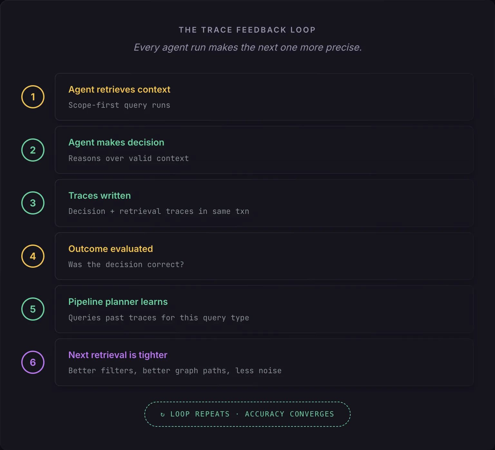
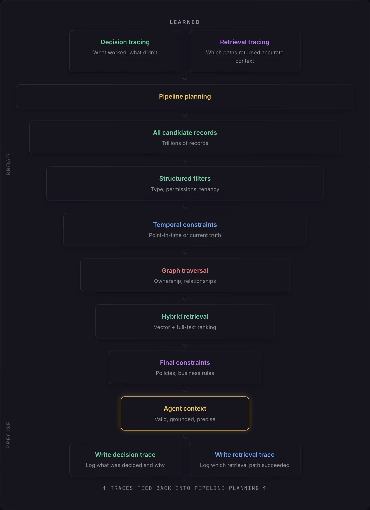

# How to get near-perfect, deterministic accuracy from your AI agents



I have spent a lot of time working on large-scale agent architectures with some of the largest organizations in the world, and the single most common mistake I see teams make is assuming their accuracy problems are model problems. They almost never are. Your agent is typically not struggling because the LLM is weak. It is struggling because your retrieval layer is feeding it bad context. Fix your retrieval, and accuracy jumps. Make your retrieval learn from its own results, and accuracy becomes deterministic. Here is what that looks like in practice.

> **TL;DR** - Agent accuracy problems are almost always retrieval problems, not model problems. At scale, vector search alone is not enough. You need structured filters, graph traversal, temporal constraints, and vector similarity composed in a single atomic query to get to ~90–95% accuracy. To close the remaining gap to ~99%+, you need reasoning graphs and retrieval graphs: structured graph edges that capture the agent's logic and retrieval patterns, feeding back into the pipeline so the system learns which approaches produce correct outcomes. Both require a multi-model database with ACID transactions across every data model, which is exactly what we designed SurrealDB to be.

## The problem: why agent accuracy hits a ceiling

Every agent follows the same loop: retrieve context, reason over it, act. The quality of the action is bounded by the quality of the context. I have seen perfectly capable models produce terrible outputs because the context they were given was noisy, and I have seen mid-tier models produce excellent outputs because the context was precise. The model matters less than most teams think.

At small scale, none of this is a problem. If you have a few thousand documents, vector search returns good results, everything fits in a single database, and accuracy looks great. The problems emerge when data grows into the millions or billions of records. Suddenly more candidates look semantically similar, top-k selection becomes unstable, unrelated chunks bleed into the context window, and your agent starts hallucinating. The RAG survey literature (Gao et al., 2023) documents these failure modes extensively. Vector similarity is a useful ranking signal. It is not a control plane.

What makes it worse is the typical production stack. Most teams are running Postgres for state, Neo4j for relationships, Pinecone for vectors, MongoDB for documents, sometimes Elasticsearch and a memory layer on top. Five or six independent systems, each with its own consistency model. When the graph database is 200ms behind the relational store, or the vector index has not ingested a document that was just written, your agent is reasoning over a version of reality that does not exist. It does not know the data is stale. It just makes a worse decision. And in multi-step workflows, each bad retrieval compounds into the next.

So the question worth asking is not "which model should we use?" It is: how do you guarantee that the context reaching the model is valid, complete, current, and precise, even at scale? In my experience, the answer has two layers. The first gets you to roughly 90–95%. The second closes the gap to 99%+.

## The accuracy staircase

Each layer compounds on the last. Skip any step and accuracy hits a ceiling.



## Getting to ~90–95%: scope-first retrieval

The idea is straightforward: instead of running similarity search against everything and cleaning up the results, you constrain the candidate set before ranking. Define what counts as a valid result first. Rank inside that scope second.

Think about what a single agent retrieval step actually needs, and what goes wrong without each layer.

**Structured filters** narrow by type, permissions, and tenancy. Without them, I have watched a support agent retrieve internal engineering postmortems and serve them verbatim to a customer, because the postmortem was semantically similar to the customer's question. The vector search was technically correct. The result was a data leak.

**Temporal constraints** ensure the data is current. Without them, an agent recommending products will happily surface items that were discontinued months ago, because the old product description is still the closest embedding match. The customer clicks through to a dead link. Trust erodes.

**Graph traversal** follows real relationships: this customer owns this product, which has this known issue, which maps to this knowledge base article. Without it, your agent retrieves articles about similar-sounding problems on entirely different products. The answer reads plausibly but is wrong in the specifics, which is the worst kind of hallucination because it is hard to catch.

Only after all of that scoping should vector similarity and full-text search run, ranking the remaining candidates by relevance. By this point, the candidate pool is already valid. Similarity is just picking the best among the valid.

The problem is you cannot compose these operations across a fragmented stack. In a multi-database architecture, each is an independent query against an independent system. The application layer stitches the results together and hopes the data was consistent across all of them. It never fully is. You need a database that handles all of this natively, in a single query, against a single consistent snapshot. That is why we built SurrealDB the way we did: structured filters, temporal constraints, graph traversal, vector similarity, full-text search, and business rule enforcement all compose in one SurrealQL transaction.

Here is what that looks like. One query, every scoping layer, against one consistent snapshot:

```surrealql
SELECT
	id,
	title,
	vector::distance::knn() AS vec_dist,
	search::score(1) AS ft_score,
	(1 - vector::distance::knn()) * 0.65 + search::score(1) * 0.35 AS blend_score,
	search::highlight('<em>', '</em>', 1) AS content_snippet
FROM knowledge_base
WHERE type = 'support'
	AND tenant = $tenant
	AND $agent_principal INSIDE allowed_principals
	AND updated_at > time::now() - 30d
	AND id IN $customer->owns->product->has_issue->knowledge_base
	AND content_embedding <|100,40|> $query_embedding
	AND content @1@ $query_text
ORDER BY blend_score DESC
LIMIT 10;
```

That single statement does what would take four or five round-trips across a fragmented stack: permission checks, temporal filtering, graph traversal through the customer's actual product relationships, and hybrid vector + full-text ranking. One query. One transaction. One consistent snapshot. The line that does the most work is the graph traversal: `$customer->owns->product->has_issue->knowledge_base`. That is not a join. It is a native graph traversal across edges, and it means the agent only sees knowledge base articles connected to the specific products this customer actually owns. Everything else is excluded before similarity even runs.

How the agent selects the right traversal path in the first place is itself a retrieval problem, one you can solve with the same primitives in the same database.

### Two reasons fragmented stacks kill accuracy



Microsoft's GraphRAG work (Edge et al., 2024) demonstrated the same principle at the retrieval level: combining graph structure with similarity search significantly outperforms vector-only approaches. The CoALA framework (Sumers et al., 2024) describes it architecturally: agent memory must be consistent and accessible within a single reasoning cycle. A multi-model database that handles all data models under one transaction boundary is the simplest way I know to actually do both.

This gets you to roughly 90–95% accuracy on large corpora. The consistency gaps are gone. The retrieval noise is way down. For many use cases, this is enough.

But for agents that need to operate autonomously, make consequential decisions, or run in production without human oversight, the last 5–10% is where the difference between "mostly works" and "deterministic" lives. Closing that gap requires a different kind of mechanism.

## Getting to ~99%+: reasoning graphs and retrieval graphs

Scope-first retrieval fixes the shape of the funnel. Reasoning and retrieval graphs fix the funnel itself. They are the mechanism that turns a static retrieval pipeline into one that learns from its own results, and in my experience they are the single biggest differentiator between agents that are "pretty good" and agents that are genuinely deterministic.

Every time an agent runs a retrieval pipeline and makes a decision, two graph structures get written in the same transaction as the action: a **reasoning graph** (the agent's decision and the evaluated edges for each piece of evidence it considered) and a **retrieval graph** (the operational details of how context was retrieved).

I want to be specific about what these are. They are not log entries. They are not analytics events. They are graph edges stored in the same database as the data they describe, connecting the agent, the action, the customer, and the evidence records the agent evaluated. Written atomically with the agent's action and fully traversable with the same query language you use for everything else. ACID-guaranteed edges in the same graph your agent operates on. This is exactly why SurrealDB is a graph-native multi-model database: the reasoning and retrieval graphs have to be part of the same graph as the documents, the relationships, the vector embeddings, and the agent state, all under one transaction boundary. If they are not, the causal link between "what was retrieved," "how the agent reasoned about it," and "what it decided" breaks.

The **reasoning graph** is a set of edges radiating from the agent. A **decided** edge connects the agent to the action, carrying confidence and the eventual outcome. But the reasoning itself is not a field on that edge. Each step of the agent's logic is its own **evaluated** edge connecting the agent directly to the evidence it considered: agent->evaluated->kb:4821 with a verdict (used or rejected), the reason, and how much it moved the agent's confidence. The reasoning is not a string or an array. It is a set of traversable edges connecting the agent to every piece of evidence it touched. The **retrieval graph** is a retrieved_via edge from the action back to the customer, carrying which scope filters were applied, the graph path traversed, the candidate count before and after scoping, whether the top result was relevant, and the retrieval latency.

### Anatomy of the Reasoning and Retrieval Graphs

Every reasoning step and every retrieval detail is a graph edge. Traversable, not buried in strings.



The reason the reasoning has to be a graph, not a field, is that the pipeline planner needs to traverse individual evaluation steps across thousands of runs. If kb:2201 gets rejected in 94% of firmware queries, the planner can only discover that by traversing evaluated edges, not by parsing strings in a log. In SurrealQL, this is what the actual transaction looks like. The action is a node. The reasoning and retrieval are edges, created with `RELATE`, connecting the agent to each piece of evidence and the action back to the customer:

```surrealql
BEGIN;

CREATE support_action:escalate_7291 CONTENT {
  action: 'escalate_to_engineering',
  customer: customer:acme,
  ticket: ticket:9913,
  created_at: time::now()
};

RELATE agent:support_tier2->decided->support_action:escalate_7291 CONTENT {
  confidence: 0.94,
  created_at: time::now()
};

RELATE agent:support_tier2->evaluated->kb:4821 CONTENT {
  action: support_action:escalate_7291,
  step: 1, verdict: 'used',
  reason: 'Identical symptoms on same SKU',
  confidence_delta: 0.3
};

RELATE agent:support_tier2->evaluated->kb:2201 CONTENT {
  action: support_action:escalate_7291,
  step: 2, verdict: 'rejected',
  reason: 'Wrong product line',
  confidence_delta: 0
};

RELATE agent:support_tier2->evaluated->kb:5540 CONTENT {
  action: support_action:escalate_7291,
  step: 3, verdict: 'rejected',
  reason: 'Issue resolved, no longer active',
  confidence_delta: 0
};

RELATE support_action:escalate_7291->retrieved_via->customer:acme CONTENT {
  scope_filters: { type: 'support', tenant: 'acme', max_age: '30d' },
  graph_path: 'customer:acme->owns->product:x100->has_issue->kb',
  candidates_before: 2847331,
  candidates_after: 14,
  top_result_relevant: true,
  latency_ms: 8.2,
  created_at: time::now()
};

COMMIT;
```

The decision logic is not buried in strings. Every reasoning step is an edge in the graph. The decided edge connects the agent to the action. Each evaluated edge connects the agent to a specific piece of evidence it considered, carrying the verdict, the reason, and the confidence delta. The retrieved_via edge connects the action back to the customer with the retrieval metadata. The evaluated edges are not magic. Your agent framework already evaluates candidates and produces a decision. The RELATE statements just persist what the agent already computed. The only design requirement is that your agent emits structured evaluations per candidate rather than a single monolithic response.

That graph structure gives you something most teams have never had: you can replay any agent run, traverse the exact reasoning it followed, and identify exactly where and why it went wrong. But the real value is what happens when the reasoning and retrieval graphs feed back into the system. And they feed back in two different ways, serving two different purposes.

The **pipeline planner** traverses the reasoning and retrieval graphs to decide **what context the agent sees**. This is structural optimization. The planner can start from kb:2201 and traverse all evaluated edges pointing at it across every run. If it discovers that kb:2201 gets rejected 94% of the time for firmware queries, it deprioritizes or excludes it from the candidate set for that query type. It can walk agent:support_tier2->evaluated->\* to see every piece of evidence this agent has ever considered, grouped by action, filtered by verdict. It learns which retrieval patterns, graph paths, and scope filters correlate with correct outcomes and tightens the funnel accordingly.

The **LLM itself** receives relevant past reasoning edges as context to guide **how it thinks about the candidates it receives**. This is behavioral optimization. When the agent retrieves context for a firmware issue on product:x100, the system can also pull in past evaluated edges for queries in the same product category: "Last time an agent evaluated a firmware issue on this product line, it used kb:4821 (identical symptoms, same SKU) and rejected kb:2201 (wrong product line). That decision was correct." The agent is not just getting better candidates. It is getting guidance on how to reason about those candidates, grounded in what actually worked before.

Those two mechanisms work on different layers. The pipeline planner tightens the funnel so fewer, better candidates reach the agent. The past reasoning edges sharpen how the agent evaluates whatever reaches it. Together, they compress errors from both directions. This is different from a context graph, which stores world facts (this customer owns this product). The reasoning and retrieval graphs extend the context graph with behavioral facts: how agents reasoned, what worked, what did not. The pipeline planner and the LLM both walk all three layers.

### The graph feedback loop

> **This is the critical shift.** The reasoning and retrieval graphs turn retrieval from a static pipeline into a feedback loop. The funnel does not just narrow the data. It narrows itself. Every agent run produces decided, evaluated, and retrieval edges. Those edges inform the next pipeline plan. The scoping gets tighter. The graph paths get more precise. And because both graphs are written in the same transaction as the action, you have a causally consistent, traversable record of every decision the agent ever made, every piece of evidence it considered, and the retrieval path that produced it.



Let me walk through what this looks like concretely. On the first run for a given query type, the retrieval funnel starts with 2.8 million candidates and narrows to 14. The agent evaluates the top candidates, creating an evaluated edge for each one with a verdict and reason. It makes a decision. The decision turns out to be correct. The decided edge, the evaluated edges, and the retrieval edges all persist in the graph.

On the next similar query, both mechanisms kick in. The pipeline planner traverses past retrieval and reasoning edges. It knows the successful graph path. It knows which filter combination produced a good reduction ratio. It knows kb:2201 was rejected last time for being the wrong product line, so it excludes it from the candidate set entirely. The funnel goes from 2.8 million to 9 instead of 14. Meanwhile, the agent receives past evaluated edges as context alongside the candidates: "For similar firmware queries, kb:4821 was used because it described identical symptoms on the same SKU. kb:5540 was rejected because the issue was already resolved." The agent is not just seeing better candidates. It is seeing how a previous agent successfully reasoned about similar candidates.

After a hundred similar queries, the graph contains a rich web of evaluated edges for that query type. The planner can see, across all runs, which evidence records consistently get used versus rejected, which rejection reasons recur, and which evaluation patterns correlate with correct outcomes. The LLM, on every new run, gets the distilled reasoning patterns from the most relevant past decisions. The funnel is no longer exploring. The reasoning is no longer starting from scratch. Both layers are applying learned patterns. And the patterns are not summaries or statistics computed offline. They are live graph topology that gets traversed on every run.

This is what "deterministic" means in practice. Not that the LLM produces identical tokens every time. It means that given the same type of query, the system follows the same learned retrieval pattern, produces the same quality of context, and arrives at the same caliber of decision. The variability gets squeezed out of the data layer, which is where it was causing problems in the first place. The model can still be creative where creativity helps. But the retrieval is locked down.

### The full retrieval funnel

Putting it all together, here is the complete pipeline from raw candidates to agent context, with graphs feeding back into pipeline planning:



After the agent acts, the decided, evaluated, and retrieval edges are written back, feeding into the next cycle of pipeline planning. The funnel self-tightens with every run.

### Why the graphs break in a fragmented stack

There is one more thing worth making concrete, because it is easy to nod along with "you need one database" without feeling why.

Say your reasoning and retrieval edges write to Postgres, your vector embeddings live in Pinecone, and your graph relationships are in Neo4j. The pipeline planner needs to query: "for this query type, which graph paths and filter combinations correlated with correct decisions in the last 200 runs?" That query needs to join reasoning edges and retrieval edges in Postgres with graph topology in Neo4j and vector metadata in Pinecone. What transaction boundary covers all three systems? There is not one. So the planner is reading behavioral data that may or may not reflect what actually happened, referencing graph paths that may have changed since the edges were written, and correlating against outcomes that landed in a different system at a different time. The feedback loop is broken before it starts. You are building a learning system on top of eventually consistent quicksand.

That is why this architecture needs a multi-model graph database. Not because fewer databases is aesthetically nicer, but because the reasoning and retrieval edges need to live in the same graph as the entities they reference. The feedback loop is a graph traversal: walk from an agent through its decided edges, through its evaluated edges to each piece of evidence, follow the retrieval edges, compare outcomes. That only works when the reasoning and retrieval edges, the documents, the graph relationships, the vector embeddings, and the agent state all live in the same engine with the same transactional guarantees. SurrealDB handles all of this natively. This is the exact problem we designed it to solve.

## Supporting research

**Cognitive Architectures for Language Agents (CoALA)** - Sumers, Yao, Narasimhan, Griffiths · 2024. Formalizes agent memory into episodic, semantic, and procedural types coordinated through a single decision loop. Reasoning and retrieval graphs map directly to CoALA's episodic memory: structured records of past actions that inform future decisions. The framework makes clear that scattering memory types across separate systems works against reliable agent behavior.

**From Local to Global: A Graph RAG Approach** - Edge, Trinh, Larson, Truitt (Microsoft Research) · 2024. Demonstrated that combining knowledge graphs with retrieval-augmented generation significantly outperforms vector-only retrieval for complex queries requiring multi-hop reasoning and structured context.

**Retrieval-Augmented Generation: A Survey** - Gao, Xiong, Gao et al. · 2023. Identifies consistent failure modes in RAG at scale: top-k instability, chunk blending, precision degradation. Recommends constraining the candidate set before similarity search using structural filters and graph traversal.

**Graph Retrieval-Augmented Generation: A Survey** - Peng, Zhu, Liu et al. · 2024. First comprehensive overview of GraphRAG, formalizing how graph-based indexing, retrieval, and generation improve accuracy and context-awareness over similarity-only approaches.

## Conclusion

Near-perfect agent accuracy comes from two things working together. A retrieval pipeline that scopes candidates using structural filters, temporal constraints, graph traversal, and business rules before similarity ranking, all within a single ACID transaction. That gets you to roughly 90–95% on large corpora by eliminating the consistency gaps and retrieval noise that cause most agent failures.

And reasoning and retrieval graphs stored as edges in the same transaction as the agent's action, feeding back into the pipeline so the funnel tightens with every run. That is what closes the gap to 99%+.

Neither works if your data models are split across separate systems. The scope query cannot compose and the feedback loop breaks unless everything shares one transaction boundary. That is why we built SurrealDB.

On the first run, 2.8 million candidates narrowed to 14. A few hundred runs later, it narrows to 9, then 6, each time more precise, each time learning from the last. That is what deterministic accuracy looks like in practice: agents that do not just perform well on average, but get better with every decision they make.

## References

- Sumers, T.R., Yao, S., Narasimhan, K., & Griffiths, T.L. (2024). Cognitive Architectures for Language Agents. *Transactions on Machine Learning Research*.
- Edge, D., Trinh, H., Larson, J., & Truitt, S. (2024). From Local to Global: A Graph RAG Approach to Query-Focused Summarization. *arXiv:2404.16130*.
- Gao, Y., Xiong, Y., Gao, X., et al. (2023). Retrieval-Augmented Generation for Large Language Models: A Survey. *arXiv:2312.10997*.
- Peng, B., Zhu, Y., Liu, Y., et al. (2024). Graph Retrieval-Augmented Generation: A Survey. *arXiv:2408.08921*.
