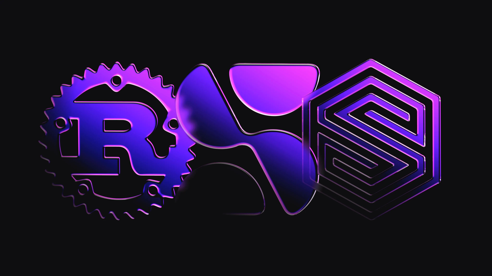
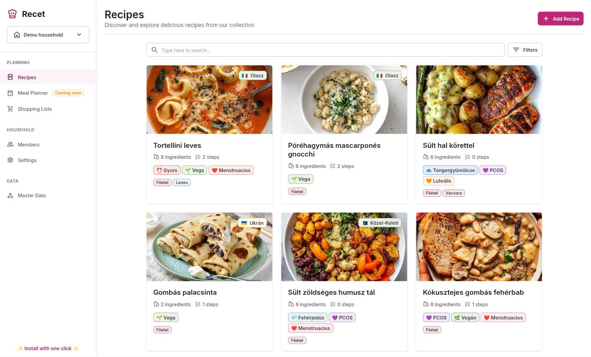

# How to use Surrealism to build your own custom SurrealDB extensions

Two weeks ago we announced SurrealDB 3.0, along with a [new feature called Surrealism](/blog/introducing-surrealism) that lets you write your own functions in Rust that can then be annotated to call directly from the database.

In this blog post, we are going to take a look at what use cases Surrealism solves and easy it is to get started with it. Let's begin by taking a look at how functions are used in SurrealQL and how Surrealism expands their range of use.

## Functions in SurrealDB

SurrealDB has always had user-defined functions that look like this:

```surrealql
DEFINE FUNCTION fn::combine($one: number, $two: number) -> number {
  $one + $two
};

fn::combine(10, 10); -- 20
```

These functions can get to any complexity and length that you like.

```surrealql
DEFINE FUNCTION fn::relate_all($records: array<record>) {
  IF $records.len() < 2 {
      -- Don't do anything, ending the recursion
  }  ELSE {
      LET $first = $records[0];
      LET $remainder = $records[1..];
      FOR $counterpart IN $remainder {
          RELATE $first->to->$counterpart;
      };
      fn::relate_all($remainder);
  }
};
```

The next type of function was added in SurrealDB 2.0: closures. Closures are anonymous functions that can work in read operations that can access both arguments and parameters in their scope.

```surrealql
LET $log_level = "DEBUG";

-- Define a closure
LET $split = (|$record: record| {
    table: $record.tb(),
    key: $record.id(),
    log_level: $log_level
});

$split(user:1);
[person:one, cat:two].map($split);
```

```surrealql
-- Calling $split
{
	key: 1,
	log_level: 'DEBUG',
	table: 'user'
}

-- Passing $split into .map() which takes a closure
[
	{
		key: 'one',
		log_level: 'DEBUG',
		table: 'person'
	},
	{
		key: 'two',
		log_level: 'DEBUG',
		table: 'cat'
	}
]
```

However, both defined functions and closures live inside the SurrealQL query language inside the database.

Surrealism surpasses this limitation by letting you define functions in Rust instead, with all of the available bells and whistles that you get from the Cargo package manager and [crates.io](https://crates.io/) ecosystem.

These functions are then compiled to a WASM binary that then can be linked to from the database itself.

Being able to add functions just like that means that new functionality can be added today, to your existing SurrealDB version, with the only setup being two `DEFINE` statements - one to set up a file bucket, and one more to show the database where inside this bucket the WASM file is located.

## Why we made Surrealism

Making Surrealism was in fact an absolute necessity for a project like SurrealDB in which the community plays such a large part. That's because a lot of requests are for features that are nice to have, but don't quite make sense to merge into the code for the database itself. But with an extension system, you can make the feature yourself!

Using Surrealism is basically like installing apps on your phone. You can't modify the OS of the phone itself, but you can install a new app any time you find one that appeals to you. Similarly, you can build and upload an app for other people to try out.

## Some examples

Let's look at two case studies where Surrealism allows a functionality to be added that was not possible before.

### Case 1: A well-intended PR

Sometimes you will see a well-intended PR that isn't able to be accepted, such as [this one](https://github.com/surrealdb/surrealdb/pull/6063). That PR used Rust's [fake](https://crates.io/crates/fake) crate to create a number of database functions that could be used to seed a database with mock data: fake names, addresses, companies, and so on. The function signatures would have looked like this.

```surrealql
fake::address::building_number
fake::address::city
fake::address::country
fake::address::country_code
fake::address::state
fake::address::street
// ... and so on...
```

While useful (and tempting), it would lead to an increase in the binary size for a functionality that is not core to a database, so it was not able to be merged.

### Case 2: A feature request

Another example comes in the form of feature requests, such as [this one](https://github.com/surrealdb/surrealdb/issues/2794) from a user who would like to see Serbian added to the list of languages that could use the Snowball filter.

First let's look at what the Snowball filter is and what it does. This filter is used inside a `DEFINE ANALYZER` statement to enable full-text search. The filter uses something called stemming which reduces words to something like a root form. This is best seen through an example. In the two queries below we have defined an analyzer that first splits a string by class (whitespace, dots, numbers vs. letters, etc.) and then passes it through the Snowball filter for English.

```surrealql
DEFINE ANALYZER en_snowball TOKENIZERS class FILTERS snowball(english);
search::analyze(
        "en_snowball",
        "Making Surrealism was in fact an absolute necessity for a project like SurrealDB..."
);
```

The output shows some words like 'absolut' and 'necess', which are the shortest possible forms that can be used to match on a word. Note that this isn't an exact science as you could argue that 'make' should be 'mak' in order to match on forms like 'making'. But that is a subject for another time.

```surrealql
['make', 'surreal', 'was', 'in', 'fact', 'an', 'absolut', 'necess',
 'for', 'a', 'project', 'like', 'surrealdb', '...']
```

Now, the interesting part about this feature request is that Serbian **is** one of the languages with a Snowball stemmer. So adding Serbian is technically doable, except that it would require quite a bit of work.

The reason why is that the crate that SurrealDB uses to implement it hasn't been updated for a while. There was even a [PR to add Serbian](https://github.com/CurrySoftware/rust-stemmers/pull/15) to it but it was never merged and has since been closed. So adding Serbian to the list of languages would require something like the following:

- Try contacting the crate author to bring up the issue again
- Wait a while, fork the repo if there is no response
- Contacting the author of the PR to add Serbian to see if it's okay to use that PR, or implement it ourself
- Follow up with a PR to the SurrealDB source code

Now, if you'd like to put a PR together that accomplishes all that then feel free!

However, thanks to Surrealism, this sort of problem can be resolved today.

## Making a Surrealism module

So let's put a Surrealism module together that allows you to create mock data as well as work with Serbian text. This section is a somewhat quicker walkthrough of the same steps as [this page](/docs/surrealdb/extensions/tutorial) in the documentation, so check that page out too to see more details.

There is a bit of boilerplate to start.

> [!NOTE]
> April 2026 update: As of SurrealDB 3.1.0, you can now use the `surreal module init` command to add the necessary boilerplate, along with a few sample functions that will work out of the box.

### The boilerplate

First we need to add a line in Cargo.toml to create a dynamic library that can be loaded from another language.

```yaml
[lib]
crate-type = ["cdylib"]
```

And then a surrealism.toml file is needed. We can just copy and paste this into the file.

```yaml
[package]
organisation = "surrealdb"
name = "demo"
version = "1.0.0"

[attach]
fs = "fs"

[capabilities]
allow_scripting = true
allow_arbitrary_queries = true
allow_functions = ["fn::test"]
allow_net = ["127.0.0.1:8080"]
```

### Annotating functions

Now we can make some functions and annotate them.

The code for the fake data couldn't be simpler, as the [`fake`](https://crates.io/crates/fake) crate uses a dedicated function for each type of fake data. You do have to choose a language though. Let's go with German for the fun of it.

To make a function a Surrealism function, just add the `#[surrealism]` annotation to the top. This will allow them to be exposed in the binary once the code is compiled.

```rust
// Inside lib.rs
use fake::{
    Fake, 
    faker::{
        address::de_de::{CityName, CountryName}, 
        company::de_de::CompanyName, creditcard::de_de::CreditCardNumber, 
        name::de_de::Name
    }
};
use surrealism::surrealism;

#[surrealism]
pub fn city() -> String {
    CityName().fake()
}

#[surrealism]
pub fn company_name() -> String {
    CompanyName().fake()
}

#[surrealism]
pub fn full_name() -> String {
    Name().fake()
}
```

Calling these functions will generate an output something like this.

```syntax
Oberschreiberheim
Schmidt and Götz Stiftung
Gerhard Hoffmann
```

Now let's move on to Serbian. Implementing Snowball ourselves would be a lot of code, so let's go with something simpler for demonstration: stop words. Stop words is a method by which you remove all the most frequent words from a language that are not very useful when working with text. For English these are words like the, a, an, but, at, on, is, and so on.

Rust has a [stop words](https://docs.rs/stop-words/0.10.0/stop_words/) crate which doesn't have Serbian, but does have Croatian (language code `hr`). Both Serbian and Croatian are one of the standards of [Serbo-Croatian](https://en.wikipedia.org/wiki/Serbo-Croatian) which means that a tool for one works pretty well for another.

This crate has an example of the tool in action [here](https://github.com/cmccomb/rust-stop-words/blob/48ddeb615215cce40e51497224bc7e5384fa62cd/examples/remove_stop_words_with_regex.rs#L1).

```rust
fn main() {
    // Read in a file
    let document = std::fs::read_to_string("examples/foreword.txt").expect("Cannot read file");

    // Print the contents
    println!("Original text:\n{}", document);

    // Get the stopwords
    let words = stop_words::get(stop_words::LANGUAGE::English);

    // Remove punctuation and lowercase the text to make parsing easier
    let lowercase_doc = document.to_ascii_lowercase();
    let regex_for_punctuation = human_regex::one_or_more(human_regex::punctuation());
    let text_without_punctuation = regex_for_punctuation
        .to_regex()
        .replace_all(&lowercase_doc, "");

    // Make a regex to match stopwords with trailing spaces and punctuation
    let regex_for_stop_words = human_regex::word_boundary()
        + human_regex::exactly(1, human_regex::or(&words))
        + human_regex::word_boundary()
        + human_regex::one_or_more(human_regex::whitespace());

    // Remove stop words
    let clean_text = regex_for_stop_words
        .to_regex()
        .replace_all(&text_without_punctuation, "");
    println!("\nClean text:\n{}", clean_text);
}
```

Now we have a small hiccup here: unlike Croatian, Serbian is also written using the Cyrillic alphabet. However, a quick search through crates.io shows that there is [a crate](https://docs.rs/serbian-cyrillic-latin-conversion/1.0.2/serbian_cyrillic_latin_conversion/index.html) to convert Serbian Cyrillic to Latin and the other way around.

Combining these two, we can create a function called `serbian_stop()` that converts the input to Latin or Cyrillic. Instead of exposing that, we'll make two more functions, `serbian_stop_latin()` and `serbian_stop_cyrillic()`, which will get the `#[surrealism]` annotation so that they can be called directly from the database.

```rust
pub enum Alphabet {
    Latin,
    Cyrillic,
}

#[surrealism]
pub fn serbian_stop_latin(document: String) -> String {
    serbian_stop(document, Alphabet::Latin)
}

#[surrealism]
pub fn serbian_stop_cyrillic(document: String) -> String {
    serbian_stop(document, Alphabet::Cyrillic)
}

pub fn serbian_stop(document: String, alphabet: Alphabet) -> String {
    // Make sure it's the Latin alphabet first
    let document = Convertion::from_cyrillic(&document);

    // Get the stopwords
    let words = stop_words::get("hr");

    // Remove punctuation and lowercase the text to make parsing easier
    let lowercase_doc = document.to_ascii_lowercase();
    let regex_for_punctuation = human_regex::one_or_more(human_regex::punctuation());
    let text_without_punctuation = regex_for_punctuation
        .to_regex()
        .replace_all(&lowercase_doc, "");

    // Make a regex to match stopwords with trailing spaces and punctuation
    let regex_for_stop_words = human_regex::word_boundary()
        + human_regex::exactly(1, human_regex::or(words))
        + human_regex::word_boundary()
        + human_regex::one_or_more(human_regex::whitespace());

    // Remove stop words
    let clean_text = regex_for_stop_words
        .to_regex()
        .replace_all(&text_without_punctuation, "");

    // Return as input user requested
    match alphabet {
        Alphabet::Cyrillic => Convertion::from_latin(&clean_text),
        Alphabet::Latin => Convertion::from_cyrillic(&clean_text),
    }
}
```

Putting all the functions together gives us this code.

```rust
use fake::{
    Fake,
    faker::{address::de_de::CityName, company::de_de::CompanyName, name::de_de::Name},
};
use serbian_cyrillic_latin_conversion::Convertion;
use surrealism::surrealism;

#[surrealism]
pub fn city() -> String {
    CityName().fake()
}

#[surrealism]
pub fn company_name() -> String {
    CompanyName().fake()
}

#[surrealism]
pub fn full_name() -> String {
    Name().fake()
}

pub enum Alphabet {
    Latin,
    Cyrillic,
}

#[surrealism]
pub fn serbian_stop_latin(document: String) -> String {
    serbian_stop(document, Alphabet::Latin)
}

#[surrealism]
pub fn serbian_stop_cyrillic(document: String) -> String {
    serbian_stop(document, Alphabet::Cyrillic)
}

pub fn serbian_stop(document: String, alphabet: Alphabet) -> String {
    // Make sure it's the Latin alphabet first
    let document = Convertion::from_cyrillic(&document);

    // Get the stopwords
    let words = stop_words::get("hr");

    // Remove punctuation and lowercase the text to make parsing easier
    let lowercase_doc = document.to_ascii_lowercase();
    let regex_for_punctuation = human_regex::one_or_more(human_regex::punctuation());
    let text_without_punctuation = regex_for_punctuation
        .to_regex()
        .replace_all(&lowercase_doc, "");

    // Make a regex to match stopwords with trailing spaces and punctuation
    let regex_for_stop_words = human_regex::word_boundary()
        + human_regex::exactly(1, human_regex::or(words))
        + human_regex::word_boundary()
        + human_regex::one_or_more(human_regex::whitespace());

    // Remove stop words
    let clean_text = regex_for_stop_words
        .to_regex()
        .replace_all(&text_without_punctuation, "");

    // Return as input user requested
    match alphabet {
        Alphabet::Cyrillic => Convertion::from_latin(&clean_text),
        Alphabet::Latin => Convertion::from_cyrillic(&clean_text),
    }
}
```

### Compiling and accessing the Surrealism module

With the functions done, it's now time to compile the Surrealism module. That can be done with the [`surreal module build`](/docs/surrealdb/cli/module) command. Follow this with `--out` and the file name, which must have the extension `.surli`.

```cli
surreal module build --out serbian_and_fake.surli
```

You should see the following output.

```syntax
Building WASM module...
   Compiling random v0.1.0 (/Users/mithr/surrealism_test)
    Finished `release` profile [optimized] target(s) in 2.38s
Optimizing bundle...
```

Now it's time to start the database with `surreal start`. It needs two environment variables to make this happen: one to allow the `files` and `surrealism` experimental features to be used, and another that shows the location of the `.surli` file that we just compiled.

```cli
SURREAL_CAPS_ALLOW_EXPERIMENTAL=files,surrealism SURREAL_BUCKET_FOLDER_ALLOWLIST="/Users/my_name/my_rust_code/" surreal start --user root --pass secret
```

Now we'll connect to the database either via Surrealist or the following CLI command.

```cli
SURREAL_CAPS_ALLOW_EXPERIMENTAL=files,surrealism surreal sql --user root --pass secret
```

Once we are connected we just need two more statements: one to define a bucket for the files, and another to define a module, a module being a collection of Surrealism functions.

```surrealql
DEFINE BUCKET my_bucket BACKEND "file:/Users/my_name/my_rust_code";
DEFINE MODULE mod::my_funcs AS f"my_bucket:/serbian_and_fake.surli";
```

And that's all you need to do! Let's call the first three functions to see what output we get. It'll be different every time, but will look something like this.

```surrealql
mod::my_funcs::full_name();    -- 'Christa Simon'
mod::my_funcs::company_name(); -- 'Götz and Seidel und Partner'
mod::my_funcs::city();         -- 'Kleinfuchsfurt'
```

Now let's try the Serbian functions. We'll choose this passage from the Serbian Wikipedia:

> Неолитско насеље у Винчи удаљено је око 14 km од ушћа Саве у Дунав, што је изузетно повољно место које је омогућило да постане фокална тачка простора југоисточне Европе.

That passage is about a pre-historic neolithic culture that existed in and well beyond present day Serbia. It means:

> "The Neolithic settlement in Vinča is about 14 km from the confluence of the Sava and the Danube, which is an extremely favorable place that allowed it to become a focal point of the area of Southeastern Europe."

We'll take the Cyrillic form and see if we can turn it into Latin and vice versa.

```surrealql
mod::my_funcs::serbian_stop_latin(
    "Неолитско насеље у Винчи удаљено је око 14 km од ушћа Саве у Дунав, што је изузетно повољно место које је омогућило да постане фокална тачка простора југоисточне Европе."
);
mod::my_funcs::serbian_stop_cyrillic(
    "Neolitsko naselje u Vinči udaljeno je oko 14 km od ušća Save u Dunav, što je izuzetno povoljno mesto koje je omogućilo da postane fokalna tačka prostora jugoistočne Evrope."
);
```

Success! Even if you don't know the language, you can compare the input and output to see that the output does indeed lack a number of words. This is clear when you line them up against each other.

```surrealql
-- Original text in Latin
'Neolitsko naselje u Vinči udaljeno je oko 14 km od ušća Save u Dunav, što je izuzetno povoljno mesto koje je omogućilo da postane fokalna tačka prostora jugoistočne Evrope.'

-- Cyrillic turned into Latin with stop words applied
'neolitsko naselje   vinči udaljeno    oko 14 km    ušća save   dunav         izuzetno povoljno mesto         omogućilo    postane fokalna tačka prostora jugoistočne evrope'

-- Latin turned into Cyrillic with stop words applied
'неолитско насеље    винчи удаљено     око 14 км    ушћа саве   дунав         изузетно повољно  место         омогућило    постане фокална тачка простора југоисточне европе'
```

So there we have it. In the space of a 350-line blog post we've managed to turn SurrealDB from regular SurrealDB 3.0 into one with a few extra "apps" that let you create mock data on the fly, or work with a new language that wasn't available before.

And since a Surrealism plugin is a WASM binary written in Rust, you can compile it yourself or share it for others to use. The ability to share what you've built is what makes a plugin system like this so extensible.

## Community example

To finish up this post, let's quickly check out an example of Surrealism in action. SurrealDB user (and [ambassador](/ambassador-programme)!) Horváth Bálint is the author of an app called recet that he described as follows:

> Recet is an open source, work in progress recipe manager application built using Nuxt and SurrealDB. It is motivated from personal needs and the curiosity to see how much functionality can be squeezed out from using SurrealDB as the backend. My goal is to create a web app that feels great on both desktop and mobile using modern technologies like PWA, View Transition API, all while showcasing many features of SurrealDB.

One of the features of this app is a Surrealism function! Let's [take a look at it](https://github.com/horvbalint/recet/blob/4d5fa7009049b3b30b61ff90ddcf8980b1b97fdc/surreal-plugin/src/recipe_scraper.rs#L9). As you can see, it uses a crate called [`html2text`](https://crates.io/crates/html2text). Here's part of it.

```rust
#[surrealism]
fn scrape_for_recipe(source_type: String, source_text: String) -> Result<RecipeInfo> {
    let text = if source_type == "text" {
        source_text
    } else if source_type == "url" {
        let html: String = sql_with_vars(
            "http::get($url)",
            vars! {
                url: source_text
            },
        )?;
        html2text::from_read(html.as_bytes(), usize::MAX)?
    } else {
        return Err(anyhow::anyhow!("Invalid source type"));
    };
    // ... snip
}
```

Then we have the same `DEFINE BUCKET` and `DEFINE MODULE` [statements](https://github.com/horvbalint/recet/blob/4d5fa7009049b3b30b61ff90ddcf8980b1b97fdc/db.surql#L34) as above:

```surrealql
// PLUGINS
DEFINE BUCKET OVERWRITE plugins BACKEND $pluginsBucketPath PERMISSIONS NONE;
DEFINE MODULE OVERWRITE mod::recet AS f"plugins:/recet.surli";
```

And then [a query via the JavaScript SDK](https://github.com/horvbalint/recet/blob/4d5fa7009049b3b30b61ff90ddcf8980b1b97fdc/app/pages/recipe/create/%5B%5Bid%5D%5D.vue#L277) that calls the function.

```javascript
async function importRecipe() {
  try {
    importing.value = true

    const [recipe] = await db
      .query(surql`mod::recet::scrape_for_recipe(${importSourceType.value}, ${importSource.value})`)
      .collect<[ImportedRecipe | null]>()

    if (!recipe)
      throw new Error('No recipe found at the provided URL.')
    // ... snip
  }
}
```

As you can see, it's the same process described in the first examples above. Annotate the function, compile the module, use `DEFINE` twice to connect to it, and the function(s) are yours to call.

The final app, by the way, looks like this. Personally I think the *kókusztejes gombás fehérbab* looks particularly good, or the *póréhagymás mascarponés gnocchi* with the leeks replaced with grated cheese.



## Back to you

There's no telling what the SurrealDB community will do with Surrealism now that 3.0 is here and the word is getting out.

We can't wait to see what you build!

## Get started with Surrealism

Go to the [Surrealism Docs](/docs/surrealdb/extensions) to get started. We are excited to see what extensions you build, be sure to share them in our [Discord channel](https://discord.com/invite/surrealdb).

Thank you for being on this journey with us!
