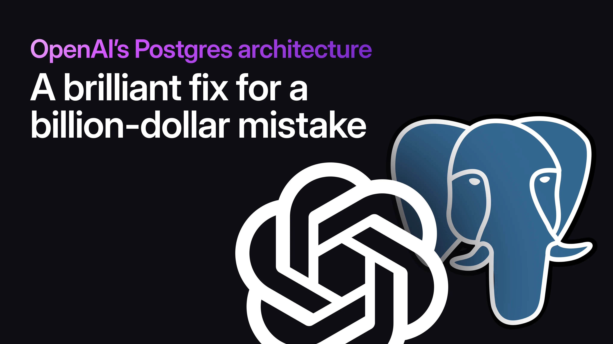
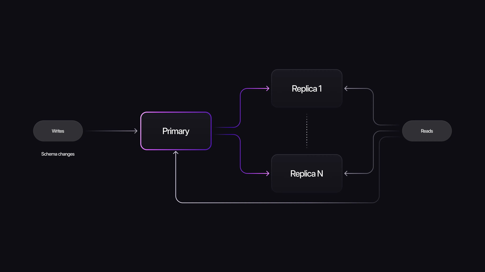
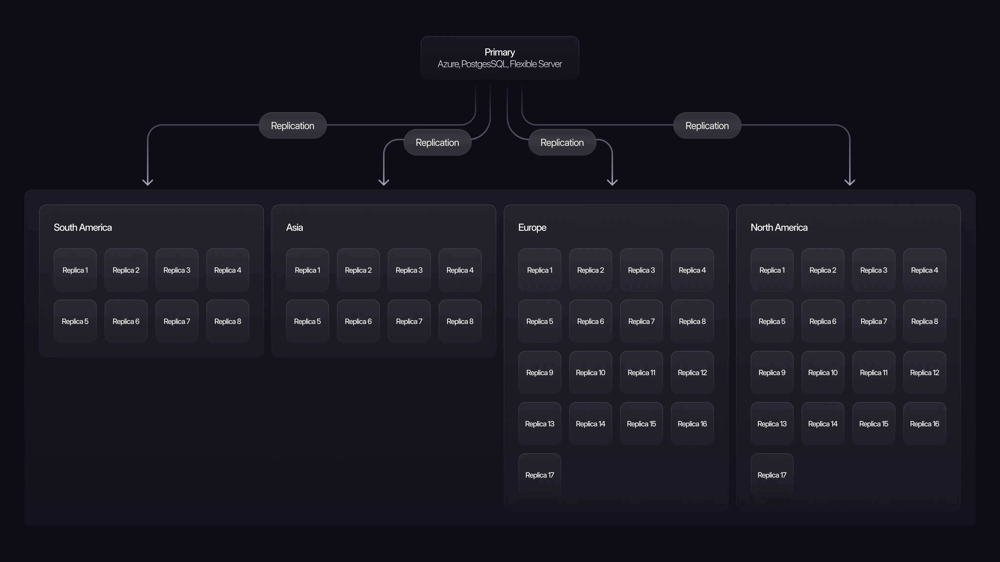
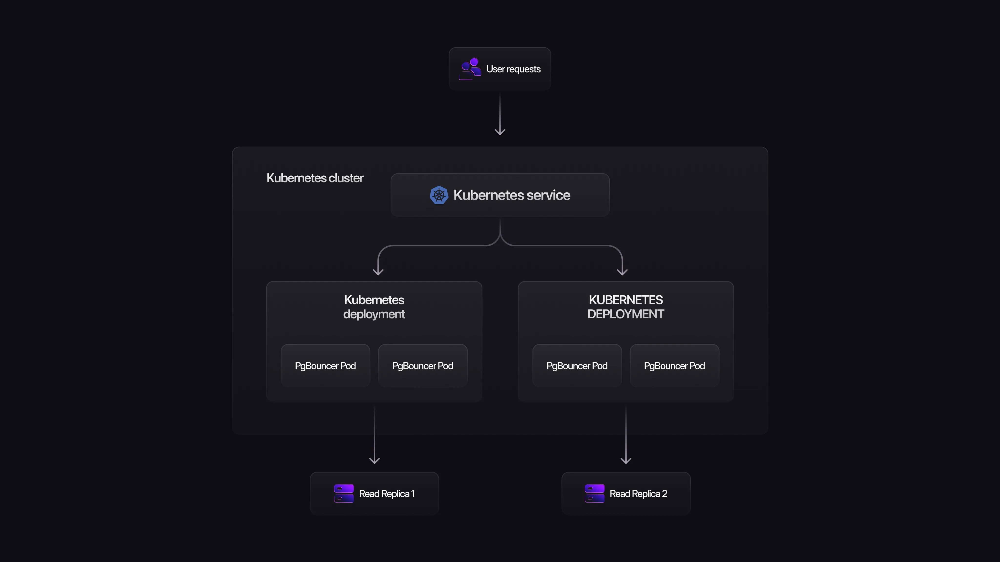
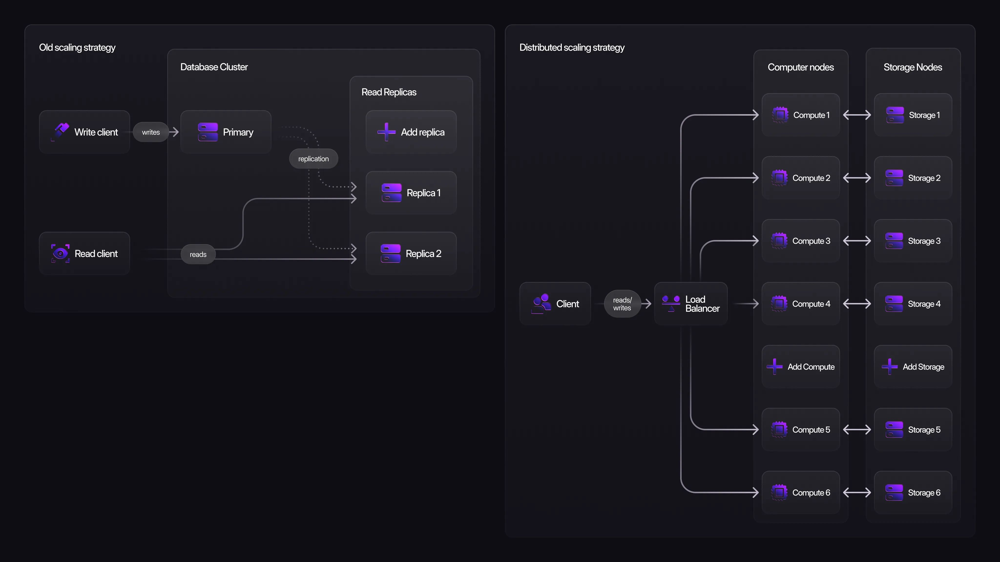
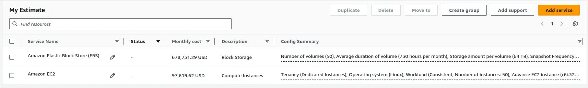
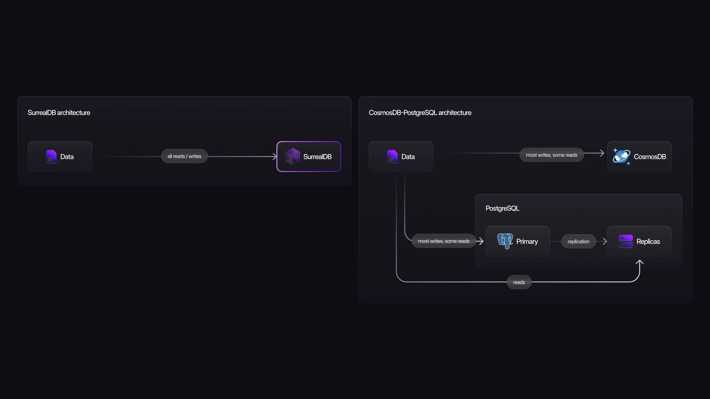
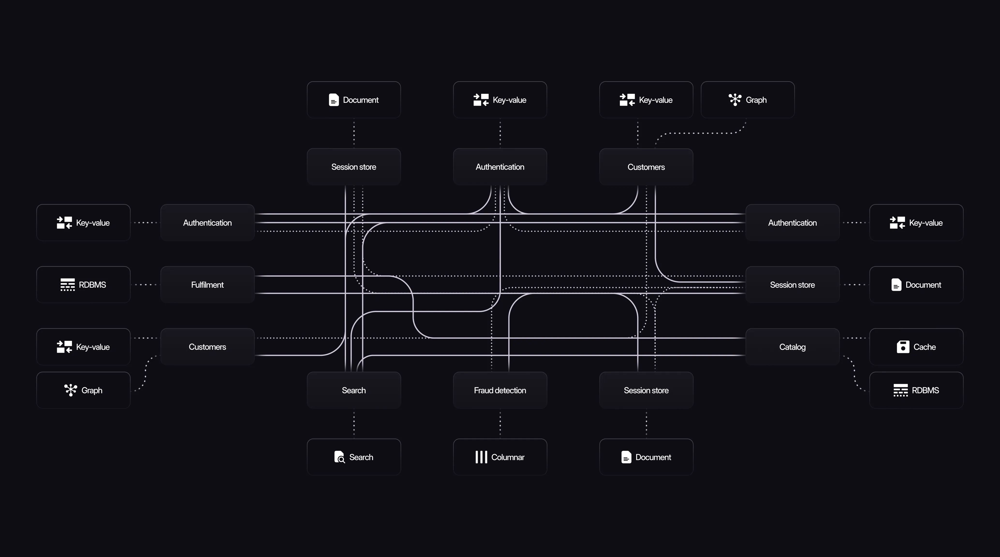

# OpenAI’s Postgres Architecture: A Brilliant Fix for a Billion-Dollar Mistake

OpenAI’s [write-up on scaling PostgreSQL](https://openai.com/index/scaling-postgresql/) for ChatGPT is worth reading twice: once as an operations playbook, and once as a case study in what happens when a system outgrows its original shape. The engineering is excellent. But the database they started with leaves a lot to be desired and has almost certainly cost the company millions of dollars in completely unnecessary infrastructure pain.

What I’ve noticed on social media is that many people are treating this article as proof of how amazing the engineering is at OpenAI (which it is) and as a blueprint for how their own organizations should scale. I’d argue the opposite. This architecture is a lesson in what not to do. Just because brilliant engineers can make something work doesn’t mean you should. I wouldn’t eat soup with a fork, and I wouldn't use a single-writer PostgreSQL cluster to serve 800 million users.

### Why this architecture exists (and why it shouldn't)

The scaling strategies OpenAI used here are very familiar to me. I've helped design the database architecture for some of the largest transactional systems on the planet, and what OpenAI did mirrors patterns I’ve seen in the field. What’s unusual is the timing. Most companies I’ve seen running this exact playbook are 2010s organizations that started on MySQL or Postgres before the distributed-database space matured. They scaled with read replicas and orchestration because migrating later was impractical. That isn’t OpenAI. They made these architectural decisions presumably in the early 2020s, when far better options already existed. My suspicion is that their technical decisions had a lot to do with the fact that Microsoft has a large stake in OpenAI and wanted them running on Azure services.

(Traditional 2010s Postgres Architecture)

### What OpenAI actually built

But enough history. Let's look at what they actually built.

OpenAI runs a single primary Azure PostgreSQL Flexible Server instance with nearly 50 full read replicas distributed globally, handling millions of QPS for ChatGPT and the API. All writes hit the single primary. Reads are aggressively offloaded to replicas. They have explicitly avoided sharding the existing PostgreSQL deployment because of the inherent complexity and time-consuming nature of that adaptation, a fully understandable call at their scale.

A single-writer Postgres instance, even the biggest one Azure offers, obviously can’t handle this kind of write volume. So OpenAI migrated shardable workloads and write-heavy tables to Azure Cosmos DB and blocked all new tables/features on the main PostgreSQL cluster. New workloads now default to sharded alternatives. This also likely means they have applications stitching data together from both Cosmos DB and Postgres.

Because Azure PostgreSQL caps connections at 5,000, OpenAI deployed PgBouncer in Kubernetes. Each read replica gets its own K8s deployment with multiple PgBouncer pods behind a Service for load balancing. This dramatically cuts active connections and connection-setup latency.

On replication: the primary currently streams WAL directly to all ~50 replicas. That’s sustainable today on huge instances with fat pipes, but it has hard limits. To go further, OpenAI is having the Azure Postgres team build out a new feature for them: cascading replication (intermediate replicas relay WAL downstream). But the feature is still in testing.

Other key optimizations:

- Aggressive query tuning to kill expensive multi-table joins and ORM anti-patterns
- Multi-layer caching with cache locking/leasing to survive cache-miss storms from overloading their PostgreSQL instances
- Workload isolation: high-priority vs low-priority traffic (and different products) routed to separate instances to avoid noisy-neighbor issues
- Multi-layer rate limiting (application, proxy, connection pooler, and per-query) plus careful retry policies to prevent spikes and retry storms
- Restricted schema changes: only lightweight operations allowed (no full table rewrites); backfills are heavily rate-limited; new tables forbidden
- High-availability setup on the primary with a hot standby for fast failover, plus enough replica headroom per region to survive individual replica failures

### The results: impressive… and concerning

The result is a system that's… kinda stable: double-digit ms p99 client-side latency, claimed five-nines availability, and “only one SEV-0 PostgreSQL incident” in the past year. (I’m questioning how they measure five-nines availability if they’re happy about only having one SEV-0 this past year, but I digress.)

That’s impressive problem-solving, and it’s a credit to OpenAI’s engineering talent that they pulled it off. Many organizations fail at far smaller scale.

But let’s be clear: I have never in my career heard an infrastructure engineer be happy about having “only one SEV-0” on their primary transactional database infrastructure in a year. (Can you imagine what that says about the previous years?) A SEV-0 is the highest-severity outage. This is not normal for a well-architected system (granted, most systems are not well architected). Even in gigantic, high-growth companies, many go years without a SEV-0 on their primary transactional database system, or have never even had one.

The problem with this system is that it currently is and is going to continue to be constantly on the verge of a SEV incident, and it will never stop unless they shard or migrate off of it. Growth is endless (or it is if the company is healthy, which hopefully OpenAI stays healthy), which means more data, QPS, connections, etc. every year forever. And they have put themselves in a situation where there are inherent architectural limits that have required all kinds of architectural workarounds and special arrangements with their cloud hosting provider just to keep things running. Not to mention teams and teams of engineers at both Azure and OpenAI just to keep this alive who could all probably be better utilized to increase functionality instead of keeping a system alive. Remember, Azure Database for PostgreSQL Flexible Server only allows for 5 read replicas, so in order for OpenAI to scale this way they had to have custom bespoke solutions made for them by the Azure engineering team.

### The real cost: engineering heroics forever

Virtually every problem they had to solve has already been solved, out of the box, by modern distributed databases. They would have saved millions in infra spend, thousands of engineering hours, and future-proofed the system by choosing something designed for this scale from the start.

But I don’t blame the OpenAI team; maybe this level of growth wasn’t anticipated, or maybe internal constraints forced their hand. No one knows but the OpenAI team.

But the point I want to make with this article is: if you were designing the database layer for this class of workload today, should you do this? And my very strong recommendation would be no. Unless you don't care about time, money, outages, your engineers' sanity, weekends, holidays, sleeping through the night, developer velocity, future-proofing, your remaining hair, or basic human joy.

### The alternative: start with distributed architecture

So what's the alternative? You should use a database architecturally designed for this type of scale from the start. In the rest of this piece, I’ll use SurrealDB as the example (full disclosure: they pay me, so I’m biased, at least until the iron fist of the CEO comes down on me for writing this article). That said, the underlying principles I’m about to walk through apply to many modern distributed systems, not just SurrealDB. Bias or not, the technical realities are what matter. And those realities should bias you towards a very different path forward, one that avoids nearly all of the problems OpenAI had to solve through sheer operational heroics. Let’s walk through it.

### The problems PostgreSQL forced OpenAI to solve, and how a native distributed system like SurrealDB avoids them entirely

Let’s go through the biggest pain points OpenAI encountered (including ones they didn’t mention) and why almost every one of them disappears with a distributed database.

1. **Fundamental scale limitations of a 1990s design**

PostgreSQL came out of Berkeley in the mid-1990s, back when a few terabytes felt huge and “big data” was whatever fit on a lab server. And while it's seen a lot of development since then, the core design was never meant to handle planet-scale traffic across regions with millions of QPS and hundreds of millions of users. All the tricks OpenAI threw at it (read replicas, PgBouncer, begging Azure for cascading replication) are basically duct tape on a system that just wasn’t built for this.

Databases like SurrealDB were architected at their core for this level of modern distributed scale. A SurrealDB distributed deployment uses the TiKV storage engine, the same storage engine that some of the biggest banks, insurance companies, Flipkart, Databricks, Pinterest, Plaid, Atlassian, and others use in clusters with hundreds of nodes, pushing millions of QPS and petabytes of data. And these companies are not constantly dealing with SEV-0 events. The fundamental architecture is designed to handle this traffic without the same kind of custom patches and workarounds.

In addition, databases like SurrealDB do not have the same connection limit issues as older relational databases, where you’re capped at 5,000 connections. So the connection pooling problem OpenAI had to overcome becomes mitigated (though it's still a good idea to optimize the system).

2. **The insane replica cost**

OpenAI has ~50 full read replicas, which means 50 complete copies of the whole dataset. Block storage is the priciest, least-discountable thing on any cloud bill, and copying dozens/hundreds of TBs of data fifty times is throwing away millions a year for no extra value beyond read capacity. On top of that, each replica is its own isolated box that can’t share compute. You have to overprovision every single one to survive its own spikes, so half (or very likely more) of your CPU is probably sitting idle 95% of the time. And when traffic surges, you can’t just add compute instantly. Provisioning a new replica and replicating the full dataset takes a huge amount of time (potentially hours). That’s why OpenAI overprovisions well in advance, to give themselves a buffer while new replicas catch up. But this architecture means that they need accurate forecasting and plenty of spare capacity ahead of time.

And if you don't believe me on the storage pricing analysis, here's the AWS bill calculator for 50 64TB EBS volumes and 50 128vCPU instances. How much more expensive do you think storage is vs. compute?

That’s right. Storage costs ~7× more than compute in this example. This can vary depending on the disk type, how much data and compute you need, and whether you are using managed services. In your situation it might only be 4× or 2×, but you get the gist. And while this example is from AWS, this is true across all cloud hosting providers.

The core reason is that with reserved instances you can get huge discounts on compute with all the cloud providers, up to 72% or even 80%+ with enterprise discount plans. The standard discount for block storage is 0%. I have seen up to 5% with special arrangements on AWS, but that was for one of their largest customers. This is why scaling via read replicas is such a financial disaster. Now, maybe OpenAI gets special treatment here because they are partially owned by Microsoft and this isn’t relevant to them, but it should be relevant to you if your company cares about money.

And feel free to verify these cost figures yourself:

- [https://cloud.google.com/products/calculator](https://cloud.google.com/products/calculator)
- [https://azure.microsoft.com/en-us/pricing/calculator/](https://azure.microsoft.com/en-us/pricing/calculator/)
- [https://calculator.aws/](https://calculator.aws/)

But how does a distributed database like SurrealDB address this? When you store data on SurrealDB, it uses a separate node entirely for storage that replicates it 3 times, auto-shards it into small chunks across the cluster, and distributes it across the cluster for high availability.

And if you need to scale throughput and concurrency, you can do so by adding cheaper stateless compute nodes that all read from the same shared storage pool. No full copies. And on top of that, the stateless compute nodes can be removed and spun up dynamically at any time, which means you don’t have to massively overprovision for any given event. The system is flexible enough to be scaled up and down all the time, saving huge costs on overprovisioning. And in the event you do have a high-growth event and you need more compute, it only takes a few minutes to get the cluster powered up enough to handle the increased workload.

All this means that by going with a distributed architecture you could, depending on your scenario, decrease your current/future total cloud bill by several factors.

3. **The single-writer bottleneck and the forced migration to a separate NoSQL system**

In PostgreSQL’s single-primary architecture, every single write (updates, inserts, deletes) has to funnel through that one primary instance. No matter how large the machine (and OpenAI is clearly running one of the biggest Azure offers), a sudden write spike can still saturate CPU, I/O, or WAL bandwidth. Latency climbs, queries start timing out, retries pour in, and you’re suddenly in a classic overload death spiral that can degrade ChatGPT and the API for everyone.

OpenAI’s fix was to identify the workloads that were shardable and write-heavy (many of which are probably fundamentally relational in nature), migrate them to Cosmos DB, and accept the permanent cost of running two completely different database systems side-by-side. That means separate query languages, different consistency models, distinct operational tooling, and application code that has to stitch results together across the two stores forever.

A distributed database like SurrealDB is multi-writer by design. Writes are spread across multiple nodes in the cluster, so write capacity grows horizontally as you add machines. There is no single primary choke point, and no need to spin up and maintain an entirely separate database just to handle write load.

4. **Expensive multi-table joins killing the cluster**

OpenAI repeatedly calls out multi-way joins as a major source of SEV incidents. They had to audit ORM output, break joins into application-side logic, and basically treat joins as dangerous. That’s not a great place to be when your data model is relational.

SurrealDB avoids this class of failure by not relying on traditional relational joins at all. Relationships are modeled explicitly as record links and graph edges, and resolved through traversal inside a single query engine rather than join operators. This eliminates join explosion and centralized join execution while still allowing expressive relationship queries across documents, graphs, and vectors without forcing application-side orchestration or creating single-node saturation risks.

5. **Schema changes become impractical**

OpenAI now bans anything beyond the lightest schema changes and rate-limits backfills for weeks. That’s a huge velocity tax. Every new column or type change becomes a high-risk, multi-week operation.

SurrealDB reduces schema-change issues by decoupling schema definition from rewriting existing storage. Where relational systems often force heavy DDL and backfills just to keep data and schema synchronized, SurrealDB’s current approach enforces schema primarily as data is written/updated, and the team has explicitly identified richer zero-downtime mechanisms (aliases/versioning/async migrators) as the path to handling large-scale online migrations and reindexing without downtime. This results in a scenario where you can make a change to a table at scale without complexity or waiting.

6. **Stability constantly threatened by spikes**

In the single-primary PostgreSQL setup, any unexpected surge (cache-miss storms, new feature launches, retry loops, or sudden traffic growth) can quickly saturate a single instance’s CPU, I/O, or connection limits. Latency spikes, requests time out, retries amplify the load, and the whole service risks cascading degradation. The primary is still a true single point of failure (even with a hot standby), and losing a read replica requires pre-planned headroom across every region. OpenAI had to build multiple layers of rate limiting, workload isolation, and cache leasing just to keep the system from regularly tipping over.

A distributed architecture with separated compute and storage handles this differently. Stateless query nodes can be scaled automatically in seconds during spikes, absorbing bursts without saturating any one machine. High availability is native: individual node failures are isolated, and automatic failover and rebalancing occur without any intervention.

7. **Astronomical ongoing engineering overhead**

This setup requires constant tuning, custom Azure features, cascading replication experiments, query audits, rate-limit adjustments, connection-pool management, and on-call heroics to prevent the next SEV-0. That’s a permanent tax on engineering bandwidth. People who could be building new features are instead keeping Frankenstein alive.

SurrealDB is designed for distributed scale from the start and is intended to be boring at this traffic level. The problems OpenAI is constantly solving just aren’t issues with databases like SurrealDB. Now, every database will encounter problems at hyperscale (and tons of them (and when I say tons, I mean tons; scale is hard)), but they won't be nearly as severe. In fact, with many of the (healthy) companies I’ve worked with, the majority of the time infrastructure engineers spend is more on the optimization and functionality side of things.

8. **Inevitable database sprawl**

By freezing the core PostgreSQL schema and banning new tables entirely, OpenAI has ensured that any future workload with different performance characteristics or heavier writes will need its own separate database system (Cosmos DB today, likely others tomorrow). That guarantees growing proliferation, more cross-system data movement, and increasing consistency and operational challenges over time, which, by the way, likely means more data transfer fees and more replicas across databases.

(A possible future of OpenAI’s architecture)

SurrealDB is multi-model, which can evolve with the product. It can incorporate relational, document, geospatial, temporal, graph, vector, and time-series data in the same cluster as requirements evolve, avoiding the need to continually spin up new databases.

9. **Locking yourself out of future AI workloads on your own data**

This is the subtler long-term cost. OpenAI has arguably the most valuable dataset on the planet, but their core transactional store is perpetually at capacity and can’t absorb new workloads. To do anything interesting with that data at scale, they’ll need to replicate it elsewhere, adding cost, latency, time, and consistency risk.

SurrealDB is built for exactly this future: relational + temporal + document + graph + vector + time-series in the same system, on the same dataset, without replication or ETL. You can run transactional workloads, analytics, RAG, and recommendation engines against the same live data without fear of blowing up the cluster.

### Database infrastructure shouldn’t require miracles

OpenAI’s infrastructure team pulled off a minor miracle keeping a single-writer PostgreSQL cluster alive at this scale. The optimizations are clever, the operational discipline is elite, and the fact that ChatGPT mostly works for 800 million users is a testament to their skill.

But miracles aren’t scalable. This architecture is a patchwork of workarounds, custom Azure features, and permanent firefighting, held together by constant engineering effort that could be spent building new capabilities instead. All to compensate for fundamental limitations of a 1990s-era database design pushed far beyond its natural habitat.

If you’re building something ambitious in 2026, don’t inherit these problems. Choose a database built for distributed scale, horizontal everything, multi-model flexibility, and reliably boring operations from day one.

Your bill will be lower, your on-call rotation will sleep better, and you’ll have vastly more freedom to experiment with the AI-native workloads that will define the next decade.

Pick the right foundation the first time. Everyone on your team will thank you.
