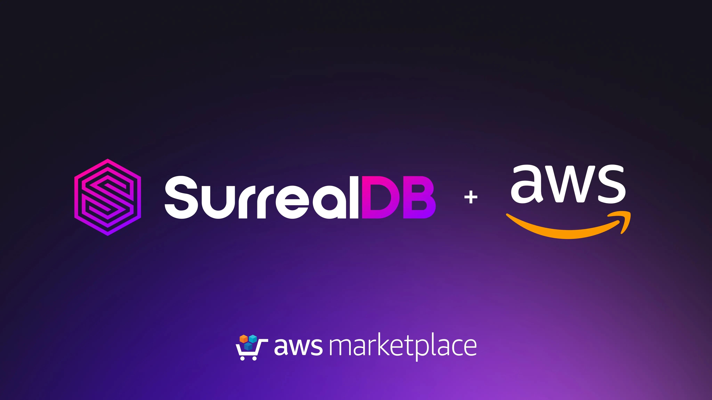

# SurrealDB is now available on AWS Marketplace

We’re excited to announce that SurrealDB is now officially available on AWS Marketplace.

You can now deploy SurrealDB Cloud with streamlined procurement, simplified billing, and faster time to production - all through your existing AWS accounts.

This launch also reinforces our commitment to meeting customers where they build, and deepens our partnership with AWS to make SurrealDB easier to adopt, deploy, and scale in the cloud.

## Why this matters

AWS Marketplace makes it easier for companies to adopt SurrealDB with:

- Seamless AWS-native deployment
- Consolidated billing
- Faster security and procurement approval
- Production-ready infrastructure from day one.

If you’re already building on AWS, getting started with SurrealDB just became frictionless.

## Why SurrealDB?

SurrealDB combines document, graph, and relational capabilities in one unified database - designed for modern applications, real-time systems, and AI-powered workloads.

With flexible schema, SurrealQL, and built-in real-time features, SurrealDB simplifies your technology stack, reduces Total Cost of Ownership and operational complexity, and allows you to ship products and features in days rather than weeks.

## Get started

SurrealDB is [available now on AWS Marketplace](https://aws.amazon.com/marketplace/seller-profile?id=seller-3gvbyh53eomro). We can’t wait to see what you build.
