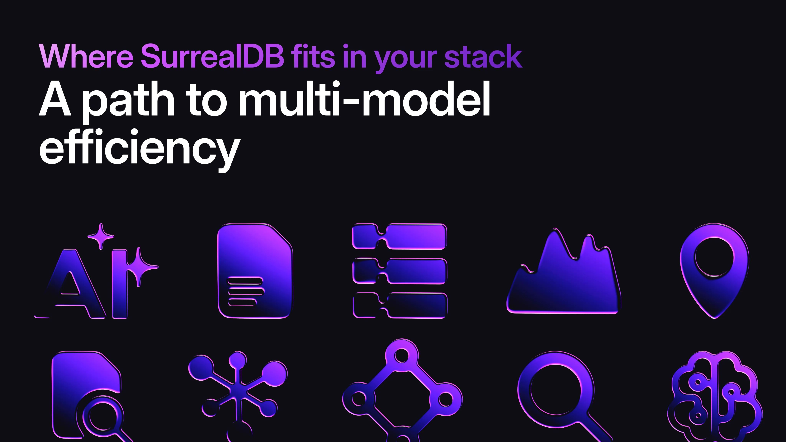

# Where SurrealDB fits in your stack

## Where SurrealDB fits in your stack: a path to multi-model efficiency

In today's data-driven applications, managing multiple specialised databases (often referred to as polyglot persistence) has become a common challenge. Teams juggle relational databases like PostgreSQL for structured data, document stores like MongoDB for flexible schemas, graph databases like Neo4j for relationships, and vector databases for AI workloads.

While powerful once finally set up, this configuration introduces complexity: multiple query languages, data pipelines, security models, and scaling strategies. Enter SurrealDB, an open-source multi-model database that unifies these paradigms into a single system. By consolidating databases into one platform, SurrealDB enables applications with multi-model capabilities, blending relational queries, graph traversals, vector search, time-series and geospatial analysis without the overhead of disparate tools.

This article explores how SurrealDB facilitates database consolidation, drawing from real-world benchmarks, case studies (e.g., Tencent [consolidating nine databases into one](/customer/tencent)), and performance comparisons. We'll map current polyglot setups to a consolidated future state, discuss ROI and TCO implications, and provide architecture overviews. If you're a technical evaluator considering SurrealDB as a replacement for your existing stack, this guide assumes basic database knowledge but no deep familiarity with SurrealDB's SurrealQL query language or internals.

## Where SurrealDB fits in your deployment

SurrealDB positions itself as a versatile, AI-native database that scales from edge devices to petabyte clusters. [Built in Rust](/blog/why-we-are-betting-on-rust), it supports deployment as an embedded library, single-node server, or distributed system. Its layered architecture separates compute (query processing) from storage (e.g., using TiKV for distributed persistence), allowing flexible scaling.

### What it replaces

SurrealDB's multi-model design natively handles multiple data paradigms, making it a direct substitute for several specialised databases:

- **Document stores (e.g., [MongoDB](/docs/surrealdb/migrating/mongodb))**:

SurrealDB stores data as flexible, JSON-like documents, supporting a default schemaless model that allows as much strictness to be added to your schema as your solution requires. It replaces MongoDB for content management, real-time apps, and unstructured data, with SurrealQL providing aggregation and querying akin to MongoDB's syntax but unified across models.

- **Graph databases (e.g., [Neo4j](/docs/surrealdb/migrating/neo4j))**: with

built-in graph functionality, SurrealDB uses record links and graph edges as first-class citizens for traversals and relationships. It has been used to replace Neo4j in recommendation engines, fraud detection, and knowledge graphs, offering SQL-like syntax for graph queries without Cypher's learning curve.

- \*\*Relational databases (e.g.,

[PostgreSQL](/docs/surrealdb/migrating/postgresql))\*\*: SurrealDB emulates relational tables with ACID transactions, indexes, and joins (via record or graph links rather than traditional SQL JOINs for better scalability). It consolidates Postgres workloads for transactional data, geospatial queries, and time-series.

- **Vector and Search databases**: integrated vector embeddings, full-text

search, and hybrid retrieval replace standalone tools like Pinecone or Elasticsearch for AI apps, including RAG (Retrieval-Augmented Generation) pipelines.

- **Key-Value and Time-Series stores (e.g., Redis, InfluxDB)**: SurrealDB

handles simple key-value pairs and temporal data with live queries for real-time updates along with an in-memory datastore that also includes [persistent snapshot or AOL storage](/docs/surrealdb/cli/start#datastore-configuration).

[Case studies](/casestudies) highlight replacements: one company swapped Neo4j, RabbitMQ, and Postgres for SurrealDB, while Tencent consolidated nine systems, reducing complexity and costs.

### What it does not replace

While versatile, SurrealDB isn't a one-size-fits-all solution:

- **Pure OLAP or data warehouses (e.g., Snowflake, BigQuery)**: for massive

analytical workloads requiring columnar storage and distributed joins across exabytes, SurrealDB's focus on multi-model OLTP (online transaction processing) may not match specialised OLAP tools' optimisation for ad-hoc queries.

- **Highly specialised hardware-accelerated databases**: it doesn't replace

niche systems like GPU-optimised databases for extreme-scale ML training or legacy mainframe databases with proprietary integrations.

- **Non-database tools**: SurrealDB consolidates data storage but not

orchestration (e.g., Kubernetes).

### The Outcome

A single SurrealDB instance or cluster handles all, with SurrealQL as the query interface. Compute nodes process queries, storage persists data distributively.

Benchmarks show efficiency: SurrealDB often outperforms single-model databases in mixed workloads (e.g., faster than MongoDB in reads, comparable to Neo4j in graphs).

## Mapping the customer journey into consolidation: ROI and TCO over time

Adopting SurrealDB follows a phased journey, yielding compounding ROI (return on investment) and reduced TCO (total cost of ownership).

### Phase 1: evaluation (months 1-2)

- Assess: map current databases to SurrealDB models using migration guides

(e.g., from Neo4j/PostgreSQL) and Surreal Sync migration tool.

- POC: run SurrealDB in a testing environment as the backend for a single

application; test key validation areas such as:

- **Setup and integration**: install SurrealDB locally or via SurrealDB Cloud,

in your application stack, and verify connectivity with existing microservices.

- **Data migration**: import sample datasets from your current databases and

test schema definitions in schemaless or schemafull modes.

- **Query performance**: execute mixed-model queries (e.g., combining document

lookups with graph traversals and vector searches) and benchmark against your existing setup for read/write throughput, latency, and resource usage.

- **Feature validation**: test real-time capabilities like live queries and

change feeds; evaluate AI features such as vector embeddings and hybrid search for RAG use cases; assess geospatial and time-series handling.

- **Security and compliance**: configure authentication (e.g., JWTs, scopes),

test access controls, and ensure alignment with your security best practices like least privilege.

- **Scalability and reliability**: simulate load with tools like the SurrealDB

CLI or Surrealist dashboard, test failover in a small cluster, and monitor performance metrics.

- **Developer experience**: use the Surrealist dashboard for querying and

visualisation; experiment with SurrealQL syntax to rewrite existing queries from MongoDB/Neo4j/PostgreSQL.

- Initial ROI: is higher than baseline due to the overhead on the team doing the

POC/migration, and temporarily running 2 different databases in parallel until full cut-over.

### Phase 2: partial consolidation (months 3-12)

- Migrate one workload (e.g., replace MongoDB for documents).
- Integrate with AI frameworks (e.g., LangChain for RAG).
- ROI: faster feature iteration performance improvements and lower overhead.

TCO: 10-50% reduction by eliminating 2-3 databases, cutting licensing/maintenance.

### Phase 3: full multi-model shift (year 1+)

- Consolidate all: from polyglot deployment model to a unified stack.
- Scale: horizontal clustering for high availability.
- ROI: 2-3x faster time-to-market; AI apps ship quicker with native

vectors/graphs. TCO: Up to 70% savings via fewer systems, no ETL, and simplified ops (e.g., one monitoring setup).

Over time, ROI grows exponentially as complexity drops: enterprises report 3-4x lower costs through consolidation than managing 3-4+ databases.

## Conclusion

SurrealDB offers a compelling consolidation path for technical teams, replacing multiple databases while supporting multi-model apps. By mapping your current polyglot setup to its unified models, you can achieve significant ROI through faster development and lower TCO. Start with a POC to evaluate fit. Learn what companies like Tencent, Walmart and Samsung already know. For more, explore SurrealDB's [documentation](/docs) or [GitHub](https://github.com/surrealdb/surrealdb), or visit our [Discord community](https://discord.gg/surrealdb).
