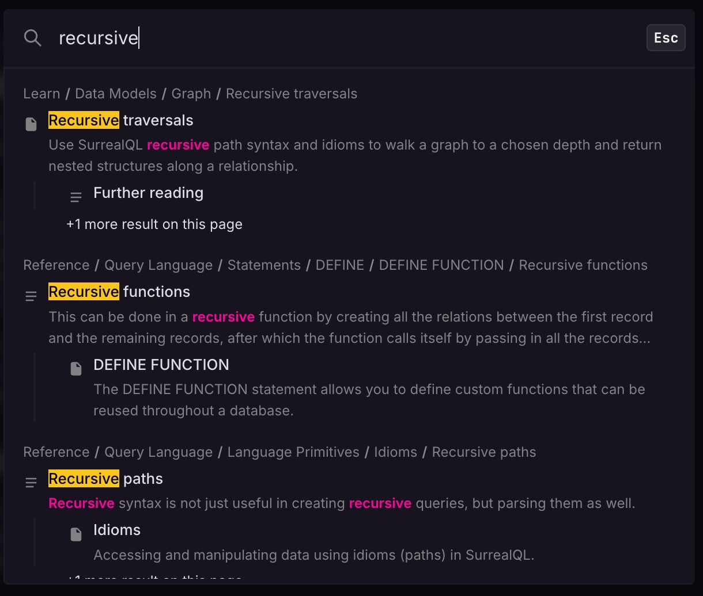

# New SurrealDB docs search using hybrid search and HNSW\/BM25 reranking


Trying to produce relevant search results is one of the hardest things to get right when building an app. Searching can be done in a lot of ways: basic text search, full-text search, vector search, and often even graph and geospatial.

This post introduces an example that includes two of these models: full-text and vector search together. These two tend to involve quite a bit of SurrealQL code, because:

- To use full-text search, you first have to define how you want text to be split up and modified. Do you want it to be case-sensitive? Split by whitespace, or some other way? Modified to root forms based on the language of the text? (And so on...)
- To use vector search, you have to generate embeddings for pieces of text and know how to query them.

What makes this example special is that it is the search function you use every time you type some text into the "Search the docs" part of the SurrealDB documentation! This functionality was recently implemented, and because it's open source we are able to show you the ins and outs of how it was done.

# How doc search is implemented

The [README](https://github.com/surrealdb/docs.surrealdb.com/blob/main/search/README.md) in the [/search](https://github.com/surrealdb/docs.surrealdb.com/tree/main/search) section of the docs repo goes into a good amount of detail. In addition, you can see the mechanics of the search itself inside [this search.ts file](https://github.com/surrealdb/docs.surrealdb.com/blob/main/src/utils/search.ts) in another section.

The entire implementation is done using SurrealDB, along with Bun to deploy the website and an OpenAI API key. You can go to [this part of the page](https://github.com/surrealdb/docs.surrealdb.com/tree/main/search#local-development) to deploy it locally and test it out.

Here is what the final result looks like:



Since the README file already goes into detail about how to do the deployment yourself, in this post we will instead take a closer look at the SurrealQL statements themselves to see how they work and how they might help you do something similar in your own tools and apps.

# The role SurrealDB plays

As the README mentions, the search functionality uses hybrid search:

> Hybrid search for the SurrealDB documentation. Combines BM25 full-text search with OpenAI vector embeddings, fused via Reciprocal Rank Fusion (RRF) inside SurrealDB.

[Hybrid search](https://surrealdb.com/docs/learn/data-models/vector-search/hybrid-search) allows you to combine full-text search with vector search, giving you the best of both worlds.

**Vector search** is useful because it is capable of going beyond the outward appearance of words to get to their **semantic meaning**. For example, the term **lead** in the following paragraph is used to mean two different things. We can recognize that as humans, and LLM models are also able to do the same, returning the output as an embedding (a large array of numbers representing semantic space).

> The project **lead** frowned and took a hard look at the results. They were clear as day. There was far too much **lead** content in the water. That's why the town had gotten sick!

However, full-text search is useful too because it excels at slicing and modifying text into tokens. To show what that looks like, here's what the full-text analyzer looks like that is used in the docs search.

```surrealql
DEFINE ANALYZER OVERWRITE simple
    TOKENIZERS blank, class, camel, punct
    FILTERS snowball(english);
```

The easiest way to understand what all the tokenizers and filters do in an analyzer is by putting a string into the [search::analyze()](https://surrealdb.com/docs/reference/query-language/functions/database-functions/search#searchanalyze) function, which returns an array. To avoid showing a huge array in this blog post, we'll call `.join(' ')` on the output to join them back into a single string.

```surrealql
search::analyze(
    "simple", 
    "The project lead frowned and took a hard look at the results. They were clear as day. There was far too much lead content in the water. That's how the town had gotten sick!")
.join(' ');
```

As the output shows, using this analyzer will allow you to match on terms like "FroWNinG" which will turn into "frown" before being compared against a search string.

> "the project lead frown and took a hard look at the result . they were clear as day . there was far too much lead content in the water . that ' s how the town had gotten sick !"

So if vector search and full-text search each have their advantages, how can you combine the two? It would be nice if you could somehow plug them into a function that does this.

And it turns out that SurrealDB has exactly that! It is called [search::rrf()](https://surrealdb.com/docs/reference/query-language/functions/database-functions/search#searchrrf) and was added during the 3.0 beta period. Here is what it looks like in practice.

```surrealql
-- ── Reciprocal Rank Fusion ──
-- Combines the four ranked lists into a single ranking.
-- RRF scores each result as: sum(1 / (k + rank_in_list))
-- across all lists the result appears in.
--   arg 1: array of ranked lists to fuse
--   arg 2: k=60 (smoothing constant, standard RRF default)
--   arg 3: limit=80 (max candidates to consider)
LET $fused = search::rrf(
    [$page_ft, $page_vs, $section_ft, $section_vs], 
    60, 
    80
);
```

As you can probably guess, it is fusing the results of previous queries for full-text search on pages and sections (`$page_ft`, `$section_ft`) together with vector searches on pages and sections (`$page_vs`, `$section_vs`).

Full-text searches are done using the `@@` operator (the "matches" operator). This operator works as long as you have a index on a field that uses a `FULLTEXT ANALYZER`:

```surrealql
DEFINE INDEX OVERWRITE page_ft_title       ON page FIELDS title       FULLTEXT ANALYZER simple BM25;
DEFINE INDEX OVERWRITE page_ft_breadcrumb  ON page FIELDS breadcrumb  FULLTEXT ANALYZER simple BM25;
DEFINE INDEX OVERWRITE page_ft_description ON page FIELDS description FULLTEXT ANALYZER simple BM25;
DEFINE INDEX OVERWRITE page_ft_content     ON page FIELDS content     FULLTEXT ANALYZER simple BM25;
DEFINE INDEX OVERWRITE page_ft_path        ON page FIELDS path        FULLTEXT ANALYZER simple BM25;
```

In between these two `@` operators you can insert a number to access the `search::score()` for each field. This will make sense once you take a look at these two queries. Each of them is querying multiple fields, each of which will return a score thanks to `BM25` defined in the field. To know which field is which, you put a reference number in between the `@` operators like `@0@` and `@2@`. They can then be added together or multiplied or whatever logic you would like to use.

```surrealql
LET $page_ft =
        SELECT
            id,
            "page" AS kind,
            path AS url,
            path AS page_path,
            collection,
            title,
            breadcrumb,
            description,
            content,
            (
                (search::score(0) * 15)
                + (search::score(1) * 25)
                + (search::score(2) * 10)
                + (search::score(3) * 8)
                + (search::score(4) * 3)
            ) AS ft_score
        FROM page
        WHERE
            path @0@ $query
            OR title @1@ $query
            OR breadcrumb @2@ $query
            OR description @3@ $query
            OR content @4@ $query
        ORDER BY ft_score DESC
        LIMIT 30;

LET $section_ft = 
        SELECT
            id,
            "section" AS kind,
            string::concat(page.path, "#", anchor) AS url,
            page.path AS page_path,
            page.collection AS collection,
            title,
            breadcrumb,
            content,
            (
                (search::score(0) * 25)
                + (search::score(1) * 10)
                + (search::score(2) * 3)
            ) AS ft_score
        FROM section
        WHERE
            title @0@ $query
            OR breadcrumb @1@ $query
            OR content @2@ $query
        ORDER BY ft_score DESC
        LIMIT 30;
```

The vector search query also uses its own index. Note that you don't specifically need an index to use vector search, as you can go with a [brute force function](https://surrealdb.com/docs/reference/query-language/functions/database-functions/vector#vectorsimilaritycosine) such as `vector::similarity::cosine()` instead. However, an `HNSW` index instead can speed up the process dramatically if you don't mind sacrificing a bit of precision. Here the index is defined with a dimension of 1536 to match the length of the array returned by OpenAI's text-embedding-3-small model.

```surrealql
-- HNSW index for approximate nearest-neighbour vector search.
-- Dimension 1536 matches OpenAI text-embedding-3-small output.
-- Cosine distance is the standard metric for normalised text embeddings.
DEFINE INDEX OVERWRITE page_embedding_hnsw ON page FIELDS embedding
    HNSW DIMENSION 1536 DIST COSINE;
```

Having an `HNSW` index also lets you use the `<||>` operator (the KNN, or K-nearest neighbour) operator when performing the query. The comments above the code explain what each of the two numbers mean. Here, the `|30,100|` syntax means to return 30 neighbours among up to 100 candidates.

```surrealql
-- ── Page vector search ──
-- Finds the 30 pages whose embeddings are closest to the
-- query embedding. The <|30,100|> syntax means: return 30
-- neighbours, exploring up to 100 candidates in the HNSW
-- graph (higher = more accurate but slower).
LET $page_vs = 
    SELECT
        id,
        "page" AS kind,
        path AS url,
        path AS page_path,
        collection,
        title,
        breadcrumb,
        description,
        content,
        vector::distance::knn() AS distance
    FROM page
    WHERE embedding <|30,100|> $qvec
    ORDER BY distance ASC
    LIMIT 30;

-- ── Section vector search ──
-- Same as page vector search but for H2 sections.
-- Pulls the parent page's path and collection via the
-- record link (page.path, page.collection).
LET $section_vs =
    SELECT
        id,
        "section" AS kind,
        string::concat(page.path, "#", anchor) AS url,
        page.path AS page_path,
        page.collection AS collection,
        title,
        breadcrumb,
        content,
        vector::distance::knn() AS distance
    FROM section
    WHERE embedding <|30,100|> $qvec
    ORDER BY distance ASC
    LIMIT 30;
```

So that is how the magic happens. Well, part of it. Be sure to check out the rest of the code which shows what happens after the SurrealDB query returns. For example, as the database is unaware of which collections it is searching through, some modifications are made on the SDK side to give SDK docs less precedence compared to more core docs. This is something that you could perhaps do on the database side if you wanted (starting with `DEFINE TABLE sdk_page` instead of `DEFINE TABLE page` for example) but that will always depend on your own case.

```surrealql
// ──────────────────────────────────────────────────────────
// Post-retrieval boosting
//
// After RRF fusion, we apply multiplicative boosts to adjust
// rankings based on signals the database query can't capture:
// title similarity, content type (page vs section), source
// collection, and comparison-query detection.
// ──────────────────────────────────────────────────────────

/**
 * Non-SDK doc collections get a small ranking boost because
 * generic queries like "authentication" should prefer the
 * core concept page over an SDK API reference page that
 * happens to mention auth as one of many methods.
 */
const CORE_COLLECTIONS = new Set([
    "doc-surrealdb",
    "doc-surrealql",
    "doc-tutorials",
    "doc-cloud",
    "doc-surrealist",
    "doc-surrealml",
    "doc-surrealkv",
    "doc-integrations",
]);
```

# Simplifying the example

Since you might not have the head space at the moment to play around with the existing code demonstrated in this blog post, let's finish up with the same pattern as above in a very simplified form. This will let you copy and paste the example into the online [Surrealist UI](https://app.surrealdb.com/) to give it a try yourself.

The content below holds all the same features: a full-text analyzer, a full-text and vector index, a full-text and vector query, and a final query that combines the two into hybrid search results. However, it has all been simplified to a single field for text content and embeddings, and a single document table that is being searched on. In addition, the embeddings have been cut down to an array of just ten numbers in length. An array that small is very imprecise, but just long enough to serve for our simple example.

```surrealql
-- Define an analyzer
DEFINE ANALYZER OVERWRITE simple TOKENIZERS blank, class, camel, punct FILTERS SNOWBALL(en);

-- Attach it to an index
DEFINE INDEX OVERWRITE ft ON document FIELDS content FULLTEXT ANALYZER simple BM25(1.2, 0.75);

-- Create a vector index too
DEFINE INDEX OVERWRITE page_embedding_hnsw ON document FIELDS embedding HNSW DIMENSION 10 DIST COSINE;

-- Add some sample data
{
    CREATE document:one SET content =   "Elves and halflings and witches and such", embedding = [-0.0019, -0.0142, 0.0080, -0.0664, 0.0173, 0.0109, 0.0066, 0.0045, 0.0204, 0.0087];
    CREATE document:two SET content =   "Is that a wizard?",                        embedding = [0.0010, -0.0051, 0.0207, -0.0787, -0.0061, 0.0127, -0.0172, -0.0097, 0.0077, -0.0120];
    CREATE document:three SET content = "Databases are used to store information",  embedding = [-0.0317, -0.0112, 0.0118, -0.0348, 0.0061, 0.0114, 0.0310, 0.0117, 0.0034, 0.0195];
    NONE
};

-- A sample query and its embedding
LET $witch_text = "witches";
LET $witch_embed = [-0.0200, -0.0059, -0.0081, -0.0475, 0.0020, 0.0295, -0.0183, 0.0170, 0.0048, 0.0286];

-- Get the full-text score
LET $fts_score =
        SELECT
            id,
            content,
            search::score(0) AS ft_score
        FROM document
        WHERE
            content @0@ $witch_text;

-- Get the vector score
LET $vector_score = 
    SELECT
        id,
        content,
        vector::distance::knn() AS distance
    FROM document
    WHERE embedding <|30,100|> $witch_embed
    ORDER BY distance ASC;

-- Combine the results as a hybrid score
search::rrf([$fts_score, $vector_score], 60, 80);
```

We can see in the output that while only one document had a match on the word "witches" (and thus a value for ft_score), the vector search portion has been able to conclude that the sentence about wizards is semantically a bit closer than the one about databases. This would be a lot more accurate of course if the embedding were longer than 10 elements, but even at this length we can still see its potential.

```surrealql
[
	{
		content: 'Elves and halflings and witches and such',
		distance: 0.2789615948854415f,
		ft_score: 0.4782197177410126f,
		id: document:one,
		rrf_score: 0.024691358024691357f
	},
	{
		content: 'Is that a wizard?',
		distance: 0.385041442417419f,
		id: document:two,
		rrf_score: 0.012195121951219513f
	},
	{
		content: 'Databases are used to store information',
		distance: 0.3876749269204385f,
		id: document:three,
		rrf_score: 0.012048192771084338f
	}
]
```

Hopefully the simplified example has made it easy to follow the logic we use in our own doc search and has given you some ideas for how to implement patterns yourself. Have any questions or comments about hybrid search? Feel free to [Create a free SurrealDB Cloud instance today to get started](https://surrealdb.com/docs/build/deployment/surrealdb-cloud/getting-started/create-an-instance), and drop by [our Discord community](https://discord.com/invite/surrealdb) to discuss anything on your mind with the SurrealDB community and staff.
