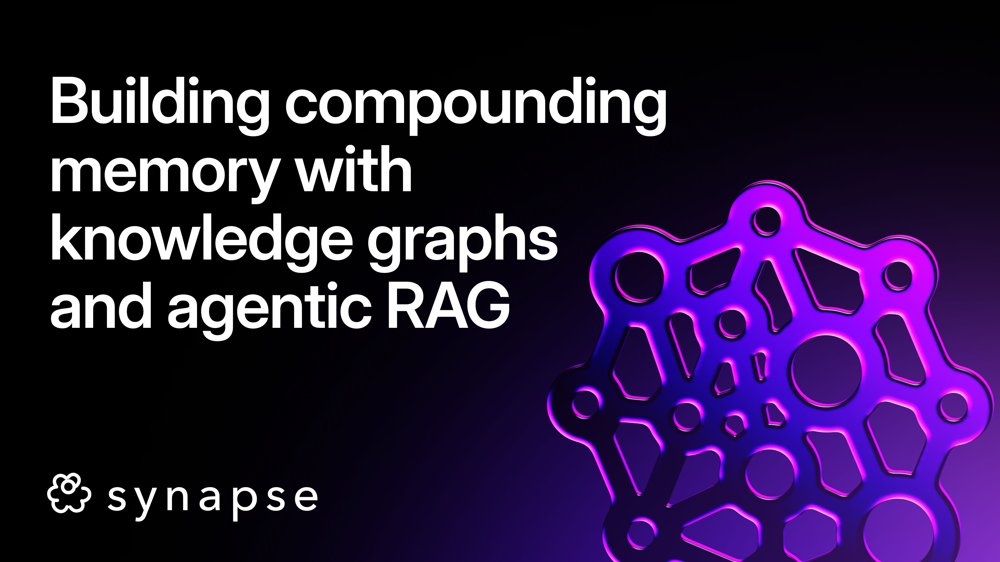
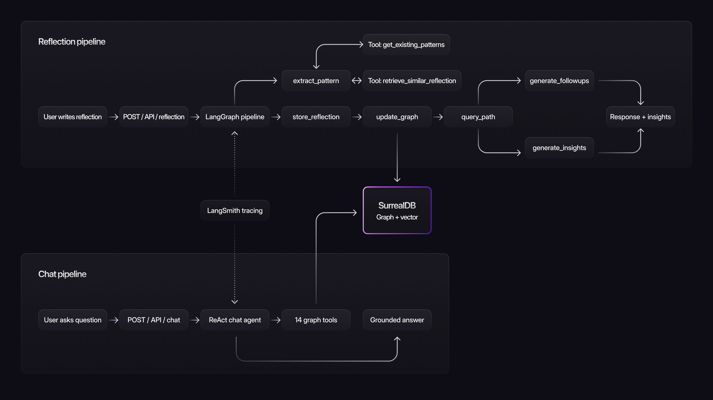

# Building compounding memory with knowledge graphs and agentic RAG



Therapy can be very helpful, but also frustrating. Every week you talk through something painful, there is some revelation, and then it's all gone. Later the same pattern shows up again, but you don't quite remember you've been here before. It's hard to track patterns over time, writing them up somewhere in a notebook you'll never reread.

Synapse is our attempt to fix that. A memory-first reflection agent built for the London LangChain x SurrealDB Hackathon. It turns journal entries into a persistent knowledge graph structured around therapy frameworks, then surfaces patterns and answers questions from that evolving context.

______________________________________________________________________

### The three pillars

**1. Grounding in therapeutic frameworks**

We didn't want AI vibing on human behaviour but rather organise insights through a clinical lens. So we structured the system around scientific frameworks therapists use: CBT, DBT, IFS, and Schema Therapy.

These frameworks become the graph schema: patterns, emotions, themes, IFS parts, schemas, people, body signals. The structure mirrors how clinicians think about recurring patterns, which means the graph's knowledge is built on strong foundation.

**2. Agentic extraction**

To make sure memory compounds instead of fragmenting, the extraction agent retrieves first. Before extracting anything from a new reflection, it calls tools to fetch existing patterns and similar past reflections. New entries connect to existing nodes instead of creating duplicates.

This happens inside a **6-node LangGraph pipeline**: `store_reflection` + `extract_patterns` run in parallel, then converge into `update_graph` → `query_graph` → `generate_insights` → `generate_followups`

**3. Memory that compounds**

Each reflection enriches the graph. Future extractions and chat answers get better because they have more context.

Here's what that looks like in practice: You journal about a conflict with your boss. The system extracts "fear of criticism" and links it to anxiety (emotion), boss (person), tight chest (body signal). A month later, you journal about your dad. The extraction agent recognises the same pattern and connects it. Now your boss and dad are linked through a shared trigger.

When you later ask "why do I shut down during feedback?", the chat agent doesn't just retrieve your most recent reflection. It traverses: fear of criticism → appears with boss and dad → co-occurs with emotional shutdown → tight chest in 4/5 instances.



______________________________________________________________________

### Memory structure unlocks agentic RAG

The graph structure is what makes the chat agent actually useful. Because everything is organised we were able to build 14 specialised tools for the agent to pick from based on what you're asking them.

Ask "what's my most common pattern?" and it calls `get_all_patterns_overview`. Ask "how does my relationship with dad affect me?" and it chains `get_person_deep_dive("Dad")` into `hybrid_graph_search("dad")` to pull both structured data and semantic matches. The agent reasons about which tools will answer the question, then executes.

The tools break down into four categories:

*Overview tools* show you the big picture `get_all_patterns_overview()`, `get_all_emotions_overview()`, `get_ifs_parts_overview()`, `get_schemas_overview()`, `get_people_overview()`, `get_body_signals_overview()`, `get_graph_summary()`.

*Deep-dive tools* let you drill into specifics `get_person_deep_dive(person_name)`, `get_deep_pattern_analysis(pattern_name)`.

*Relationship tools* follow the edges `get_emotion_triggers(emotion_name)`, `get_pattern_connections(pattern_name)`, `get_temporal_evolution(pattern_name)`.

*Search tools* handle the fuzzy stuff `hybrid_graph_search(query)`, `semantic_search_reflections(query)`.

And here's what a graph traversal actually looks like:

```python
@tool
def get_temporal_evolution(pattern_name: str) -> str:
    """Show how a pattern appears over time across reflections."""
    data = conn.query(
        """SELECT created_at, text FROM reflection
           WHERE ->reveals->pattern.name CONTAINS $name
           AND user_id = $user_id
           ORDER BY created_at""",
        {"name": pattern_name, "user_id": user_id},
    )
    return json.dumps(data, default=str) if data else f"No timeline data for {pattern_name}"
```

Every node has a vector embedding, so the agent can mix structured traversal with semantic search e.g. graph queries for "show me co-occurring patterns," vector search for "anything related to abandonment."

______________________________________________________________________

### Production thinking

**LangSmith-traceable evals**

We couldn't ship a therapy-adjacent tool without knowing it actually works. So we built four eval suites that run on every change.

*Extraction quality* is the foundation. We wrote test reflections where we know exactly what should be extracted (specific patterns, people, emotions, body signals, IFS parts, schemas). Each test case gets a score, and we track what was missed which then helps us understand where to improve the prompts.

*Graph integrity* catches structural rot. Are there orphaned reflections that never got linked? Duplicate entities that should've been merged? Broken co-occurrence edges? Missing embeddings? The graph is only useful if it's actually coherent.

*Chat grounding* tests for hallucination. Which matters a lot when you're reflecting on your mental health. We used must-mention and must-not-mention assertions. "Do I have patterns related to gambling?" must NOT return "gambling addiction" if it doesn't exist in the graph. The agent should say "I don't see that pattern" instead of making things up.

*Pipeline performance* tracks end-to-end latency. With extracted entity counts, linked to LangSmith tracing node-level timing we can see exactly which nodes are slow and why.

**Guardrails**

Because our tool touches sensitive topics, so we needed to think of safety. We've build crisis detection that flags concerning language and shows support resources. Non-diagnostic language ensures the system never says "you have depression" only "a pattern that shows up in your reflections." Safety instructions are prepended to every prompt: extraction, chat, insight, and follow-up.

**Voice input**

Journaling by talking is often easier than typing, especially when you're processing something emotional. Telegram integration lets users send voice notes, which get transcribed via Whisper, then hit the same pipeline.

______________________________________________________________________

### Challenges and tradeoffs

Our biggest challenge was latency. A single reflection submission triggers a lot:

- 2+ LLM calls in the extraction agent
- 20+ OpenAI embedding API calls to vectorise each extracted entity
- 50-150+ SurrealDB writes for edge creation
- 2 further LLM calls for insight and follow-up generation

These added up in a way that made the user experience felt too slow. So we needed to run some experiments.

First we explored the thought that users would appreciate seeing something while the system builds the graph. So, we tried streaming an early insight before the full extraction finished. It backfired. The additional LLM call competed for resources and delayed the main pipeline and total latency went up.

Through some more trial and error, we implemented these four things that significantly helped:

*Parallelising* LangGraph nodes made a difference. `store_reflection` and `extract_patterns` fan out from the start node and run simultaneously, then fan back in to `update_graph`. Same pattern repeats at the end; insights and follow-ups generate in parallel.

*Batching* was the other lever. Instead of 20+ individual embedding API calls, we collect all the texts and hit the endpoint once. Instead of 150 sequential SurrealDB writes, we batch them into groups of 50.

*SSE streaming* solved chat latency. Instead of waiting for the full response before showing anything, the agent streams tokens as they're generated. The user sees the answer being written in real-time.

*Progressive status updates* helped with reflection extraction. The frontend cycles through "Analysing patterns...", "Building your graph...", "Pulling insights..." as each node completes. Not a latency fix, but it makes the wait feel purposeful rather than broken.

Furthermore, to help with the reflection extraction bottleneck, we tested several models to find the right tradeoff between speed and accuracy:

| Model | Latency | Quality |
|---|---|---|
| Claude Sonnet 4.6 | ~35-45s | Best tool use, deepest extraction, consistent JSON |
| GPT-4.1 | ~20s | Faster but weaker at multi-tool orchestration and nuanced pattern recognition |
| GPT-5-mini | ~75-85s | Slower than Sonnet with less accurate extractions |

In the end we chose Sonnet. While GPT-4.1 was tempting (20 seconds vs 40 seconds is real) the extraction quality compounds. Every future insight depends on how well the initial extraction captures patterns, schemas, and relationships. A 15-second win now could create a worse product over time.

______________________________________________________________________

### Lessons learned

**Agent building is design**

I'm a product designer, and agent development in 2026 is very much orchestration and prompt design; deciding on structure, what tools to create, when they get called, how data flows between nodes. With agentic coding and LangChain/SurrealDB doing the heavy lifting, I could focus on the design decisions that mattered. The hard part was thinking clearly about the system.

______________________________________________________________________

### Tech stack

- Orchestration: LangGraph + LangChain
- Backend: FastAPI (Python 3.12+)
- Frontend: React + TypeScript (Vite)
- Database: SurrealDB (graph + vector)
- Embeddings: OpenAI text-embedding-3-small
- Extraction/chat model: Anthropic claude-sonnet-4-6
- Insight/follow-up generation: OpenAI gpt-5-mini
- Telegram voice transcription: OpenAI whisper-1
- Charts: Recharts
- Tracing: LangSmith

### Thanks for reading!

If you'd like to try it: [https://synapse-ks93.onrender.com](https://synapse-ks93.onrender.com)

And to poke around the code: [https://github.com/jawciu/synapse](https://github.com/jawciu/synapse)

Built by [@jawciu](https://github.com/jawciu), [@12ian34](https://github.com/12ian34), and [@azrael352](https://github.com/azrael352)
