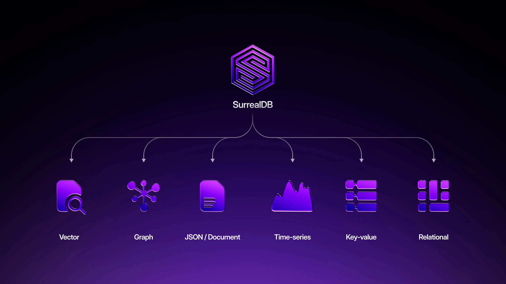

# Graph RAG does not need a graph database. It needs a database that does everything.



How SurrealDB compares to Neo4j, Amazon Neptune, and ArangoDB for production graph RAG.

Graph RAG is the right idea. Using relationships between entities to scope and improve retrieval produces better results than vector similarity alone. The research is clear on this. What the research does not address is where those operations execute, and that turns out to be the question that actually matters in production. Here is what happens when you try to build production graph RAG across a typical multi-database stack, and what changes when every operation composes in a single system.

## The gap: what graph RAG actually needs in production

Most graph RAG implementations follow the pattern from Microsoft's GraphRAG paper: extract entities from documents, build a knowledge graph of those entities and their relationships, then traverse that graph at query time to pull relevant context. The graph is derived from the content. It is an inferred structure that helps you find documents that are semantically connected through shared entities.

That works for document discovery over a static corpus. It does not work for a production agent that needs to serve a specific customer, respect access control, enforce tenancy, check data freshness, and ground its answers in real business relationships rather than inferred ones.

A production graph RAG pipeline needs all of the following in a single retrieval step:

**Ground truth relationships.** This customer purchased this product. This product has this known defect. This defect maps to these knowledge base articles. These are not inferred from document content. They are transactional facts from your purchase system, your CRM, your product catalog. The graph traversal that scopes retrieval needs to follow these real edges, not entity co-occurrence.

**LLM-inferred relationships.** This knowledge base article documents a fix for this issue. This article is related to that article. These connections are useful and hard to create manually at scale. An extraction pipeline reads the article and the issue description and decides they are connected. This is exactly what the GraphRAG pattern provides, and it is valuable.

**Structured filters.** Type constraints, tenant isolation, permission checks. Not every document that is relevant is valid for this agent to return to this customer.

**Temporal constraints.** The article was updated within 30 days. The product has not been discontinued. The issue is still active.

**Hybrid retrieval.** Vector similarity and full-text search, blended into a single relevance score, running against the candidates that survived everything above.

None of these are controversial. Every serious production RAG system needs them. The question is where they execute and whether they compose.

## The comparison: the same pipeline in SurrealQL and Cypher

Neo4j is the most established graph database. Since version 5.11, it has native vector indexes. It has full-text indexes. It can store properties on nodes and relationships. There is no technical reason you cannot build this entire pipeline in Neo4j.

Here is the retrieval operation in SurrealQL. Same scoping, graph traversal, hybrid search, and result set as you would build in Cypher, but expressed as a single statement with co-equal predicates:

```surrealql
SELECT
  id, title,
  vector::distance::knn() AS vec_dist,
  search::score(1) AS ft_score,
  (1 - vector::distance::knn()) * 0.65
    + search::score(1) * 0.35 AS blend,
  search::highlight('<em>','</em>',1) AS snippet
FROM knowledge_base
WHERE type = 'support'
  AND tenant = $tenant
  AND $agent_principal INSIDE allowed_principals
  AND updated_at > time::now() - 30d
  AND id IN
    $customer->owns->product
      ->has_issue->knowledge_base
  AND content_embedding <|100,COSINE|>
    $query_embedding
  AND content @1@ $query_text
ORDER BY blend DESC
LIMIT 10;
```

One statement. Co-equal predicates. One consistent snapshot.

In SurrealQL, the graph traversal, structured filters, vector search, and full-text search are co-equal predicates in a single `WHERE` clause. They compose the same way boolean conditions always compose: with `AND`. The query reads like a single thought. You can rearrange the predicates, add new ones, or remove them, and the statement still works.

In Cypher, the same operations require separate procedural steps. Vector search is a `CALL db.index.vector.queryNodes()` block. Full-text search is another `CALL db.index.fulltext.queryNodes()` block. The graph traversal is a `MATCH` pattern. The metadata filters are a `WHERE` clause. The blending is manual arithmetic in the `RETURN`. You are orchestrating five steps and correlating their results yourself. It works, but it reads like a script, not a query.

The readability gap is the obvious problem. The less obvious one is memory. Each procedural step in the Cypher pipeline `YIELD`s a result set into the execution context, and those intermediate results stay in memory while the next step runs. The vector `CALL` yields 100 nodes with scores. Those 100 nodes sit in memory while the `MATCH` clause runs graph pattern matching against them. The `MATCH` can fan out fast: if a customer owns 5 products, each product has 10 known issues, and each issue maps to 20 knowledge base articles, the pattern expands to 1,000 intermediate rows before any `WHERE` filter trims them. All materialized. All held. Then the full-text `CALL` runs and yields another result set that needs to be correlated with everything already in memory.

At production scale, this is not a theoretical concern. Combinatorial expansion in multi-hop `MATCH` patterns is one of the most common causes of out-of-memory failures in Neo4j. The intermediate state accumulates faster than the downstream filters can prune it, and the query planner cannot optimize across the boundaries between `CALL` blocks and `MATCH` clauses because they are procedurally separate operations. You end up tuning heap sizes, adding `LIMIT` hints mid-pipeline, or splitting queries into multiple round-trips to keep memory under control. All of which is managing a problem that does not need to exist.

In SurrealQL, because all predicates are co-equal in one `WHERE` clause, the engine sees every constraint upfront. It can start with the most selective predicate and narrow early before touching the expensive operations. There is no intermediate materialization between steps because there are no steps. The result set is built once, not accumulated across a pipeline.

This matters for day-to-day development too. When retrieval logic is a single composable statement, you can modify it, extend it, and reason about it as a unit. When it is a multi-step procedure, every change requires understanding the data flow between steps. Adding a new filter means figuring out which step it belongs to and whether it changes what gets passed to the next step. Removing a constraint means tracing its effects through the pipeline. The cognitive overhead scales with the number of operations, and production retrieval pipelines have a lot of operations.

## The deeper problem: your graph database is not your system of record

Neo4j is almost never where the data originates. The purchase happens in Postgres. The ticket gets created in a CRM. The permission change happens in an auth service. Neo4j receives all of that via sync jobs, CDC pipelines, or batch imports. It is a read replica of graph-shaped data. The same is true of Neptune and, in most deployments, ArangoDB. The graph database is downstream of the systems that produce the data your agent needs to reason over.

That is why the consistency problem exists in the first place. The graph is always behind the source of truth because it is not the source of truth. A permission gets revoked in the auth service, but the graph database does not see it for 50ms and the vector index does not see it for 200ms. An article gets updated in the CMS, but the vector store still has embeddings from the old version for up to 5 minutes. Each system is internally consistent. The inconsistency lives in the spaces between them. Your agent is reasoning over multiple realities simultaneously and does not know it.

SurrealDB is designed as a transactional system of record. The purchase record, the customer relationship, the product graph, the knowledge base articles, the embeddings, the agent's memory, and the LLM-inferred edges from extraction pipelines all live in the same database as first-class data. The ground truth edges are not synced from somewhere else. They are the transaction records:

```surrealql
BEGIN;

-- The purchase record IS the graph edge
RELATE customer:4821->purchased->product:drip_coffee_maker SET
  order_id = 'ORD-29481',
  purchased_at = time::now(),
  source = 'transaction',
  confidence = 1.0;

-- Product-to-known-issue edge (from engineering)
RELATE product:drip_coffee_maker->has_issue->product_issue:gasket_defect SET
  severity = 'moderate',
  confirmed_at = d'2026-02-15',
  source = 'engineering',
  confidence = 1.0;

COMMIT;
```

The moment that transaction commits, `customer:4821->purchased->product:drip_coffee_maker` is traversable. There is no sync job. There is no CDC pipeline. There is no replication lag. An agent querying one millisecond later sees it.

The LLM-inferred edges write to the same database. An extraction pipeline reads a knowledge base article and the issue description, decides they are connected, and creates the edge:

```surrealql
RELATE product_issue:gasket_defect->documented_in->kb:fix_base_leaks SET
  source = 'llm_extraction',
  confidence = 0.94,
  model = 'claude-sonnet-4',
  verified_by = NONE,
  created_at = time::now();
```

A single traversal now crosses both: `$customer->purchased->product->has_issue->documented_in->knowledge_base`. The first two hops are ground truth from the transaction. The last hop is LLM-inferred from the extraction pipeline. Every predicate in the query evaluates against the same ACID snapshot.

> This is not a convenience feature. It eliminates an entire category of infrastructure: the sync jobs, the CDC pipelines, the cache invalidation, the eventual consistency windows. Every one of those is a place where accuracy silently degrades. A database that is both the system of record and the query engine removes the gaps where those failures live.

## The landscape: how other graph databases handle this

SurrealDB is not the only database attempting to unify these operations. Every major graph database has recognized that vector search matters for graph RAG, and each has added some form of it. The question is not whether they support it. It is whether the operations compose, and what breaks when they do not.

### Neo4j

Neo4j is the most established graph database and the most natural comparison. As of v2026.01, Neo4j introduced a native `SEARCH` clause with in-index filtering as a preview feature. Before this, vector search could not be pre-filtered at all. You ran the vector index, got results, and filtered afterward. For years, this was a blocking issue for teams building multi-tenant RAG, and community threads going back to 2023 show developers hitting this wall repeatedly.

The new `SEARCH` clause is a step forward, but the `WHERE` subclause inside `SEARCH` supports only a subset of the full Cypher `WHERE` clause. Full-text search is still a separate procedure call that cannot compose with the `SEARCH` clause in a single statement. The graph traversal is still a separate `MATCH` pattern. So even with the improvement, you are still orchestrating procedural steps and correlating results between them, with the memory accumulation problem described earlier in this article. Neo4j is actively closing the gap, but as of today the composition is partial.

Where Neo4j remains the clear winner is deep graph analytics. The Graph Data Science library (community detection, centrality algorithms, pathfinding, node similarity at scale) is purpose-built and has no equivalent in SurrealDB. If your primary workload is analytical graph algorithms rather than transactional agent retrieval, Neo4j is the right tool.

### Amazon Neptune

Amazon Neptune is the default choice for teams already on AWS, and it illustrates the composition problem at the product level. Neptune is actually two separate products. Neptune Database is a transactional graph database with no native vector search. Neptune Analytics is an analytics engine with vector search and graph algorithms but designed for analytical workloads, not transactional retrieval. AWS's own "unified" graph solution is itself a two-database architecture.

Neptune Analytics has vector search, but with fundamental constraints. Vector index updates are explicitly not ACID compliant: changes to vector embeddings are non-atomic and become visible to concurrent queries immediately, even if the query that wrote them fails later. If a bulk load with embeddings fails midway, you end up with a partial set of embeddings and need to retry the entire operation. You can only create one vector index per graph, and it must be specified at graph creation time. There is no native full-text search. And because Neptune Analytics is an analytics engine, not a transactional store, it is designed for loading data from S3 or snapshotting from Neptune Database, not for serving live agent queries against data that changes in real time.

### ArangoDB

ArangoDB is the closest multi-model competitor to SurrealDB's architecture. It supports documents, graphs, key-value, full-text search (via ArangoSearch), and as of version 3.12.4, vector search via FAISS integration. On paper, it has every primitive under one roof.

ArangoDB's vector index requires a `--vector-index` startup flag that permanently alters the RocksDB storage engine and cannot be reversed. Since v3.12.6, ArangoDB has supported attribute pre-filtering on vector searches — you can place `FILTER` operations between `FOR` and `SORT` to narrow candidates before the vector index runs:

```javascript
FOR doc IN knowledge_base
  FILTER doc.tenant == @tenant
  FILTER doc.type == 'support'
  SORT APPROX_NEAR_COSINE(doc.embedding, @query_emb) DESC
  LIMIT 10
  RETURN doc
```

This addresses the multi-tenant filtering problem for attribute-based constraints and is a genuine improvement over earlier versions. Where the composition breaks down is the full retrieval pipeline. ArangoSearch (the full-text engine) uses a separate `SEARCH` operation with its own syntax and optimizer path. Graph traversals use `FOR v, e, p IN ... GRAPH` with a different iteration model. Vector search requires iterating over a collection directly with `APPROX_NEAR_*` functions. Composing all three — traversing a customer's product graph to scope candidates, running vector similarity against those scoped candidates, and blending in full-text relevance scores — requires orchestrating these as separate operations within AQL rather than expressing them as co-equal predicates in a single statement.

> The pattern across all three is the same. Each database has added vector search as a capability. None of them have made it compose natively with graph traversal, structured filters, and full-text search in a single atomic statement. The operations exist. The composition does not. That composition is the specific thing SurrealDB was designed to provide.

## Honest tradeoffs: when SurrealDB is not the right choice

If your primary workload is deep graph analytics (community detection, centrality algorithms, pathfinding over billions of edges), Neo4j's Graph Data Science library or TigerGraph's analytical engine are purpose-built for that. SurrealDB does not have an equivalent analytics library.

The honest question is whether your current retrieval accuracy is good enough. If your agents are producing correct results at an acceptable rate and the failure modes described in this article are not showing up in production, there is no reason to migrate. The architecture you have is working.

If you are trying to push accuracy higher and you are hitting a ceiling, the pattern is almost always the same: the individual operations work, but they do not compose. The vector search returns good candidates. The graph traversal follows the right paths. The filters check the right fields. But they run separately, against different snapshots, with intermediate results accumulating in memory, and the accuracy loss lives in the gaps between them. That is not a problem you can solve by tuning parameters. It is a structural limitation of running these operations across systems that were not designed to compose them. Closing that gap requires a database where graph traversal, vector search, full-text search, structured filters, and permission checks are co-equal predicates in a single atomic statement. That is what SurrealDB provides.

## Conclusion

Every graph database covered in this article can store graphs, run traversals, and return results. Most of them can now do vector search. The thing none of them can do is compose all of it in a single atomic statement against a single consistent snapshot while also being the transactional system of record for the data your agent reasons over.

That is not a feature gap. It is an architectural one. And it is the gap where retrieval accuracy goes to die.
