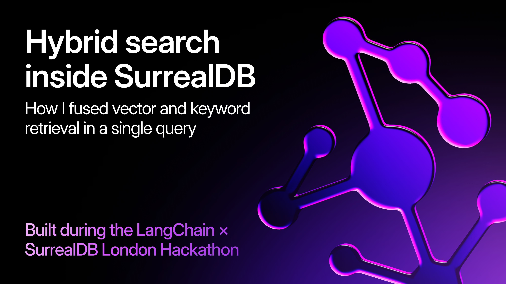
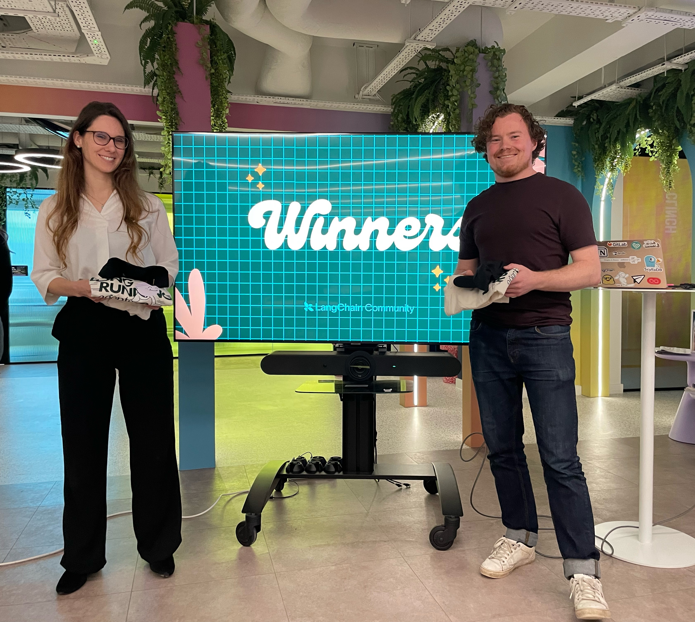
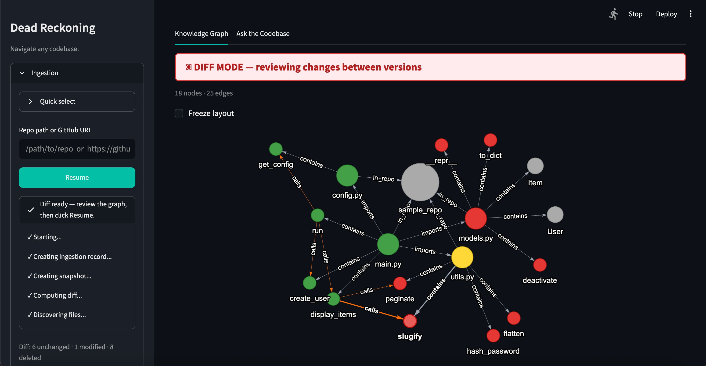
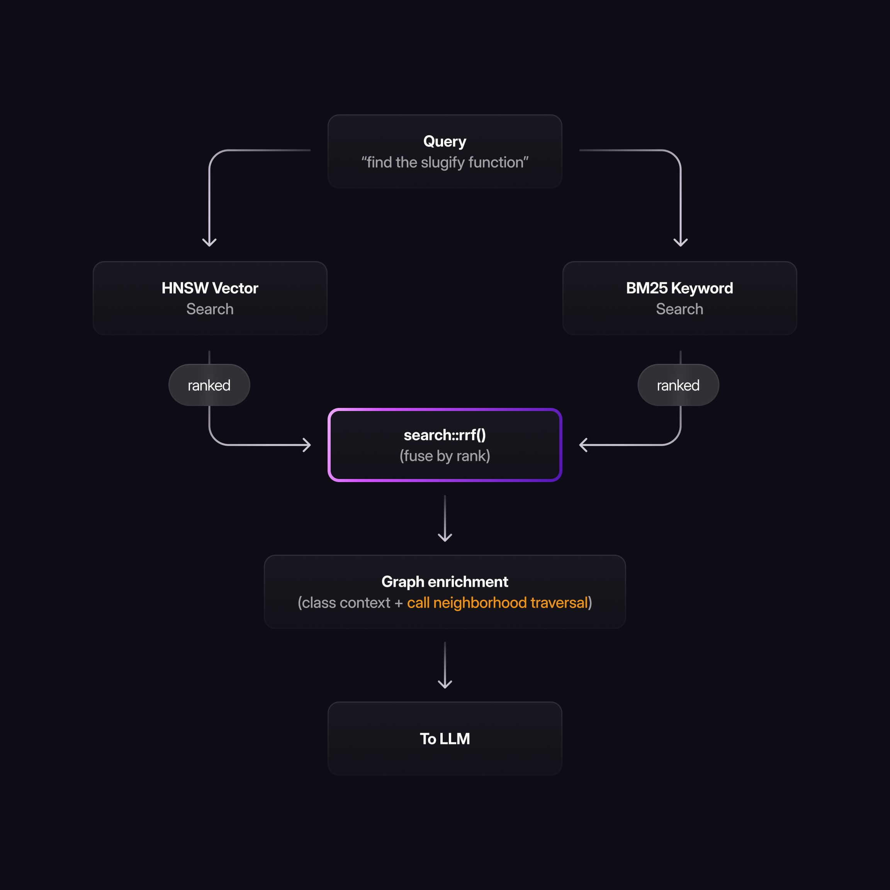
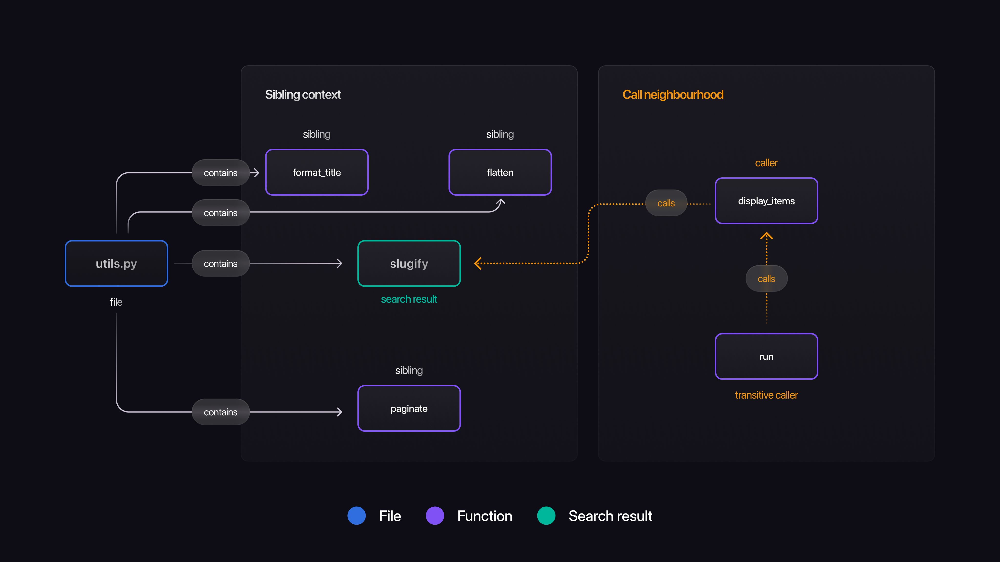
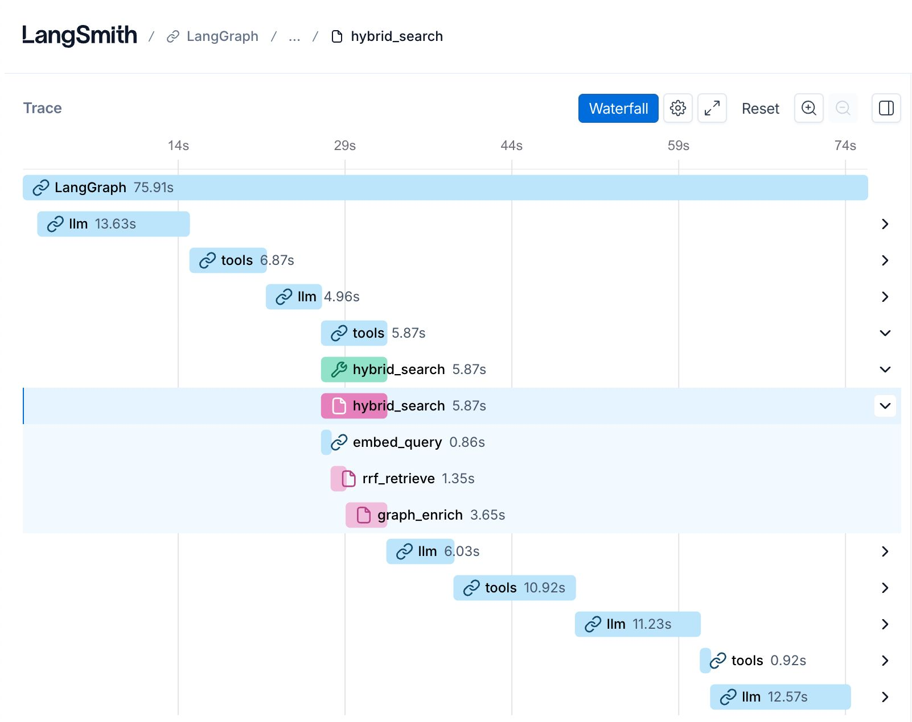

# Hybrid search inside SurrealDB



Author: [Archie Marshall](https://www.linkedin.com/in/atwmarshall/) - Applied AI Lead at Squad AI

*Built during the LangChain × SurrealDB London Hackathon*



> DeadReckoning was a winner in the LangChain × SurrealDB hackathon in London. Here’s the search architecture that powered it. Left to right, Júlia Sala-Bayo and Archie Marshall.

## TL;DR

- RAG systems fail when vector search returns *semantically similar* results instead of the *exactly named* function you asked for.
- The fix is hybrid search: vector + keyword in parallel, fused by Reciprocal Rank Fusion.
- SurrealDB's `search::rrf()` runs the whole thing inside the database - one query, no middleware, no score normalisation.
- With graph enrichment on top, a 3B local model handles codebase questions you'd normally need a frontier API for.

## The problem nobody tells you about RAG

Your RAG system returns confident, well-formatted answers. They’re also wrong -  because the retriever found semantically similar results instead of the actual function you asked for.

This is the problem I hit building DeadReckoning, a knowledge graph agent that turns any Python codebase into something you can query in plain English. You ask it: “what depends on the slugify function?” and it needs to find the function named slugify - not every function that does something similar to slugifying.

DeadReckoning was a winner in the LangChain × SurrealDB hackathon in London. One SurrealDB instance runs the entire backend: knowledge graph, vector store, agent checkpoint, and version history. But the layer that made everything else work was the search architecture.

The solution: run vector search and keyword search in parallel, then fuse them with Reciprocal Rank Fusion - in a single SurrealQL query. No application-side stitching. No separate search service. One database, one query, ranked results that handle both meaning and spelling.

Here's how I built it.



>

DeadReckoning ingesting a second version of a codebase. The knowledge graph diffs itself - green (unchanged), yellow (modified), red (deleted), blue (new). One SurrealDB instance stores the graph, runs the search, and checkpoints the agent state.

Repo: [https://github.com/atwmarshall/dead-reckoning/](https://github.com/atwmarshall/dead-reckoning/)

## Why vector search alone fails

HNSW vector search maps text into a high-dimensional embedding space where similar meanings cluster together. It’s powerful for open-ended questions like “what handles input validation?” because it understands meaning, not just words.

But it has a blind spot: spelling.

Search for “the slugify function” and vector similarity returns sanitise_input, clean_string, normalise_text. Semantically related - all text-cleaning functions - but you wanted the function named slugify. Embeddings don’t care about the name. They care about the neighbourhood.

For a codebase search system, this is a critical failure. Developers think in function names. When they ask for slugify, they mean slugify.

## Why keyword search alone fails

BM25 keyword search has the opposite problem. It’s excellent at exact matches but blind to meaning.

Search for “what handles HTTP connection pooling?” and BM25 looks for those exact words. The answer lives in \_transport.py with a docstring that talks about “session reuse” and “persistent connections”. Same concept, different vocabulary. Keyword search misses it entirely.

Neither strategy works alone. You need both. The question is how to combine them.

| Query | Vector only | Keyword only | Hybrid (RRF) |
|---|---|---|---|
| “find the slugify function” | sanitise_input, clean_string, normalise_text ❌ | slugify ✅ | slugify ✅ (rank 1) |
| “what handles HTTP connection pooling?” | \_transport.py ✅ | no results ❌ | \_transport.py ✅ (rank 1) |
| “find all validation helpers” | validate_input, check_schema ✅ | validate_input ⚠️ partial | validate_input, check_schema ✅ (both ranked) |

## Reciprocal Rank Fusion: merge by rank, not score

The naive approach to combining two search strategies is to normalise their scores and add them. This doesn’t work. Vector similarity scores and BM25 scores are on fundamentally incompatible scales. A cosine similarity of 0.82 and a BM25 score of 4.7 aren’t comparable - and normalising them introduces arbitrary assumptions about their relative importance.

Reciprocal Rank Fusion sidesteps this entirely. It ignores scores and uses rank positions instead.

The formula is simple: for each result, `sum 1 / (k + rank)` across all retrieval lists. k is a smoothing constant (typically 60 – see why here: [https://cormack.uwaterloo.ca/cormacksigir09-rrf.pdf](https://cormack.uwaterloo.ca/cormacksigir09-rrf.pdf)) that prevents the top-ranked result from dominating.

A function ranked 2nd in vector search and 3rd in keyword search scores higher than one ranked 1st in only one list. Results that appear high in multiple strategies get a compounding boost. Results that only one strategy found rank lower.

This is the same pattern used in production search systems at Elasticsearch and Azure AI Search. The difference: we’re running it inside the database.



>

The hybrid search pipeline. Vector and keyword search run in parallel inside SurrealDB, fused by rank with search::rrf(). Graph enrichment then adds class context and the call neighbourhood before results reach the LLM - all within the same database.

## The implementation: search::rrf() in SurrealQL

`search::rrf()` is available in SurrealDB and does rank fusion inside the database. Most databases require you to run vector and keyword search separately and fuse them in application code. SurrealDB does it in a single query with `search::rrf()`, making hybrid search a database-native operation. This means no middleware, no score normalisation logic, and no extra network hops. Here’s the full query:

```sql
-- HNSW Vector search: find functions semantically similar to the query                              
LET $vs = SELECT
		id,
		vector::similarity::cosine(embedding, $query_embedding) AS score                  
	FROM function
	WHERE embedding <|5,100|> $query_embedding;                                                  

-- BM25 Keyword search: find functions matching by name or docstring
LET $ft = SELECT
		id,
		search::score(0) + search::score(1) AS score                                      
	FROM function                                                                              
	WHERE name @0@ $keyword            
		OR docstring @1@ $keyword                                                               
	ORDER BY score DESC                                                                          
	LIMIT 10;

-- Fuse both result sets by rank position (k=60 smooths top-position influence)
RETURN search::rrf([$vs, $ft], 5, 60);  

```

Three statements. Let’s walk through each one.

The first runs a HNSW vector similarity search against the function embeddings. The `<|5,100|>` operator queries the HNSW index - 5 results, with `ef_search=100` controlling how many candidates the index considers during traversal.

The second runs a BM25 full-text search across function names and docstrings. The `@0@` and `@1@` operators reference separate BM25 indexes - one on name, one on docstring - both using the same analyzer. The numeric suffixes map to `search::score(0)` and `search::score(1)`, which means you can weight name matches differently from docstring matches.

The third fuses them. `search::rrf()` takes an array of result sets, a limit, and a `k` parameter. For each result, it calculates `1 / (k + rank)` from each list and sums them. The rank-based approach means you never need to normalise scores across incompatible scales.

**This runs inside SurrealDB.** No Python middleware. No post-processing. The database returns fused, ranked results ready for your LLM.

## Graph enrichment: context, not just results

Search gives you a ranked list of functions. But a function in isolation isn’t very useful to an LLM. The model needs context: what class does this function belong to? What other functions sit alongside it? What calls it, and what does it call?

After RRF returns the top results, I run three parallel queries on each one. SurrealDB stores the codebase as a knowledge graph - files, functions, classes, and call relationships as nodes and typed edges. For each search result, I query:

```sql
-- Parent class (nearest class definition above this function)      
SELECT name, bases FROM `class`                                                                        
	WHERE file.path = $path AND lineno < $lineno                                                         
	ORDER BY lineno DESC LIMIT 1;                                                                      

-- Sibling functions (same class, same file)                                                           
SELECT name FROM `function`                                                                        
	WHERE file.path = $path AND class_name = $class_name
	AND name != $name;                                                                                 

-- Call neighbourhood (graph traversal over calls edges)                                           
SELECT                                                                                               
	<-calls<-`function`.name AS callers,                                                                 
	->calls->`function`.name AS callees                               
	FROM $fn_id;   

```

The LLM now receives not just “here’s the function” but “here’s the function, its parent class, its sibling methods, and everything that calls it or that it calls.” That dependency context is what turns accurate answers into useful ones. It's also what lets the agent trace downstream impact when it spots something worth investigating.

This is where storing your search index and your knowledge graph in the same database pays off. The graph traversal after search is a SurrealQL query, not a separate service call. No network hop, no serialisation overhead, same database.



>

The context graph for a hybrid search query. The search result (slugify) is returned alongside its parent file, sibling functions, and call neighbourhood - all retrieved from the same SurrealDB instance in three parallel queries.

## Tracing every retrieval stage

When hybrid search returns bad results, you need to know which stage failed. Was the vector search returning irrelevant results? Did keyword search miss because of vocabulary mismatch? Did RRF rank them wrong? Did graph enrichment pull in unrelated context?

Every search request produces a trace with three separate spans: embedding, RRF retrieval (vector + keyword + fusion in a single SurrealDB query), and graph enrichment. Each span shows its inputs, outputs, and latency.



>

A single hybrid search request traced in LangSmith. Embedding is cheap (0.86s), the fused BM25 + HNSW query via search::rrf() runs in a single SurrealDB roundtrip (1.35s), and graph enrichment - traversing calls edges for callers and callees - dominates at 3.65s. That breakdown is exactly the kind of signal you need when a query returns the wrong answer.

This level of observability is essential for iterating on search quality. When a query returns wrong results, you open the trace and see immediately whether the problem is in retrieval, ranking, or graph context. Without it, debugging hybrid search is guesswork.

## What improved

Before hybrid search, DeadReckoning used vector-only retrieval. The failure pattern was consistent: exact-name queries returned semantically similar but wrong functions, and the LLM confidently answered based on the wrong context.

| Query type | Vector only | Keyword only | Hybrid (RRF) |
|---|---|---|---|
| Exact function name | ❌ Semantically similar | ✅ Correct | ✅ Correct (rank 1) |
| Semantic / conceptual | ✅ Correct | ❌ Vocabulary mismatch | ✅ Correct |
| Mixed (name + concept) | ⚠️ Partial | ⚠️ Partial | ✅ Both found |

The graph enrichment layer compounded the improvement. Even when the top result was correct, without class context and sibling functions the LLM often missed the full picture. With enrichment, answers went from “this function exists” to “this function exists in this class alongside these other functions, and it’s called by these three modules.”

## Why this works on a laptop

DeadReckoning doesn't need a frontier model. It runs on small local models via Ollama –CPU only, no GPU required. The default is gemma4:e2b, Google's edge-tier model designed for laptops and phones. During the hackathon I ran it on llama3.2:3b - Gemma4 hadn't been released yet, and llama3.2:3B was a fast small model to hand with usable tool calling capabilities. It's a 3B model that fits in 2GB of RAM and handles most queries, though structured tool calling gets flaky at that size. Either way: no API costs, nothing leaves your machine.

For context, some frontier models are estimated to have over a trillion parameters - hundreds of times larger. They cost dollars per session via API and require your data to travel to someone else’s infrastructure.

The reason a 3B model works here isn’t because the task is simple. It’s because the retrieval layer does the heavy lifting before the model sees anything. Hybrid search with RRF finds the right functions. Graph enrichment adds the class context and sibling functions. By the time the query reaches the LLM, the context is small, precise, and directly relevant - no noise, no irrelevant files, no hoping the model figures out what matters.

This is context engineering, not model engineering. The model doesn’t need to be smart enough to search an entire codebase. It needs to be smart enough to reason over five well-chosen functions and their relationships. A 3B model can do that.

There are tradeoffs. A larger model will reason better, handle more ambiguous queries, and produce more polished output. But for targeted code navigation - finding the right functions, understanding their relationships, answering specific questions - the gap is smaller than you'd expect when the context is good.

DeadReckoning is model-agnostic - you configure the Ollama model in your `.env` file and swap it for anything you have locally. The search architecture makes the model size a deployment choice, not a foregone conclusion. Run it on a MacBook Air. Run it air-gapped with zero API dependency. The infrastructure you have, not the infrastructure you wish you had.

This matters for regulated industries where data can’t leave the building, for teams that need to control costs, and for anyone who wants to stop paying per-token for context the model shouldn’t need in the first place.

## What I’d change

This was built in a hackathon, so there are things I’d do differently with more time:

**Per-analyser weighting in BM25.** I weight name matches and docstring matches equally. In practice, a name match is a much stronger signal. Adjusting the analyser weights would sharpen keyword search before it even reaches RRF.

**Feedback loop.** Logging which search results the LLM actually used in its answer would let us build a relevance feedback loop. Over time, the system could learn which RRF rankings led to correct answers and adjust accordingly.

## One query, one database

`search::rrf()` makes hybrid search a database-native operation rather than an application-layer concern. For anyone building retrieval systems on SurrealDB, this is the pattern to start with: vector for meaning, keyword for precision, rank fusion to combine them, and graph traversal to add context.

The entire search pipeline –from query to enriched, ranked results– runs inside a single SurrealDB instance. No separate vector database. No external search service. No middleware to maintain. One database, one query language, one set of credentials.

DeadReckoning is open source –full codebase and hybrid search implementation at [github.com/atwmarshall/dead-reckoning](https://github.com/atwmarshall/dead-reckoning/). Built with [Júlia Sala-Bayo](https://www.linkedin.com/in/julia-sala-bayo/) at the LangChain × SurrealDB London Hackathon.

If you're building retrieval on SurrealDB, or doing hybrid search anywhere else and want to compare notes, I'd genuinely like to hear from you. Find me on [LinkedIn](ttps://www.linkedin.com/in/atwmarshall/) –happy to swap war stories, especially around eval and observability for retrieval pipelines.

> **Archie Marshall** is an Applied AI Lead at Squad AI, building AI systems for regulated industries. He was a winner in the LangChain × SurrealDB London Hackathon with DeadReckoning, a knowledge graph agent for codebase navigation.

______________________________________________________________________

[Get started with SurrealDB](https://surrealdb.com/docs), create your [free SurrealDB Cloud account](http://app.surrealdb.com/c/sandbox/query), and join our [Discord community](https://discord.com/invite/surrealdb).
