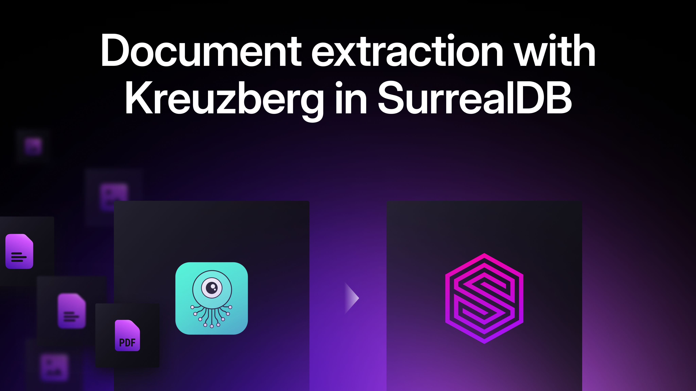
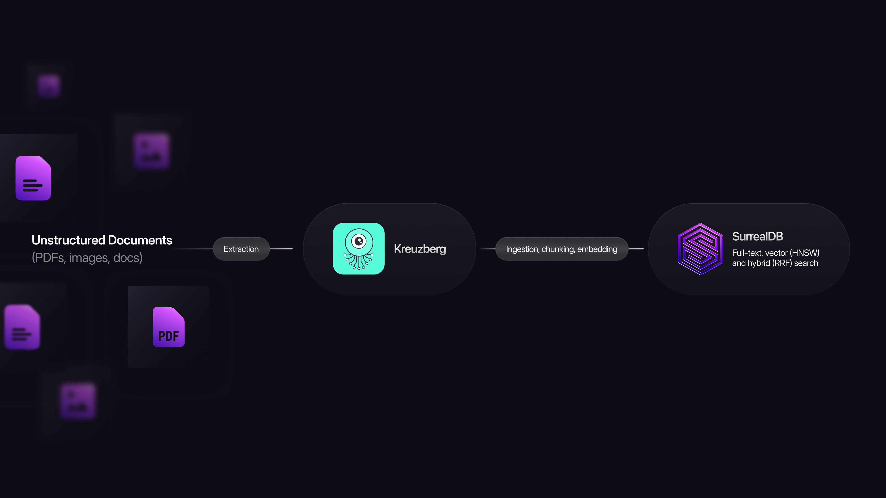

# Kreuzberg & SurrealDB: from unstructured documents to hybrid retrieval

We’re excited to share a new partner integration: **`kreuzberg-surrealdb`**, a connector that bridges the Kreuzberg document intelligence framework directly into SurrealDB. This integration was created by the Kreuzberg team and we are excited to have this functionality available now in SurrealDB.

Kreuzberg extracts, chunks, and generates embeddings from 88+ document formats, while SurrealDB provides a multi-model database for AI applications, combining documents, graphs, vectors, and full-text search in a single system.

Together, they make it easy to build document search and RAG pipelines.

## What the integration does

`kreuzberg-surrealdb` handles the full ingestion workflow:

- Automatic schema setup
- Content deduplication using SHA-256 hashing
- Storage and indexing in SurrealDB
- Documents ready for search immediately after ingest

The integration supports two modes:

- DocumentConnector:indexes full documents for BM25 keyword search.
- DocumentPipeline:chunks documents, generates embeddings, and enables semantic and hybrid search using HNSW vector indexes and Reciprocal Rank Fusion.

## Why it matters

Building document search systems often requires combining multiple tools for extraction, chunking, embeddings, and storage.

With `kreuzberg-surrealdb`, the entire workflow runs through a **single integration**—no schema boilerplate, no duplicate ingestion, and built-in support for **keyword, semantic, and hybrid search**.

## Get started

See how to get started in [SurrealDB Docs: Kreuzberg Integration](https://surrealdb.com/docs/build/integrations/ai-frameworks/kreuzberg?utm_source=kreuzberg_blog&utm_medium=blog&utm_campaign=kreuzberg_blog), and check out our example of [How to build a knowledge graph for AI with SurrealDB and Kreuzberg](https://surrealdb.com/blog/how-to-build-a-knowledge-graph-for-ai?utm_source=kreuzberg_blog&utm_medium=blog&utm_campaign=kreuzberg_blog#parsing-unstructured-data).
