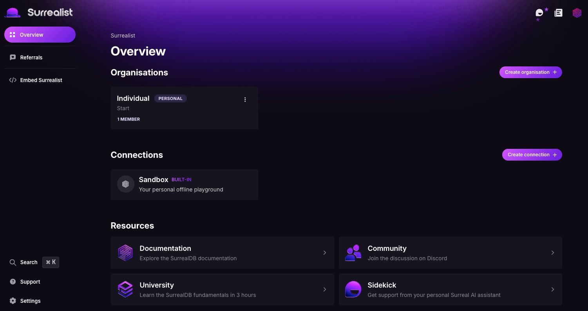
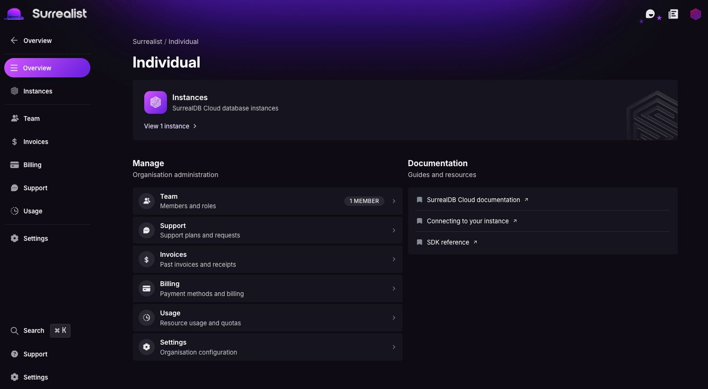
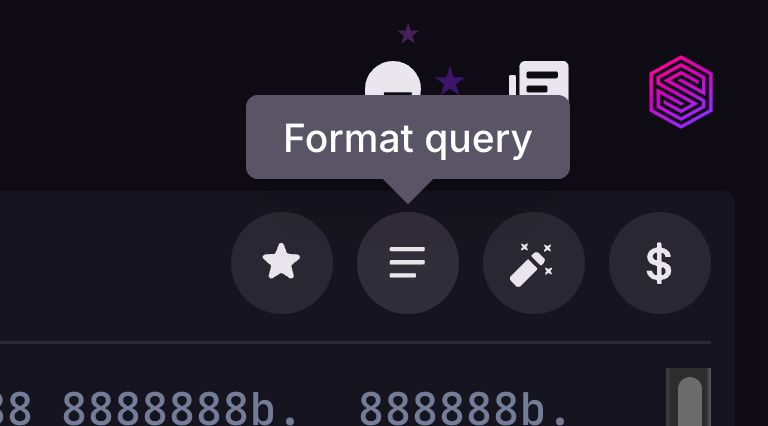

# What's new in Surrealist 3.8

We're excited to announce the release of Surrealist `3.8`! This version introduces exciting new features such as a fully redesigned navigation experience, improved query formatting, and much more. Let's dive into what's new 🎉.

> [!NOTE]
> If you are using Surrealist Desktop and this version does not appear automatically, please download the latest version by clicking [here](https://surrealdb.com/surrealist?download).

## Highlights

### Redesigned navigation experience

We have redesigned the overview page to give you a cleaner and more intuitive experience. This new flow merges the organisations page into the overview page so that organisations are right at your finger tips when opening the app.

Additionally, the organisation view has been fully redesigned from the ground up! This new sidebar navigation approach allows organisations to show more information than the previous tabs approach, making it easier to find your instances and view information at a glance.

### Quality of life improvements

This release contains also contains loads of quality of life improvements to make your experience using Surrealist even better! These include:

- An improved query formatting system with advanced configuration options for max line length, indentation mode, and indentation size
- A new request timer in the Query view which shows you the total time the request took for all queries
- A button to clear all notifications, rather than having to close each notification individually
- Advanced query result exporting in the Query view which allows you to export your query results as JSON or in CSV format
- A button to clear live query history

## Full changelog

- Redesigned overview page
- Redesigned organisation view from the ground up
- Improved namespace and database management
- Added a new query results exporter to export query results in JSON or CSV format
- Added a button to clear live query history
- Added a new and improved query formatting system
- Added a new clear notifications button
- Added a query runtime to the Query view to show how long your whole request has been running
- Fixed an issue with the macOS menu bar items not working
- Fixed an issue with macOS keybinds not working
- Fixed an issue with the escape key exiting full screen on macOS
- Fixed an issue with the Designer view causing crashes
- Fixed an issue with stale data causing crashes in the Explorer view
- Fixed an issue with syntax highlighting being the wrong color in light mode when searching
- Fixed missing horizontal and vertical scrollbars in the Explorer view
- Fixed an issue with record selections persisting across tables
- Fixed an issue where graph relations caused Designer view to crash
- Fixed an issue where large namespaces and databases would cause scrolling
- Fixed an issue with decimal points being truncated that were below 0.000
- Fixed an issue with record ids rendering in light mode when the app is in dark mode
- Fixed an issue where some error messages were not showing in the record inspector

We hope you enjoy these new features and improvements! As always, we appreciate your feedback and suggestions for future releases. [Join the SurrealDB Discord](https://discord.com/invite/surrealdb) - engage with the community and receive support.

Get started for free today - [app.surrealdb.com](https://app.surrealdb.com)
