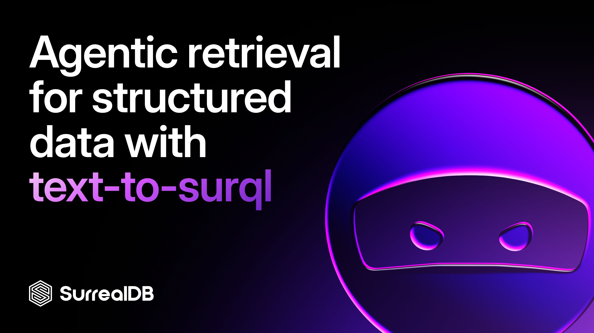
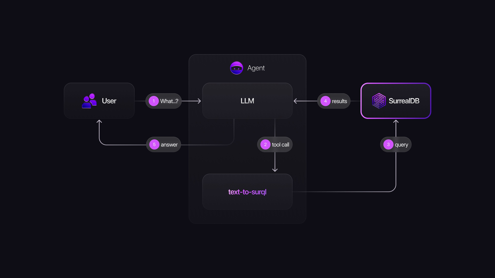

# Agentic retrieval for structured data with text-to-surql



RAG pipelines are commonly centred around processing unstructured data and indexing it with vectors or BM25. But when you have structured data, things change. You may still need semantic and full-text search, but the main challenge now is how to retrieve the structured data that sits in tables.

Yes, you could create an agent tool with a query to the DB to –for example– *fetch the records in the products table that match a specific category*. But then, you’ll need a new tool for each other query pattern, and unless you want your agent to have a very limited range of action, this is not the best solution.

This is where **text-to-surql** comes to help.

## Using a retrieval tool

Give the agent tools that speak the language of your database, and you’ll support infinite types of questions from your users [[1]](#footnotes).

Here's the flow:



The agent, with the LLM doing the reasoning, decides when to hit the database using the retrieval tool, which generates a valid SurrealQL query, executes it, and returns structured results.

## The SurrealQL generation tool

SurrealQL is uniquely well-suited for this because it’s a multi-model query language. In a single query, you can traverse graph relationships, filter document fields, and run relational aggregations. That means your agent doesn't need to orchestrate across multiple databases or data layers. One tool, one query, one result.

Let's walk through a real example first.

The tool itself is straightforward to build: a prompt template that includes the schema, a few-shot examples of good SurrealQL queries, and a SurrealDB client to execute the result. We'll cover that later.

**User asks:** *"can you summarize the reviews of my top 3 best selling products?"*

The tool generates:

```surrealql
LET $top = SELECT in.{id, name} AS product,
	math::sum(qty) AS total_sales
	FROM REL_PRODUCT_IN_ORDER
	GROUP BY product
	ORDER BY total_sales DESC
	LIMIT 3;

RETURN $top.map(
    |$p| {
        $p + {
            average_rating: (
                SELECT
                    product,
                    math::mean(score) AS avg_rating,
                    math::sum(1) AS review_count
                FROM review
                WHERE product = $p.product.id
                GROUP BY product
            )[0].avg_rating,
            review_count: (
                SELECT
                    product,
                    math::mean(score) AS avg_rating,
                    math::sum(1) AS review_count
                FROM review
                WHERE product = $p.product.id
                GROUP BY product
            )[0].review_count,
            sentiment_breakdown: (
                SELECT
                    sentiment,
                    math::sum(1) AS count
                FROM review
                WHERE product = $p.product.id
                GROUP BY sentiment
                ORDER BY count DESC
            ),
            recent_reviews: (
                SELECT
                    score AS rating,
                    created_at AS date,
                    text,
                    sentiment,
                    flow_sentiment
                FROM review
                WHERE product = $p.product.id
                ORDER BY created_at DESC
                LIMIT 10
            ),
        };
    }
);
```

**Result returned to agent:**

```surrealql
[
    {
        average_rating: 4.75f,
        product: {
            id: product:26,
            name: 'Yoga Mat Pro',
        },
        recent_reviews: [
            {
                date: d'2026-04-20T11:11:27.427351302Z',
                rating: 5,
                sentiment: 'possitive',
                text: "I bought this primarily for stretching and cool-down after lifting sessions rather than yoga proper. It does that job perfectly - thick enough that kneeling on a hard floor is comfortable, and it doesn't slide even on polished concrete. Rolled up it's compact enough to slip under my desk. No complaints whatsoever.",
            },
            {
                date: d'2026-04-20T11:11:27.427112844Z',
                rating: 4.5f,
                sentiment: 'possitive',
                text: "Non-slip is not an exaggeration - this mat grips the floor and my hands equally well even in sweaty hot yoga sessions. The 6mm thickness is the sweet spot between cushioning and stability for balance poses. TPE material doesn't have the chemical smell that cheaper PVC mats have. The carrying strap is a bit flimsy but functional.",
            },
        ],
        review_count: 2,
        sentiment_breakdown: [{ count: 2, sentiment: 'possitive' }],
        total_sales: 5,
    },
    {
        average_rating: 4.5f,
        product: {
            id: product:9,
            name: 'Canvas Tote Bag',
        },
        recent_reviews: [
            {
                date: d'2026-04-20T11:11:27.426732636Z',
                rating: 4.5f,
                sentiment: 'possitive',
                text: 'I use this as a daily carry and it holds everything - laptop, gym clothes, lunch, groceries. The interior zipper pocket is a lifesaver for keys and cards. Handles are reinforced and show no signs of wear after months of heavy use. The canvas has a slight stiffness that I actually like.',
            },
        ],
        review_count: 1,
        sentiment_breakdown: [{ count: 1, sentiment: 'possitive' }],
        total_sales: 3,
    },
    {
        average_rating: 5,
        product: {
            id: product:7,
            name: 'Linen Wrap Dress',
        },
        recent_reviews: [
            {
                date: d'2026-04-20T11:11:27.426633136Z',
                rating: 5,
                sentiment: 'possitive',
                text: 'This dress is exactly what summer dressing should be. The linen is lightweight and breathable, the wrap silhouette is flattering on multiple body types, and the tie actually stays put throughout the day. Ordered two in different colors.',
            },
        ],
        review_count: 1,
        sentiment_breakdown: [{ count: 1, sentiment: 'possitive' }],
        total_sales: 2,
    },
];
```

The agent now has exact numbers and reviews it can cite with confidence and trace back to a specific query against a specific table. That's what auditability looks like in production.

## Built-in permissions

SurrealDB's record- and field-level permissions and RBAC model mean that agents only see the data they're supposed to see – enforced at the database layer, not bolted on in application code. Multi-tenant agent deployments become straightforward: each agent session operates within the appropriate permission scope automatically.

[Learn more about SurrealDB’s security model.](https://surrealdb.com/docs/learn/security)

## How to build it

Here's how to put the pattern together from scratch.

**Step 1: Define your schema and expose it to the agent**

The SurrealQL generation tool needs schema context to know what tables, fields, and indexes it can play with. It needs this information to infer where to get the data from to answer the user’s question.

```surrealql
-- TABLE: product
DEFINE TABLE product SCHEMAFULL;
DEFINE FIELD category ON product TYPE record<category>;
DEFINE FIELD description ON product TYPE string;
DEFINE FIELD embedding ON product TYPE array<float> | none;
DEFINE FIELD name ON product TYPE string;
DEFINE FIELD price ON product TYPE float;
```

The schema context can be dynamically generated, see snippet below. But once your schema is stable, to avoid extra calls to the DB you can hardcode it (which also gives you more control on what to include in the context) or at least cache it.

```surrealql
-- example of how to dynamically generate your schema context
LET $db = INFO FOR DB;
$db.tables.values() +
$db.users.values() + 
$db.tables.keys().map(|$t| {
	LET $i = INFO FOR TABLE $t;
	$i.fields.?.values() + $i.indexes.?.values()
}).flatten().filter(|$v| !!$v);
```

**Step 2: Build the SurrealQL generation tool**

This is a function your agent can call. At minimum it needs:

- A system prompt with schema context and a few-shot examples of valid SurrealQL queries.
- A SurrealDB client to execute the query and return results
- Optional but recommended: catch any errors when executing the query, and ask the LLM to fix them and try again. Without this retry logic within the tool, the agent may retry the tool altogether, but the LLM call that generates the SurrealQL won’t include the error as context, because it’s not a parameter of the tool.

**Step 3: Wire up the agent tool**

This pattern is framework-agnostic. It works with Pydantic AI agents, LangChain's tool-calling agents, LlamaIndex's ReAct agents, or a custom loop. The key is to provide the agent with a clear tool description so it knows when to use it, e.g. “Use this tool to answer questions about products, orders, reviews, or users”. In the following example, you can see a fine-tuned description that hints to LLM to leverage the vector embeddings when available. In my use case, this prevents the LLM from searching products or categories by matching keywords, preferring vector search instead [[2]](#footnotes).

```python
async def query_db(context: RunContext[Deps], question: str) -> str:
    """Use this tool to answer questions about products, orders, reviews,
    or users.

    If required, you can do vector search against any table with an
    embeddings field.
    E.g: `WHERE embedding <|20,40|> fn::embed("text to embed")`.

    Args:
        question: The user question.
    """
    ...

```

```python
PROMPT_GEN_SURQL = """
You are an expert in SurrealQL (surql, SurrealDB's query language).

Generate a valid surql query to get the information required to answer the user's prompt.

PROMPT: {prompt}

<schema>
{schema}
</schema>

<best-practices>
{notes}
</best-practices>

<examples>
{examples}
</examples>
"""
```

Find more in [query_db.py](https://github.com/surrealdb/kaig/blob/main/examples/knowledge-graph/tools/query_db.py) and the [prompt template](https://github.com/surrealdb/kaig/blob/main/src/kaig/prompts/text_to_surql.py) in the [Kai G repo](https://github.com/surrealdb/kaig). If you are new to prompt engineering –or want a good refresher, I recommend watching [Prompting 101](https://www.youtube.com/watch?v=ysPbXH0LpIE) by Anthropic.

## Fine-tuning

LLMs are getting better and better at writing complex queries, but they don’t get it right all the time. This is why the prompt and few-shot examples are so important. The ones I shared above were the result of a few manual iterations. You can borrow them for your project, but your specific use case (and model) will require different hints.

Design your solution in a way that you have good observability to iterate quickly, and metrics to make sure you are moving forward. In my demo, I use Pydantic’s Logfire for observability, and store the results from the text-to-surql function and the query execution with a score. This allows me to capture queries that failed, identify the anti-pattern, and add a line to the tool prompt or a new example to avoid that mistake from surfacing again.

Some examples:

```yaml
- don't use `math::avg`, the correct one is `math::mean`.
- always `OMIT` the `embedding` field from the final result to avoid large results.
- vector::distance::knn() must be in SELECT to use in ORDER BY
```

## Conclusion

The next generation of production AI agents won't be distinguished by how good their embeddings are. They'll be distinguished by **how precisely they can retrieve and present facts** - with full auditability back to the source.

Agentic retrieval with a SurrealQL generation tool closes that gap. Instead of hoping a vector similarity search lands close enough, the agent reasons about your question, writes a precise query, and returns exactly the data you asked for. Every answer is traceable to a specific query against a specific table.

SurrealDB makes this pattern practical: multi-model queries mean the agent handles graph traversals, document lookups, and relational aggregations in a single round-trip, while record-level permissions keep data access secure by default.

If you're building agents that need to answer questions from structured data - and answer them **correctly** - this is the architecture worth building toward.

______________________________________________________________________

## Footnotes

[1] You probably don’t want users to have such power. If you allow users to ask any question, they may ask “change the price of SKU-0042 to $0, and create an order with 10 of them ready to checkout”.

[2] A full-text index could be a better idea, if what you are searching for can effectively be retrieved by lexical means, rather than semantically. And for some use cases [reranked hybrid search](../../2026/04/a-real-world-example-of-hybrid-fusion-search-using-the-surrealdb-docs-search.md) could be the right choice. Consider all alternatives based on your use case, and what you are optimising for.

______________________________________________________________________

**Ready to try it?**

- [Create a free SurrealDB Cloud instance](https://surrealdb.com/cloud)
- [Explore the SurrealQL docs](https://surrealdb.com/docs)
- [Join the SurrealDB Discord](https://discord.gg/surrealdb)

______________________________________________________________________

*Looking for related reading? Check out *[\*\*](https://www.notion.so/app/w/9zcowyqrmrdz3h4ykitn/file/blog/what-is-the-recommended-chunk-size)\*\*[*What chunk strategies exist and how to choose one?*](../../2026/05/what-chunk-strategies-exist-and-how-to-choose-one.md)* and *[*How to build a knowledge graph for AI*](../../2026/02/how-to-build-a-knowledge-graph-for-ai.md)*.*
