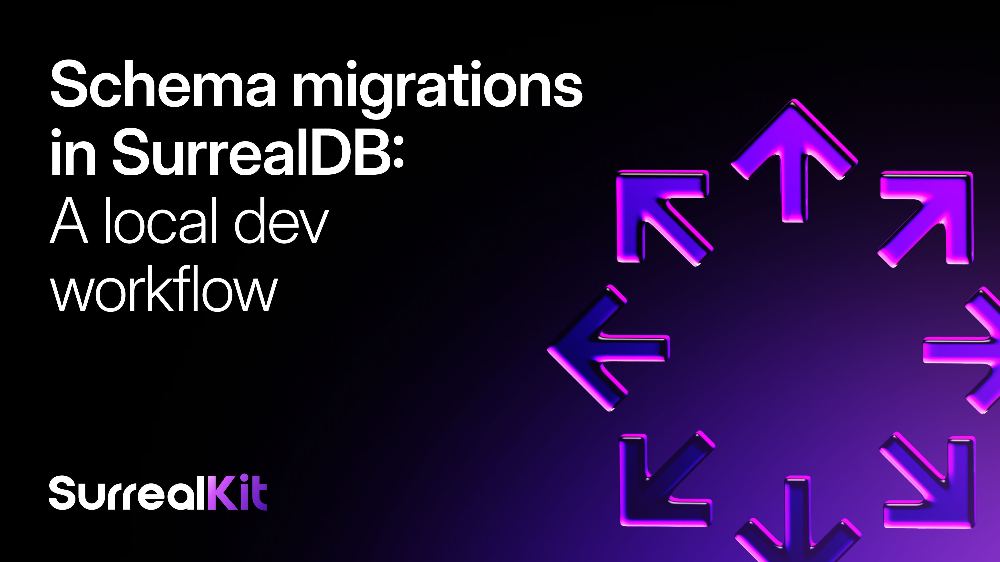

# Schema migrations in SurrealDB: A local dev workflow



This post walks through a proper migration workflow for local development using **SurrealKit,** an official tool from the SurrealDB team that handles schema sync, rollouts, seeding, and testing.

If you've spent any time working with SurrealDB, you know that with great flexibility comes the responsibility of managing your schema carefully. You're iterating quickly, adding tables, refining field definitions, and removing what you no longer need, and before long your local database can drift out of sync with what your code expects.

______________________________________________________________________

## What is SurrealKit?

SurrealKit is a CLI tool that manages your SurrealDB schema through `.surql` files. You define your schema as files, and SurrealKit keeps your database in sync with them.

It has two main modes:

- **Sync**: a fast, declarative approach for local and dev environments. Your files are the source of truth. Add something and it gets created, change it and it gets updated, remove it and it gets deleted.
- **Rollout**: a more controlled migration path for shared or production databases, with planning, staged execution, and rollback support.

For local dev, you'll mostly live in `sync`. Rollouts come into play when you're pushing to shared environments.

______________________________________________________________________

## Getting Started

Cargo is the Rust package manager. Cargo downloads a Rust package's dependencies, compiles the packages, makes distributable packages.

```cli
cargo install surrealkit
```

Or grab a prebuilt binary from the GitHub releases page if you don't want to compile it.

```cli
surrealkit init
```

This creates a `/database` directory with the scaffolding you need. SurrealKit connects to your database using environment variables, so add these to your `.env`:

```yaml
SURREALDB_HOST=localhost:8000
SURREALDB_NAME=myapp
SURREALDB_NAMESPACE=development
SURREALDB_USER=root
SURREALDB_PASSWORD=secret
```

It supports both `DATABASE_HOST` and `PUBLIC_DATABASE_HOST` variants, which is handy if you're working in a SvelteKit or similar setup where env vars are split by visibility.

______________________________________________________________________

## The Local Dev Workflow

### Writing Your Schema

Schema files live in `database/schema/`. Each file is a `.surql` file with your table definitions, indexes, access rules - whatever you'd normally write in SurrealQL.

The structure is entirely up to you. You might have one file per table, or group related things together. Either way, SurrealKit tracks what's in those files and reconciles it with what's actually in your database.

### Syncing Changes

When you've made a change and want to apply it:

```cli
surrealkit sync
```

That's it. SurrealKit diffs your schema files against the current database state and applies what's changed. If you deleted a table definition from your files, it removes it from the database too. Everything stays in sync.

For active development sessions, watch mode is where you'll spend most of your time:

```cli
surrealkit sync --watch
```

This watches your `database/schema/` directory and resyncs automatically whenever you save a file. It handles deletions too, if you remove a definition, it gets cleaned up. No manual intervention needed.

______________________________________________________________________

## Moving to Shared Environments

The sync approach is great for local databases you own completely. But the moment you're working against a shared or staging database, you need more control. That's what rollouts are for.

### Baseline First

Before your first rollout on an existing database:

```cli
surrealkit rollout baseline
```

This records the current state so SurrealKit knows what it's working from.

### Plan → Start → Complete

When you're ready to ship a schema change:

```cli
surrealkit rollout plan --name add_user_indexes
```

This generates a TOML manifest in `database/rollouts/` describing exactly what will change. You can review it, commit it, get it reviewed. Treat it like a pull request for your schema.

When you're ready to apply, you'll reference the manifest by its full filename. SurrealKit names these with a timestamp prefix: 20260302153045 translates to 2nd March 2026 at 15:30:45. This is the time the plan was generated, and it's there so rollouts always have a guaranteed sort order. If two people generate a plan on the same day, the timestamps keep them distinct and sequential. You'll see the full name in your database/rollouts/ directory after running plan.

When you're ready to apply:

```cli
surrealkit rollout start 20260302153045__add_user_indexes
```

This runs the non-destructive part of the migration. Once your application is deployed and you're confident everything is working:

```cli
surrealkit rollout complete 20260302153045__add_user_indexes
```

This finishes the migration, including any cleanup of legacy objects.

If something goes wrong mid-rollout:

```cli
surrealkit rollout rollback 20260302153045__add_user_indexes
```

You can also validate a manifest without touching the database:

```cli
surrealkit rollout lint 20260302153045__add_user_indexes
```

And check what state a rollout is in:

```cli
surrealkit rollout status
```

SurrealKit tracks rollout state in the database itself, so it's always resumable.

______________________________________________________________________

## Seeding

SurrealKit has a built-in seeding system for populating your local database with test data:

```cli
surrealkit seed
```

Seed files live alongside your schema in the `/database` directory. Useful for onboarding new team members quickly , they clone the repo, init SurrealKit, run sync and seed, and they're good to go.

______________________________________________________________________

## Testing

One of the more interesting features is the declarative testing framework. You write TOML test suites in `database/tests/suites/` and run them with:

```cli
surrealkit test
```

Each suite runs in an isolated ephemeral namespace, so tests can't interfere with each other or your actual data. You can test SQL assertions, permission rules, schema metadata, and even HTTP API endpoints.

A simple example, checking that a guest can't create an order:

```json
name = "security_smoke"

[[cases]]
name = "guest_cannot_create_order"
kind = "sql_expect"
actor = "guest"
sql = "CREATE order CONTENT { total: 10 };"
allow = false
error_contains = "permission"
```

You can also test permission matrices across a whole table at once, which is handy for verifying your access rules haven't regressed after a schema change.

For CI, add `--json-out` to get machine-readable output:

```cli
surrealkit test --json-out database/tests/report.json
```

The command exits non-zero on any failure, so it integrates cleanly with GitHub Actions and other CI / CD systems seamlessly.

______________________________________________________________________

## Putting It Together

Here's what a typical day looks like with this setup:

1. Pull the latest changes
1. Run `surrealkit sync` to update your local DB
1. Edit schema files in `database/schema/`
1. Use `surrealkit sync --watch` while you work
1. When you're done, run `surrealkit test` to make sure nothing broke
1. Commit your schema files alongside your code

For production changes, swap step 4 for `surrealkit rollout plan` and follow the plan → start → complete flow.

Would love to hear how you get on with SurrealKit. Jump into Discord and let us know how it goes or if you need a hand along the way
