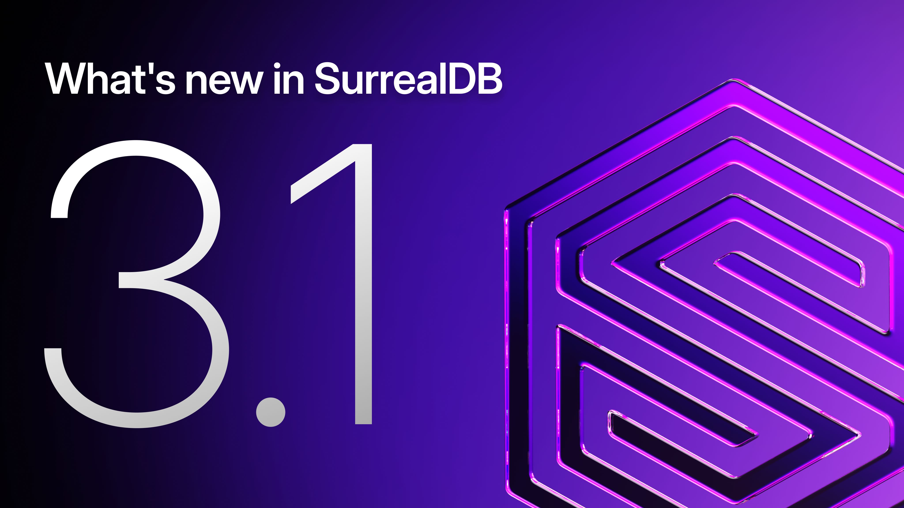

# SurrealDB 3.1: stability, DiskANN, and a new release process



Three months after 3.0 went GA, we're excited to announce that SurrealDB 3.1 is now available. This is the first minor release in the 3.x series. It builds on the foundations we shipped in 3.0 with a focus on stability, a second approximate-nearest-neighbour index in DiskANN, and a substantial round of security hardening. Alongside the release, we're also rolling out a change to how we develop and ship SurrealDB.

The full list of changes is in the [3.1 release notes](https://surrealdb.com/releases/3.1.0). Below are the highlights.

# What's new in 3.1

## DiskANN approximate-nearest neighbour index

SurrealDB now ships DiskANN as a second ANN index type, sitting alongside HNSW. DiskANN trades a different set of memory and recall characteristics and is well suited to larger-than-memory vector workloads, which has been a recurring request from teams building production agent and search systems on SurrealDB.

The introduction of DiskANN also drove an end-to-end overhaul of the ANN warm-lookup path. Both HNSW and DiskANN benefit from this work, with measurable improvements to warm-cache latency on the existing HNSW index for free.

You can pick the index type at definition time with the new `DEFINE INDEX ... DISKANN` syntax. See the release notes for the full set of options.

## GraphQL: aliases, cursor pagination, and multi-model filtering

SurrealDB v3.1 brings a significant upgrade to the GraphQL surface (with breaking changes), making it more expressive, more predictable, and easier to integrate with modern GraphQL clients.

The generated schema now follows Apollo conventions by default, with singular fetch, plural list queries, and `createX` / `updateX` / `deleteX` mutations, so you always know what to expect without consulting per-database config. Fields and tables can now carry `GRAPHQL_ALIAS` and `GRAPHQL_DEPRECATED` clauses directly in their definitions, letting you decouple your SurrealQL identifiers from the names your API consumers see:

```surrealql
DEFINE FIELD first_name ON person TYPE string
  GRAPHQL_ALIAS "firstName";

DEFINE FIELD legacy_score ON player TYPE int
  GRAPHQL_DEPRECATED "Use `rank` instead";
```

Cursor pagination arrives in this release too. Each table now gets a `<plural>Connection` query returning `edges`, `pageInfo`, and a lazily-evaluated `totalCount`, so you only pay for the count when you ask for it. Offset pagination via `limit` and `start` remains fully supported alongside it.

On the multi-model side, GraphQL queries can now reach across SurrealDB's full data model. Full-text search, vector similarity, and time-series aggregation are all directly queryable through the GraphQL API, unlocking AI-native and analytics-heavy workloads without touching SurrealQL.

This release also closes a range of reported issues: stale schema caches after DDL changes, invalid filter identifiers on nested array fields, missing `id` range and `in` filters, and `count()`-based predicates in `WHERE` clauses, all resolved and covered by integration tests.

## Improved in-memory performance

SurrealDB's in-memory backend now uses a datastore based on optimistic lock coupling. This improves performance by allowing readers to acquire lock-free access, only retrying at the end if a modification has occurred in the meantime. This allows readers to proceed without blocking writers, and vice versa.

## Stability and correctness

The bulk of the 3.1 work is bug fixes and stabilisation of the 3.0 line. This continues the stream of fixes that shipped in v3.0.1 through v3.0.5, with a substantial number of additional issues addressed across the query engine, indexing, and storage layers. If you upgraded from 2.x to 3.0 and hit any rough edges, there's a strong chance the relevant fix is in 3.1.

## Security hardening

3.1 closes a batch of previously reported security vulnerabilities, alongside a set of previously undiscovered issues that we found internally. The undiscovered ones come from an increased investment in LLM-assisted security review, in line with broader industry practice. Mozilla wrote a [good summary of this approach](https://blog.mozilla.org/en/privacy-security/ai-security-zero-day-vulnerabilities) recently. The combined result is a notably larger security section in this release than in previous ones.

The full security section is itemised in the release notes.

## Enterprise: audit logging and slow-query pipeline

Customers on the Enterprise tier get two new operational tools in 3.1:

- A structured audit log capturing authentication events, schema changes, and other actions of interest to compliance and security teams.

Both have been on Enterprise customer wishlists for a while, and we're pleased to have them shipping in 3.1.

## Other quality of life additions

Among the many changes mentioned in the 3.1 release notes, some of the changes that you won't want to miss are:

- A built-in MCP server for AI tools and IDEs,
- Unified OpenTelemetry metrics and logging pipeline,
- W3C trace propagation across HTTP and WebSocket,
- Full ALTER coverage for every DEFINE statement,
- And continued executor and index improvements beyond the in-memory engine.

## A new release process

3.1 is also the first release we've shipped under a new development workflow, and we want to be transparent about what's changed and why.

For most of SurrealDB's history, we've developed in public on the main `surrealdb/surrealdb` repository. When a security vulnerability needed addressing, we'd cut a temporary private fork, fix the issue there, cut a release, patch the SurrealDB Cloud fleet, and then make the release public. The intent was good. Development happened where the community could see it, and security fixes were embargoed only as long as they needed to be. In practice, though, this added real overhead to every security response. Cutting a fresh private fork for each issue, keeping it in sync with main, and merging the fix back when going public all took time we'd rather have spent on the fix itself.

Starting with 3.1, we've moved all development to a private repository. The public `surrealdb/surrealdb` repo remains the source of truth for releases, issues, and the source code that users read. Day-to-day commits now happen privately.

The cadence looks like this:

1. We develop and tag releases in the private repository.
1. When a release is ready, we announce it publicly and ship binaries and Docker images on the usual schedule.
1. Roughly 1 week after each release, we sync the private repository back to the public `surrealdb/surrealdb` repo.

The week between release and public sync gives us a private window to triage any issues or vulnerabilities reported against the new version before the corresponding commits become visible. We can ship a fix and roll it out across SurrealDB Cloud before the underlying issue is public. This is the same model used by most database and infrastructure projects at comparable scale, and it lets us close security issues as quickly as they're reported.

A few practical notes:

- **Issues, PRs, and discussions stay on the public repo.** Keep filing them on `surrealdb/surrealdb`. We watch and respond to them daily.
- **Security reports.** Use the GitHub Security Advisory flow on the public repo, or email `security@surrealdb.com`. Both reach us privately, and are the right route for anything you don't want disclosed publicly.

We don't expect this to be visible to most users in day-to-day use. If you follow commit-by-commit development on the public repo, the experience will change: you'll see batched updates around each release rather than a continuous stream. We think the security benefit is worth that tradeoff, and we plan to keep working this way for the foreseeable future.

# Try it

SurrealDB 3.1 is available now. Head to the [install page](https://surrealdb.com/install) to grab it for your platform.

If you're running on SurrealDB Cloud, instances are being rolled to 3.1 as part of our standard release cycle. No action needed.

Read the [full release notes](https://surrealdb.com/releases/3.1.0) for the complete list of changes, and come say hello on [Discord](https://discord.gg/surrealdb) if you hit anything along the way.
