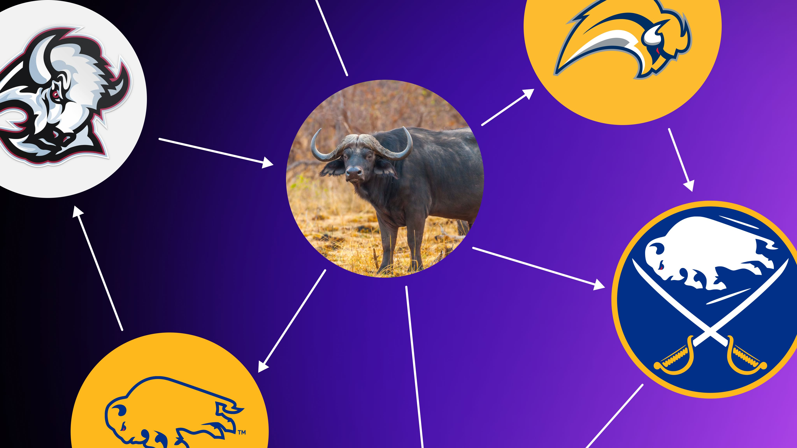
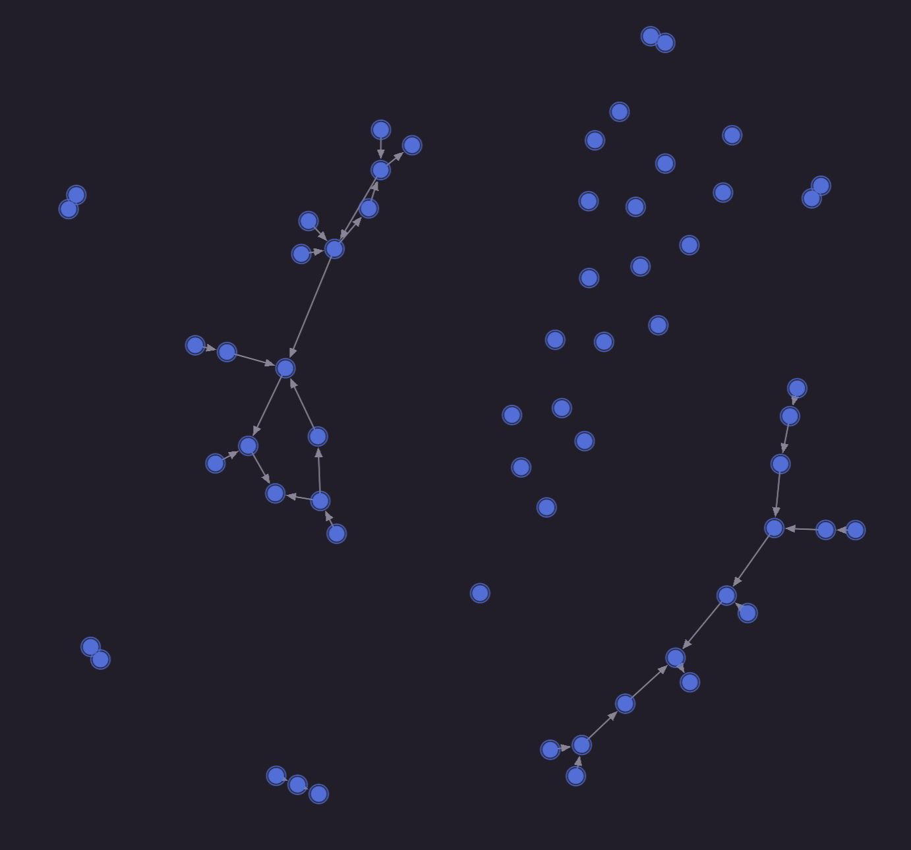
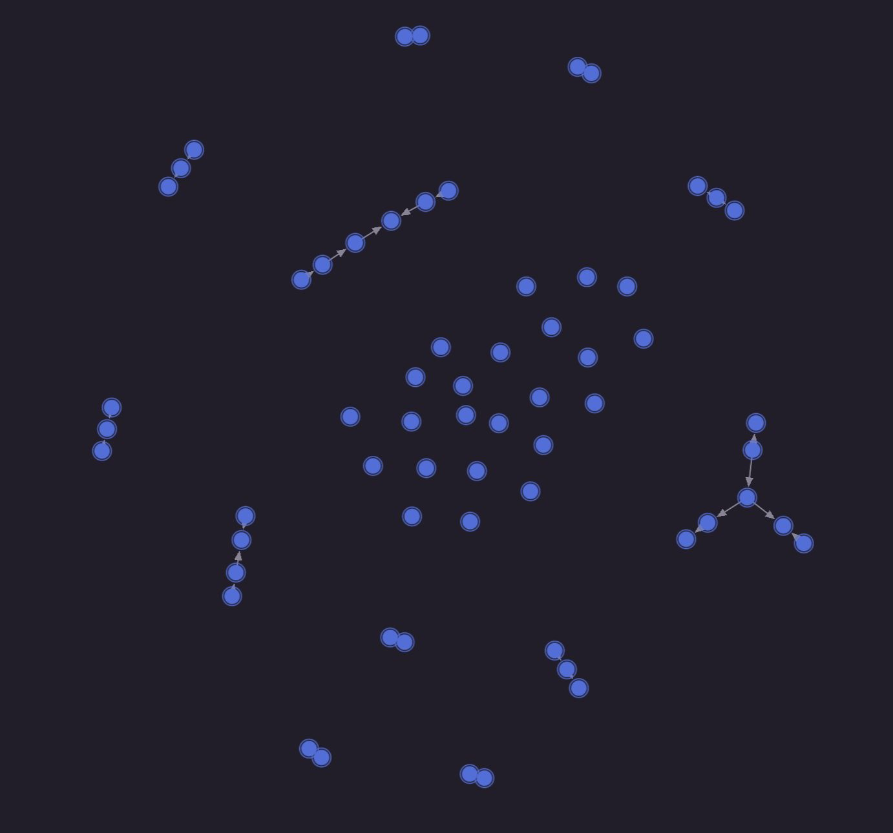

# Using SurrealDB to understand how Buffalo buffalo buffalo Buffalo buffalo



*Buffalo buffalo Buffalo buffalo buffalo buffalo Buffalo buffalo.*

That's technically a valid English sentence, one of the ones that [has its own Wikipedia article](https://en.wikipedia.org/wiki/Buffalo_buffalo_Buffalo_buffalo_buffalo_buffalo_Buffalo_buffalo) to explain just how it works. What makes it work is that the word buffalo is also a (rarely used) verb to mean [to bully or to fool someone](https://en.wiktionary.org/w/index.php?title=buffalo&oldid=90796509#Translations_2). Here's an example of the verb in practice:

> "If nonfiction is where you do your best writing, or your best teaching of writing, don't be *buffaloed* into the idea that it's an inferior species."

The other thing that makes the sentence confusing is that the word buffalo can also be the plural of buffalo. Fortunately, you can also pluralise it with an s - which is what we will do in this post from here on.

With a bit of rewriting and notes in parentheses, the sentence makes a *little* more sense.

> Buffaloes from Buffalo that buffaloes from Buffalo buffalo (trick) buffalo (trick) buffaloes from Buffalo.

If that still only makes just a bit of sense, don't worry - because we can demonstrate the situation using SurrealQL instead.

# Buffaloes that buffalo Buffalo buffaloes

To start: if we have Buffalo buffalo, that means that there should also be non-Buffalo buffalo: buffalo that don't come from the city of Buffalo. Let's make 50 of each. Two following two `CREATE` statements will create them with a sequential ID starting from 1 and ending at 100.

```surrealql
CREATE |buffalo:1..=50| SET from = "Buffalo";
CREATE |buffalo:51..=100| SET from = "Somewhere else";
```

Now we need to get the buffaloes to interact with each other.

Since the original sentence is talking about how a buffalo can buffalo another buffalo, that must mean that this sometimes happens and sometimes does not. To demonstrate this, let's go through each buffalo, randomly choose a buffalo (with the [rand::enum()](https://surrealdb.com/docs/reference/query-language/functions/database-functions/rand#randenum) function) that is not the buffalo in question ([array::complement()](https://surrealdb.com/docs/reference/query-language/functions/database-functions/array#arraycomplement) will do that), and then use [rand::bool()](https://surrealdb.com/docs/reference/query-language/functions/database-functions/rand#randbool) to give it a 50% chance of buffaloing that buffalo.

```surrealql
FOR $buffalo IN SELECT * FROM buffalo {
    // We could do this in a single line but let's go one step at a time
    LET $all_buffalo = SELECT VALUE id FROM buffalo;
    LET $except_this_one = $all_buffalo.complement([$buffalo.id]);
    LET $other_buffalo = rand::enum($except_this_one);
    // Now that we have another buffalo, we'll flip a coin
    // to see if it gets 'buffaloed'
    IF rand::bool() {
        RELATE $buffalo->buffaloes->$other_buffalo;
    };
};
```

With that set up, we can do a query to see which Buffalo buffaloes are buffaloing Buffalo buffaloes, and who they are. To do that, we can use a `WHERE` clause to ensure that the buffalo in question is from Buffalo, and that the path `->buffaloes->buffalo.from` (the buffalo(es) that are getting buffaloed) contains the word "Buffalo".

```surrealql
SELECT 
    id, 
    from, 
    ->buffaloes->buffalo AS buffaloes
FROM buffalo 
WHERE 
    from = "Buffalo" 
AND 
    "Buffalo" IN ->buffaloes->buffalo.from;
```

Because half of the buffaloes are from Buffalo and half of these have buffaloed another buffalo, the output should show...about 25? Not quite, because some unlucky buffaloes have been buffaloed by more than one buffalo. We can demonstrate that by doing a reverse graph query on the buffaloes to see which ones they are being buffaloed by, followed by a filter to only retain the ones that have been buffaloed more than once.

```surrealql
(SELECT <-buffaloes<-buffalo AS buffaloed_by FROM buffalo)
    .filter(
        |$b| $b.buffaloed_by.len() > 1
    );
```

# Buffaloing back

Now it's time for justice to be done. Because the original sentence can actually be read as a decree.

> "No buffalo from Buffalo shall be buffaloed by a buffalo from Buffalo without the chance to buffalo back. Henceforth, any buffalo from Buffalo that Buffalo buffalo buffalo shall also buffalo a Buffalo buffalo."

Sounds fair.

To enact this decree, we will need to have every buffalo that is buffaloed by a buffalo from Buffalo now also buffalo another buffalo from Buffalo.

To start, we'll use much of the same query as above but turn it around. And this time we won't use rand::bool() because the buffalo from Buffalo in question that has been buffaloed now has a 100% chance of buffaloing another buffalo from Buffalo.

```surrealql
FOR $buffalo IN SELECT VALUE
    id
FROM buffalo 
WHERE 
    from = "Buffalo" 
AND 
    "Buffalo" IN <-buffaloes<-buffalo.from {
         LET $all_buffalo = SELECT VALUE id FROM buffalo;
         LET $except_this_one = $all_buffalo.complement([$buffalo.id]);
        LET $other_buffalo = rand::enum($except_this_one);
        RELATE $buffalo->buffaloes->$other_buffalo;
};
```

# Visualising all the buffaloing

We can finish this off by visualising the data to see all of the buffaloing that is going on, whether actively (buffaloing a buffalo) or passively (being buffaloed by a buffalo). The following two queries will show who is buffaloing and who they are being buffaloed by, depending on whether they are from Buffalo or not.

```surrealql
SELECT 
    id, 
    buffaloes->buffalo AS buffaloes, 
    <-buffaloes<-buffalo AS buffaloed_by
FROM buffalo 
WHERE from = "Buffalo";

SELECT 
    id, 
    buffaloes->buffalo AS buffaloes,
    <-buffaloes<-buffalo AS buffaloed_by
FROM buffalo 
WHERE from != "Buffalo";
```

The raw output of these queries is easy enough to read, but it's tough to get a top-level idea of what is going on here.

```surrealql
[
	{
		buffaloed_by: [
			buffalo:76
		],
		buffaloes: NONE,
		id: buffalo:3
	},
	{
		buffaloed_by: [
			buffalo:45,
			buffalo:18
		],
		buffaloes: NONE,
		id: buffalo:4
	},
	{
		buffaloed_by: [],
		buffaloes: NONE,
		id: buffalo:5
	},
//...
]
```

This is where Surrealist's graph visualisation comes into play. To use it, just click on the "Combined" button next to the button used to run a query and change it to "Graph". As long as a query contains the id of each record, it will be able to visually show which records are connected to which other ones.

You can also click on "Stray edges" to display records that aren't connected, which is what we will do here.

The output will differ every time these queries are executed and every time this functionality is used to generate a visual output in Surrealist, but for the most part you will notice that there is a lot more going on between the buffaloes from Buffalo than those from somewhere else. That makes sense, because the second RELATE operation that we used was only for, and between, buffaloes from Buffalo.

The first query between buffaloes from Buffalo should look somewhat busy with connections between quite a few, and a number of stray edges floating around in the middle.



The second query is a bit less so, with fewer connections between these buffaloes and a lot more stray edges.



# Learn more

Interested in learning more? Here are some more links and blog posts to get started.

- [Visualising your data with Surrealist's graph view](../../2025/03/visualising-your-data-with-surrealists-graph-view.md)
- [Enhance your musical skills with Surrealist's graph view](../../2025/06/enhance-your-musical-skills-with-surrealists-graph-view.md)
- [Agentic retrieval for structured data with text to surql](../../2026/05/agentic-retrieval-for-structured-data-with-text-to-surql.md)

And for another technically correct mind-bending sentence, check out the page on [James while John had had had had had had had had had had had a better effect on the teacher](https://en.wikipedia.org/wiki/James_while_John_had_had_had_had_had_had_had_had_had_had_had_a_better_effect_on_the_teacher).

# Ready to try it?

- [Create a free SurrealDB Cloud instance](https://surrealdb.com/cloud)
