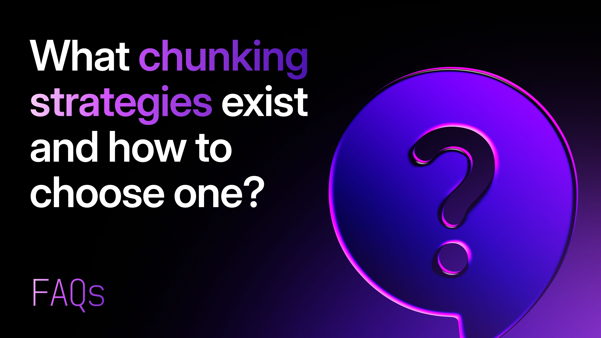

# What chunking strategies exist and how to choose one?



If you've decided to chunk your documents for a RAG pipeline or semantic search system, the next question hits almost immediately: **which chunking strategy should I use?**

Fixed-size? Semantic? Sentence-aware? Document-structure? The options multiply quickly — and picking the wrong one can quietly wreck your retrieval quality even if everything else in your pipeline is solid.

The good news: each strategy has a clear set of tradeoffs, and once you understand them, the right choice for your use case becomes much more obvious. This guide breaks down every major chunking strategy and gives you a practical framework for choosing between them.

## What Is a Chunking Strategy?

A **chunking strategy** is the method you use to split documents into smaller segments before embedding and indexing them in a vector store.

The strategy determines *where* splits happen — and that matters enormously. Split in the wrong place and you'll sever a sentence mid-thought, cut a code block in half, or lump together ideas that have nothing to do with each other. Any of these will degrade the embeddings you produce, and degraded embeddings mean worse retrieval.

Chunking strategy and chunk size work together, but they're separate decisions. This guide focuses on *how* to split. For guidance on *how much* to put in each chunk, see [What is the Recommended Chunk Size?](../../2026/05/what-is-the-recommended-chunk-size.md)

## Fixed-Size Chunking

**What it is:** Split text into chunks of exactly N tokens (or characters), with an optional overlap between consecutive chunks.

**How it works:**

```text
[Token 1 ... Token 512] [Token 462 ... Token 973] [Token 923 ... Token 1,434]
        Chunk 1                  Chunk 2                    Chunk 3
        |<--- 50-token overlap -->|    |<--- 50-token overlap -->|

```

**Pros:**

- Extremely simple to implement
- Fast and predictable — no parsing required
- Works with any document type without preprocessing

**Cons:**

- Completely ignores sentence and paragraph boundaries
- Can split mid-sentence or mid-idea, producing incoherent chunks
- Overlap only partially compensates for boundary problems

**Best for:** Large-scale pipelines where simplicity and throughput matter more than retrieval precision; use as a baseline before evaluating more sophisticated strategies.

## Recursive / Sentence-Aware Chunking

**What it is:** Split text by trying a hierarchy of separators in order — paragraphs (`\n\n`), then sentences (`.`, `!`, `?`), then words — until chunks fall within the target size.

**How it works:** This is the approach used by LangChain's `RecursiveCharacterTextSplitter` and similar libraries. Instead of cutting blindly at token N, the splitter looks for the nearest natural boundary — a paragraph break first, then a sentence end, then a word boundary — and cuts there.

**Pros:**

- Much cleaner chunk boundaries than fixed-size splitting
- Preserves sentence and paragraph integrity in most cases
- Simple to configure; widely supported in RAG frameworks

**Cons:**

- Still purely syntactic — doesn't understand meaning
- Long paragraphs with no natural breaks can still produce awkward splits
- Doesn't account for document structure (headers, sections, code blocks)

**Best for:** General prose documents — blog posts, articles, knowledge base content, support documentation — where natural language boundaries are reliable.

## Semantic Chunking

**What it is:** Split text based on shifts in *meaning*, not just syntax. Sentences are embedded, and a new chunk boundary is placed wherever the semantic similarity between consecutive sentences drops below a threshold.

**How it works:**

1. Embed each sentence individually
1. Compute [cosine similarity](https://surrealdb.com/docs/reference/query-language/functions/database-functions/vector#vectorsimilaritycosine) between adjacent sentences
1. Where similarity drops sharply, insert a chunk boundary
1. Merge the resulting segments up to your target size

**Pros:**

- Chunks align with actual topic shifts, not arbitrary token counts
- Produces the most semantically coherent chunks of any strategy
- Especially effective on documents that mix multiple topics

**Cons:**

- Significantly more expensive — requires an embedding call per sentence at index time
- Threshold tuning requires experimentation; too sensitive and you over-split, too loose and you under-split
- Slower indexing pipeline

**Best for:** High-value, heterogeneous documents where retrieval precision is critical — research papers, legal documents, long-form reports with multiple sections covering different topics.

## Document-Structure Chunking (Headers / Sections)

**What it is:** Use the document's own structure — headings, sections, page breaks, or metadata — as chunk boundaries.

**How it works:** Parse the document to identify structural markers (e.g. Markdown `##` headers, HTML `<h2>` tags, PDF section titles), then treat each section as one chunk. Optionally split further if sections exceed your target size.

**Pros:**

- Chunks map directly to logical, human-defined units of content
- Each chunk is inherently self-contained and titled
- Heading text can be prepended to the chunk for richer embeddings

**Cons:**

- Requires documents to have consistent, parseable structure
- Section length varies widely — some sections may be too long, others too short
- Doesn't work well on unstructured documents (plain text, transcripts, raw web scrapes)

**Best for:** Technical documentation, wikis, structured knowledge bases, and any content with consistent heading hierarchies (Markdown, HTML, Confluence, Notion exports).

## Sliding Window Chunking

**What it is:** Create overlapping chunks by sliding a fixed-size window across the document, advancing by a step smaller than the window size.

**How it works:**

```text
Window size: 512 tokens | Step size: 256 tokens

[0–512]    Chunk 1
[256–768]  Chunk 2
[512–1024] Chunk 3

```

Every token appears in multiple chunks, ensuring no information is ever isolated at a boundary.

**Pros:**

- Guarantees continuity — no information is ever stranded at a boundary
- Useful when context continuity is more important than avoiding redundancy
- Simple to implement

**Cons:**

- Significant index bloat — many more chunks per document
- High redundancy means higher embedding and storage costs
- Can hurt precision if retrieved chunks all contain the same content

**Best for:** Conversational transcripts, meeting notes, and documents where context continuity matters more than compactness; also useful as a fallback for documents with no clear structure.

## How to Choose: Decision Framework

Use this framework to quickly narrow down the right strategy for your use case.

### Step 1: What type of document are you chunking?

| Document Type | Recommended Strategy |
|---|---|
| Structured docs with headers (Markdown, HTML, Notion) | Document-structure chunking |
| General prose (articles, blog posts, support docs) | Recursive / sentence-aware |
| Dense heterogeneous content (research papers, legal) | Semantic chunking |
| Code repositories | Structure-aware (by function/class) — see below |
| Transcripts / conversational text | Sliding window or recursive |
| Unknown / mixed / quick prototype | Fixed-size (as baseline) |

### Step 2: How much does retrieval precision matter?

- Precision is critical(production RAG, customer-facing AI): Use semantic or document-structure chunking. The extra indexing cost is worth it.
- Precision matters but throughput is also important: Use recursive/sentence-aware chunking. Good results, low overhead.
- You're prototyping or throughput is the priority: Fixed-size chunking is fine to start. Upgrade later once you've validated your pipeline.

### Step 3: What are your infrastructure constraints?

- Tight latency / cost budget at index time: Avoid semantic chunking (requires per-sentence embedding). Use recursive instead.
- Storage is a concern: Avoid sliding window (high redundancy). Use recursive or structure-based.
- Using SurrealDB as your vector store: You can pair smaller chunks with graph relationships to add context at query time, reducing the pressure to have large, information-dense chunks. This makes recursive or document-structure chunking with smaller sizes a strong default.

### Step 4: A note on code

For code, no general-purpose text chunking strategy works particularly well. Use a **syntax-aware splitter** that splits by function, method, or class — most major languages have AST-based splitters available. A function is the natural semantic unit in code, the same way a paragraph is in prose.

## Quick-Reference Summary

| Strategy | Splits On | Best For | Watch Out For |
|---|---|---|---|
| Fixed-size | Token/character count | Prototyping, high throughput | Mid-sentence splits, loss of meaning |
| Recursive / sentence-aware | Paragraph → sentence → word | General prose | Long undivided paragraphs |
| Semantic | Meaning shifts (embedding similarity) | Heterogeneous / multi-topic docs | Cost, threshold tuning |
| Document-structure | Headers / sections | Structured docs (Markdown, HTML) | Inconsistent or missing structure |
| Sliding window | Fixed window + step | Transcripts, continuity-critical content | Index bloat, redundancy |

No single strategy wins universally. The best teams treat chunking strategy as part of their retrieval architecture — something to evaluate empirically with real queries against real documents — not a one-time decision made at setup.

## Get Started with SurrealDB

SurrealDB's native vector search, combined with its graph and relational capabilities, makes it a uniquely powerful foundation for RAG pipelines. Store embeddings, graph relationships, and structured metadata in one place — and query across all of them simultaneously. Smaller, more precise chunks become far more powerful when you can traverse graph edges to pull in related context at query time.

- 🚀 [Create a free cloud instance](https://surrealdb.com/cloud)
- 🛠️ [Start building](https://surrealdb.com/docs)
- 💬 [Join our Discord server](https://discord.gg/surrealdb)
