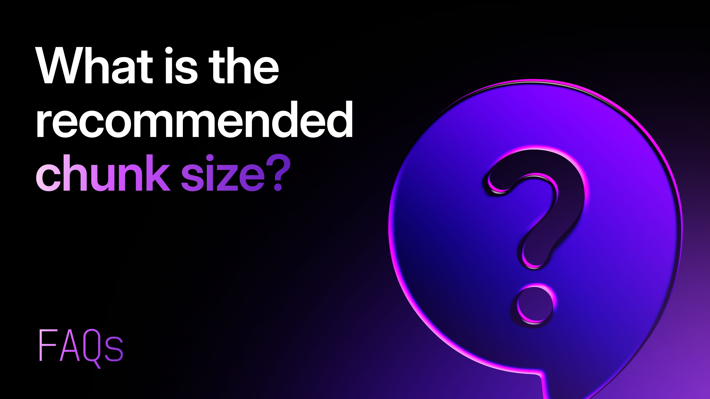

# What is the recommended chunk size?

If you're building a RAG (Retrieval-Augmented Generation) pipeline, a semantic search system, or any AI application that reads from a vector store, one question comes up almost immediately: **what chunk size should I use?**

It sounds deceptively simple. But chunk size is one of the most impactful decisions you'll make in your retrieval pipeline. Too small, and your chunks lose meaning. Too large, and you flood your LLM's context window with noise — and your retrieval precision tanks.

There's no single universal answer, but there *are* clear principles and well-tested starting points depending on your use case. This guide walks you through both.

______________________________________________________________________

## What is Chunking?

**Chunking** is the process of splitting a large piece of text into smaller segments before embedding and storing them in a vector database.

When a user asks a question, your system embeds the query and searches for the most semantically similar chunks — not the full documents. This means the quality of your chunks directly determines the quality of what gets retrieved, and therefore the quality of your LLM's response.

Chunk size (usually measured in **tokens**, not characters) refers to the maximum number of tokens each chunk is allowed to contain. A token is roughly ~4 characters in English, so 512 tokens ≈ ~2,000 characters, or about 3–4 paragraphs.

______________________________________________________________________

## Why Chunk Size Matters

Chunk size affects three critical dimensions of your RAG system:

### 1. Retrieval Precision

Smaller chunks tend to be more focused — they're about one specific idea. This makes it easier for a query to match the right chunk. Larger chunks contain more information, which can increase recall (you're less likely to miss something), but at the cost of precision.

### 2. Context Quality for the LLM

Once chunks are retrieved, they're passed into the LLM's context window. If chunks are too large, you waste context space with irrelevant text. If they're too small, the LLM may lack the surrounding context it needs to generate a coherent answer.

### 3. Embedding Quality

Embedding models have their own token limits (typically 512–8,192 tokens depending on the model). Exceeding the model's context window results in truncation — meaning the tail end of your chunk simply won't be embedded. More subtly, very long chunks produce embeddings that represent a "blurred" average of many ideas, making them harder to match precisely.

______________________________________________________________________

## Factors That Influence Chunk Size

Before picking a number, consider these variables:

| Factor | What to Consider |
|---|---|
| Embedding model | What's its token limit? (e.g. OpenAI's text-embedding-3-small supports up to 8,191 tokens, but shorter inputs often perform better) |
| LLM context window | How many chunks will you retrieve? k × chunk_size must fit in the LLM's context window |
| Document type | Dense technical docs vs. casual prose have very different ideal sizes |
| Query style | Short factual queries benefit from small chunks; broad conceptual queries benefit from larger ones |
| Overlap | Are you using chunk overlap to preserve continuity across boundaries? |
| Retrieval strategy | Hybrid search or graph-augmented retrieval can compensate for smaller chunks by adding relational context |

[Learn more about hybrid search](../../2026/04/a-real-world-example-of-hybrid-fusion-search-using-the-surrealdb-docs-search.md).

______________________________________________________________________

## Recommended Chunk Sizes by Use Case

These are well-tested starting points — treat them as defaults to tune from, not hard rules.

### General-purpose RAG / Q&A over documents

**Recommended: 512–1,024 tokens, with 10–20% overlap**

This is the most common setup and strikes a solid balance between precision and context richness. A chunk overlap of ~50–100 tokens ensures key sentences at boundaries don't get split in a way that loses meaning.

*Best for:* knowledge bases, documentation Q&A, internal wikis, product support bots.

______________________________________________________________________

### Short-form content (FAQs, product descriptions, reviews)

**Recommended: 128–256 tokens, no overlap needed**

When your source documents are already short and self-contained, smaller chunks work well. Each chunk maps closely to a single answer or concept, so retrieval is very precise.

*Best for:* e-commerce search, FAQ bots, review summarisation, support ticket classification.

______________________________________________________________________

### Long-form technical documentation or research papers

**Recommended: 1,024–2,048 tokens, with 10–15% overlap**

Technical content often has long logical chains — code samples, multi-step explanations, table references. Splitting these too aggressively destroys meaning. Larger chunks preserve those chains, at the cost of some retrieval precision.

*Best for:* developer docs, academic papers, legal documents, compliance materials.

______________________________________________________________________

### Conversational / chat memory

**Recommended: 256–512 tokens per turn or exchange**

For agent memory or conversation history retrieval, chunking by dialogue turn or a small window of turns works better than chunking by token count alone. The goal is semantic coherence per exchange.

*Best for:* AI assistants, customer support agents, voice AI (e.g. RAG over call transcripts).

______________________________________________________________________

### Code repositories

**Recommended: Chunk by function or class, typically 200–600 tokens**

Structure-aware chunking is far more effective for code than fixed-size chunking. A function or class is a natural semantic unit — splitting mid-function almost always hurts retrieval quality.

*Best for:* developer tools, code search, AI coding assistants, documentation generation.

______________________________________________________________________

## How to Test and Tune Your Chunk Size

No matter where you start, **you should treat chunk size as a hyperparameter and evaluate it empirically**. Here's a straightforward process:

### Step 1: Establish a baseline

Pick one of the recommended ranges above for your use case. Run your retrieval pipeline and collect a small evaluation set of question/expected-answer pairs (25–50 is enough to start).

### Step 2: Measure retrieval quality

For each question, check whether the correct chunk was retrieved in the top-k results. Useful metrics:

- Recall@k— was the correct chunk in the top k?
- MRR (Mean Reciprocal Rank)— how highly was it ranked?
- Answer faithfulness— did the LLM's answer actually reflect what was in the retrieved chunk?

### Step 3: Try adjacent sizes

Test the same eval set with chunk sizes ±50% of your baseline (e.g. if you started at 512, try 256 and 1,024). Compare retrieval metrics across all three.

### Step 4: Tune overlap

If you notice the right content *almost* gets retrieved — i.e. it's split across two consecutive chunks — increase overlap to 15–20%.

### Step 5: Consider your retrieval architecture

If you're using [SurrealDB](https://surrealdb.com/) for your vector store, you can pair small, precise chunks with graph relationships to provide the LLM with richer context — without inflating chunk size. This lets you keep retrieval precision high while still giving the model the surrounding context it needs.

______________________________________________________________________

## Summary

| Use Case | Recommended Chunk Size | Overlap |
|---|---|---|
| General RAG / Q&A | 512–1,024 tokens | 10–20% |
| FAQs / short content | 128–256 tokens | None |
| Technical docs / research | 1,024–2,048 tokens | 10–15% |
| Conversational memory | 256–512 tokens per turn | None |
| Code | Per function/class (~200–600 tokens) | None |

The right chunk size depends on your documents, your queries, your embedding model, and your retrieval architecture. Start with the recommended range for your use case, measure retrieval quality, and iterate from there.

______________________________________________________________________

## Get Started with SurrealDB

SurrealDB's native vector search, combined with its graph and relational capabilities, makes it uniquely powerful for building high-quality RAG pipelines. You can store embeddings, graph relationships, and structured metadata in one place — and query across all of them simultaneously.

- 🚀 [Create a free cloud instance](https://surrealdb.com/cloud)
- 🛠️ [Start building](https://surrealdb.com/docs)
- 💬 [Join our Discord server](https://discord.gg/surrealdb)
