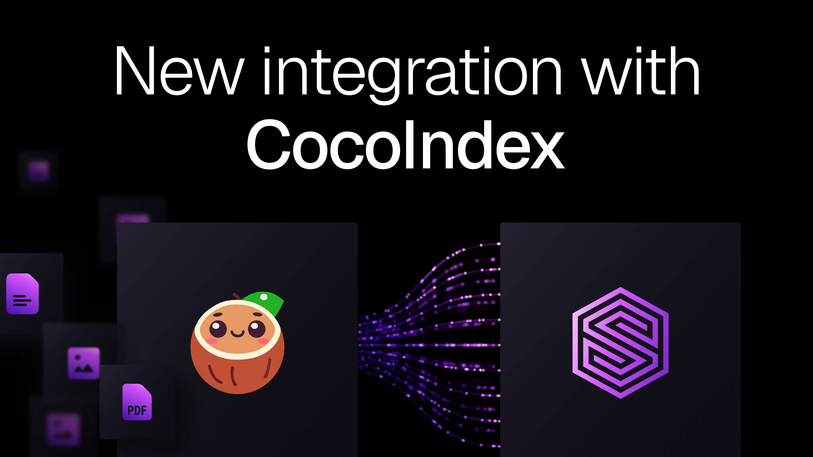

# A living knowledge layer for your agents: SurrealDB + CocoIndex



An AI agent is only as good as the context it can see - and most of that context is moving. Documents get edited, tickets get closed, new records land every minute. The usual answer is a batch job that re-embeds everything on a schedule and produces an index that's stale the moment it finishes.

It gets worse the moment you want *more* than vector search. As soon as you care about the relationships between the things you've embedded - who wrote what, which entity belongs to which deal, how one fact connects to another - you end up running a vector database next to a graph database next to a document store, and writing brittle glue to keep all three in sync.

Today that gets a lot simpler. **CocoIndex now ships a native SurrealDB connector**, so a single declarative pipeline can drive a document store, a knowledge graph, and a vector index - all inside one SurrealDB instance, all kept incrementally fresh.

## Why this pairing

[CocoIndex](https://cocoindex.io/) is an incremental engine for the data behind AI applications. Instead of writing imperative ETL, you declare the target state you want and the engine reconciles it. The model is closer to a spreadsheet or a React component than a cron job: you describe what should exist, and when a source changes, CocoIndex works out the delta. It identifies the affected records, propagates the change across lookups and joins, updates the target, and retires stale rows - without touching anything that didn't change. Python defines the logic; a Rust core handles high-concurrency execution and state. No full re-embeds, no drift.

SurrealDB is the multi-model database for AI agents: documents, graph, relational, and vectors in one engine, queried with one language. That's the natural home for CocoIndex output - because the SurrealDB connector doesn't just write a vector column. It supports:

- Normal tables - your documents, chunks, and structured records.
- Relation (graph edge) tables - the relationships between them, written as real SurrealDB graph edges you can traverse with->.
- Vector indexes - HNSW or DISKANN indexes.

So the knowledge graph and the embeddings live in the same store, populated by the same flow, kept consistent by the same incremental engine. Hybrid retrieval - vector similarity *and* graph traversal in a single SurrealQL query - stops being an integration project and becomes a query.

## What a pipeline looks like

A CocoIndex flow that embeds products, and writes the result into a SurrealDB table with a vector index is only a few lines:

```python
import cocoindex as coco
from cocoindex.connectors import surrealdb

SURREAL_DB: coco.ContextKey[surrealdb.ConnectionFactory] = coco.ContextKey("main_db")

@dataclass
class Product:
    id: str
    name: str
    price: float
    embedding: Annotated[NDArray, embedder]

@coco.lifespan
def coco_lifespan(builder: coco.EnvironmentBuilder) -> Iterator[None]:
    builder.provide(
        SURREAL_DB,
        surrealdb.ConnectionFactory(
            url="ws://localhost:8000/rpc",
            namespace="test",
            database="test",
            credentials={"username": "root", "password": "root"},
        ),
    )
    yield

@coco.fn
async def app_main() -> None:
    # Declare table target state
    table = await surrealdb.mount_table_target(
        SURREAL_DB,
        "products",
        await surrealdb.TableSchema.from_class(Product),
    )

    # Declare records
    for product in products:
        table.declare_record(row=product)

    # Declare a vector index
    table.declare_vector_index(
        field="embedding",
        metric="cosine",
        method="hnsw",
        dimension=384,
    )
```

Run it once to backfill. Run it again any time - only the files that actually changed get re-embedded. Point it at a live source and the index stays current on its own.

Because the connector also understands relation tables, the same pattern extends to graphs: extract entities from each document, mount a target per entity type, and `RELATE` them as you go. Add an entity type and a new table appears; remove one and it's cleaned up - no manual migration, no orphaned data. You get a knowledge graph that maintains itself.

## What you can build

This is the missing piece for a few things that were previously painful:

- **Hybrid RAG without the stitching**: Combine vector recall with graph traversal in one query, against one store, instead of federating results across Qdrant, Neo4j, and a document database.
- **Durable agent memory**: Give agents a context layer that's always fresh and richly connected, rather than a snapshot that decays between batch runs.

## Get started

The SurrealDB connector is part of CocoIndex v1. Install it and you're a few lines from your first pipeline:

```sh
pip install cocoindex[surrealdb]
```

- Connector in SurrealDB Docs: [surrealdb.com/docs/build/integrations/ai-frameworks/cocoindex](https://surrealdb.com/docs/build/integrations/ai-frameworks/cocoindex)
- Connector in CocoIndex Docs: [cocoindex.io/docs/connectors/surrealdb](cocoindex.io/docs/connectors/surrealdb)

We're excited to see what you build on top of it. Tag us in our socials - we'll boost it - or share in
