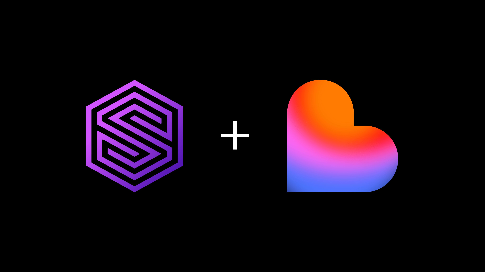

# Build apps on your data with SurrealDB and Lovable



Lovable turns a prompt into a working web app. SurrealDB is the one database behind that app, covering documents, graph, vectors, and SQL in a single engine. The piece that connects them is the Model Context Protocol (MCP).

As of [SurrealDB 3.1](https://surrealdb.com/releases/3.1), every SurrealDB instance can expose a first-party MCP server: a typed tool surface that AI agents call to inspect your schema and run queries safely. Lovable supports any MCP server as a chat connector. Put the two together and Lovable can build directly from the data you already have in SurrealDB.

This is vibe coding for teams that already own their data. Instead of letting an agentic coding tool improvise a throwaway backend, you point Lovable at SurrealDB and build on a database you already trust, with the AI agent reading your real schema as it goes.

This guide is a hands-on quickstart. By the end you will have SurrealDB 3.1 running with its MCP server enabled, connected to a Lovable project, and you will have prompted Lovable to generate a real interface on top of your data.

## What you'll need

You need a few things before you start, and none of them take more than a few minutes to set up.

You need SurrealDB 3.1.0 or later. The MCP server shipped in the 3.1.0 minor release, and we recommend running the latest patch (3.1.4 at the time of writing) for the newest fixes. You also need a way to reach your instance from the internet, because Lovable's chat connectors talk to your MCP server over HTTP and the server needs a public URL. A SurrealDB Cloud instance gives you one out of the box; for a local instance you can use a tunnel, which we cover below. You need a Lovable account, where the free tier is fine to get started and custom MCP servers are supported on all plans. Finally, you need some data. Even a handful of records is enough to see the workflow end to end, and we create a small schema below so you have something to build against.

It is worth noting how this differs from Lovable's native Supabase integration. With Supabase, Lovable provisions and owns a Postgres backend for the app it builds. With SurrealDB over MCP, you own the database. Lovable connects to a SurrealDB instance you already run, reads its schema as context, and can query or mutate it through a typed, permissioned tool surface. This is the right pattern when SurrealDB is your system of record and you want to build interfaces on top of it rather than spin up a new backend.

## How SurrealDB, MCP, and Lovable fit together

There are three moving parts to understand before the steps.

SurrealDB 3.1 exposes a typed tool surface for AI agents. Rather than handing an agent a raw SQL console, the MCP server presents twelve defined tools: `query`, `select`, `create`, `insert`, `upsert`, `update`, `delete`, `relate`, `info`, `list`, `use`, and `run`. Each tool carries annotations (`read_only_hint`, `destructive_hint`, `idempotent_hint`) so an MCP client like Lovable knows which operations are safe and which mutate data, and can prompt you before anything destructive runs. The server also publishes self-describing schema resources at URIs like `surrealdb://schema/ns/{ns}/db/{db}/table/{table}`, so the agent discovers your tables and fields instead of guessing.

You can run that MCP server two ways. Locally, `surreal mcp` runs as a stdio subcommand, which suits IDE integrations on your own machine. For a remote client like Lovable, the server is exposed over HTTP at `/mcp`, sitting behind SurrealDB's existing authentication middleware. We use the HTTP path here, because Lovable needs to reach your server over the network.

Lovable treats MCP servers as chat connectors. Once you register your SurrealDB endpoint, the Lovable Agent pulls your live schema and data into its context while it builds, and where you allow it, takes actions back against the database.

## Step 1: Install or upgrade to SurrealDB 3.1

If you are already on a 3.1.x release you can skip ahead. Otherwise, pick whichever install path matches your setup. Each pins to a specific version; drop the `--version` flag to always get the newest stable.

macOS (Homebrew), then upgrade in place:

```cli
surreal upgrade --version 3.1.4
```

Linux and macOS install script, which auto-detects your architecture:

```cli
curl -sSf https://install.surrealdb.com | sh -s -- --version 3.1.4
```

Windows (PowerShell), then upgrade in place:

```cli
surreal upgrade --version 3.1.4
```

Docker, to pull and run the exact image:

```cli
docker run --rm --pull always -p 8000:8000 surrealdb/surrealdb:v3.1.4 start
```

The `surreal upgrade` command can swap any existing install, whether Homebrew, install script, or manual binary, to the version you specify. Patch releases on the 3.1 line are drop-in upgrades: 3.1.4 introduces no SurrealQL surface changes and no on-disk layout changes from earlier 3.1.x releases.

If you are on SurrealDB Cloud, you can upgrade your instance in place from the Surrealist app, and you already have a public HTTPS endpoint, which makes the networking in Step 4 considerably simpler.

Verify your version:

```cli
surreal version
```

## Step 2: Start your instance and create some data

For a local run, start a server with authentication enabled. The MCP HTTP endpoint sits behind the same auth middleware as the rest of SurrealDB, so credentials matter here.

```cli
surreal start \
  --user root --pass "a-strong-root-password" \
  rocksdb://mydata.db
```

This starts SurrealDB on `http://localhost:8000` with a persistent RocksDB store and a root user. In production you would scope down to a namespace and database user rather than root, which we cover under permissions later.

Now give Lovable something to build against. Open a SQL session, or use [Surrealist](https://surrealdb.com/surrealist), the visual query tool, and define a small schema. We model a simple product catalog with reviews, which is enough to show off SurrealDB's [record links](https://surrealdb.com/docs/reference/query-language/language-primitives/record-links).

```surrealql
-- Pick a namespace and database to work in
USE NS shop DB catalog;

-- A products table
DEFINE TABLE product SCHEMAFULL;
DEFINE FIELD name        ON product TYPE string;
DEFINE FIELD price       ON product TYPE number;
DEFINE FIELD in_stock    ON product TYPE bool DEFAULT true;
DEFINE FIELD created_at  ON product TYPE datetime DEFAULT time::now();

-- A reviews table that links back to a product
DEFINE TABLE review SCHEMAFULL;
DEFINE FIELD product ON review TYPE record<product> REFERENCE;
DEFINE FIELD rating  ON review TYPE int ASSERT $value IN 0..=5;
DEFINE FIELD body    ON review TYPE string;

-- Seed a few records
CREATE product SET name = "Aeropress", price = 39.95;
CREATE product SET name = "Gooseneck Kettle", price = 64.00;
CREATE product SET name = "Burr Grinder", price = 129.00, in_stock = false;

```

A `SCHEMAFULL` table means SurrealDB enforces the field definitions, which is what you want when an AI agent is going to read and write the table. The schema becomes the contract the agent builds against. Because SurrealDB publishes that schema as an MCP resource, Lovable reads these field types directly rather than inferring them from sample rows.

## Step 3: Enable the MCP server over HTTP

In 3.1, the MCP HTTP surface is served at `/mcp` on the same port as the rest of the HTTP API, behind authentication. A handful of environment variables let you tune its limits. The defaults are sensible, but it is worth knowing they exist:

- SURREAL_HTTP_MAX_MCP_BODY_SIZE: maximum request body size (default 4 MiB)
- SURREAL_MCP_QUERY_TIMEOUT_SECS: per-query timeout (default 60 s)
- SURREAL_MCP_MAX_RESULT_BYTES: maximum result payload (default 256 KiB)
- SURREAL_MCP_RUN_MAX_ARGS: maximum arguments to the run tool (default 64)
- SURREAL_MCP_PARAMS_MAX_KEYS: maximum bound parameters per call (default 256)

For example, to allow larger result payloads while keeping a tight query timeout:

```cli
SURREAL_MCP_MAX_RESULT_BYTES=1048576 \
SURREAL_MCP_QUERY_TIMEOUT_SECS=30 \
surreal start --user root --pass "a-strong-root-password" rocksdb://mydata.db
```

If instead you want to wire SurrealDB into a local IDE rather than Lovable, run the stdio variant, `surreal mcp`, and point your editor's MCP client at that subcommand. For Lovable, stick with the HTTP endpoint.

A good sanity check before involving Lovable is to confirm the endpoint responds. The `/mcp` route speaks the MCP protocol (JSON-RPC over HTTP), so you will not get a friendly HTML page, but you can confirm it is reachable and that auth is being enforced. The important thing is that requests without valid credentials are rejected, which means the auth middleware is doing its job.

## Step 4: Make your instance reachable

Lovable runs in the cloud, so it needs a public URL for your MCP endpoint. You have two clean options.

The first option is SurrealDB Cloud. If your data lives in a SurrealDB Cloud instance, you already have a public HTTPS endpoint with managed TLS and authentication. Your MCP URL is simply that instance's address with the `/mcp` path appended. This is the lowest-friction path and the one we recommend for anything beyond local experimentation.

The second option is a tunnel to a local instance. For local development, expose `http://localhost:8000` through a tunneling service that gives you a temporary public HTTPS URL, such as [Cloudflare Tunnel](https://developers.cloudflare.com/tunnel/) or [ngrok](https://ngrok.com). Your MCP URL is then `https://<your-tunnel-host>/mcp`. This works well for trying things out, but treat the URL as ephemeral and never point it at production data.

Either way, you end up with a single value to hand to Lovable: an HTTPS URL ending in `/mcp`, plus the credentials needed to authenticate against it.

> **Security Note**: The MCP endpoint inherits SurrealDB's authentication and permissions. Before you expose anything, create a dedicated database user scoped to just the namespace and database you want Lovable to touch, rather than handing over root. SurrealDB enforces record-level and field-level permissions on every query the agent runs, so a properly scoped user cannot read or write beyond what you have granted, even if the agent asks it to.

## Connect SurrealDB to Lovable as an MCP chat connector

Now switch over to Lovable. Custom MCP servers are added the same way for every service, with no SurrealDB-specific dialog, because MCP is a standard.

1. In Lovable, open Connectors and go to the Chat connectors tab.
1. Click New MCP server.
1. Server name: give it something clear, like SurrealDB - shop/catalog.
1. Server URL: paste your MCP endpoint, for example https://your-instance.surrealdb.cloud/mcp or your tunnel URL ending in /mcp.
1. Authentication: choose how Lovable should authenticate. OAuth is Lovable's default, used when the server supports it. Bearer token or API key is the typical choice for a SurrealDB instance, where you supply a token for your scoped database user. No authentication should only ever be used for a throwaway local demo, never for real data.
1. Click Add server, or Add & authorize for OAuth.

Your SurrealDB server now appears in the chat connectors list. Chat connectors are per-user connections, so you can review or revoke them at any time from **Connectors**. On Business and Enterprise plans, workspace admins can control which MCP servers are available to the whole team under **Settings → Privacy & security** and the **Admin settings** panel.

## Build an app on your SurrealDB data with Lovable

With the connector live, the Lovable Agent calls SurrealDB's tools to discover your schema and read your records, then generates UI that is wired to that data.

Start by pulling your data into context with a prompt like this:

> Using my SurrealDB connector, list the tables in the shop/catalog database and show me the fields on the product table.

This prompts Lovable to call the `list` and `info` tools and read the schema resource, then report back what it found. Behind the scenes, `use` selects the `shop` namespace and `catalog` database, and the schema resource at `surrealdb://schema/ns/shop/db/catalog/table/product` tells Lovable that `product` has `name`, `price`, `in_stock`, and `created_at` with their exact types.

Once it understands your schema, ask it to build:

> Build a product catalog page that shows every product from SurrealDB as a card with its name, price, and stock status. Add a filter to show only in-stock items.

Lovable reads your live products via the `select` tool, scaffolds a front end, and binds the components to the real fields. Because the agent knows `in_stock` is a boolean from the schema, the filter it builds is correct on the first pass rather than a guess.

You can go further and let it traverse relationships, which uses SurrealDB's graph capabilities:

> Add a detail view for each product that lists its reviews, the rating and body, pulled from the review table that links to the product.

Here SurrealDB's record links do the heavy lifting. A SurrealQL query like `SELECT *, <~review.{ rating, body } AS reviews FROM product` fetches each product together with its reviews in one round trip. The `<~` operator walks incoming record references the same way graph queries do, and Lovable issues exactly that through the `query` tool.

When you ask Lovable to write data, such as adding a form to submit a new review, the agent reaches for the `create` or `insert`tool. Because those tools carry the non-read-only annotations, Lovable knows they mutate state and can surface a confirmation before anything is written. Your SurrealDB permissions remain the backstop: if the connected user lacks `CREATE` permission on `review`, the write fails at the database regardless of what the agent attempts.

## SurrealDB MCP tools reference

Knowing what each tool does tells you exactly what you can ask Lovable to do with your data.

- query: run arbitrary SurrealQL. The most powerful tool, and the one behind any complex read or graph traversal.
- select: read records from a table, optionally filtered.
- create and insert: add new records, with insert geared toward bulk.
- upsert: create or update depending on whether the record exists.
- update: modify existing records.
- delete: remove records, which is a destructive operation.
- relate: create graph edges between records, SurrealDB's relational strength.
- info: describe the structure of a namespace, database, or table.
- list: enumerate available namespaces, databases, or tables.
- use: select the namespace and database to operate within.
- run: invoke a defined function on the server.

The read-only tools (`select`, `info`, `list`) are safe to let an agent call freely. The mutating tools (`create`, `insert`, `upsert`, `update`, `delete`, `relate`) are the ones the hint annotations flag, and the ones your database permissions should govern most tightly.

## Monitor the Lovable agent with SurrealDB observability

In the 3.1 release, MCP tool dispatch emits per-tool request metrics alongside the existing GraphQL, HTTP, and WebSocket surfaces, all flowing through SurrealDB's unified OpenTelemetry pipeline. Metrics are exposed as Prometheus text on `/metrics` and can be pushed via OTLP.

In practice this means you can watch, in your own monitoring stack, exactly which MCP tools Lovable is calling, how often, and how long they take. If an agent is hammering `query` or a particular call is timing out, you will see it. For a workflow where an AI is touching your database, that visibility means you are never guessing about what the agent did.

## Production considerations for SurrealDB with Lovable

A few things are worth getting right before you let real users near a SurrealDB-backed Lovable app.

Scope the connected user tightly. Create a database-level user with only the permissions the app needs. SurrealDB's permission model is enforced on every query, including record-level and field-level `SELECT`, `CREATE`, `UPDATE`, and `DELETE` permissions, so the agent is constrained by the database, not just by good behavior. The 3.1.4 patch specifically hardened array element-level `SELECT` permission enforcement, which is another reason to run the latest patch.

Use the limits. The MCP environment variables exist to keep a chatty agent from overwhelming your instance. Set a sensible `SURREAL_MCP_QUERY_TIMEOUT_SECS` and `SURREAL_MCP_MAX_RESULT_BYTES` for your workload.

Prefer Cloud or a stable endpoint over a dev tunnel. Tunnels work for trying this out, but they are ephemeral and unauthenticated at the transport layer beyond what you configure. For anything persistent, a SurrealDB Cloud instance, or your own properly secured deployment, is the right home.

Remember the per-user connection model. Each Lovable user connects their own MCP credentials. If a team is building against shared data, plan how database users map to people, and use the workspace admin controls on Business and Enterprise plans to govern which servers are allowed at all.

## Where this leaves you

You now have a SurrealDB instance whose schema and data are first-class context for [Lovable](https://lovable.dev), exposed through a typed, permissioned, observable MCP surface. The same connection that lets Lovable build a catalog page would let it scaffold an admin dashboard, a customer-facing storefront, or an internal tool, all reading from and writing to the one database you control.

That is the shape of the SurrealDB and Lovable workflow: SurrealDB is the system of record and the source of truth for structure, and Lovable is the interface layer that builds on top of it. MCP is the standard that makes the two speak the same language, with no bespoke integration to maintain on either side. It is what turns vibe coding and agentic coding from a demo trick into a workflow you can run against your own production data.

From here, a few good next steps are to define a SurrealDB function and invoke it from Lovable via the `run` tool, so business logic lives in the database where the agent can reuse it; to model a richer graph with `RELATE` and ask Lovable to build views that traverse it; and to move from a dev tunnel to a [SurrealDB Cloud](https://surrealdb.com/cloud) instance and tighten your user permissions for a real deployment.
