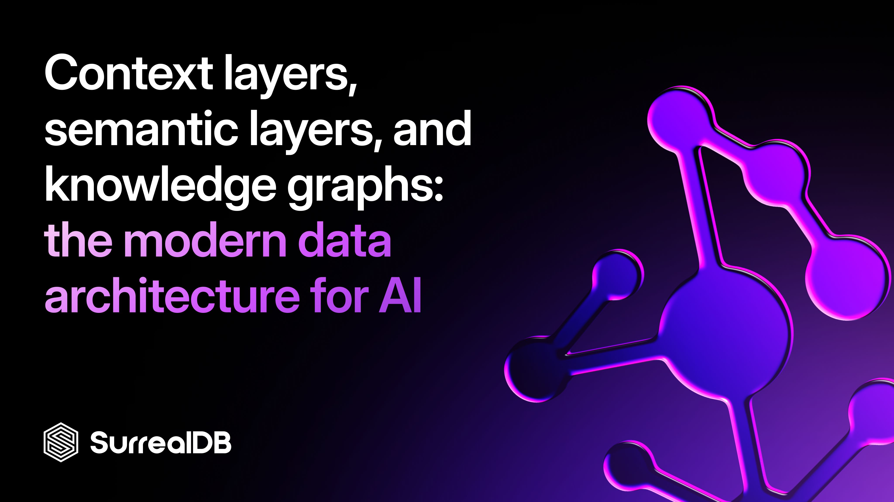
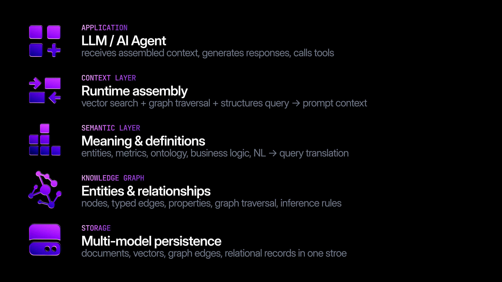
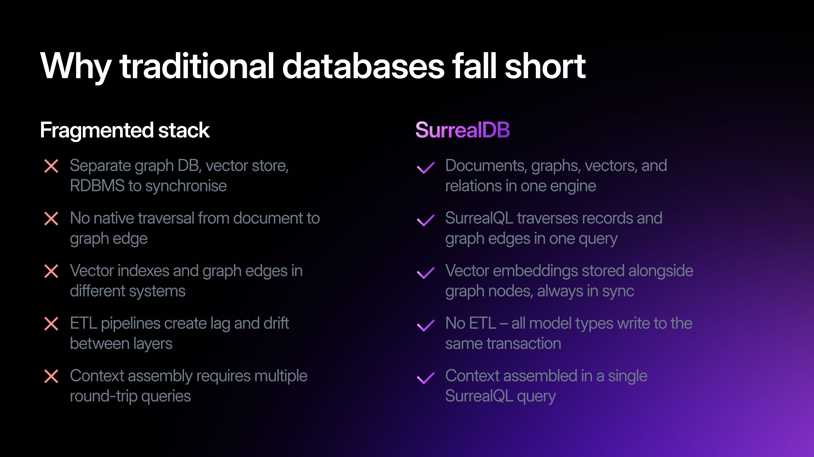

# Context layers, semantic layers, and knowledge graphs: the modern data architecture for AI



Three terms that every AI engineer and architect encounters - often confused, always critical. Here's what they mean, how they differ, and why SurrealDB's multi-model architecture lets you build all three without stitching together a fragile stack of specialist systems and databases.

# Definitions: what each term actually means

These three concepts are related but distinct. They operate at different layers of a data system and serve different purposes. Conflating them leads to overengineered stacks and brittle integrations.

- \*\*Context Layer: **The layer that gathers, filters, and packages data as context for an LLM or AI model. It answers:** \*\**what does the model need to know right now?*
- **Semantic Layer**: A persistent abstraction that translates raw data into business-meaningful concepts - metrics, dimensions, relationships. It answers: *what does this data mean?*
- \*\*Knowledge Graph: **A graph-structured store of entities (nodes) and typed relationships (edges) with attached properties. It answers:** \*\**how are things connected and what do we know about them?*

## **The context layer**

A context layer sits between your data systems and your AI model. When a user asks a question or an agent starts a task, the context layer enables the retrieval of relevant facts, documents, graph traversals, and structured data, then packages them into a prompt or message window. It is inherently dynamic - the context assembled for one query will differ entirely from the next.

Context layers are what makes retrieval-augmented generation (RAG) work in production. A naive RAG pipeline just does vector similarity search and hopes for the best. A production context layer combines vector search, graph traversal, structured queries, and recency signals to produce dense, accurate context with minimal irrelevant tokens.

Context layers are sometimes called **memory layers** in agent architectures - particularly when they maintain episodic memory (past conversations), semantic memory (persistent facts), and procedural memory (how to do things) across sessions.

## **The semantic layer**

A semantic layer is a persistent schema of meaning. It defines what your data represents - not just a `user_id column`, but a *Customer* entity with a *lifetime_value* metric computed from orders. It makes data queryable in business language, so a natural-language question like "what is our ARR by region?" can be translated into SQL or graph query without ambiguity.

For AI systems, semantic layers are critical for tool-use agents that query databases. Without one, the LLM has to infer schema from table names - a recipe for hallucinated responses, miss-interpretation of column names and wrong retrieval of data. With a semantic layer, the model has unambiguous definitions to work from.

Semantic layers grew up in the data warehouse and data lake world - dbt metrics, Databricks Unity Catalog, Looker's LookML. They're good at what they do. The problem is they were designed for BI and analytics, not for AI inference time. Your LLM doesn't need a dashboard. It needs a definition it can reason from at runtime, co-located with the data it's querying, and with rich data models and formats including graph relationships.

## **The knowledge graph**

A knowledge graph is a data structure: nodes (entities like `person`, `product`, `organisation`) connected by typed edges (`employes`, `purchased`, `competes_with`) each carrying properties. Unlike a relational table, a knowledge graph stores the relationship itself as a first-class object. Unlike a document store, it can traverse arbitrary-depth connections efficiently.

Knowledge graphs underpin enterprise ontologies, recommendation engines, fraud detection, and the entity resolution pipelines that give AI systems a coherent world model. They are the substrate on which semantic reasoning runs.

# Why these layers matter for AI agents

Large language models have no persistent memory and no inherent access to your organisation's data. Every capability you see in production AI - answering questions about your customers, reasoning about your products, navigating complex entity relationships - requires an explicit data architecture underneath.

The three layers form a stack. The knowledge graph stores your world model. The semantic layer defines what that model means. The context layer retrieves the right fragment of it at inference time.



# Why a fragmented stack falls short

Most organisations try to build this stack by stitching together a graph database (e.g. Neo4j), a vector store (e.g. Pinecone, Qdrant, Weaviate, or Postgres pgvector), a relational database (e.g. Postgres, MySQL, SQL Server), and a semantic layer tool (dbt, Cube). The result is four synchronisation problems, four query languages, four failure modes, and data that diverges between systems the moment you write it.

Data platforms like Databricks, Snowflake, and BigQuery excel at the analytical layer - batch processing, historical queries, BI. What they weren't built for is the operational AI layer: sub-millisecond context assembly, real-time graph traversal, and agent memory that needs to be written and read within the same session.

For complex datasets with a high level of correlation (such as those in industries like financial services, manufacturing, retail, healthcare, media and publishing, supply chain, cybersecurity, legal/accounting/compliance, government, and others), the use of only a vector database (without a knowledge graph) means that your retrieval only relies on semantic search and/or full-text search.

There’s three main ways in which this affects production AI agent rollout.

## Agent accuracy

Without the use of a knowledge graph (or having to stitch graph, vector, and other databases), agents are not able to correctly understand relationships in the data . For example, that `person:ignacio` -> `knows` -> `person:martin`, and that both `person:ignacio` and `person:martin` -> `live` -> in `London` and ->`work` ->at `SurrealDB`.

Additionally, by using separate systems, the agent needs to retrieve data from each specialised system, returning an output in a different format and query language. The agent then needs to try to decipher, normalise and understand the output of each query and formulate it into a response, severely impacting the accuracy of the agent.

## Agent latency and performance

By using multiple database systems, the agent needs to retrieve data individually from each system. This complexity means multiple network hops, which compounds into increased network latency and response time, leaving the user waiting for a response - that will not be great (see point 1).

## Agent costs

Costs rapidly grow on three main fronts:

1. \*\*Increased Total Cost of Ownership. \*\*From having to run and maintain separate systems, each with their own strategy for deployments, scaling, patching, high-availability, monitoring and observability, backups, query language, and price - that’s a lot of overhead and duplication of efforts. We’ve seen customers [like Tencent](https://surrealdb.com/customer/tencent) go from 9 different tools to one with SurrealDB, drastically reducing TCO.
1. **Increased LLM token costs**. With a fragmented stack, retrieval (i.e. similarity search) needs to be done across multiple systems and across a large corpus of data. With SurrealDB, there’s only one system to retrieve data against (reducing LLM token utilisation), and thanks to SurrealQL’s multi-model magic, you can structure queries to first isolate only the data to be retrieved by applying advanced logic (filters, graph traversals, etc.), before doing semantic search against a smaller corpus of data, resulting in fewer LLM tokens used.
1. \*\*Caching responses. \*\*With SurrealDB as memory layer, you are able to cache responses and avoid using LLM tokens for frequently asked questions that have already been previously responded. If most users ask the same question, then it is inefficient to do a LLM-based retrieval for each question. A memory layer that acts as cache for known answers is a modern architecture pattern that greatly helps reduce costs.

> [!NOTE]
> Semantic and vector search is not the only answer for retrieval. Full-text search can be equally powerful, and hybrid search with re-ranking (which SurrealDB natively supports) can also deliver improved results. The optimal retrieval strategy depends on the use case.



Neo4j excels at graph traversal. Pinecone stores embeddings but knows nothing about relationships. Postgres handles structured data brilliantly but graph queries are expensive joins. In a production AI system, you end up querying all three and merging results in application code - at the cost of latency, consistency, and operational complexity.

## **Where the tradeoffs cut the other way**

Consolidation isn't free, and it's worth being honest about what you're trading. Running one system instead of four or five means a higher blast radius: a cluster problem now touches your graph, vector, and relational workloads at once, where a fragmented stack would have isolated the failure. That's why SurrealDB is architected for scalability and resiliency. Our separation of storage and compute allows us to run on very powerful and resilient highly-available distributed storage architectures that can survived one or multiple node crashes.

The question isn't whether specialists can beat a multi-model database on their home turf; sometimes they will. It's whether the *combined* cost of running, syncing, and querying four of them - and the accuracy and latency penalties of merging their outputs in application code - is worth it for your workload. For a large class of production AI systems, where graph, vector, and document retrieval all serve the same queries against the same data, the answer is no: the integration tax outweighs the specialist edge. That's the case SurrealDB is built for. Where it isn't your case, a specialist still wins, and we'd rather you know that going in.

SurrealDB is also younger than Postgres or Neo4j, with a smaller ecosystem and a query language fewer engineers already know - so you're weighing operational simplicity against a more proven specialist toolchain and a larger hiring pool. The reality is that LLMs do most of the heavy lifting of writing code and queries today. We've put a huge effort to ensure LLMs understand SurrealQL, making sure our Docs are LLM-optimised, that there's plenty of technical resources and code snippets for LLMs to learn, and providing clear llms.txt, agent tools and a robust MCP ecosystem. The fact that SurrealQL is SQL-like and intuitive to learn and understand makes this easier.

# How SurrealDB powers all three layers natively

SurrealDB is a multi-model database. Every record can simultaneously be a document (flexible schema), a graph node (with outgoing and incoming edges), a vector-indexed embedding, a full-text search, or an advanced query powered by SurrealQL’s superior flexibility. SurrealQL lets you traverse these models in a single query - no application-side join, no round trips, no duplication.

## **Defining a knowledge graph schema**

```text
-- Define entity types and their properties
DEFINE TABLE company SCHEMAFULL;
DEFINE FIELD name    ON company TYPE string;
DEFINE FIELD sector  ON company TYPE string;
DEFINE FIELD embedding ON company TYPE array<float,1536>;

-- Define typed graph relationships
DEFINE TABLE employs  TYPE RELATION FROM company TO person;
DEFINE TABLE supplies TYPE RELATION FROM company TO company;
DEFINE TABLE mentions TYPE RELATION FROM document TO company;

-- Define a vector index for semantic search
DEFINE INDEX company_vec ON company
  FIELDS embedding
  HNSW DIMENSION 1536 DIST COSINE;
```

## **Assembling context in a single query**

```text
-- Assemble context: find semantically similar companies,
-- traverse their supply chain relationships, and retrieve
-- associated documents - all in one query
SELECT
  name, sector,
  -- graph traversal: who do they supply to?
  ->supplies->company.name AS customers,
  -- reverse traversal: who supplies to them?
  <-supplies<-company.name AS suppliers,
  -- co-mentioned documents (graph edge)
  <-mentions<-document.{title, body} AS documents
FROM company
WHERE embedding <|5, 40|> $query_vector
  AND sector = 'aerospace';
```

This is where SurrealDB's multi-model architecture pays off. A context layer query that would require three separate API calls against a fragmented stack becomes a single SurrealQL statement:

> [!NOTE]
> The **\<|5, 40|>** operator runs approximate nearest-neighbour vector search using the HNSW index defined above - returning the 5 closest embeddings within a search radius of 40. Vector, graph, and document retrieval in one query, one round trip.

## **Building the semantic layer**

SurrealDB's computed fields, views, and DEFINE FUNCTION capabilities let you encode semantic definitions directly in the database - not in an external tool:

```text
-- Define a semantic metric: customer lifetime value
DEFINE FIELD lifetime_value ON company COMPUTED math::sum(SELECT VALUE amount FROM order WHERE buyer = $parent.id);

-- Define a reusable function: competitive similarity score
DEFINE FUNCTION fn::competitive_similarity($a: record, $b: record) {
  RETURN vector::similarity::cosine($a.embedding, $b.embedding);
};

-- Semantic view: top tier customers with risk signal
DEFINE TABLE top_sectors AS
  SELECT sector, math::sum(lifetime_value) AS value,
    count() AS num_companies
  FROM company
  WHERE lifetime_value > 500000
  GROUP sector;
```

These definitions persist in the schema - any agent or application querying SurrealDB gets consistent, pre-defined business semantics without needing to reinvent the logic per query.

## Real-world use cases

- **AI agent memory**: Store episodic memory (conversation history), semantic memory (user facts), and procedural memory (task patterns) as graph-connected records. An agent's context layer queries all three with graph traversal in a single call. No external memory service required.
- **Enterprise knowledge graph:** Model your organisation's entity ontology - people, projects, systems, suppliers, risks - with typed relationships. Replace a dedicated graph database and a document store with a single SurrealDB cluster. Use the semantic layer to expose business metrics directly on the graph.
- **Advanced RAG pipeline:** Go beyond naive chunk similarity search. Store document chunks as records with vector embeddings AND graph edges to the entities they mention. At query time, use vector search to find relevant chunks, then traverse graph edges to pull in related entity context - all in one SurrealQL query.
- **Ontology / semantic layer replacement:** Teams currently using technologies such as Palantir Foundry or dedicated semantic layer tools for their ontology can define that ontology directly in SurrealDB's schema, gaining graph traversal, vector search, full-text search, and document storage in the same system - with a fraction of the operational overhead.
- **Fraud and risk graphs:** Model transaction networks where accounts, devices, and merchants are nodes and transactions are typed edges. Graph traversal detects ring patterns in milliseconds. Vector similarity identifies accounts with suspiciously similar behaviour profiles.

# Frequently asked questions

**What is the difference between a context layer and a RAG pipeline?**

A RAG (retrieval-augmented generation) pipeline is a specific pattern within a context layer - it retrieves document chunks by vector similarity and injects them into a prompt. A context layer is the broader architecture that may include RAG, but also structured data queries, knowledge graph traversals, tool call results, and session memory. In production, RAG alone is rarely sufficient; you need the full context layer to produce accurate, grounded responses.

**What is a semantic layer in the context of AI and LLMs?**

A semantic layer for AI is a set of persistent definitions that map raw data (tables, documents, graph nodes) to business concepts (customers, revenue, risk). When an LLM uses a tool to query a database, the semantic layer prevents the model from hallucinating column names or writing logically incorrect queries. It acts as a stable interface between natural language intent and data schema.

**How does a knowledge graph relate to a data lake or data platform?**

They serve different purposes and shouldn't be in competition. A data lake or data platform (Databricks, Snowflake, BigQuery) is the right home for batch analytics, large-scale historical data, and the ETL pipelines that populate your entity store. A knowledge graph is the operational layer - it holds the refined, relationship-rich world model your AI systems reason from at inference time. In practice, your data platform feeds your knowledge graph; the knowledge graph serves your AI. SurrealDB sits at that second layer.

**Is SurrealDB a knowledge graph database?**

SurrealDB supports knowledge graph use cases natively through its graph data model - you can define typed relation tables, traverse multi-hop paths with arrow syntax, and store entity properties flexibly in the same schema. Unlike dedicated graph databases, SurrealDB also stores the vector embeddings, documents, and relational records that typically live alongside a knowledge graph in a production system, eliminating cross-system synchronisation.

**Can SurrealDB replace Neo4j for knowledge graphs?**

For most enterprise AI and analytics use cases: yes. SurrealDB handles multi-hop graph traversal, typed relationships, and graph queries efficiently. For extremely graph-heavy workloads with complex graph algorithms (PageRank, community detection at scale), a dedicated graph database may still be preferable. For teams building AI systems that need graph, vector, and document storage together, SurrealDB removes the need for a separate Neo4j cluster.

**What is the relationship between a knowledge graph and a semantic layer?**

A knowledge graph is the data structure - it stores entities and relationships. A semantic layer is the meaning layer on top - it defines what those entities represent, what metrics can be computed from them, and what business concepts they map to. In SurrealDB, you can define both in the same schema: the graph model holds the structure, and computed fields, views, and defined functions encode the semantics.

**How does SurrealDB handle vector embeddings alongside graph data?**

Embeddings are stored as typed array fields on any record (document, graph node, or relation). You define an HNSW or DiskANN vector index on the field. SurrealQL's \<|k, ef|> operator runs approximate nearest-neighbour search on that index. Because the embedding lives on the same record as the graph edges, a single query can combine semantic similarity with graph traversal - no cross-database join needed.

Explore SurrealDB's multi-model architecture - graph, vector, document, and relational in one system - and build context layers, semantic layers, and knowledge graphs without the fragmentation.

# Ready to consolidate your AI data stack?

Start building the data layer to power your AI agents:

[Read the docs](https://surrealdb.com/docs)

[Try SurrealDB Cloud](http://app.surrealdb.com/c/sandbox/query?signin=true&_gl=1*1h09xea*_gcl_aw*R0NMLjE3Nzk5NzQ3MDcuQ2owS0NRand6OV9RQmhEX0FSSXNBRG5TQ2ZBQ0g5X2dtZGdMbF9XSmZ1amZrQThnaFFIc0hCNW9lX2EwZVYtNGxjOU5uMFBsUDVsbG5za2FBdDJpRUFMd193Y0I.*_gcl_au*MTcwODc0NTQ1OC4xNzc2NzYzNDgy*FPAU*NTI0MzkxNzI0LjE3NzQyMjAwNjQ.*_ga*MTk4NjUxNjg5MC4xNzcyMDExOTE3*_ga_J1NWM32T1V*czE3ODA1MTAyODckbzE2MiRnMSR0MTc4MDUxMDMwMCRqNDckbDAkaDE3MzkyNTY0NzY.*_fplc*MFpJcEhJMmpTY3FLVDVlQW9CbThIR0t4TkIlMkJWT3JWaUloMGNaakNhcWdLOGpLY2NrVnp0ekJ5QWVFcnZyUDdZdElkeEtucUdPR05SbTZxVXRSV0tsVDRrUTY4R2lzWmpZUzY3VmZBWWFVWHBvcHlKdTJLWVp2TlRKeHROVEElM0QlM0Q.)

**Related topics:** multi-model database · graph database · vector database · RAG pipeline · retrieval-augmented generation · knowledge graph database · semantic layer architecture · LLM context window · agent memory · ontology layer · SurrealQL
