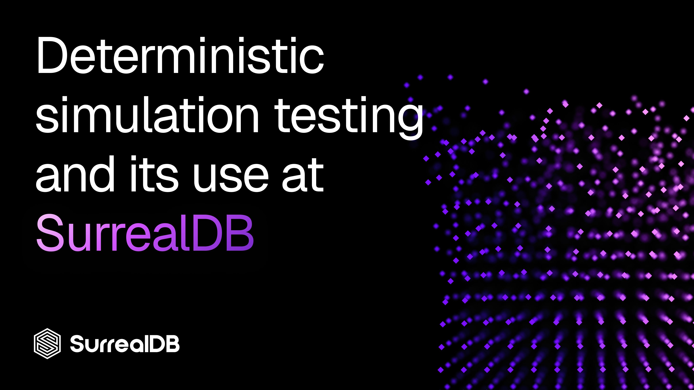

# Deterministic simulation testing and its use at SurrealDB



In today's engineering blog post we introduce a much longer post by Farhan Khan, a Senior Software Engineer at SurrealDB who works among other things on our distributed transactional key-value store and our own embedded key-value engine, SurrealKV.

The post is about DST (deterministic simulation testing), and can be read in full [on this page](https://arriqaaq.com/blog/posts/dst.html).

DST is a type of testing that aims to have the best of both worlds in both areas:

- Coverage: writing tests that span as large an area as possible in order to find and resolve bugs before they are discovered in production.
- Reproducibility: writing tests that reproduce the same output every time regardless of their complexity.

The blog post is quite lengthy and contains a number of runnable diagrams to demonstrate the testing behaviour it introduces. Here is a very quick tl;dr of each of its four sections to give a taste of what maks it such a fascinating read.

## What deterministic simulation testing actually is

This part of the blog post goes over the difference between pure functions and impure functions...

```surrealql
// Same price + same qty = always the same result
fn checkout_total(price: u64, qty: u64) -> u64 {
    price * qty
}

// A function that depends on a hidden input.
// Now the output is not always guaranteed
use std::time::{SystemTime, UNIX_EPOCH};

fn checkout_total(price: u64, qty: u64) -> u64 {
    let subtotal = price * qty;
    let now = SystemTime::now()
        .duration_since(UNIX_EPOCH)
        .unwrap()
        .as_nanos();
    if now % 20 == 0 {        // a "discount" that fires on 1 call in 20
        subtotal / 2
    } else {
        subtotal
    }
}
```

...and how to take seemingly random and unpredictable behaviour and make it reproducible: for example, by using the same random seed.

## Building upon tokio

Rust's tokio async runtime actually comes built in with testing tools that allow you to control simulations! Here is one code example from that section.

```surrealql
fn build_runtime(sim_seed: u64, node_name: &str) -> Result<Runtime, Error> {
    let mut builder = tokio::runtime::Builder::new_current_thread();
    builder.enable_time().start_paused(true);

    #[cfg(all(feature = "tokio-rng-seed", tokio_unstable))]
    {
        use rand::RngCore;

        let node_seed =
            crate::prng::Prng::derive_stream(sim_seed, node_name.as_bytes()).next_u64();

        builder.rng_seed(tokio::runtime::RngSeed::from_bytes(
            &node_seed.to_le_bytes(),
        ));
    }

    let _ = (sim_seed, node_name);

    builder
        .build()
        .map_err(|e: std::io::Error| Error::Io(e.to_string()))
}
```

## DST library architecture

This section moves beyond just the tokio runtime into further complexity, such as testing with one clock for packet delivery, one place where faults are chosen, one network model, and one record of what happened.

## Using it to test our distributed KV store

Here we get to see the blog circle back to work at SurrealDB and how this testing is being used, for example with scenarios and fault profiles and more.

```rust
// A scenario pairs a fault profile with a simulated-time budget
// and a set of invariants
struct Scenario {
    name: String,
    profile: FaultProfile,
    budget_sim_ms: u64,
    invariants: Vec<Invariant>,
}

// Example: a crash-recovery scenario described 
// without exposing the internal protocol
let scenario = Scenario {
    name: "crash_recovery".into(),
    profile: FaultProfile { /* per-tick crash / bounce / partition rates */ },
    budget_sim_ms: 30_000,
    invariants: vec![
        Invariant::CommittedNeverRegresses,
        Invariant::AllUpNodesNormalAtEnd,
        Invariant::ConnectedNodesAgreeOnViewAtEnd,
    ],
};
```

If your interest has been piqued, [give the post a read](https://arriqaaq.com/blog/posts/dst.html) and try out some of the runnable scenarios! They can be run and modified all inside the blog post itself.

For discussions on testing or SurrealDB in general, feel free to drop by [our Discord server](https://discord.com/invite/surrealdb).

And if this is your first time encountering SurrealDB, welcome aboard! You can try it out today in your browser window via our sandbox at [app.surrealdb.com](https://app.surrealdb.com/). If you like what you see but don't want to [install it](https://surrealdb.com/install) yet, just click on the `Sign in` button to create a free SurrealDB Cloud instance where the data you have been experimenting with can be saved - all it requires is an email to create the account.
