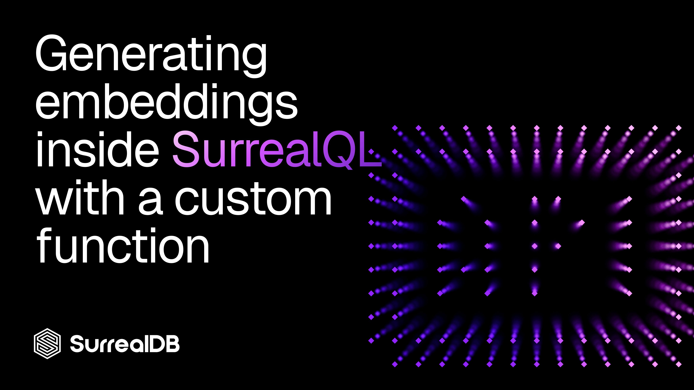

# Generating embeddings inside SurrealQL with a custom function



*Wrap your embedding provider in a **`DEFINE FUNCTION`**, then call it straight from a query — no application glue, no separate vectorisation service.*

______________________________________________________________________

## Why it matters

Most semantic-search stacks split the work across two systems. The application calls an embedding API to turn text into a vector, then sends that vector to the database for a nearest-neighbour search. That means two network hops, two places to handle errors, and embedding logic scattered across whichever service happens to need it.

SurrealDB lets you collapse that split. Because SurrealQL can make outbound HTTP calls and you can package logic into named functions, the entire "text in, ranked results out" flow can live in the database. You define `fn::embed` once, and every query — or every `INSERT` — can call it by name.

______________________________________________________________________

## The custom function

A SurrealQL function is defined with `DEFINE FUNCTION` and lives in the `fn::` namespace. Inside it, `http::post` calls your embedding provider and you reach into the JSON response to pull out the vector:

```surrealql
DEFINE FUNCTION OVERWRITE fn::embed($text: string) {
    RETURN http::post('https://api.openai.com/v1/embeddings', {
        input: $text,
        model: 'text-embedding-3-small',
        encoding_format: 'float'
    }, {
        'Authorization': 'Bearer ' + $OPENAI_API_KEY,
        'Content-Type': 'application/json'
    }).data[0].embedding;
};

```

A few things to note:

- `OVERWRITE` redefines the function if it already exists, so you can iterate on it without a `REMOVE FUNCTION` first.
- The third argument to `http::post` is a **headers object** — that's where the `Authorization` bearer token goes.
- `http::post` parses the JSON response automatically, so `.data[0].embedding` walks straight into the structure OpenAI returns and hands back a plain `array<float>`.

Swap the URL, model, and response path to point at any provider that speaks JSON over HTTP — Cohere, Voyage, a self-hosted Ollama endpoint, or your own service.

______________________________________________________________________

## Keeping the API key out of the function body

Hard-coding a secret in the function body is a bad idea — it shows up in `INFO FOR DB` and in every definition dump. Define it once as a database parameter instead, and reference it as `$OPENAI_API_KEY`:

```surql
DEFINE PARAM $OPENAI_API_KEY VALUE "sk-...";

```

Defining the key as a parameter centralises it: rotating the secret is a one-line change, and the function itself stays free of credentials. Restrict who can run `DEFINE PARAM` and `INFO` statements with SurrealDB's access controls so the value is only readable by roles that genuinely need it.

You'll also need to allow the outbound host. SurrealDB gates network access through capabilities, so start the server with the embedding endpoint on the allow-list:

```bash
surreal start --allow-net api.openai.com --allow-funcs "http::post" file://data

```

______________________________________________________________________

## The schema and vector index

Store the embedding alongside the rest of the record, and add an HNSW index so nearest-neighbour search stays fast as the table grows:

```surql
DEFINE TABLE product SCHEMAFULL;
DEFINE FIELD name ON product TYPE string;
DEFINE FIELD category ON product TYPE record<category>;
DEFINE FIELD embedding ON product TYPE array<float>;

DEFINE INDEX idx_product_embedding ON product
    FIELDS embedding
    HNSW DIMENSION 1536   -- match your model's output size
    DIST COSINE;

```

`text-embedding-3-small` returns 1536 dimensions by default, so the index `DIMENSION` must match. Cosine distance is the right metric for OpenAI's embeddings, which are normalised.

______________________________________________________________________

## Embedding at write time

Because `fn::embed` is just a function, you can call it the moment a record is created — no separate back-fill step. Generate the vector from the product name (or a richer description) in the same `CREATE`:

```surql
CREATE product SET
    name = "Classic wool baseball cap",
    category = category:hats,
    embedding = fn::embed("Classic wool baseball cap");

```

If you'd rather keep the embedding automatically in sync with a field, wrap it in an event so any change to `name` refreshes the vector:

```surql
DEFINE EVENT reembed ON product
    WHEN $event = "CREATE" OR $before.name != $after.name
    THEN {
        UPDATE $after.id SET embedding = fn::embed($after.name);
    };

```

______________________________________________________________________

## Searching with the embedded vector

Now the part that motivated all of this. Embed the query text with the same function, bind it to a parameter, and run a KNN search — enriching each hit with related data in the same statement:

```surql
LET $vector = fn::embed("baseball hats");

SELECT *, category.name,
    ->REL_PRODUCT_IN_ORDER->order.user.name AS buyers
OMIT embedding
FROM product
WHERE embedding <|10,40|> $vector;

```

What each piece does:

- `LET $vector = fn::embed(...)` turns the search phrase into a vector using the exact same model as the stored embeddings — essential, since vectors from different models aren't comparable.
- `<|10,40|>` is the KNN operator: return the10nearest neighbours, using an HNSW search list size (`EF`) of **40**. A larger `EF` trades a little latency for better recall.
- `category.name` follows the record link to the product's category in the same query — no join, no second round-trip.
- `->REL_PRODUCT_IN_ORDER->order.user.name AS buyers` traverses the graph from each product through its orders to the people who bought it. Semantic search and graph traversal in one statement.
- `OMIT embedding` drops the bulky 1536-float vector from the response so you return the useful fields, not a wall of numbers.

A single query goes from a natural-language phrase to ranked products, complete with their category and buyer list — and the embedding call, the vector search, and the graph traversal all happen server-side.

______________________________________________________________________

## Things to watch

- **Latency.** Every call to `fn::embed` is a synchronous HTTP request to your provider. For search that's usually fine, but for bulk imports prefer batching outside the database, or accept that each `CREATE` waits on the API.
- **Error handling.** If the provider returns an error or times out, the `http::post` call fails and so does the surrounding statement. Wrap bulk writes in a transaction, or validate the returned array length before relying on it.
- **Dimension drift.** Switching embedding models almost always changes the vector size and geometry. Re-embed the whole table and rebuild the index with the new `DIMENSION` — mixing models in one index produces meaningless rankings.
- **Cost.** Embedding at write time is one API call per record; embedding at query time is one call per search. Both are cheap individually, but worth metering at scale.

______________________________________________________________________

## Takeaway

A custom `fn::embed` function turns SurrealDB into the only system in the loop for semantic search. The provider call, the vector index, the graph traversal, and the field shaping all live in SurrealQL, so your application sends a phrase and gets back ranked, enriched results. No vectorisation microservice, no glue code, no second hop.

______________________________________________________________________

## Get started

Ready to build semantic search on top of your own data?

- [Create a free cloud instance](https://surrealdb.com/cloud)
- [Start building](https://surrealdb.com/docs)
- [Join our Discord server](https://discord.gg/surrealdb)
