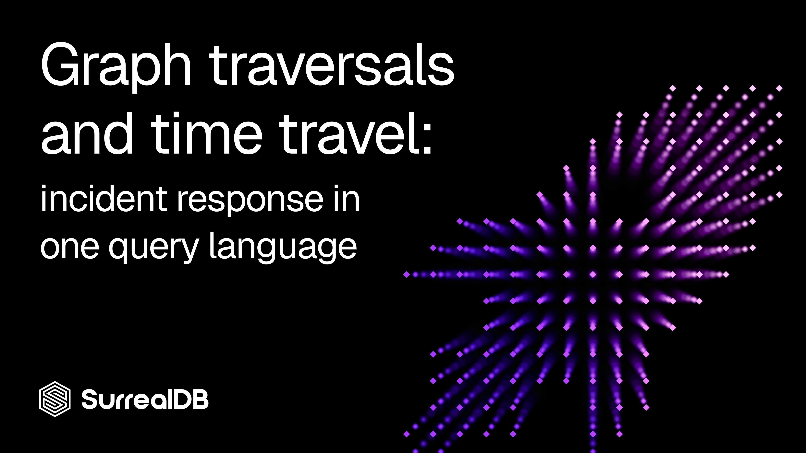

# Graph traversals and time travel: incident response in one query language



Most security teams track their assets in a spreadsheet or a flat CMDB table: one row per host, a column for the owner, a column for criticality. That model answers "what do we have?" but it's useless for the question that actually matters during an incident: **"if this box is owned, what else is now at risk?"**

Risk doesn't live in the rows. It lives in the *edges* — which host can reach which, who can log into what, which service depends on which database. That's a graph. And when an incident hits, you need a second dimension too: not just what the graph looks like *now*, but what it looked like **at 02:00 last Tuesday**, before anyone touched it.

This post shows how to model both with [SurrealDB](https://surrealdb.com/): assets and their relationships as a native graph, and time-travel queries (the `VERSION` clause) for incident reconstruction.

## Why a graph beats a table

A network is a set of nodes connected by relationships. Forcing that into rows means every interesting question becomes a recursive self-join — painful to write, slow to run, and impossible to read six months later.

In a graph model the questions map directly onto traversals:

- **Blast radius** — "what's reachable from the compromised host?" is "follow `connects_to` outward."
- \*\*Lateral movement \*\*— "where can this stolen credential go?" is "follow `can_access` from the account."
- **Crown-jewel exposure** — "which internet-facing assets have a path to a critical database?" is one traversal with a filter.

SurrealDB stores these relationships as first-class **graph edges**, so you write the traversal the way you'd say it out loud: `->connects_to->asset`.

## The schema

Three node tables — `asset`, `account`, `vulnerability` — and three edge tables that connect them. Edges in SurrealDB are real records, so they carry their own fields (a port, a privilege level, a timestamp).

```surql
-- Node: an asset (host, service, database, workstation, cloud resource)
DEFINE TABLE asset SCHEMAFULL;
DEFINE FIELD hostname        ON asset TYPE string;
DEFINE FIELD kind            ON asset TYPE string
  ASSERT $value IN ['server','workstation','database','service','cloud'];
DEFINE FIELD ip              ON asset TYPE string;
DEFINE FIELD environment     ON asset TYPE string
  ASSERT $value IN ['prod','staging','dev'];
DEFINE FIELD criticality     ON asset TYPE int ASSERT $value >= 1 AND $value <= 5;
DEFINE FIELD internet_facing ON asset TYPE bool DEFAULT false;
DEFINE FIELD created_at       ON asset TYPE datetime VALUE time::now() DEFAULT time::now();

-- Node: an identity / account
DEFINE TABLE account SCHEMAFULL;
DEFINE FIELD username   ON account TYPE string;
DEFINE FIELD role       ON account TYPE string;
DEFINE FIELD privileged ON account TYPE bool DEFAULT false;

-- Node: a known vulnerability
DEFINE TABLE vulnerability SCHEMAFULL;
DEFINE FIELD cve      ON vulnerability TYPE string;
DEFINE FIELD severity ON vulnerability TYPE string
  ASSERT $value IN ['low','medium','high','critical'];
DEFINE FIELD cvss     ON vulnerability TYPE float;

DEFINE INDEX uniq_hostname ON asset         FIELDS hostname UNIQUE;
DEFINE INDEX uniq_cve      ON vulnerability FIELDS cve      UNIQUE;

-- Edge: network reachability (asset -> asset)
DEFINE TABLE connects_to TYPE RELATION IN asset OUT asset SCHEMAFULL;
DEFINE FIELD port     ON connects_to TYPE int;
DEFINE FIELD protocol ON connects_to TYPE string;

-- Edge: who can log into what (account -> asset)
DEFINE TABLE can_access TYPE RELATION IN account OUT asset SCHEMAFULL;
DEFINE FIELD privilege ON can_access TYPE string ASSERT $value IN ['read','admin'];

-- Edge: which assets carry which vulnerabilities (asset -> vulnerability)
DEFINE TABLE exposed_to TYPE RELATION IN asset OUT vulnerability SCHEMAFULL;

```

`TYPE RELATION IN asset OUT asset` tells SurrealDB this table is an edge and pins down what it's allowed to connect — so that you can't accidentally relate an `account` to a `vulnerability` or any other invalid combination.

## Seed data

A small slice of a production estate: an internet-facing web server, an app server, a critical database, a jump box, and a developer workstation. Edges wire up the network paths, an over-privileged service account, and a Log4Shell (a software security vulnerability reported in 2021) exposure on the web tier.

```surql
CREATE asset:web1  CONTENT { hostname:'web-01',  kind:'server',      ip:'10.0.1.10', environment:'prod', criticality:3, internet_facing:true };
CREATE asset:app1  CONTENT { hostname:'app-01',  kind:'server',      ip:'10.0.2.10', environment:'prod', criticality:4 };
CREATE asset:db1   CONTENT { hostname:'db-01',   kind:'database',    ip:'10.0.3.10', environment:'prod', criticality:5 };
CREATE asset:jump1 CONTENT { hostname:'jump-01', kind:'server',      ip:'10.0.0.5',  environment:'prod', criticality:4 };
CREATE asset:ws1   CONTENT { hostname:'ws-anna', kind:'workstation', ip:'10.0.9.21', environment:'prod', criticality:2 };

CREATE account:anna CONTENT { username:'anna',       role:'developer', privileged:false };
CREATE account:root CONTENT { username:'svc-deploy', role:'service',   privileged:true  };

CREATE vulnerability:log4shell CONTENT { cve:'CVE-2021-44228', severity:'critical', cvss:10.0 };

-- Network paths
RELATE asset:web1  -> connects_to -> asset:app1 CONTENT { port:8080, protocol:'tcp' };
RELATE asset:app1  -> connects_to -> asset:db1  CONTENT { port:5432, protocol:'tcp' };
RELATE asset:jump1 -> connects_to -> asset:app1 CONTENT { port:22,   protocol:'tcp' };
RELATE asset:ws1   -> connects_to -> asset:jump1 CONTENT { port:22,  protocol:'tcp' };

-- Access grants
RELATE account:anna -> can_access -> asset:ws1  CONTENT { privilege:'admin' };
RELATE account:root -> can_access -> asset:app1 CONTENT { privilege:'admin' };

-- Exposure
RELATE asset:web1 -> exposed_to -> vulnerability:log4shell;

```

## Querying the graph

### Blast radius — what can the compromised host reach?

`web-01` is internet-facing and just got popped. One hop out:

```surql
SELECT hostname, ->connects_to->asset.hostname AS one_hop FROM asset:web1;
-- [{ hostname: 'web-01', one_hop: ['app-01'] }]

```

Push the traversal one more hop to see the second-order blast radius:

```surql
SELECT ->connects_to->asset->connects_to->asset.hostname AS two_hops FROM asset:web1;
-- [{ two_hops: ['db-01'] }]

```

Two hops from a web server you reach `db-01`, your criticality-5 database. That's the path the incident commander needs on screen in the first five minutes.

### Lateral movement — where can a stolen credential go?

Traverse `can_access` to see which accounts hold the keys to a sensitive host. The `<-` arrow walks the edge *inbound*:

```surql
SELECT <-can_access<-account.username AS who_can_access FROM asset:app1;
-- [{ who_can_access: ['svc-deploy'] }]

```

`svc-deploy` is a privileged service account with admin on `app-01` — exactly the kind of identity an attacker pivots to.

### Crown-jewel exposure — find the dangerous paths proactively

You don't have to wait for an incident. Ask the standing question: *which internet-facing assets have a network path into a criticality-5 system?*

```surql
SELECT hostname FROM asset
WHERE internet_facing = true
  AND ->connects_to->asset->connects_to->asset.criticality CONTAINS 5;
-- [{ hostname: 'web-01' }]

```

`web-01` is two hops from your most critical database. That's a finding you act on *before* the breach, not after.

### Vulnerability exposure

```surql
SELECT hostname FROM asset
WHERE ->exposed_to->vulnerability.severity CONTAINS 'critical';
-- [{ hostname: 'web-01' }]

```

## Temporal querying — reconstructing the incident

Here's the part flat inventories can't do at all. By the time you investigate, the environment has already changed: connections were cut, hosts were rebuilt, credentials were rotated. Querying the *current* graph tells you what's true now — not what was true **during the incident**.

SurrealDB's `VERSION` clause queries the graph as it existed at a point in time. Append a datetime to any `SELECT` and you get the historical state.

>

Setup: time-travel needs a versioned datastore. Start the server with versioned=true in the path (SurrealDB 3.x syntax):
surreal start --user root --pass secret "surrealkv://data/spectron?versioned=true"

Versioned queries have been available via SurrealKV since SurrealDB 2.0. If the storage engine isn't versioned, VERSION queries return "the underlying datastore does not support versioned queries." A timestamp with no matching state simply returns an empty array.

### The scenario

At 02:00 an analyst flags suspicious traffic from `app-01` to a legacy host over telnet. By the time the IR team logs in at 09:00, remediation has already pulled that connection. Querying *now* shows nothing:

```surql
-- The connection that mattered has already been remediated
SELECT ->connects_to->asset.hostname AS reachable FROM asset:app1;
-- [{ reachable: [] }]

```

But pin the query to the incident timestamp and the truth comes back:

```surql
SELECT ->connects_to->asset.hostname AS reachable
FROM asset:app1
VERSION d'2026-06-18T02:00:00Z';
-- [{ reachable: ['legacy-01'] }]

```

The edge that was deleted during cleanup is still there *as of the incident* — so you can prove the exposure existed, scope exactly which assets were reachable in that window, and reconstruct the attacker's options without relying on whatever logs happened to survive.

The same `VERSION d'…'` clause works on any query. Reconstruct the full reachable set, the access graph, or the asset inventory as it stood at the moment of compromise:

```surql
-- What could the stolen service credential reach during the window?
SELECT ->can_access->asset.hostname AS reachable
FROM account:root
VERSION d'2026-06-18T02:00:00Z';

-- Which assets even existed at incident time?
SELECT hostname, criticality FROM asset
VERSION d'2026-06-18T02:00:00Z';

```

## Putting it together

Two SurrealDB features, working as one investigative tool:

1. **Graph edges** turn "what's connected to what" from a recursive join nightmare into a one-line traversal — so blast radius, lateral movement, and crown-jewel paths are queries you can write in the heat of an incident.
1. **The ****`VERSION`**** clause** turns your asset graph into a time machine — so you can answer "what was actually exposed during the incident?" against the topology *as it was*, not as it's been cleaned up since.

______________________________________________________________________

## Try it yourself

- **Spin it up in two minutes.** Install SurrealDB and start a versioned instance:

```go
curl -sSf https://install.surrealdb.com | sh
surreal start --user root --pass secret "surrealkv://data/assets?versioned=true"
```

Then paste the schema, seed data, and queries above into `surreal sql` and watch the traversals run.

- **Read the docs.** Dig into [graph relations](https://surrealdb.com/docs/surrealql/statements/relate) and the [VERSION clause](https://surrealdb.com/docs/surrealql/statements/select) to model your own estate.
- **Map your real environment.** Point an asset-discovery feed at these tables, wire your network and IAM data into `connects_to` and `can_access`, and you've got a live, queryable, time-travelling security graph.
- **Join the community.** Share what you build and get help on the [SurrealDB Discord](https://surrealdb.com/community), and star the project on [GitHub](https://github.com/surrealdb/surrealdb).

*Graph traversals and time travel, one query language — incident response across space*\* ****and**** \**time.*
