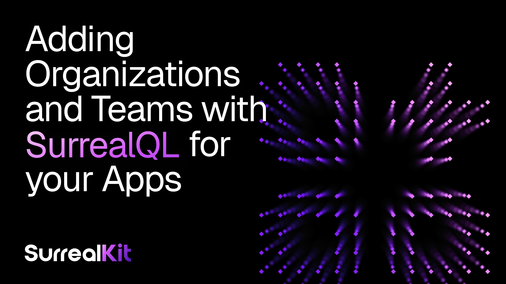

# Organizations and Teams for your SurrealDB App



Almost every SaaS application eventually needs the same plumbing: users belong to an **organization**, organizations have **roles**, roles carry **permissions**, and somewhere a function has to decide *"is this person allowed to do this?"* It's the kind of thing you write once, get subtly wrong, and then patch for the next two years.

[SurrealKit](https://github.com/surrealdb/surrealkit) (SurrealDB's schema management, migration, seeding, and testing tool) ships a set of **templates** that give you this entire layer as reviewed, tested `.surql` files. Instead of starting from a blank schema, you scaffold a project and toggle on the building blocks you want. This article walks through the **Organizations** template and its companion **Teams**, **Units**, and **Subsidiaries** features, and shows where you're meant to make them your own.

## What "templates" actually are

When you run `surrealkit init`, SurrealKit scaffolds a `/database` project from a template. The bundled `default` template ("SurrealKit starter") isn't a monolith: it's a set of **optional features** you opt into, each one a bundle of schema, seed data, and tests.

The four features relevant here, all opt-in (none are enabled by default):

| Feature | ID | What it gives you | Requires |
|---|---|---|---|
| Organizations | organizations | Orgs, roles, per-app permissions, employees, and invitations | None |
| Teams | teams | Teams with per-member roles (maintainer / member) | organizations |
| Organization units | units | Departments / regions in a hierarchy, with unit-scoped permissions | organizations |
| Subsidiaries & delegation | subsidiaries | Parent / child orgs with cross-org delegated permissions | organizations |

You can select them interactively, or non-interactively with flags:

```cli
# Interactive multi-select prompt
surrealkit init

# Just organizations + teams, no prompt
surrealkit init --feature organizations --feature teams

# Bare project, add nothing
surrealkit init --minimal
```

Because `teams`, `units`, and `subsidiaries` all declare `requires = ["organizations"]`, SurrealKit resolves the dependency closure for you: ask for `teams` and `organizations` comes along automatically, with a friendly note in the output. Once scaffolded, the `.surql` files are *yours*: SurrealKit's job was to give you a correct starting point, not to lock you in.

## The Organizations model

Turning on `organizations` lays down a small, deliberate set of tables. The shape is worth internalising because everything else hangs off it.

- `user`: the account. Email is validated and unique; a user can only select their own record by default.
- `organization`: the tenant. Has a name, a unique URL-safe slug, an optional legal_name and logo, and an owner that defaults to the authenticated user.
- `organization_permission`: the catalog of permission strings (e.g. employees/manage). These are seeded rows, not hard-coded enums.
- `organization_role`: a named bundle of permissions, scoped to one organization.
- `employee_of`: a graph relation user -> organization that carries the person's role, title, and employment status.
- `organization_invitation`: a token-based invite that, when accepted, wires a new user into the org (and optionally into teams).

### Permissions are data, not code

This is the design decision that makes the template adaptable. Permissions are rows in `organization_permission`, seeded from a plain `.surql` file:

```surrealql
UPSERT organization_permission:organization_manage  SET name = "organization/manage",  description = "Full control of the organization";
UPSERT organization_permission:employees_view       SET name = "employees/view",       description = "View employees";
UPSERT organization_permission:employees_manage      SET name = "employees/manage",     description = "Invite, update, and remove employees";
UPSERT organization_permission:roles_read            SET name = "roles/read",           description = "View roles";
UPSERT organization_permission:roles_manage          SET name = "roles/manage",         description = "Create, update, and delete roles";
UPSERT organization_permission:roles_assign          SET name = "roles/assign",         description = "Assign roles to employees";
```

The starter set covers managing the org, its employees, and its roles. To fit your own app you simply **add rows**(`billing/manage`, `projects/create`, `reports/export`, whatever your product needs) and start referencing them. No schema change, no migration of an enum type.

A **role** then references a set of those permissions, and is scoped to a single organization:

```surrealql
DEFINE FIELD permissions ON organization_role
    TYPE array<record<organization_permission>> DEFAULT [];
DEFINE FIELD kind ON organization_role
    TYPE string ASSERT $value IN ["system", "organization"] DEFAULT "organization";
```

`kind` distinguishes a `system` role (provisioned automatically, like *Owner*) from `organization` roles your customers create at runtime. Roles are unique per `(organization, name)`, so two different tenants can both have a "Manager" role without collision.

### Every new org bootstraps itself

You don't have to manually seed the first role and membership. The `organization` table carries a `CREATE` event that provisions an **Owner** system role holding *every* permission, then relates the owner in as an active employee:

```surrealql
DEFINE EVENT setup_organization ON organization WHEN $event = "CREATE" THEN {
    LET $owner_role = CREATE ONLY organization_role SET
        name = "Owner",
        organization = $after.id,
        kind = "system",
        permissions = (SELECT VALUE id FROM organization_permission),
        created_by = $after.owner;

    RELATE $after.owner->employee_of->$after.id CONTENT {
        role: $owner_role.id, title: "Owner", status: "active"
    };
};
```

So the moment a user creates an org, they're a fully-privileged member of it: no race conditions, no half-provisioned state, and it happens *in the database* regardless of which client triggered it.

### The functions that do the deciding

The template's authorization logic lives in a handful of `fn::organization::*` functions. The one that matters most is `fn::organization::permissible`, the single source of truth for *"can this account perform this action on this org?"*:

```surrealql
DEFINE FUNCTION fn::organization::permissible(
    $account: option<record<user>>,
    $organization: option<record<organization>>,
    $permission: string
) {
    IF $account == NONE OR $organization == NONE { RETURN false };
    LET $roles = (SELECT VALUE role FROM employee_of
        WHERE out = $organization AND in = $account AND status = "active");
    FOR $role IN $roles {
        IF fn::organization::role::contains($role, "organization/manage") { RETURN true };
        IF fn::organization::role::contains($role, $permission) { RETURN true };
    };
    RETURN false;
};
```

Two things to notice. First, `organization/manage` acts as a **superuser wildcard**: any role holding it passes every check, which is exactly why the auto-provisioned Owner role works. Second, this function (plus `fn::organization::employee` and `fn::organization::role::contains`) is the *only* place permission logic lives.

That matters because the tables enforce themselves by **calling these functions in their**\*\* ****`PERMISSIONS`**** \*\***clauses**:

```surrealql
DEFINE TABLE organization SCHEMAFULL PERMISSIONS
    FOR select WHERE fn::organization::employee($auth, id)
    FOR create WHERE $auth != NONE
    FOR update WHERE fn::organization::permissible($auth, id, "organization/manage")
    FOR delete NONE;

DEFINE TABLE organization_role SCHEMAFULL PERMISSIONS
    FOR select       WHERE fn::organization::permissible($auth, organization, "roles/read")
    FOR create, update, delete WHERE fn::organization::permissible($auth, organization, "roles/manage");
```

The upshot: **authorization is enforced at the data layer, not in your application code.** A leaked API token, a buggy frontend, a direct query: none of them can read or mutate data the role isn't permitted to touch, because the check runs inside SurrealDB on every operation.

### Employees and the "last admin" guard

`employee_of` is a graph relation carrying the membership details: `role`, `title`, and a `status` that moves through `invited → active → suspended → resigned → terminated`. It also protects you from a classic foot-gun: an event prevents removing or downgrading the **last** administrator, so a tenant can never accidentally lock itself out.

```surrealql
DEFINE EVENT guard_last_admin ON employee_of WHEN $event IN ["DELETE", "UPDATE"] THEN {
    LET $org = IF $event = "DELETE" THEN $before.out ELSE $after.out END;
    LET $admins = (SELECT VALUE id FROM employee_of
        WHERE out = $org AND status = "active"
            AND fn::organization::role::contains(role, "organization/manage"));
    IF array::len($admins) = 0 { THROW "Organization needs at least one administrator" };
};
```

### Invitations that wire themselves up

`organization_invitation` is a token + email + target role with an expiry. When it's accepted (its `used_at` / `used_by` get set), an event relates the new user into the org with the invited role and, if the invite named any teams, drops them straight into those teams. Onboarding becomes a single record update.

## Adding Teams

Switch on `teams` and you get a second layer of grouping *inside* each org. Teams are useful when org-wide roles are too coarse: think "the Frontend team" or "EMEA Support".

- `team`: name, an optional parent team (so teams can nest), and an organization it belongs to. It even adds a computed teamsfield to organization so you can read an org's teams directly.
- `member_of`: a relation employee_of -> team carrying a per-team role of either maintainer or member.

Team membership rides on top of org membership (you relate the *employee*, not the raw user), so someone has to be in the org before they can be on a team. Team-scoped checks get their own helper, `fn::team::member_of($auth, team, "maintainer")`, and the org permission catalog gains `team/view`, `team/create`, `team/update`, `team/delete`, and `team/manage` so org admins can govern teams without being on them.

### Progressive enhancement, by design

Here's a neat detail. The base `organizations` feature defines a *placeholder*:

```surrealql
DEFINE FUNCTION fn::account::organization::teams($account, $organization) { RETURN []; };
```

When you add the `teams` feature, it **overwrites** that function with a real implementation that walks the membership graph. The same pattern applies to `fn::account::organization::unit` for the units feature. This means features compose cleanly: the org layer references capabilities that simply return "nothing" until you enable the feature that provides them: no broken references, no conditional code.

## Two more building blocks

The same template carries two heavier-duty features for when a flat org model isn't enough:

- Organization units (units) model an internal hierarchy (departments, regions) with a materialised path on each unit so you can ask "is this unit a descendant of that one?" cheaply. Employees can be pinned to a unit, opening the door to unit-scoped permissions.
- Subsidiaries & delegation (subsidiaries) models parent/child organizations and lets a parent delegate a role into a child via organization_delegation_grant. Crucially, enabling it overwrites `fn::organization::permissible` so the check also traverses parent orgs and their grants: a holding company can grant scoped access down into a subsidiary without anyone holding a second login.

You don't need either to ship a normal SaaS, but they're there when "we got acquired" or "we need departments" lands in your backlog.

## Making it yours

The template is a starting point, and SurrealKit assumes you'll customise it:

1. Add permissions. Drop new rows into the seed file (billing/manage, projects/export, …) and reference them in table `PERMISSIONS` clauses. Roles pick them up immediately.
1. Let customers build roles. Roles are runtime data created by anyone with roles/manage. Your app's "Roles & Permissions" settings page is just CRUD over organization_role.
1. Edit the schema directly. Add fields to organization, change the status enum on employee_of, adjust an event: it's all plain .surql you own after init.
1. Parameterise with template variables. surrealkit init --var KEY=VALUE (and the --var flag on other commands) lets templates carry placeholders you fill at scaffold time.
1. Bring your own template. surrealkit init --from <git-url> scaffolds from an external template, so a team can standardise its own org model across projects.

## Shipping it safely

Because this is SurrealKit, the org layer plugs into the rest of the toolchain:

- `surrealkit sync` pushes your schema to local/dev databases declaratively (with --watch for live editing).
- `surrealkit rollout plan/start/complete` handles staged, reviewable, rollback-able migrations for shared and production databases.
- `surrealkit seed` loads the permission catalog.
- `surrealkit test` runs the bundled declarative suites (including permission matrices) that assert, for example, that the auto-provisioned owner is a superuser and that a member lacks a permission they were never granted. You inherit those tests, and you can add your own as you extend the model.

## Wrapping up

The Organizations template gives you a multi-tenant foundation that most SaaS apps need and few get entirely right: self-bootstrapping orgs, data-driven permissions, runtime roles, safe membership, token invitations, and, most importantly, authorization that lives *in the database* where it can't be bypassed. Teams, Units, and Subsidiaries layer on cleanly when you need them, and every piece is editable `.surql` the moment you scaffold it.

Start with `surrealkit init`, toggle on `organizations` (and `teams` if you want sub-groups), seed, sync, and you have a permission layer you can grow into, instead of one you'll be unpicking later.

> Explore the templates and the wider tool at [github.com/surrealdb/surrealkit](https://github.com/surrealdb/surrealkit).
